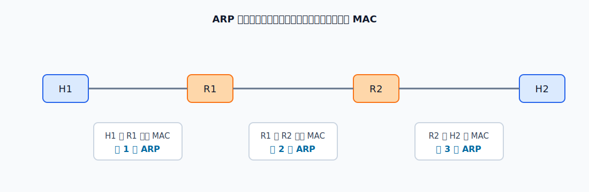

# ARP

ARP 的功能是：已知同一链路上的某个 IP 地址，查询它对应的 MAC 地址。
**ARP 不能跨路由器解析远端主机的 MAC 地址。**

[html-card height=620](../assets/arp-request-reply-slides.html)

主机发送 IP 数据报前，实际要封装成链路层帧。若目的主机在本网络，就解析目的主机 MAC；若目的主机不在本网络，就解析默认网关或下一跳路由器接口的 MAC。

ARP 高速缓存保存 IP 到 MAC 的映射。动态项由 ARP 自动学习，通常有生命周期；静态项由人工配置，生命周期取决于系统实现。

跨多个网络转发时，每一段链路都可能各自使用一次 ARP。例如 H1 到 H2 经过 R1、R2，则可能在 H1-R1、R1-R2、R2-H2 三段链路分别解析下一跳 MAC。

RARP 的方向与 ARP 相反：已知自己的 MAC 地址，查询自己的 IP 地址。它主要用于早期无盘主机启动场景，现代网络中基本由 [[DHCP]] 取代。
