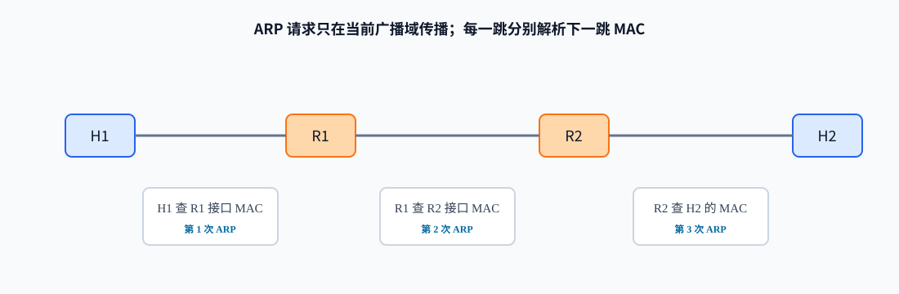

# ARP

ARP 的功能是：已知同一链路上的某个 IP 地址，查询它对应的 MAC 地址。

普通 ARP 请求使用数据链路层广播，只在当前**广播域**内传播；路由器不会把该广播转发到另一个广播域。因此，主机不能用普通 ARP 直接查询远端主机的 MAC 地址。代理 ARP 虽然可以由路由器代替远端主机应答，但返回的也是代理接口的 MAC 地址，并不是让 ARP 广播跨越了路由器。

[html-card height=620](../assets/arp-request-reply-slides.html)

主机发送 IP 数据报前，需要把它封装成当前链路使用的帧。**若目的主机在本网络，就解析目的主机的 MAC；若目的主机在其他网络，就解析默认网关接口的 MAC。** 此时，以太网帧的目的 MAC 是默认网关，而 IP 数据报的目的 IP 仍是远端主机。

ARP 高速缓存保存 IP 到 MAC 的映射。动态项由 ARP 自动学习，通常有生命周期；静态项由人工配置，生命周期取决于系统实现。

跨多个网络转发时，每一段以太网链路都可能各自使用一次 ARP。例如 H1 到 H2 经过 R1、R2，则可能在 H1-R1、R1-R2、R2-H2 三段链路分别解析下一跳 MAC。

路由器收到帧后会去掉原链路的帧首部，再为下一段链路重新封装。因此，**源 MAC 和目的 MAC 会逐跳改变**：源 MAC 是本跳发送接口的地址，目的 MAC 是本跳下一跳接口的地址。IP 数据报的源 IP 和目的 IP 通常保持端到端不变；经过 NAT 时才可能被改写。

RARP 的方向与 ARP 相反：已知自己的 MAC 地址，查询自己的 IP 地址。它主要用于早期无盘主机启动场景，现代网络中基本由 [[DHCP]] 取代。
