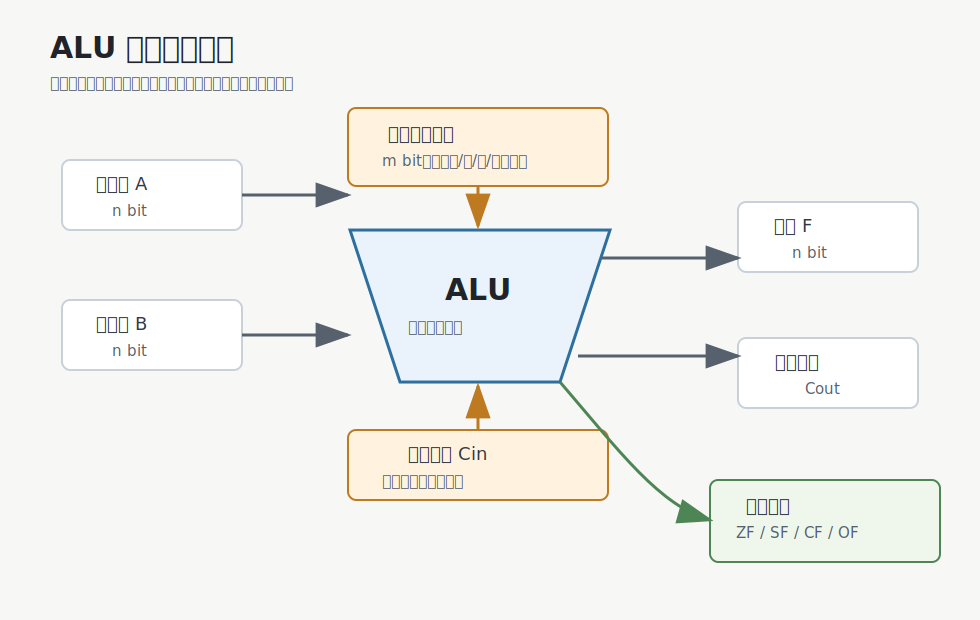
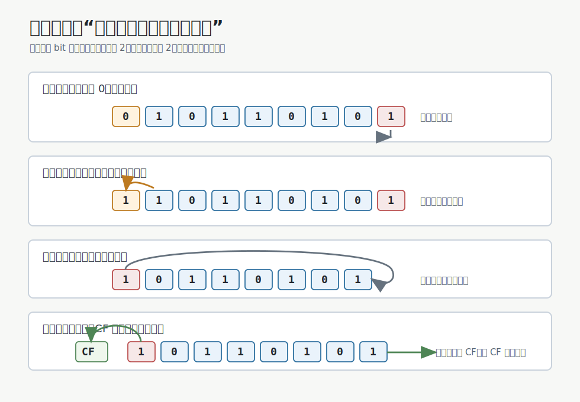
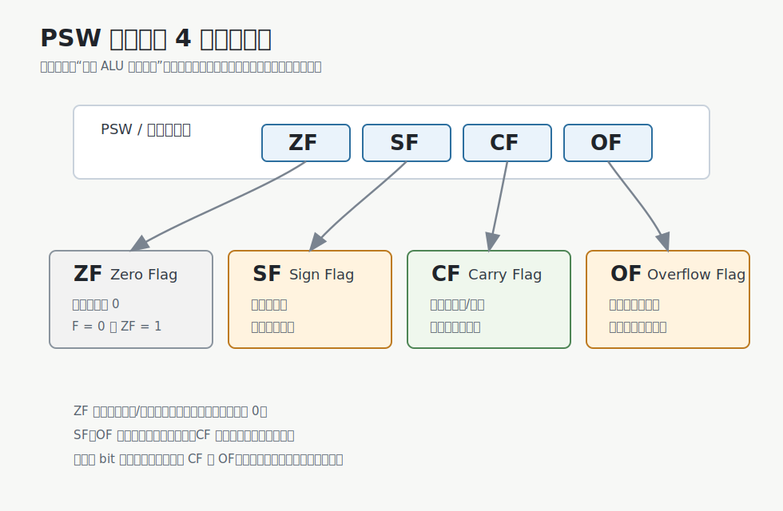

# 运算器与 ALU

运算器负责对数据进行处理。
**ALU**（Arithmetic and Logic Unit，算术逻辑单元）是运算器的核心部件。



ALU 可以看成一个受控制信号驱动的数据处理单元：

| 项目 | 含义 |
|---|---|
| 操作数 `A`、`B` | 参与运算的两个 n bit 数据 |
| 控制信号 | 指定本次执行加、减、与、或、异或、移位等哪一种操作 |
| `Cin` | 进位输入，常用于加法、减法、带进位运算 |
| 结果 `F` | n bit 运算结果 |
| `Cout` | 进位输出 |
| 标志位 | 描述本次结果的特征，如是否为 0、是否溢出 |

如果 ALU 支持 $k$ 种操作，至少需要：

$$
m \ge \lceil \log_2 k \rceil
$$

位控制信号，才能区分这些操作。

# 基本运算

ALU 支持的操作可以先分成三类。

| 类别   | 常见操作           | 关注点                  |
| ---- | -------------- | -------------------- |
| 算术运算 | 加、减、乘、除        | 数值结果、进位、溢出           |
| 逻辑运算 | 与、或、非、异或       | 按 bit 处理，不关心数值正负     |
| 移位运算 | 逻辑移位、算术移位、循环移位 | bit 位置变化，可能影响符号位或进位位 |

## 逻辑运算

逻辑运算按 bit 独立处理。例如：

| 运算    | 含义           | 常见用途          |
| ----- | ------------ | ------------- |
| `AND` | 两位都为 1 才为 1  | 清零、取掩码        |
| `OR`  | 至少一位为 1 就为 1 | 置位            |
| `NOT` | 0/1 取反       | 构造反码、按位取反     |
| `XOR` | 两位不同为 1      | 判断不同、翻转指定 bit |

> [!important] 逻辑运算不是逻辑判断
> `AND`、`OR`、`XOR` 在 ALU 中通常是按 bit 运算。它们处理的是 bit 模式，不直接关心这个 bit 模式被解释成无符号数还是补码数。

## 移位运算

移位运算通过改变 bit 位置来改变各位的位权。直观上：

- 左移 1 位，常对应乘以 2。
- 右移 1 位，常对应除以 2。




> [!warning] 
> 左移时若有效高位被舍弃，可能发生溢出。
> 右移时若低位被舍弃，可能丢失精度，即使再次左移也不能恢复。


### 逻辑移位

逻辑移位把操作数看作无符号数。

| 操作 | 规则 | 常见理解 |
|---|---|---|
| 逻辑左移 | 低位补 0，高位舍弃 | 无符号数乘 2 |
| 逻辑右移 | 高位补 0，低位舍弃 | 无符号数除 2 |

例如：

```text
1011 0101 逻辑右移 1 位 -> 0101 1010
1011 0101 逻辑左移 1 位 -> 0110 1010
```

逻辑移位适合无符号数。

### 算术移位

算术移位将操作数视为由补码表示。

| 操作 | 规则 | 常见理解 |
|---|---|---|
| 算术左移 | 低位补 0，高位舍弃 | 乘 2，可能溢出 |
| 算术右移 | 高位补符号位，低位舍弃 | 除 2，保留正负号 |

例如 8 bit 补码：

```text
1111 0110 = -10
```

算术右移 1 位：

```text
1111 1011 = -5
```

最高位补 1，是为了保留负数符号。

### 循环移位

循环移位将移出位送回另一端。

| 操作 | 规则 |
|---|---|
| 循环左移 | 最高位移到最低位 |
| 循环右移 | 最低位移到最高位 |

例如：

```text
1011 0101 循环左移 1 位 -> 0110 1011
```

循环移位常用于需要重新排列 bit 的场景。它不是普通乘除法。

### 带进位循环移位

带进位循环移位把 `CF` 也看成循环的一部分。

以带进位循环左移为例：

1. 最高位移入 `CF`。
2. 原 `CF` 移入最低位。
3. 其余 bit 左移。

因此它循环的是：$n \text{ 个数据位} + CF$

# 加法器

输入两个 n bit 数据和一个进位输入，输出 n bit 和、进位输出以及相关标志。

对 n bit 加法来说，机器实际计算的是：

$$
F = (A + B + C_{in}) \bmod 2^n
$$

超出 n bit 的部分会体现在进位或溢出相关标志里。

加法器重要，是因为很多运算可以转化为加法：

- 加法：$A+B$
- 减法：$A-B = A + (-B)$
- 补码减法：$A-B = A + (\sim B) + 1$
- 乘法：可以看成移位与多次加法的组合
- 除法：可以看成移位、比较、减法的组合

> [!note] 补码让减法复用加法器
> 补码系统中，减法可以通过“被减数不变，减数按位取反再加 1”转化为加法，因此 ALU 不需要把加法和减法理解成完全无关的两套数值机制。

## 补码加法

n bit 补码加法直接按位相加，符号位也参与运算。

$$
[X+Y]_{\text{补}} = [X]_{\text{补}} + [Y]_{\text{补}} \pmod {2^n}
$$

机器只保留低 n bit。最高位向外的进位会被丢弃，但可以参与标志位生成。

例如 8 bit 补码：

```text
  0000 1111   (+15)
+ 1110 1000   (-24)
= 1111 0111   (-9)
```

结果 `1111 0111` 按补码解释为 $-9$。

## 补码减法

补码减法先把减数变成相反数，再交给加法器。

$$
[X-Y]_{\text{补}} = [X]_{\text{补}} + [-Y]_{\text{补}}
$$

求 $[-Y]_{\text{补}}$ 的常用方法是：

1. 将 $[Y]_{\text{补}}$ 连同符号位一起按位取反。
2. 末位加 1。这个 1 有 $C_{in}$ 提供。所以补码减法的$C_{in}$为1。

例如 4 bit 补码，$X=3$，$Y=4$：

```text
X      = 0011
Y      = 0100
-Y     = 1100
X - Y  = 0011 + 1100 = 1111
```

`1111` 按 4 bit 补码解释为 $-1$。

## 无符号加减法

无符号整数的加减法也可以复用同一个 n bit 加法器。

无符号加法：

$$
F = (X + Y) \bmod 2^n
$$

无符号减法：

$$
F = (X - Y) \bmod 2^n = (X + (2^n - Y)) \bmod {2^n}
$$

$2^{n}-Y$等价于$Y$按位取反末位加 1。

这个 1 有 $C_{in}$ 提供。所以无符号减法的$C_{in}$为1。

例如 4 bit 无符号数，$X=8$，$Y=7$：

```text
X      = 1000
Y      = 0111
16 -Y  = 1001
X - Y  = 1000 + 1001 = 1 0001
```

机器保留低 4 bit，结果为 `0001`，即 $1$。最高位进位不作为结果保存。

## 加减法溢出判断

同一个 n bit 加法器可以算补码数，也可以算无符号数。区别在于结果如何解释，以及看哪个标志。

| 数的解释 | 溢出含义 | 主要看 |
|---|---|---|
| 无符号数 | 结果超出 $0$ 到 $2^n-1$ | `CF` |
| 有符号补码 | 结果超出 $-2^{n-1}$ 到 $2^{n-1}-1$ | `OF` |

无符号加法：

- 最高位向外产生进位，`CF = 1`。
- 没有进位，`CF = 0`。

无符号减法：

- 减法转加法后，若最高位没有产生进位，说明发生借位，`CF = 1`。
- 若最高位产生进位，说明没有借位，`CF = 0`。

补码加减法：

- 两个正数相加得到负数，发生上溢。
- 两个负数相加得到正数，发生下溢。
- 硬件上常用 $OF = C_n \oplus C_{n-1}$ 判断。

# PSW 与运算标志

ALU 运算完成后，除了产生结果 `F`，还会产生若干标志位。这些标志位通常送入 **PSW**（Program Status Word，程序状态字）或标志寄存器。



常见的 4 个运算标志如下。

| 标志   | 名称                 | 置 1 条件        | 主要服务对象      |
| ---- | ------------------ | ------------- | ----------- |
| `ZF` | Zero Flag，零标志      | 运算结果为 0       | 判断结果是否为 0   |
| `SF` | Sign Flag，符号标志     | 结果最高位为 1      | **有**符号数的正负 |
| `CF` | Carry Flag，进位/借位标志 | 无符号加减法发生进位或借位 | **无**符号数溢出  |
| `OF` | Overflow Flag，溢出标志 | 有符号补码结果超出表示范围 | **有**符号数溢出  |

## ZF：结果是否为 0

`ZF` 只看结果 bit 是否全为 0。

$$
ZF =
\begin{cases}
1, & F = 0 \\
0, & F \ne 0
\end{cases}
$$

它不关心结果被解释成无符号数还是有符号数。

## SF：结果最高位

`SF` 取结果 `F` 的最高位。

若把结果解释为补码整数：

- `SF = 0`：结果非负
- `SF = 1`：结果为负

> [!warning] 
> `SF` 只反映结果最高位。若有符号运算已经溢出，`SF` 看到的是截断后的机器结果符号，不是真实数学结果的符号。

## CF：无符号进位或借位

`CF` 服务于无符号整数。

对无符号加法：

- 最高位向外产生进位，说明结果超过 n bit 无符号数范围。
- 此时 `CF = 1`。

对无符号减法：

* 实质：$(a+(2^{n}-b))\text{mod}(2^{n})$
- 若**未**发生进位，说明被减数小于减数，发生**下溢**。
- 此时 `CF = 1`。

若用统一加法器表示加减法，可以记作：

$$
CF = C_{out} \oplus C_{in}
$$

其中加法时 $C_{in}=0$，减法转加法时常取 $C_{in}=1$。

## OF：有符号补码溢出

`OF` 服务于有符号补码整数。

对 n bit 补码，表示范围是：

$$
-2^{n-1} \le x \le 2^{n-1}-1
$$

若加减结果超出这个范围，`OF = 1`。

硬件上常用下面的等价判断：

$$
OF = C_n \oplus C_{n-1}
$$

其中 $C_n$ 是符号位产生的进位，$C_{n-1}$ 是最高数值位向符号位产生的进位。二者不同，说明有符号补码溢出。

## CF 与 OF 辨析

`CF` 和 `OF` 是最容易混淆的一对。

| 标志 | 判断对象 | 关心的问题 |
|---|---|---|
| `CF` | 无符号数 | 结果是否超出 $0$ 到 $2^n-1$ |
| `OF` | 有符号补码数 | 结果是否超出 $-2^{n-1}$ 到 $2^{n-1}-1$ |

同一个 bit 结果，可以有两种解释。

>[!example] $0111~1111B+0000~0001B=1000~0000B$
>
>若按无符号数解释, 结果为128，`CF = 0`;
若按有符号补码解释, 结果为-128，发生上溢，`OF = 1`。

> [!example] $1111~1111B + 0000~0001B=1~0000~0000B$
若按无符号数解释, 表示$255+1$, 发生上溢，`CF = 1`；
若按补码解释，表示$-1+1$, 结果为0，`OF = 0`。
