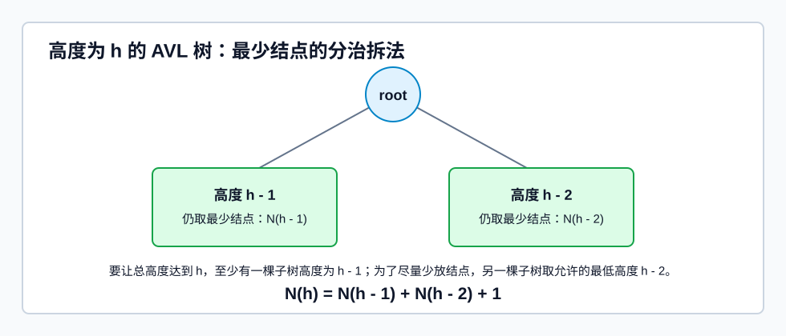
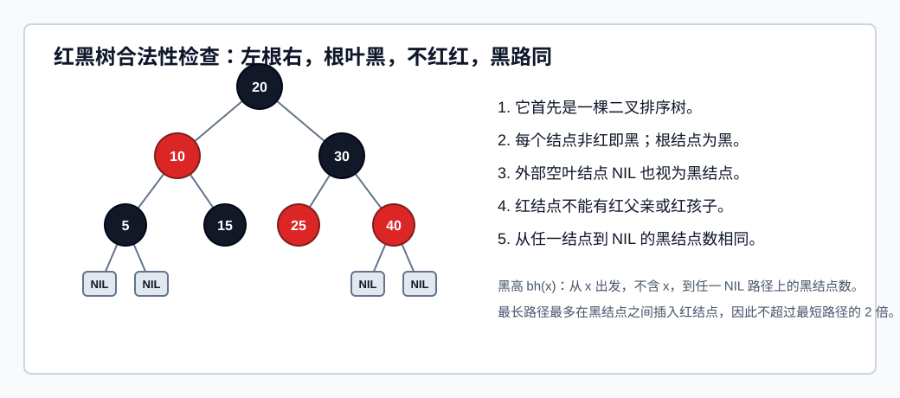

# AVL 树
## 定义与性质

**AVL 树**是一种自平衡的[[Binary-Search-Tree|二叉排序树]]。它不仅满足 BST 的左小右大性质，还要求：

> [!important]
> 对树上任一结点，其左子树和右子树的高度差绝对值不超过 `1`。

结点的**平衡因子**定义为：

$$
BF = h_{left} - h_{right}
$$

因此 AVL 树中任一结点的平衡因子只能是 `-1`、`0`、`1`。只要有一个结点的平衡因子绝对值大于 `1`，整棵树就不是 AVL 树。

AVL 树首先是 BST，所以中序遍历仍得到递增序列；查找过程也与 BST 完全一致。区别在于：插入、删除后如果破坏平衡，需要通过旋转恢复平衡。

若树高为 $h$，查找一个关键字最多比较 $h$ 次。因此 AVL 树的高度上界直接决定查找性能。

### 高度为 $h$ 的 AVL 树至少有多少个结点？

1. 要让整棵 AVL 树高度达到 $h$，根的某一棵子树高度至少要达到 $h-1$。
2. 为了让结点总数尽量少，另一棵子树应尽可能矮。
3. 但 AVL 要求左右子树高度差不能超过 `1`，所以另一棵子树最低只能是 $h-2$。
4. 两棵子树本身也必须是 AVL 树，而且也要各自取最少结点。

令 $N(h)$ 表示高度为 $h$ 的 AVL 树至少包含的结点数，则：

$$
N(0)=0,\quad N(1)=1,\quad N(2)=2
$$

$$
N(h)=N(h-1)+N(h-2)+1
$$

这里的 `+1` 是根结点。这个递推的本质是：根结点把问题拆成“高度 $h-1$ 的最小 AVL 子树”和“高度 $h-2$ 的最小 AVL 子树”。

### 高度为 $h$的 AVL 树有几种可能形态？

设 $S(h)$ 表示高度为 $h$ 的 AVL 树形态数。按根结点**分治**：

- 整棵树高度为 $h$，所以左右子树中至少有一棵高度为 $h-1$。
- AVL 要求左右子树高度差不超过 `1`，所以另一棵子树高度只能是 $h-1$ 或 $h-2$。
- 因此根的左右子树高度组合只有三类：$(h-1,h-1)$、$(h-1,h-2)$、$(h-2,h-1)$。
- 每一类中，左子树形态数与右子树形态数相乘；三类情况再相加。

可递推写为：

$$
S(0)=1,\quad S(1)=1
$$

$$
S(h)=S(h-1)^2+2S(h-1)S(h-2)
$$

其中：

- $S(h-1)^2$ 对应左右子树都高 $h-1$。
- $2S(h-1)S(h-2)$ 对应一边高 $h-1$、另一边高 $h-2$，且较高子树可以在左边或右边。

## 插入

AVL 插入先按 [[Binary-Search-Tree#插入与构造|BST 规则插入]]。新结点一定先作为叶结点出现。

### 插入后的旋转调整

插入后，从插入点向上检查祖先结点的平衡因子，找到第一个失衡结点，称为**最小不平衡子树**的根。

插入只会让某条查找路径上的结点高度发生变化，其他分支不受影响。因此只需要沿插入路径向上找。

[html-card height=720](../assets/avl-rotations.html)

#### LL 型

若新结点插入到失衡结点 `A` 的左孩子 `B` 的左子树中，使 `BF(A)` 从 `+1` 变成 `+2`，属于 LL 型。

处理：对 `A` 做**右单旋**。

- `B` 上升，成为这棵子树的新根。
- `A` 下降，成为 `B` 的右孩子。
- `B` 原右子树改接为 `A` 的左子树。
#### RR 型

若新结点插入到失衡结点 `A` 的右孩子 `B` 的右子树中，使 `BF(A)` 从 `-1` 变成 `-2`，属于 RR 型。

处理：对 `A` 做**左单旋**。

- `B` 上升，成为这棵子树的新根。
- `A` 下降，成为 `B` 的左孩子。
- `B` 原左子树改接为 `A` 的右子树。

#### LR 型

若新结点插入到 `A` 的左孩子 `B` 的右子树中，属于 LR 型。

`C` 是 `B` 的右孩子，调整后让 `C` 成为这棵子树的新根。

具体连接：

1. `C->left = B`，`C->right = A`。
2. `C` 原来的左子树 `CL` 挂到 `B` 的右边。
3. `C` 原来的右子树 `CR` 挂到 `A` 的左边。

这等价于“先对 `B` 左旋，再对 `A` 右旋”。

#### RL 型

若新结点插入到 `A` 的右孩子 `B` 的左子树中，属于 RL 型。

`C` 是 `B` 的左孩子，调整后让 `C` 成为这棵子树的新根。

具体连接：

1. `C->left = A`，`C->right = B`。
2. `C` 原来的左子树 `CL` 挂到 `A` 的右边。
3. `C` 原来的右子树 `CR` 挂到 `B` 的左边。

这等价于“先对 `B` 右旋，再对 `A` 左旋”。

### 插入后为什么只调一次

插入后现在的最小不平衡子树高度比原来平衡状态增加 `1`。经过 LL/RR/LR/RL 调整后，这棵最小不平衡子树的高度会恢复到插入前的高度。

因此，对插入而言，只要把最小不平衡子树调整平衡，它上面的祖先结点也会恢复平衡，不需要继续向上调整。

## 删除

AVL 删除分两步：

1. 先按[[Binary-Search-Tree|二叉排序树]]的删除方法删除目标结点。
2. 从实际被删除的位置向上回溯，检查是否出现失衡；若失衡，则旋转恢复。

BST 删除的三种情况仍适用：

- 叶结点：直接删除。
- 只有一棵子树：用唯一子树替代该结点。
- 有两棵子树：用直接前驱或直接后继替代，再转化为删除前驱/后继。

[html-card height=700](../assets/avl-delete-propagation.html)

删除后调整的核心步骤：

1. 从删除位置向根回溯，找到第一个平衡因子绝对值超过 `1` 的结点 `A`。
2. 在 `A` 的两棵子树中选择更高的孩子 `B`。
3. 在 `B` 的两棵子树中选择更高的孩子 `C`。
4. 根据 `C` 相对于 `A` 的位置判断 LL、RR、LR、RL，并旋转。
5. 继续向上检查 `A` 的祖先。

删除和插入的重要区别：

- 插入调整后，最小不平衡子树高度通常恢复到插入前，因此不平衡不会继续向上传导。
- 删除调整后，某棵子树可能比删除前更矮，祖先结点的平衡因子可能继续变化，所以删除可能需要多次向上调整。

调整类型可按下面判断：

| 失衡结点       | 较高孩子    | 孙子位置           | 调整                   |
| ---------- | ------- | -------------- | -------------------- |
| `BF(A)=+2` | 左孩子 `B` | `B` 的左侧更高或左右等高 | LL，右单旋               |
| `BF(A)=+2` | 左孩子 `B` | `B` 的右侧更高      | LR，`C` 上升，`B/A` 分居左右 |
| `BF(A)=-2` | 右孩子 `B` | `B` 的右侧更高或左右等高 | RR，左单旋               |
| `BF(A)=-2` | 右孩子 `B` | `B` 的左侧更高      | RL，`C` 上升，`A/B` 分居左右 |

## 查找性能

AVL 查找过程与 BST 一致：

- 小于当前结点，进入左子树。
- 大于当前结点，进入右子树。
- 等于当前结点，查找成功。
- 走到空指针，查找失败。

由于 AVL 树高度保持在 $O(\log_2 n)$，所以：

$$
Search = O(\log_2 n)
$$

插入、删除也都只沿根到叶的一条路径查找位置，再做有限次旋转；每次旋转是局部常数时间操作，因此：

$$
Insert = O(\log_2 n),\quad Delete = O(\log_2 n)
$$

AVL 树的特点是查找性能稳定，适合以查找为主、插入删除相对较少的场景。

实际[[#红黑树]]通常更实用，因为它对“平衡”的要求较弱，调整次数往往更少。

# 红黑树
## 定义

**红黑树**是一种自平衡的二叉排序树。它比 [[#AVL 树]] 的平衡条件更宽松，但仍能保证树高为 $O(\log_2 n)$。

红黑树必须同时满足：

1. 它是一棵二叉排序树。
2. 每个结点要么是红色，要么是黑色。
3. 根结点是黑色。
4. 叶结点是黑色。这里的叶结点通常指外部空结点，也就是 `NULL`、失败结点或 NIL 结点。
5. 不存在两个相邻的红结点，即红结点的父结点和孩子结点都必须是黑色。
6. 对任一结点，从该结点到任一叶结点的简单路径上，黑结点数相同。

可以把判断口诀记为：

>[!cite]
> **左根右，根叶黑，不红红，黑路同。**

判断一棵树是不是红黑树时，应按以下顺序查：

1. 先看是否满足 BST 的左小右大关系。
2. 再看根是否为黑，外部空叶是否按黑结点处理。
3. 检查是否存在红父红子。
4. 对每个结点检查到各 NIL 叶结点的黑结点数是否相同。

### 黑高

结点 `x` 的**黑高** `bh(x)` 定义为：

> 从 `x` 出发，不含 `x` 本身，到达任一 NIL 叶结点的路径上黑结点总数。

因为红黑树要求“黑路同”，所以对同一个结点 `x`，无论走向哪个 NIL 叶结点，黑高都相同。

**黑高常用于推导红黑树的高度上界。**

* 若根结点黑高为 $h$，内部结点数最少的情况是：只保留黑结点形成的满二叉树。此时至少有$2^h - 1$个内部结点。

* 若根结点黑高为 $h$，内部结点数最多的情况是：在黑结点之间尽量插入红结点，形成高度约为 $2h$ 的满树形态。此时至多有 $2^{2h} - 1$个内部结点。

## 高度性质

红黑树有两个重要高度性质。

###  1. 最长路径不超过最短路径的 2 倍

从某结点到 NIL 叶结点的所有路径，黑结点数相同。又因为红结点不能连续出现，所以最长路径最多是在每两个黑结点之间插入一个红结点。

因此：

$$
\text{最长路径} \le 2 \times \text{最短路径}
$$

这个性质是红黑树“近似平衡”的核心。

###  2. 含 n 个内部结点的红黑树高度上界

若红黑树总高度为 $H$，由于最长路径不超过黑结点路径的两倍，根的黑高至少约为 $H/2$。

又因为黑高为 $bh$ 的红黑树至少有 $2^{bh}-1$ 个内部结点，所以：

$$
n \ge 2^{H/2}-1
$$

推出：

$$
H \le 2\log_2(n+1)
$$
即：

$$
H = O(\log_2 n)
$$

因此红黑树查找时间复杂度为 $O(\log_2 n)$

## 查找

红黑树查找与 [[Binary-Search-Tree#查找|BST]] 一致：

- `key` 小于当前结点，向左子树走。
- `key` 大于当前结点，向右子树走。
- 相等则查找成功。
- 走到 NIL 叶结点则查找失败。

颜色不参与查找方向判断。颜色只用于维持树高。

## 插入

红黑树插入先按 BST 插入位置：

1. 先查找，确定插入位置。
2. 若新结点是根结点，染为黑色。
3. 若新结点不是根结点，先染为红色。
4. 若插入后仍满足红黑树定义，结束。
5. 若出现连续红结点，根据叔叔结点颜色调整。

>[!question] 
>为什么新结点默认染红？
>- 若染黑，会让某些路径黑结点数增加，容易破坏“黑路同”。
>- 染红不会改变路径黑结点数，只可能破坏“不红红”。
>- “不红红”可以通过局部旋转和染色修复。

[html-card height=1220](../assets/red-black-insert.html)

### 叔叔为红

若新结点 `N` 的父结点 `P` 是红色，叔叔结点 `U` 也是红色：

1. `P` 染黑。
2. `U` 染黑。
3. 祖父结点 `G` 染红。
4. 把 `G` 当作新的 `N`，继续向上检查。
5. 若 `G` 最后成为根，根再染黑。

这类情况不旋转，只染色并把问题上推。

### 叔叔为黑

#### LL 或 RR

若父结点红、叔叔黑，并且：

- LL：`N` 是 `G` 左孩子 `P` 的左孩子。
- RR：`N` 是 `G` 右孩子 `P` 的右孩子。

处理：

- LL：以 `G` 为根右单旋。
- RR：以 `G` 为根左单旋。
- 旋转后，原父结点 `P` 上升替代祖父。
- `P` 染黑，`G` 染红。

可以记为：

> 黑叔 LL/RR：父换爷，单旋加染色。

#### LR 或 RL

若父结点红、叔叔黑，并且：

- LR：`N` 是 `G` 左孩子 `P` 的右孩子。
- RL：`N` 是 `G` 右孩子 `P` 的左孩子。

处理：

- LR：`N` 一步上升替代祖父；`N->left = P`，`N->right = G`。`N` 原来的左、右子树分别挂到 `P` 的右边、`G` 的左边。
- RL：`N` 一步上升替代祖父；`N->left = G`，`N->right = P`。`N` 原来的左、右子树分别挂到 `G` 的右边、`P` 的左边。
- `N` 染黑，`G` 染红。

可以记为：

> 黑叔 LR/RL：儿换爷，一步重连加染色。

这与“双旋”描述等价：LR 等价于先对 `P` 左旋、再对 `G` 右旋；RL 等价于先对 `P` 右旋、再对 `G` 左旋。手绘时直接按 `N` 的中序位置重连更快。

> [!question] 插入调整是否会继续向上
> **黑叔旋转后结束；红叔染色可能继续向上。**
红黑树插入后是否继续调整，取决于遇到的是**红叔**还是**黑叔**：
> - **黑叔**：旋转加染色后，局部根变为黑色，连续红被消除，黑高也恢复一致；这次插入调整通常到此结束。
> - **红叔**：只染色，不旋转；父、叔变黑，祖父变红。此时祖父要当作新的插入结点继续向上检查，因为它可能和自己的红父亲形成新的连续红。
> - 若上推到根，最后把根染黑。
> 

## 删除

红黑树删除时间复杂度仍为$O(\log_2 n)$

# AVL 树和红黑树对比

| 项目   | AVL 树         | 红黑树                      |
| ---- | ------------- | ------------------------ |
| 平衡要求 | 严格，高度差不超过 `1` | 较宽松，用颜色约束黑高              |
| 查找性能 | 很稳定           | 同为 $O(\log_2 n)$，但常数可能略大 |
| 插入删除 | 更容易触发旋转       | 调整通常较少                   |
| 适用倾向 | 查找多、修改少       | 插入删除频繁                   |

AVL 树追求更严格的高度平衡；红黑树牺牲一点查找路径长度，换取插入删除时更少的结构调整。
