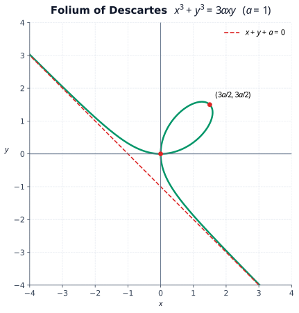

# 心形线

$$
r=a(1-\cos\theta),\qquad a>0.
$$

- $\theta=0$：$r=0$，得到原点尖点；
- $\theta=\pi$：$r=2a$，得到最远点 $(-2a,0)$；
- $\theta=\dfrac\pi2,\dfrac{3\pi}2$：得到 $(0,\pm a)$；
- $r(-\theta)=r(\theta)$，关于 $x$ 轴对称。

看到 $1-\cos\theta$ 就应判断尖端朝极轴正向、主体向左；若为 $1+\cos\theta$，方向相反。

# 摆线

$$
\begin{cases}
x=a(t-\sin t),\\
y=a(1-\cos t),
\end{cases}
\qquad a>0.
$$

一拱取 $t\in[0,2\pi]$：

$$
(0,0)\longrightarrow(\pi a,2a)\longrightarrow(2\pi a,0).
$$

并且

$$
\frac{dx}{dt}=a(1-\cos t)\ge0,\qquad
\frac{dy}{dx}=\frac{\sin t}{1-\cos t}=\cot\frac t2.
$$

所以一拱内 $x$ 始终增加，最高点切线水平，两端形成尖点。其他拱由水平方向平移 $2k\pi a$ 得到。

# 星形线

$$
\begin{cases}
x=a\cos^3t,\\
y=a\sin^3t,
\end{cases}
\qquad
x^{2/3}+y^{2/3}=a^{2/3}.
$$

四个尖点为

$$
(\pm a,0),\qquad(0,\pm a).
$$

曲线关于两坐标轴和直线 $y=x$ 对称。参数切线斜率为

$$
\frac{dy}{dx}=-\tan t.
$$

具有很好的对称性，只需研究 $t\in[0,\pi/2]$ 的第一象限部分。

# 笛卡尔叶形线

$$
x^3+y^3=3axy,
\qquad
\begin{cases}
x=\dfrac{3at}{1+t^3},\\[4pt]
y=\dfrac{3at^2}{1+t^3}.
\end{cases}
$$

- 交换 $x,y$ 后方程不变，故关于 $y=x$ 对称；
- $t>0$ 描出第一象限叶环，$t=1$ 时经过 $\left(\dfrac{3a}{2},\dfrac{3a}{2}\right)$；
- $t=0$ 与 $t\to\pm\infty$ 都趋于原点，两支切线分别为坐标轴；
- $t\to-1$ 时曲线趋于斜渐近线
  $$
  x+y+a=0.
  $$

