# 批处理调度算法

这一组算法主要关注公平性、平均等待时间、平均周转时间等整体指标。它们不强调交互式系统里的快速响应，也不区分任务紧急程度。

下面统一使用这一组进程：

| 进程 | 到达时间 | 运行时间 |
| --- | --- | --- |
| P1 | 0 | 8 |
| P2 | 1 | 4 |
| P3 | 2 | 9 |
| P4 | 3 | 5 |
| P5 | 6 | 2 |

[html-card height=780](../assets/batch-scheduling-algorithms-slides.html)

> [!summary] 总览
>
> | 算法 | 主要依据 | 优点 | 缺点 | 饥饿 |
> | --- | --- | --- | --- | --- |
> | FCFS | 到达顺序 | 公平，实现简单 | 对短作业不利 | 不会 |
> | SJF / SPF | 运行时间 | 平均等待和周转通常较小 | 对长作业不利，需要预估运行时间 | 可能 |
> | SRTN | 剩余运行时间 | 平均等待和周转可进一步降低 | 切换更频繁，对长作业更不利 | 可能 |
> | HRRN | 等待时间和运行时间的比值 | 兼顾短作业和等待较久的作业 | 每次调度要计算响应比 | 通常不会 |

# 非抢占和抢占

**抢占**是指当前进程正在 CPU 上运行时，操作系统可以因为新事件发生而强行暂停它，把 CPU 分配给另一个就绪进程。被抢占的进程没有结束，也不一定阻塞，而是回到就绪队列，等待以后继续运行。

非抢占式调度不会打断正在运行的进程。只要一个进程已经获得 CPU，它通常会一直运行到完成、阻塞或主动放弃 CPU。

| 情况 | 非抢占式 | 抢占式 |
| --- | --- | --- |
| 当前进程正在运行 | 继续运行，直到完成、阻塞或主动放弃 CPU | 可能被更合适的就绪进程打断 |
| 新进程到达 | 进入就绪队列等待 | 会触发比较，可能抢走 CPU |
| 判断重点 | 只在调度点选择一次 | 每次就绪队列变化都可能重新选择 |
| 代价 | 上下文切换少，响应可能慢 | 响应更及时，但上下文切换更多 |

SJF/SPF 和 SRTN 的核心差别就在这里：SJF/SPF 默认是非抢占式，进程一旦选中就运行到释放 CPU；SRTN 是抢占式，只要新到达进程的运行时间小于当前进程的剩余运行时间，就会抢占。

# 饥饿

**饥饿**是指某个进程长期处于就绪状态，却因为调度规则持续偏向其他进程而迟迟得不到 CPU。它不是阻塞：阻塞是进程在等 I/O 或事件，暂时不能运行；饥饿是进程明明已经就绪，却总是排不上。

饥饿发生在调度规则长期偏向某一类进程时。SJF/SPF 和 SRTN 都偏向短作业；如果短作业不断到达，长作业可能一直排不上。HRRN 把等待时间放进响应比，等待越久响应比越高，因此长作业不会一直只因为“运行时间长”而被压在后面。

# FCFS

**FCFS**，First Come First Serve，即**先来先服务**。

FCFS 按作业或进程到达的先后顺序服务。用于作业调度时，看作业到达外存后备队列的顺序；用于进程调度时，看进程到达就绪队列的顺序。

| 角度 | FCFS |
| --- | --- |
| 思想 | 公平排队，先到先服务 |
| 规则 | 按到达顺序依次运行 |
| 抢占性 | 非抢占 |
| 优点 | 公平，实现简单 |
| 缺点 | 对短作业不利；短作业排在长作业后面时，等待时间和带权周转时间会很大 |
| 饥饿 | 不会 |

对统一例子，FCFS 的运行顺序为：

$$
P1 \to P2 \to P3 \to P4 \to P5
$$

| 进程 | 完成时间 | 周转时间 | 等待时间 | 带权周转时间 |
| --- | --- | --- | --- | --- |
| P1 | 8 | $8-0=8$ | $8-8=0$ | $8/8=1$ |
| P2 | 12 | $12-1=11$ | $11-4=7$ | $11/4=2.75$ |
| P3 | 21 | $21-2=19$ | $19-9=10$ | $19/9\approx2.11$ |
| P4 | 26 | $26-3=23$ | $23-5=18$ | $23/5=4.6$ |
| P5 | 28 | $28-6=22$ | $22-2=20$ | $22/2=11$ |

平均周转时间为 $16.6$，平均等待时间为 $11$，平均带权周转时间约为 $4.29$。

# SJF / SPF

**SJF**，Shortest Job First，即**短作业优先**。用于进程调度时，严格说应称为 **SPF**，Shortest Process First，即短进程优先。

SJF/SPF 每次调度时，在已经到达的作业或进程中，选择要求服务时间最短者。默认语境下，SJF/SPF 通常指**非抢占式**算法。

| 角度  | SJF / SPF                     |
| --- | ----------------------------- |
| 思想  | 优先服务短作业，降低平均等待时间和平均周转时间       |
| 规则  | 每次调度时，从已到达者中选择运行时间最短者         |
| 抢占性 | 默认非抢占                         |
| 优点  | **通常能得到较小的平均等待时间和平均周转时间**     |
| 缺点  | 对长作业不利；需要预知运行时间，而用户给出的估计可能不准确 |
| 饥饿  | 可能导致长作业饥饿                     |

对统一例子，0 时刻只有 P1 到达，所以 P1 先运行到 8。8 时刻所有进程都已到达，剩余候选的运行时间分别为 P2=4、P3=9、P4=5、P5=2，所以选择 P5；之后选择 P2、P4，最后 P3。

运行顺序为：

$$
P1 \to P5 \to P2 \to P4 \to P3
$$

| 进程 | 完成时间 | 周转时间 | 等待时间 | 带权周转时间 |
| --- | --- | --- | --- | --- |
| P1 | 8 | $8-0=8$ | $8-8=0$ | $8/8=1$ |
| P2 | 14 | $14-1=13$ | $13-4=9$ | $13/4=3.25$ |
| P3 | 28 | $28-2=26$ | $26-9=17$ | $26/9\approx2.89$ |
| P4 | 19 | $19-3=16$ | $16-5=11$ | $16/5=3.2$ |
| P5 | 10 | $10-6=4$ | $4-2=2$ | $4/2=2$ |

平均周转时间为 $13.4$，平均等待时间为 $7.8$，平均带权周转时间约为 $2.47$。

> [!warning] “SJF 平均等待时间最少”要加条件
> 若所有进程同时到达，非抢占式 SJF 可以得到最少的平均等待时间和平均周转时间。
>
> 若进程陆续到达，抢占式的最短剩余时间[[#SRTN]]优先通常还能得到更小的平均等待时间和平均周转时间。

# SRTN

**SRTN**，Shortest Remaining Time Next，即**最短剩余时间优先**。它是**抢占式**短作业优先。

SRTN 的规则是：每当新进程到达或当前进程完成，重新比较所有就绪进程的**剩余运行时间**，选择剩余时间最短者运行。如果新到达进程比当前进程剩余时间更短，就抢占当前进程。

| 角度 | SRTN |
| --- | --- |
| 思想 | 始终让当前剩余运行时间最短的进程先运行 |
| 规则 | 每次新进程到达或当前进程完成时，比较所有就绪进程的剩余运行时间 |
| 抢占性 | 抢占 |
| 优点 | 通常比非抢占式 SJF/SPF 进一步降低平均等待时间和平均周转时间 |
| 缺点 | 需要知道或估计剩余运行时间；进程切换次数可能增加；对长作业更不利 |
| 饥饿 | 可能导致长作业饥饿 |

对统一例子：

| 时刻 | 就绪队列变化 | 选择 |
| --- | --- | --- |
| 0 | P1 到达，P1 剩 8 | 运行 P1 |
| 1 | P2 到达；P1 剩 7，P2 需 4 | P2 更短，抢占 P1 |
| 2 | P3 到达；P2 剩 3，P3 需 9 | P2 继续运行 |
| 3 | P4 到达；P2 剩 2，P4 需 5 | P2 继续运行 |
| 5 | P2 完成；P1 剩 7，P3 需 9，P4 需 5 | 运行 P4 |
| 6 | P5 到达；P4 剩 4，P5 需 2 | P5 更短，抢占 P4 |
| 8 | P5 完成；P1 剩 7，P3 需 9，P4 剩 4 | 运行 P4 |
| 12 | P4 完成；P1 剩 7，P3 需 9 | 运行 P1 |
| 19 | P1 完成；只剩 P3 | 运行 P3 |

运行顺序为：

$$
P1 \to P2 \to P4 \to P5 \to P4 \to P1 \to P3
$$

| 进程 | 完成时间 | 周转时间 | 等待时间 | 带权周转时间 |
| --- | --- | --- | --- | --- |
| P1 | 19 | $19-0=19$ | $19-8=11$ | $19/8=2.375$ |
| P2 | 5 | $5-1=4$ | $4-4=0$ | $4/4=1$ |
| P3 | 28 | $28-2=26$ | $26-9=17$ | $26/9\approx2.89$ |
| P4 | 12 | $12-3=9$ | $9-5=4$ | $9/5=1.8$ |
| P5 | 8 | $8-6=2$ | $2-2=0$ | $2/2=1$ |

平均周转时间为 $12$，平均等待时间为 $6.4$，平均带权周转时间约为 $1.81$。

对比 SJF/SPF 和 SRTN 时，要抓住“剩余时间”这个词。SJF/SPF 在某次调度时只看每个候选进程的总运行时间；SRTN 在运行过程中持续看剩余运行时间，所以同一个进程可能被拆成多个 CPU 时间段。统一例子中，P1 先运行 1 个时间单位后被 P2 抢占，后来又在 12 到 19 继续运行；P4 也被 P5 抢占后分成两段运行。

# HRRN

**HRRN**，Highest Response Ratio Next，即**高响应比优先**。

FCFS 只看等待时间，不看运行时间；SJF 只看运行时间，不看等待时间。HRRN 同时考虑二者。

$$
\text{响应比}=\frac{\text{等待时间}+\text{要求服务时间}}{\text{要求服务时间}}
$$

也可以写成：

$$
\text{响应比}=1+\frac{\text{等待时间}}{\text{要求服务时间}}
$$

HRRN 是非抢占式算法。只有当前进程完成、阻塞或主动放弃 CPU 时，才重新计算就绪队列中各进程的响应比。

| 角度  | HRRN                                |
| --- | ----------------------------------- |
| 思想  | 同时照顾短作业和等待时间较长的作业                   |
| 规则  | 每次调度时计算响应比，选择响应比最高者                 |
| 抢占性 | 非抢占                                 |
| 优点  | 比 FCFS 更照顾短作业，比 SJF/SPF 更照顾等待已久的长作业 |
| 缺点  | 每次调度都要计算响应比；仍然需要知道或估计要求服务时间         |
| 饥饿  | 通常不会                                |

对统一例子：

- 0 时刻只有 P1 到达，运行 P1。
- 8 时刻 P1 完成：
  - P2 响应比为 $(7+4)/4=2.75$。
  - P3 响应比为 $(6+9)/9\approx1.67$。
  - P4 响应比为 $(5+5)/5=2$。
  - P5 响应比为 $(2+2)/2=2$。
  - 选择 P2。
- 12 时刻 P2 完成：
  - P3 响应比为 $(10+9)/9\approx2.11$。
  - P4 响应比为 $(9+5)/5=2.8$。
  - P5 响应比为 $(6+2)/2=4$。
  - 选择 P5。
- 14 时刻 P5 完成：
  - P3 响应比为 $(12+9)/9\approx2.33$。
  - P4 响应比为 $(11+5)/5=3.2$。
  - 选择 P4。
- 19 时刻 P4 完成，只剩 P3。

运行顺序为：

$$
P1 \to P2 \to P5 \to P4 \to P3
$$

| 进程 | 完成时间 | 周转时间 | 等待时间 | 带权周转时间 |
| --- | --- | --- | --- | --- |
| P1 | 8 | $8-0=8$ | $8-8=0$ | $8/8=1$ |
| P2 | 12 | $12-1=11$ | $11-4=7$ | $11/4=2.75$ |
| P3 | 28 | $28-2=26$ | $26-9=17$ | $26/9\approx2.89$ |
| P4 | 19 | $19-3=16$ | $16-5=11$ | $16/5=3.2$ |
| P5 | 14 | $14-6=8$ | $8-2=6$ | $8/2=4$ |

平均周转时间为 $13.8$，平均等待时间为 $8.2$，平均带权周转时间约为 $2.77$。

HRRN 的优点在于折中：

- 等待时间相同，服务时间短者响应比更高，体现 SJF 的优势。
- 服务时间相同，等待时间长者响应比更高，体现 FCFS 的公平性。
- 长作业等待越久，响应比越高，因此一般不会饥饿。

# 横向对比

| 算法 | 抢占性 | 运行顺序 | 平均周转时间 | 平均等待时间 | 平均带权周转时间 |
| --- | --- | --- | --- | --- | --- |
| FCFS | 非抢占 | P1, P2, P3, P4, P5 | 16.6 | 11 | 4.29 |
| SJF / SPF | 非抢占 | P1, P5, P2, P4, P3 | 13.4 | 7.8 | 2.47 |
| SRTN | 抢占 | P1, P2, P4, P5, P4, P1, P3 | 12 | 6.4 | 1.81 |
| HRRN | 非抢占 | P1, P2, P5, P4, P3 | 13.8 | 8.2 | 2.77 |
