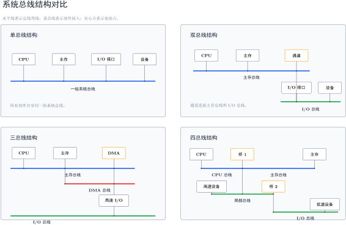

# 总线

**总线**是一组能为多个部件**分时共享**的公共信息传送线路。

- **共享**：总线上可以挂接多个部件，部件之间交换的信息都可以通过这组线路传送。
- **分时**：同一时刻只允许一个部件向总线发送信息；其他部件即使也要发送，也必须等待。

> [!note] 总线不是“一根线”
> 一条总线通常由多根信号线组成。比如一组 32 位数据总线，本质上就是 32 根可并行传送数据位的信号线。

早期计算机外部设备少时，可以采用分散连接方式；设备增多后，这种方式不利于随时增减设备。

总线连接把多个部件挂到一组公共线路上，提高了连接的灵活性。

代价：既然线路被共享，就会产生争用，需要规定占用关系、传输能力和时间配合。

# 按功能分类

按所在位置和连接对象，总线可分为三类。

| 类型 | 连接范围 | 说明 |
| --- | --- | --- |
| 片内总线 | CPU 芯片内部 | 连接 CPU 内部寄存器、ALU 等部件 |
| 系统总线 | 计算机系统内各功能部件之间 | 连接 CPU、主存、I/O 接口 |
| 通信总线 | 计算机系统之间，或计算机与其他系统之间 | 也称外部总线，用于系统外部的信息传送 |

> [!tip] 数据通路和数据总线不是一回事
> **数据通路**强调数据流经的路径；**数据总线**强调承载数据的线路媒介。数据总线可以是数据通路的一部分，但二者不是同一个概念。

# 总线的物理实现

从物理上看，总线是一组信号线。每根信号线一次传送 1 bit 信息，多根信号线并列使用时，就能在同一时刻传送多位信息。

同一时刻，总线上的典型关系是：

- 只能有一个部件作为**发送者**，把信息送到总线上。
- 可以有一个或多个部件作为**接收者**，从总线上读取信息。

如果两个部件同时向同一组总线发送不同信息，线路上的信号就会冲突。因此，总线系统需要规定谁能在什么时候占用总线。

# 总线传输周期的四个阶段

**总线传输周期**也叫总线周期，指一次总线操作所需的完整时间。一个典型总线周期可分为四个阶段。

| 阶段 | 作用 | 关键信息 |
| --- | --- | --- |
| 申请分配阶段 | 主设备申请使用总线，并获得下一次传输周期的总线使用权 | 谁能使用总线 |
| 寻址阶段 | 获得总线使用权的主设备发出从设备地址和有关命令 | 访问谁、做什么 |
| 传输阶段 | 主设备与从设备进行数据交换 | 真正交换数据 |
| 结束阶段 | 主设备撤除有关信息，释放总线使用权 | 总线恢复可用 |

# 总线的基本特性

| 特性 | 关心什么 | 例子 |
| --- | --- | --- |
| 机械特性 | 物理外形和连接方式 | 尺寸、形状、管脚数、排列顺序 |
| 电气特性 | 信号如何在电气层面有效 | 传输方向、有效电平范围 |
| 功能特性 | 每根线承担什么功能 | 地址线、数据线、控制线 |
| 时间特性 | 信号之间的时序关系 | 地址何时有效、读写信号何时发出、数据何时稳定 |

# 串行总线与并行总线

按一次传送信息的方式，总线可以分为**串行总线**和**并行总线**。

| 类型 | 基本方式 | 优点 | 局限 |
| --- | --- | --- | --- |
| 串行总线 | 数据逐位传送 | 传输线少、成本低、适合长距离传输，也能节省设备内部布线空间 | 发送和接收时需要串并转换 |
| 并行总线 | 多位数据同时传送 | 逻辑时序较简单，电路实现较容易 | 信号线多，占布线空间；长距离成本高；频率升高后线间干扰和等长要求更突出 |

并行总线在同一频率下每次能传更多位，但它不意味着一定总是更快。频率、线间干扰、传输距离、编码方式都会影响实际传输能力。

# 系统总线的三类信号

系统总线按传输信息内容可分为**数据总线**、**地址总线**和**控制总线**。

| 类型 | 传什么 | 方向 | 位数或根数的含义 |
| --- | --- | --- | --- |
| 数据总线 | 各功能部件之间的数据信息，包括指令和操作数 | 双向 | 位数与机器字长、存储字长有关 |
| 地址总线 | 主存单元或 I/O 端口的地址 | 通常单向，由 CPU 或主设备发出 | 位数与主存地址空间大小、设备数量有关 |
| 控制总线 | 控制命令和反馈信号 | 有出也有入 | 一根控制线通常传一种控制或状态信号 |

> [!note] 总线复用技术
> 系统总线按功能可以分为地址总线、数据总线和控制总线，但这不等于物理线路一定完全分开。**总线复用**是让同一组物理信号线在不同时间传送不同类型的信息。
>
> 最常见的是**地址/数据复用**：先用这组线传送地址，由接收方锁存地址；随后同一组线再传送数据。这样可以减少引脚数和信号线数，但地址和数据不能同时传送，一次总线传输也需要更明确的时序控制。

# 系统总线结构

## 单总线结构

单总线结构中，CPU、主存、I/O 设备通过 I/O 接口都连接到同一组总线上。

优点是结构简单、成本低、易于接入新设备。缺点也很直接：所有部件争用唯一总线，带宽低、负载重，不支持多个传送操作并发进行。

> [!warning] 单总线不是一根信号线
> “单总线结构”说的是系统里只有一组公共总线，不是说只有一根物理线。这一组总线内部仍然可以细分为地址总线、数据总线和控制总线。

## 双总线结构

双总线结构把系统分成两条主要总线：

- **主存总线**：用于 CPU、主存和通道之间的数据传送。
- **I/O 总线**：用于多个外部设备与通道之间的数据传送。

这里的**通道**是具有特殊功能的处理器，能统一管理 I/O 设备。双总线结构把较低速的 I/O 设备从主存总线上分离出来，减轻主存总线负担；代价是需要增加通道等硬件。

## 三总线结构

三总线结构进一步把系统中的信息通路分成三条独立总线：

- 主存总线。
- I/O 总线。
- 直接内存访问 DMA 总线。

DMA 总线用于支持高速 I/O 设备和主存之间直接交换数据，使 I/O 设备能更快响应命令，提高系统吞吐量。

## 四总线结构

四总线结构通过桥接器把不同层级的总线连接起来。桥接器具有**数据缓冲、转换和控制**功能。

> [!summary]
> - 越靠近 CPU 的总线速度通常越快。
> - 不同层级总线通过桥接器连接，桥接器负责隔离速度差异和协议差异。

读四总线结构时，可以按连接路径看：CPU 先接入 CPU 总线；桥接器一侧连接 CPU 总线，另一侧连接主存总线，并向下连接局部总线；第二级桥接器再把局部总线连接到更低速的 I/O 总线。
