# CDMA 的基本想法

码分复用 CDM 常称为码分多址 CDMA。它允许多个站点在同一时间、同一频带发送数据。接收端能够分离出目标信号，是因为每个站点使用的码片序列互相正交。

CDMA 把一个比特时间划分为 $m$ 个更短的时间片，每个时间片称为**码片**。每个站点被分配一个唯一的 $m$ 位码片序列。实际系统中常用伪随机码序列，$m$ 常取 $64$ 或 $128$；为了便于手算，例题常使用更短的码片序列。

# 码片序列与码片向量

若某站点的码片序列为：

$$
01011001
$$

计算时通常把 `0` 记为 $-1$，把 `1` 记为 $+1$，得到码片向量：

$$
S=(-1,+1,-1,+1,+1,-1,-1,+1)
$$

发送数据时：

- 发送比特 `1`：发送本站码片序列 $S$。
- 发送比特 `0`：发送本站码片序列的反码 $-S$。

# 正交与规格化内积

CDMA 要求不同站点的码片向量互相正交。设 $A$ 和 $B$ 是两个长度为 $m$ 的码片向量，它们的规格化内积为：

$$
\frac{A\cdot B}{m}=\frac{a_1b_1+a_2b_2+\cdots+a_mb_m}{m}
$$

如果：

$$
\frac{A\cdot B}{m}=0
$$

则 $A$ 和 $B$ 正交。正交意味着接收端用 $A$ 去检查 $B$ 的信号时，结果为 $0$，不会把别的站点误认为本站数据。

三条结果要记牢：

| 规格化内积 | 含义 |
| --- | --- |
| $S\cdot S/m=1$ | 本站发送 `1` |
| $S\cdot(-S)/m=-1$ | 本站发送 `0` |
| $S\cdot B/m=0$ | 其他站点信号与本站正交 |

若 $S$ 与 $B$ 正交，则 $S$ 与 $-B$ 也正交：

$$
\frac{S\cdot(-B)}{m}=-\frac{S\cdot B}{m}=0
$$

# 多站点同时发送

多个站点同时发送时，信道中的信号是这些站点所发送码片向量的逐位叠加。

例如：

- A 发送 `1`，发送 $A$。
- B 发送 `0`，发送 $-B$。
- C 不发送，视为 $0$ 向量。

信道中收到的叠加向量为：

$$
R=A+(-B)
$$

接收端不知道“肉眼上”哪一部分属于哪个站点，而是用自己的码片向量与 $R$ 做规格化内积。

[html-card height=620](../assets/cdma-decode-process-slides.html)

如果某个接收端使用本站码片向量 $S$ 计算：

$$
\frac{S\cdot R}{m}
$$

那么结果的含义为：

| 结果 | 判定 |
| --- | --- |
| $1$ | 收到本站比特 `1` |
| $-1$ | 收到本站比特 `0` |
| $0$ | 没有本站数据 |

# 为什么叠加后还能分开

关键在于内积的线性性质。若信道中：

$$
R=A+(-B)
$$

A 接收时计算：

$$
\frac{A\cdot R}{m}
=\frac{A\cdot A}{m}-\frac{A\cdot B}{m}
=1-0=1
$$

B 接收时计算：

$$
\frac{B\cdot R}{m}
=\frac{B\cdot A}{m}-\frac{B\cdot B}{m}
=0-1=-1
$$

C 若与 A、B 都正交，则：

$$
\frac{C\cdot R}{m}
=\frac{C\cdot A}{m}-\frac{C\cdot B}{m}
=0-0=0
$$

所以，同一个叠加信号 $R$，不同接收端用不同码片向量去“投影”，得到的是各自关心的结果。
