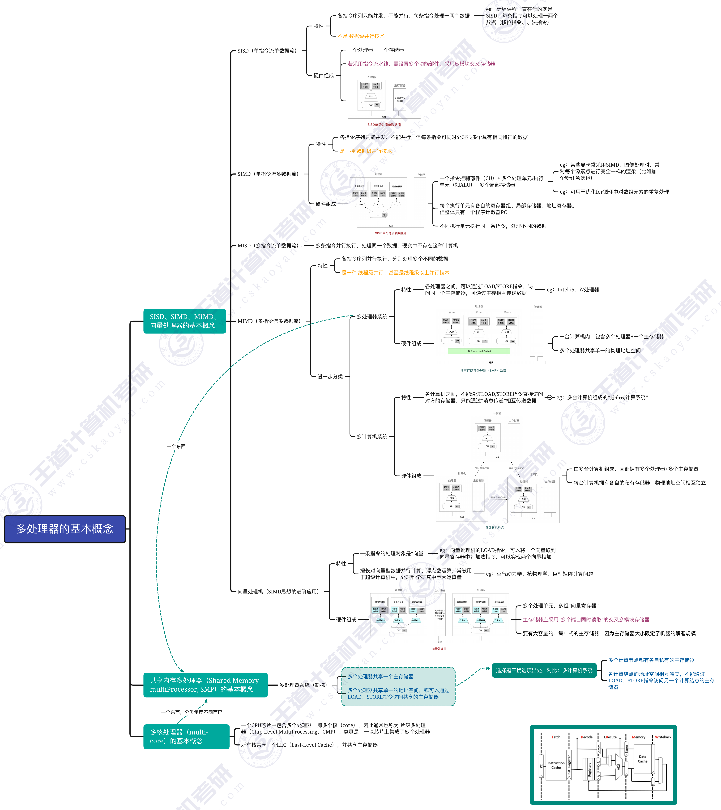

# 多处理器与硬件多线程

看图即可。

# 多处理器基本概念

| 类型 | 核心特征 |
|---|---|
| `SISD` | 单指令流、单数据流。普通单处理器顺序执行程序通常属于这一类。 |
| `SIMD` | 单指令流、多数据流。一条指令同时处理多个具有相同操作的数据，适合向量、数组、图像像素等批量处理。 |
| `MISD` | 多指令流、单数据流。现实中很少见。 |
| `MIMD` | 多指令流、多数据流。多个处理器并行执行不同指令，处理不同数据。 |

`MIMD` 又可以分成两类：

| 类型 | 存储器关系 | 通信方式 |
|---|---|---|
| 共享存储多处理器系统 | 多个处理器共享同一个主存地址空间 | 可通过 `LOAD/STORE` 访问共享数据 |
| 多计算机系统 | 每台计算机有自己的私有存储器，物理地址空间相互独立 | 通过消息传递交换数据 |

> [!note] 多核处理器
> 多核处理器是在一个 CPU 芯片中集成多个处理器核心。多个核心通常共享最后一级 Cache，并共享主存储器，因此可看作共享存储多处理器的一种实现形态。

# 硬件多线程

硬件多线程是在处理器硬件层面支持多个线程的执行状态，使处理器在一个线程等待时能切换或并行利用其他线程。

| 类型 | 基本思想 |
|---|---|
| 细粒度多线程 | 几乎每个时钟周期都在线程之间切换，以隐藏流水线停顿。 |
| 粗粒度多线程 | 只有当前线程发生较长延迟时才切换到另一个线程。 |
| 同时多线程 | 同一个时钟周期内，不同线程的指令可以同时发射到多个功能部件。 |

硬件多线程关注的是一个处理器内部如何更充分利用执行资源；多处理器关注的是系统中有多个处理器或处理器核心。
