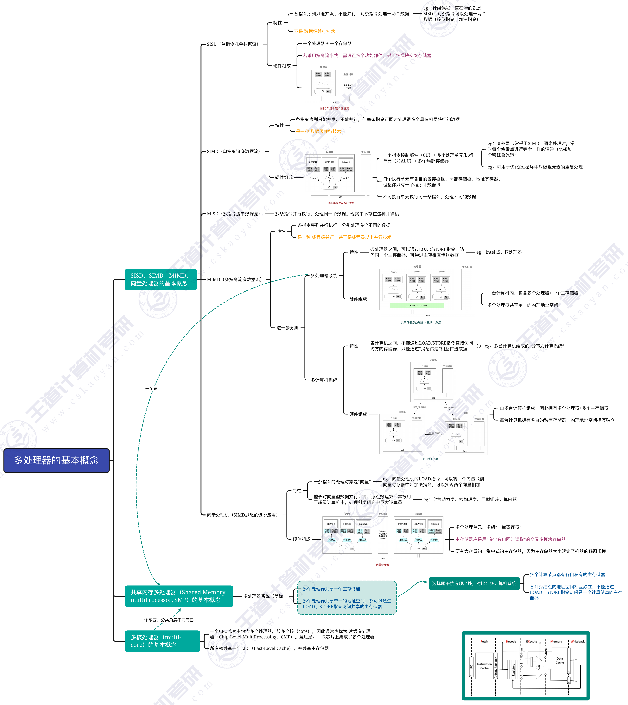

# 多处理器

看图即可。

# 硬件多线程

硬件多线程是在处理器硬件层面支持多个线程的执行状态，使处理器在一个线程等待时能切换或并行利用其他线程。既可以用于单核处理器，也可以用于多核处理器。

| 类型     | 基本思想                           | 线程切换代价      | 并行性          |
| ------ | ------------------------------ | ----------- | ------------ |
| 细粒度多线程 | 几乎每个时钟周期都在线程之间切换，以隐藏流水线停顿。     | 低，不必重载流水线   | 指令级并行，线程间不并行 |
| 粗粒度多线程 | 只有当前线程发生较长延迟时才切换到另一个线程。        | 高，需要重载流水线   | 指令级并行，线程间不并行 |
| 同时多线程  | 同一个时钟周期内，不同线程的指令可以同时发射到多个功能部件。 | 不以线程切换的方式工作 | 指令级并行和线程级并行  |
