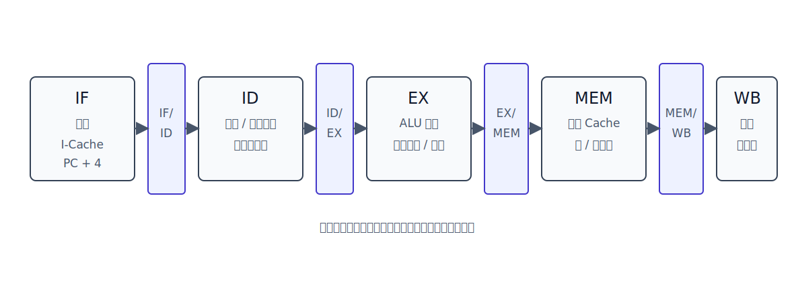

# 指令流水线

流水线把一条指令的执行过程拆成若干阶段，让多条指令在不同阶段重叠执行。

以 MIPS 五段流水线为例：

```text
IF -> ID -> EX -> MEM -> WB
```

单条指令仍然要经过多个阶段；流水线提高的是**吞吐率**，不是把每条指令本身压缩成一个阶段。



每个流水段后面都有流水线寄存器，用来保存本阶段结果并传给下一阶段：

| 流水线寄存器 | 保存内容                                |
| ------------ | --------------------------------------- |
| `IF/ID`      | 取出的指令、`PC+4`                      |
| `ID/EX`      | 读出的寄存器操作数、立即数、控制信号    |
| `EX/MEM`     | ALU 结果、分支判断结果、待写主存的数据  |
| `MEM/WB`     | 主存读出的数据或 ALU 结果、目的寄存器号 |

> [!note] 机器周期按最慢阶段设置
> 若 `IF/ID/EX/MEM/WB` 的实际耗时不同，为方便流水线同步，机器周期通常按最慢流水段设置。较快阶段也要等待一个完整机器周期结束。


> [!info] 控制信号也要随流水线向后流动
> 控制信号也要被流水线寄存器保存。对一条指令来说，`ID` 阶段译码后会同时产生后续阶段需要的控制信号；这些控制信号不能只停留在 `ID`，否则后面阶段执行到该指令时就不知道该做什么。
> 
> 
> 可以把控制信号分成三组看：
> 
> | 控制信号组 | 进入哪个流水线寄存器 | 在哪里使用 | 例子 |
> |---|---|---|---|
> | `EX` 控制 | `ID/EX` | `EX` 阶段 | `ALUOp`、`ALUSrc` |
> | `MEM` 控制 | `ID/EX -> EX/MEM` | `MEM` 阶段 | `MemRead`、`MemWrite` |
> | `WB` 控制 | `ID/EX -> EX/MEM -> MEM/WB` | `WB` 阶段 | `RegWrite`、`MemToReg` |
> 
> 因此，流水线寄存器保存的不只是数据值，还包括“这条指令到后面阶段时应该怎样控制数据通路”的信息。某一组控制信号在对应阶段用完后，就不需要再继续向后传。

# MIPS 五段阶段

| 阶段    | 名称                 | 主要工作                          |
| ----- | ------------------ | ----------------------------- |
| `IF`  | Instruction Fetch  | 根据 PC 从指令 Cache 取指令，形成 `PC+4` |
| `ID`  | Instruction Decode | 指令译码，读寄存器堆，扩展立即数              |
| `EX`  | Execute            | ALU 运算、有效地址计算、分支比较或目标地址计算     |
| `MEM` | Memory Access      | 访问数据 Cache，或完成分支 PC 写入等动作     |
| `WB`  | Write Back         | 把 ALU 结果或 load 数据写回寄存器堆       |

MIPS 采用 load/store 风格：通常只有 `lw` 和 `sw` 访问数据存储器，普通算术逻辑指令只在寄存器之间运算。

# 五类指令的阶段行为

## 运算类指令

例：

```mips
add $t0, $t1, $t2
addi $t0, $t1, 996
sll $t0, $t0, 2
```

| 阶段 | 行为 |
|---|---|
| `IF` | 取指令 |
| `ID` | 译码，读源寄存器 |
| `EX` | ALU 运算 |
| `MEM` | 空段，不访问数据存储器 |
| `WB` | 将 ALU 结果写回寄存器 |

## `lw`

例：

```mips
lw $t0, 996($s0)
```

功能：

```text
M[996 + ($s0)] -> $t0
```

| 阶段 | 行为 |
|---|---|
| `IF` | 取指令 |
| `ID` | 读基址寄存器 `$s0`，扩展偏移量 `996` |
| `EX` | ALU 计算有效地址 `996 + ($s0)` |
| `MEM` | 从数据 Cache 读取数据 |
| `WB` | 将读出的数据写回 `$t0` |

## `sw`

例：

```mips
sw $t0, 996($s0)
```

功能：

```text
($t0) -> M[996 + ($s0)]
```

| 阶段 | 行为 |
|---|---|
| `IF` | 取指令 |
| `ID` | 读基址寄存器 `$s0`，读待写数据 `$t0`，扩展偏移量 |
| `EX` | ALU 计算有效地址 |
| `MEM` | 将 `$t0` 的值写入数据 Cache |
| `WB` | 空段，不写寄存器 |

## 条件分支

例：

```mips
beq $s0, $s1, label
bne $s0, $s1, label
```

| 阶段 | 行为 |
|---|---|
| `IF` | 取分支指令 |
| `ID` | 读比较用的两个寄存器，取偏移量 |
| `EX` | 比较两个寄存器，计算分支目标 |
| `MEM` | 若采用较晚更新 PC 的实现，可在该段完成写 PC |
| `WB` | 空段 |

条件分支带来控制相关。分支结果确定前，后续取指可能已经沿某个方向进行了。

## 无条件跳转

例：

```mips
j label
```

| 阶段 | 行为 |
|---|---|
| `IF` | 取跳转指令 |
| `ID` | 译码并取得目标字段 |
| `EX` | 形成目标 PC，越早写 PC 越能减少控制冲突 |
| `MEM` | 空段或仅保留形式上的阶段 |
| `WB` | 空段 |

# 执行过程演示

[html-card height=620](../assets/mips-pipeline-execution-slides.html)

> [!warning] 阻塞传递
> 五段流水线中，`IF/ID` 锁存器保存当前取出的指令。如果某条指令因为 RAW 相关等原因停在 `ID`，后一条指令就不能继续完成 `IF` 并覆盖 `IF/ID`，否则前一条还没进入下一段的指令会丢失。
>
> 因此，无转发且数据相关严重时，不只是相关指令的 `ID` 会被阻塞，后续指令的 `IF` 也可能被迫等待。

# 流水线性能


设流水线有 `k` 个阶段，每个阶段耗时 $\Delta t$，连续执行 `n` 个任务。


理想情况下，流水线总时间为：

$$
T_k = (k+n-1)\Delta t
$$

其中：

| 部分 | 含义 |
|---|---|
| `k-1` | 流水线装入时间 |
| `n` | 每个周期完成一个任务 |
| 最后的空白 | 流水线排空过程已经包含在 `k+n-1` 中 |

从时空图看，前 `k-1` 个周期主要用于把第一个任务逐步送入各级流水段；第 `k` 个周期开始，第一个任务完成。之后在没有停顿的理想情况下，每过一个机器周期就完成一个任务，直到第 `n` 个任务走完最后一级流水段。因此总周期数不是 `kn`，而是 `k+n-1`。

## 吞吐率

吞吐率表示单位时间完成的任务数：

$$
TP = \frac{n}{(k+n-1)\Delta t}
$$

当 $n \to \infty$ 时：

$$
TP_{max} = \frac{1}{\Delta t}
$$

## 加速比

不用流水线顺序执行 `n` 个任务，需要：

$$
T_0 = nk\Delta t
$$

流水线加速比为：

$$
S = \frac{T_0}{T_k}
  = \frac{nk\Delta t}{(k+n-1)\Delta t}
  = \frac{nk}{k+n-1}
$$

当 $n \to \infty$ 时：

$$
S_{max} = k
$$

## 效率

效率是流水线设备利用率。理想情况下：

$$
E = \frac{n}{k+n-1}
$$

当 $n \to \infty$ 时：

$$
E_{max}=1
$$

> [!warning] 公式默认理想流水线
> 这些公式默认各阶段耗时相同、每个阶段结束后能立即进入下一阶段，且没有结构相关、数据相关和控制相关造成的停顿。

# 影响流水线的因素

## 结构相关

结构相关也叫资源冲突。它指多条指令在同一时刻争用同一硬件资源。

典型例子：若取指和数据访存共用同一个存储器，则某条 `lw/sw` 在 `MEM` 访问数据时，后一条指令的 `IF` 也想取指，二者冲突。

解决办法：

| 方法 | 含义 |
|---|---|
| 停顿 | 让后一条相关指令暂停一个或多个周期 |
| 资源重复配置 | 分离指令 Cache 和数据 Cache，或增加功能部件 |

MIPS 五段流水线通常用指令 Cache 与数据 Cache 分离来避免取指和数据访存争用同一个存储器端口。

## RAW 数据相关

RAW 相关是 MIPS 五段流水线中最常分析的数据冲突。它指后一条指令要**读**某个寄存器，而前一条尚未把这个寄存器的新值**写**出来。

```text
前一条指令：写 R
后一条指令：读 R
```

例如：

```mips
add $t0, $t1, $t2
sub $t3, $t0, $t4
```

`add` 写 `$t0`，`sub` 读 `$t0`，所以存在 RAW 相关。

分析一段 MIPS 指令序列时，可以按下面顺序看：

| 步骤 | 看什么 |
|---|---|
| 1 | 标出每条指令写哪个寄存器 |
| 2 | 标出后续指令读哪些寄存器 |
| 3 | 若后续指令读取前面尚未写回的寄存器，就是 RAW 相关 |
| 4 | 再判断能否通过转发解决；若是 load-use，通常仍需停顿 |

常见 MIPS 指令的读写关系：

| 指令 | 读 | 写 |
|---|---|---|
| `add rd, rs, rt` | `rs, rt` | `rd` |
| `addi rt, rs, imm` | `rs` | `rt` |
| `lw rt, offset(rs)` | `rs` | `rt` |
| `sw rt, offset(rs)` | `rs, rt` | 无 |
| `beq rs, rt, label` | `rs, rt` | 无 |

`sw` 虽然不写寄存器，但它会读两个寄存器：一个给有效地址计算，一个给待写入主存的数据。

解决办法：

| 方法 | 含义 |
|---|---|
| 硬件阻塞 | 检测到相关后插入气泡 |
| 软件插入 `nop` | 编译器或程序员显式留出空周期 |
| 数据旁路/转发 | 把后面阶段的结果直接送到前面需要它的 ALU 输入端 |
| 编译优化 | 调整无关指令顺序，填补等待周期 |

### 转发

转发也叫数据旁路。它不等结果写回寄存器堆，而是把后面流水段中已经产生的结果直接送到前面需要它的地方。

典型 ALU-ALU 相关通常可以用转发解决：

```mips
add $t0, $t1, $t2
sub $t3, $t0, $t4
```

`add` 的 ALU 结果在 `EX` 末尾已经形成，可以从 `EX/MEM` 或 `MEM/WB` 转发给 `sub` 的 ALU 输入。

用时空图看，转发发生在“生产者已经产生结果”和“消费者真正需要结果”的交界处。

注意：`sub` 在 `ID` 阶段读到的 `$t0` 可能仍是旧值，但它真正用于 ALU 运算是在 `EX` 阶段。转发技术绕过寄存器堆，把新值直接送到 `EX` 阶段的 ALU 输入。


如果没有转发，相关指令不能靠 `ID` 阶段读到新值；它必须等生产者写回寄存器堆后，才进入能正确读数的 `ID`。若模型规定寄存器堆“前半周期写、后半周期读”，`ID` 可以与 `WB` 放在同一周期；否则 `ID` 要放在 `WB` 后一个周期。

### load-use

**转发技术不能完全消除 `load-use` 类数据冲突。**

`lw` 的结果不是在 `EX` 段产生，而是在 `MEM` 段从数据 Cache 读出。因此紧跟在 `lw` 后面使用该寄存器的指令，即使有转发，也通常需要停顿一个周期。

```mips
lw  $t0, 0($s0)
add $t1, $t0, $t2
```

`add` 在自己的 `EX` 段就需要 `$t0`，但 `lw` 的数据到 `MEM` 段末尾才可用。若二者紧挨着，时间上赶不上，所以要插入一个气泡：


例如：

```mips
lw  $t0, 0($s0)
add $t5, $t6, $t7
sub $t1, $t0, $t2
```

中间的 `add` 给 `lw` 留出了一个周期，`sub` 再使用 `$t0` 时，通常可以通过转发取得数据。

## 控制相关

控制相关也叫控制冲突。它来自分支、跳转等会改变 PC 的指令。

当分支方向和目标地址尚未确定时，流水线不知道下一条指令应该从哪里取。

解决办法：

| 方法 | 含义 |
|---|---|
| 停顿等待 | 等分支结果确定后再取正确指令 |
| 分支预测 | 先猜测分支方向，猜错则冲刷流水线 |
| 同时预取两个方向 | 同时准备转移成功和失败两条路径 |
| 提前形成条件码和目标地址 | 让分支结果尽早确定，减少损失 |

# 流水线分类

流水线可以从多个角度分类。

## 按使用级别

| 类型 | 含义 | 例子 |
|---|---|---|
| 部件功能级流水线 | 把某个功能部件内部的复杂操作再分段 | 浮点加法分成求阶差、对阶、尾数相加、规格化 |
| 处理机级流水线 | 把一条机器指令的执行过程分段 | MIPS 五段 `IF/ID/EX/MEM/WB` |
| 处理机间流水线 | 多个处理机之间分工完成任务 | 每个处理机完成一部分，结果交给下一处理机 |

## 按能完成的功能

| 类型 | 含义 |
|---|---|
| 单功能流水线 | 只能完成一种固定功能 |
| 多功能流水线 | 通过不同连接方式完成多种功能 |

## 按同一时间内的连接方式

| 类型 | 含义 |
|---|---|
| 静态流水线 | 同一时间内，各段只能按同一种功能的连接方式工作 |
| 动态流水线 | 同一时间内，不同段可以服务于不同功能 |

## 按是否存在反馈

| 类型     | 含义                       |
| ------ | ------------------------ |
| 线性流水线  | 从输入到输出，每个功能段只经过一次，没有反馈回路 |
| 非线性流水线 | 存在反馈回路，某些功能段可能被多次经过      |

# 多发技术

| 技术 | 基本思想 | 关键点 |
|---|---|---|
| 超标量 | 一个时钟周期并发多条独立指令 | 需要多个功能部件，通常按序发射 |
| 超流水 | 把一个时钟周期内的功能段再细分 | 一个功能部件在一个原始周期内使用多次 |
| 超长指令字 | 编译器把可并行操作组合成一条长指令 | 由编译器挖掘指令级并行 |
