# 调度指标

不同指标观察的角度不同：

- 系统角度：CPU 是否充分忙碌，单位时间能完成多少作业。
- 用户角度：自己的作业多久完成，多久第一次得到响应。
- 算法角度：等待时间是否过长，短作业和长作业是否被公平对待。

[html-card height=760](../assets/cpu-scheduling-metrics-slides.html)

# CPU 利用率

**CPU 利用率**是 CPU 忙碌时间占总时间的比例。

$$
\text{CPU 利用率}=\frac{\text{CPU 忙碌时间}}{\text{总时间}}
$$

CPU 忙碌时间是 CPU 真正在执行进程的时间。若某段时间 CPU 空闲、等待 I/O 或没有可运行进程，则不计入忙碌时间。

类似地，也可以计算打印机、磁盘等设备的利用率：

$$
\text{设备利用率}=\frac{\text{设备忙碌时间}}{\text{总时间}}
$$

> [!example]
> 一个作业先占用 CPU 5 秒，再使用打印机 5 秒，最后再占用 CPU 5 秒。总时间为 15 秒。
>
> CPU 利用率为 $\frac{5+5}{15}=66.67\%$；打印机利用率为 $\frac{5}{15}=33.33\%$。

# 系统吞吐量

**系统吞吐量**是单位时间内完成作业的数量。

$$
\text{系统吞吐量}=\frac{\text{完成作业数}}{\text{总耗时}}
$$

如果 100 秒内完成 10 道作业，则系统吞吐量为：

$$
\frac{10}{100}=0.1\text{ 道/秒}
$$

吞吐量越高，说明系统整体处理作业的能力越强。但吞吐量不能反映单个用户的等待体验。一个系统可以吞吐量较高，但某些作业等待很久。

# 周转时间

**周转时间**是作业从提交给系统开始，到作业完成为止的时间间隔。

$$
\text{周转时间}=\text{完成时间}-\text{提交时间}
$$

周转时间包括：

- 作业在外存后备队列中等待高级调度的时间。
- 进程在就绪队列中等待低级调度的时间。
- 进程在 CPU 上执行的时间。
- 进程等待 I/O 操作完成的时间。

其中，等待进程调度、占用 CPU、等待 I/O 这些阶段，在一个作业的生命周期中可能出现多次。

**平均周转时间**用于评价一组作业的整体完成体验：

$$
\text{平均周转时间}=\frac{\text{各作业周转时间之和}}{\text{作业数}}
$$

## 带权周转时间

只看周转时间还不够。两个作业都花了 10 秒完成，如果一个作业实际只需要运行 1 秒，另一个作业实际需要运行 9 秒，用户感受并不一样。

**带权周转时间**用周转时间除以实际运行时间：

$$
\text{带权周转时间}=\frac{\text{周转时间}}{\text{实际运行时间}}
$$

平均带权周转时间为：

$$
\text{平均带权周转时间}=\frac{\text{各作业带权周转时间之和}}{\text{作业数}}
$$

带权周转时间必然大于等于 1：

- 等于 1：作业一提交就开始运行，且中途没有等待。
- 大于 1：作业经历了等待。

周转时间和带权周转时间都越小越好。带权周转时间更能反映短作业被拖慢时的体感损失。

# 等待时间

**等待时间**是进程或作业处于等待**处理机**的时间之和。

对进程来说，等待时间是进程建立后在就绪队列等待 CPU 的时间总和。

对作业来说，等待时间还要加上作业在外存后备队列中等待高级调度的时间。

> [!important] 等待 I/O 时间不计入等待处理机时间
> 等待时间关注的是“等待处理机服务”。进程等待 I/O 完成时，实际上是在等待 I/O 设备服务，**不计入等待处理机时间**。

在没有 I/O、没有抢占的简单例子中：

$$
\text{等待时间}=\text{开始运行时间}-\text{到达时间}
$$

在更一般的情况下：

$$
\text{等待时间}=\text{周转时间}-\text{CPU 运行时间}-\text{I/O 服务时间}
$$

若进程多次被抢占，等待时间要把每一段在就绪队列中等待 CPU 的时间相加。

# 响应时间

**响应时间**是从用户提交请求，到系统首次产生响应所用的时间。

$$
\text{响应时间}=\text{首次开始被服务时间}-\text{请求提交时间}
$$

> [!note] 与等待时间关系
> 在没有 I/O、没有抢占，且进程一旦开始运行就一直运行到完成的简单情况下：
> $$
> \text{响应时间}=\text{等待时间}=\text{开始运行时间}-\text{到达时间}
> $$
> 二者相等，是因为“首次开始被服务”和“唯一一次开始运行”是同一个时刻。
>
> 一旦出现抢占，二者就可能不同：
> - 响应时间只计算第一次得到 CPU 之前等了多久
> - 等待时间计算整个生命周期中所有等待 CPU 的时间总和。
>
> 例如某进程 0 时刻到达，2 时刻第一次运行，3 时刻被抢占，5 时刻再次运行，则响应时间为 $2-0=2$，等待时间为 $(2-0)+(5-3)=4$。

在**交互式系统**中，响应时间尤其重要。用户输入命令后，系统很快开始处理并给出反馈，即使整个任务还没结束，用户也会觉得系统更“灵敏”。

# 计算示例

设三个进程信息如下：

| 进程  | 到达时间 | 开始时间 | 完成时间 |
| --- | ---- | ---- | ---- |
| P1  | 0    | 0    | 4    |
| P2  | 1    | 4    | 7    |
| P3  | 2    | 7    | 9    |

调度顺序为 P1 $\to$ P2 $\to$ P3，且无 I/O、无抢占。

| 进程 | 周转时间 | 带权周转时间 | 等待时间 | 响应时间 |
| --- | --- | --- | --- | --- |
| P1 | $4-0=4$ | $4/4=1$ | $0-0=0$ | $0-0=0$ |
| P2 | $7-1=6$ | $6/3=2$ | $4-1=3$ | $4-1=3$ |
| P3 | $9-2=7$ | $7/2=3.5$ | $7-2=5$ | $7-2=5$ |

平均周转时间：

$$
\frac{4+6+7}{3}=\frac{17}{3}
$$

平均带权周转时间：

$$
\frac{1+2+3.5}{3}=\frac{13}{6}
$$

平均等待时间：

$$
\frac{0+3+5}{3}=\frac{8}{3}
$$

平均响应时间：

$$
\frac{0+3+5}{3}=\frac{8}{3}
$$

CPU 利用率：

$$
\frac{4+3+2}{9}=100\%
$$

系统吞吐量：

$$
\frac{3}{9}=\frac{1}{3}\text{ 道/时间单位}
$$
