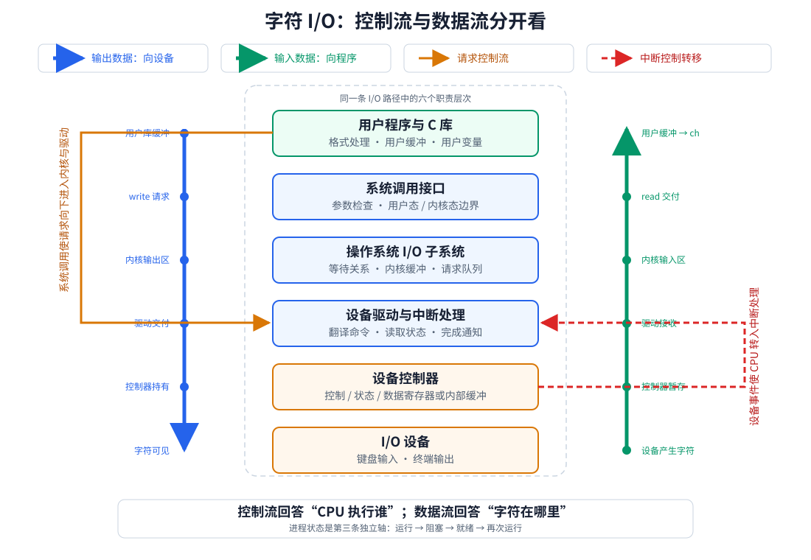

# 用三个坐标定位一次 I/O

分析字符 I/O 时，沿时间线追踪三个坐标：

| 坐标 | 要问的问题 |
| --- | --- |
| 控制流 | CPU 当前正在执行用户程序、C 库、系统调用处理、驱动程序，还是中断处理程序？ |
| 进程状态 | 发起 I/O 的进程处于运行、阻塞、就绪中的哪一种？ |
| 数据流 | 字符尚未产生，还是位于设备、控制器、内核数据区、用户缓冲区或用户变量？ |

> [!important] 两组不能互相替代的概念
> **用户态 / 内核态**描述 CPU 执行代码的权限；**运行 / 阻塞 / 就绪**描述进程是否占用 CPU、是否具备运行条件。进程可以在内核态运行系统调用，也可以在等待 I/O 时处于阻塞态；不能把“内核态”等同于“阻塞态”。

本例中的通用软件与硬件层次如下。蓝线、绿线表示数据运动，橙线表示请求控制流，红色虚线表示设备中断带来的反向控制转移。



系统调用、驱动程序、控制器和中断处理各自只负责链条的一段：

- C 库把方便的函数接口转换成字节读写请求，见 [[System-Call|系统调用与库函数]]；
- 系统调用让用户程序受控进入内核，见 [[CPU-Modes#用户态到内核态|用户态到内核态]]；
- 设备驱动把通用请求翻译为控制器操作，见 [[IO-Software-Hierarchy#设备驱动程序|设备驱动程序]]；
- 控制器暂存数据、状态和命令，见 [[IO-Device-And-Controllers#I/O 控制器|I/O 控制器]]；
- 设备用异步中断通知 CPU，见 [[Exception-And-Interrupt-Definition#中断|中断]]。

# 输入：`scanf("%c", &ch)`

```c
char ch;
scanf("%c", &ch);
```

> [!note] 场景假设
> C 标准库当前没有可直接交给 `scanf` 的输入字符，底层读取采用阻塞语义，键盘当前也没有可交付数据。用户之后产生的输入满足当前终端输入策略；若某实现要求先完成一整行，则要等行结束条件满足后，读取请求才能继续。这里讨论抽象机制，不绑定具体终端实现。

[html-card height=720 step=80 title=Character Input Timeline](../assets/character-input-timeline.html)

## 1. 用户程序进入 `scanf`

`scanf` 是用户空间的 C 库函数，负责读取已有输入、解释格式串并把转换结果写到参数指向的位置。调用库函数本身不等于系统调用。

**定位：** CPU 在用户态执行本进程的 C 库代码；进程处于运行态；字符尚未产生，`ch` 仍是调用前的值。

库缓冲中若已有字符，`scanf` 可以直接完成，本次调用不会经过后面的设备 I/O。当前假设缓冲不足，所以它要向操作系统请求更多字节。

## 2. 发起读取系统调用

C 库把需求抽象成类似请求：

```text
read(I/O 对象标识, 用户缓冲区, 最大读取字节数)
```

普通用户程序不能直接访问键盘控制器寄存器，也不能执行启动设备、修改中断状态等特权操作。它通过系统调用入口触发同步自陷；CPU 按预设入口切换到内核态，由内核检查对象、缓冲区、权限和参数。完整受控入口见 [[System-Call#调用过程|系统调用过程]]。

**定位：** CPU 先在用户态执行 C 库与系统调用入口，随后在内核态执行本进程的系统调用处理代码；进程仍处于运行态；`ch` 尚未得到输入，目标用户缓冲区也没有新字符。

## 3. 没有可交付的键盘输入

内核 I/O 层和驱动检查后发现当前没有数据，读取请求不能完成。阻塞式读取会记录“该进程在等待这个 I/O 条件”，把进程从运行态改为阻塞态，再调用调度器选择其他就绪进程。状态转换见 [[Process#进程的状态|进程状态]]。

$$
\boxed{\text{进程等待 I/O}\neq\text{CPU 等待 I/O}}
$$

**定位：** CPU 短暂执行内核阻塞与调度代码，随后执行其他进程或闲逛进程；原进程处于阻塞态；字符尚未产生。

## 4. 用户按下键盘

按键使键盘硬件产生输入信息。设备把信息交给控制器，控制器可以把它暂存在数据寄存器或内部缓冲中，并设置“数据就绪”等状态；随后向 CPU 提出中断请求。

```text
按键 → 键盘设备 → 设备控制器保存输入信息 → 中断请求
```

**定位：** CPU 此刻可能正在执行任意其他进程，也可能运行闲逛进程；发起读取的原进程仍处于阻塞态；字符位于设备或控制器侧，尚未进入用户空间。

## 5. CPU 响应中断

外部中断与当前指令流异步。CPU 通常完成当前指令后，暂停当时正在运行的代码，保存返回所需信息，切换到内核态，并根据中断入口转到对应处理过程。硬件响应与内核处理的分工见 [[Exception-And-Interrupt-Handling#响应与处理过程|中断响应与处理]]。

**定位：** CPU 在内核态执行中断公共入口、设备中断处理或驱动代码；原进程仍未占用 CPU，通常仍是阻塞态；字符仍在控制器侧，或正被读取到内核。

## 6. 操作系统接收输入数据

中断处理程序与驱动配合完成以下工作：

1. 读取控制器状态并确认中断原因；
2. 从控制器取得输入信息；
3. 把字符纳入操作系统管理的输入数据区；
4. 更新读取请求和缓冲区状态。

在这个阶段完成后，数据已经越过控制器进入**内核管理的输入路径**。

**定位：** CPU 在内核态执行中断处理或紧邻的驱动处理；原进程尚未必运行；字符在内核管理的输入缓冲区中，还不在用户缓冲区，更不在 `ch` 中。

## 7. 唤醒等待进程

当内核已有足以满足读取条件的数据时，它把等待关系标记为已满足，将原进程从阻塞队列移到就绪队列。

**定位：** CPU 仍可能在中断处理程序或其他进程中；原进程由阻塞态变为就绪态；字符仍在内核输入缓冲区。

## 8. `read` 完成并返回用户态

原进程以后被调度时，先从此前暂停的内核路径继续。内核把所需字节交付到系统调用参数指定的用户空间缓冲区，记录实际完成量，然后执行系统调用返回，使 CPU 回到用户态的 C 库代码。

这里讨论典型的复制式交付。具体实现可能共享或映射缓冲区，复制次数也可能不同；必然关系是：C 库必须能在用户空间取得读取结果，才能继续解析 `%c`。

**定位：** CPU 先在内核态继续执行原进程的读取处理，随后在用户态回到 C 库；原进程处于运行态；字符已经可由用户空间缓冲区访问，但 `ch` 仍未必赋值。

## 9. `scanf` 把字符写入 `ch`

`scanf` 根据 `%c` 取一个字符，不做整数解析，把该字符值写入 `&ch` 指向的用户变量。此时才完成源代码层面可见的效果：

$$
\boxed{ch=\text{用户输入字符对应的值}}
$$

**定位：** CPU 在用户态执行本进程的 C 库与后续用户代码；进程处于运行态；字符最终位于 `ch` 中，库缓冲中还可能保留未被本次转换消费的其他输入。

# 输出：`printf` 后显式刷新

主案例使用：

```c
printf("A");
fflush(stdout);
```

`printf("A\n")` 在典型行缓冲终端上也常触发刷新，但这取决于缓冲策略。显式调用 `fflush` 可以明确表示：程序要求 C 库把已有输出提交给底层 I/O 接口。这里假设调用成功，输出队列也有足够空间。

[html-card height=680 step=80 title=Character Output Timeline](../assets/character-output-timeline.html)

## 1. `printf` 在用户态生成字符序列

`printf` 解析格式串，把参数转换成字符，并把结果写入用户空间的标准 I/O 缓冲区。对本例而言，待输出字节是 `A`。

$$
\boxed{\text{执行了 printf}\neq\text{字符已经显示}}
$$

**定位：** CPU 在用户态执行本进程的 C 库；进程处于运行态；字符通常位于用户空间的库缓冲区。

## 2. `fflush` 发起输出系统调用

刷新使 C 库尝试通过类似接口提交字节：

```text
write(I/O 对象标识, 用户缓冲区, 字节数)
```

系统调用入口使 CPU 从用户态受控进入内核态。内核检查输出对象和缓冲区，再把请求交给通用 I/O 层与相应驱动。

**定位：** CPU 从用户态 C 库转入内核态系统调用处理；进程仍在运行；字符从用户库缓冲进入内核接收路径。

## 3. 内核接收并排队输出

典型情况下，内核把待输出数据纳入自己管理的输出缓冲区或请求队列，再由驱动准备控制器命令。具体复制次数和缓冲层数依实现而异，不能写成固定层数。

若内核输出队列有空间，`write` 可能在设备真正显示字符之前就返回；若队列已满，阻塞式写入也可能让进程等待可用空间。

**定位：** CPU 在内核态执行 I/O 层和驱动；主路径中原进程仍处于运行态，队列满时则可能阻塞；字符位于内核输出区域，并准备交给控制器。

## 4. 控制器与设备独立工作

驱动把请求转换为控制器命令。控制器取得待输出数据后驱动设备工作；CPU 不需要为每个物理动作持续执行空循环，可以继续当前进程、调度其他进程，或在没有工作时运行闲逛进程。

字符设备常在需要更多数据、输出完成或发生错误时通过中断通知 CPU；一次中断对应多少字符取决于控制器缓冲、批处理方式和具体实现，不能假定“一个字符必然一个中断”。

**定位：** CPU 可以执行用户代码、其他进程或内核代码；原进程可能已从 `write` 返回，也可能因队列满而阻塞；字符位于控制器或输出设备的处理路径中。

## 5. 字符真正显示

设备接收并完成输出后，字符才变为用户可见结果。若设备产生完成中断，内核会更新请求或缓冲区状态，并唤醒因输出队列已满而等待的进程。

下列时刻不能默认相同：

```text
printf 返回
→ fflush 发起 write
→ write 返回
→ 内核接收数据
→ 控制器接收数据
→ 设备完成输出
→ 字符可见
```

**定位：** CPU 可能正在执行任何可运行代码；发起输出的进程可能运行、就绪或已继续其他工作；字符已经到达输出设备并产生可见效果。

# 输入时刻定位表

| 时刻 | CPU 正在执行谁 | 原进程状态 | 输入字符在哪里 |
| --- | --- | --- | --- |
| `scanf` 刚执行 | 原进程的用户态 C 库 | 运行 | 尚未产生，`ch` 未改变 |
| `read` 进入内核 | 原进程的系统调用处理代码 | 运行 | 尚未产生 |
| `read` 等待输入 | 阻塞与调度代码，随后是其他进程或 idle | 阻塞 | 尚未产生 |
| 用户刚按键 | 任意当前代码 | 阻塞 | 设备或控制器侧 |
| 中断处理中 | 内核中断与驱动代码 | 阻塞，或即将被唤醒 | 正从控制器进入内核 |
| 中断处理结束 | 视调度而定 | 通常已就绪或等待转为就绪 | 内核管理的输入区域 |
| `read` 即将返回 | 原进程在内核态继续执行 | 运行 | 用户空间输入缓冲区 |
| `scanf` 返回 | 原进程的用户态 C 库与程序 | 运行 | `ch` 中 |

# 输出时刻定位表

| 时刻 | CPU 正在执行谁 | 原进程状态 | 输出字符在哪里 |
| --- | --- | --- | --- |
| `printf` 格式化 | 原进程的用户态 C 库 | 运行 | 用户态库缓冲区 |
| `write` 进入内核 | 原进程的系统调用处理代码 | 运行 | 正从用户缓冲进入内核 |
| 内核接受请求 | 内核 I/O 层或驱动 | 通常运行；队列满时可能阻塞 | 内核输出区域 |
| 控制器工作 | 任意当前代码 | 运行、就绪或阻塞均可能 | 控制器或设备侧 |
| 字符真正可见 | 任意当前代码 | 与设备完成时刻没有固定对应关系 | 输出设备形成的可见结果 |


# 易错判断

> [!danger] 键盘中断结束时，`scanf` 已经返回
> 错在混淆**设备事件处理**与**系统调用完成**。中断只使数据进入内核输入路径，并为唤醒等待者创造条件。

> [!danger] 中断发生时，CPU 一定在执行发起 I/O 的进程
> 错在忽略中断的异步性。原进程通常已阻塞，CPU 很可能正在执行另一个进程。

> [!danger] 中断服务程序结束时，字符已经在 `ch` 中
> 错在混淆**内核输入数据**与**用户变量**。还要经过唤醒、调度、读取返回和 `%c` 赋值。

> [!danger] `printf` 返回就表示字符已经显示
> 错在混淆**格式化完成、缓冲提交、内核接收与设备完成**。这些事件可能发生在不同时间。

# 哪些关系是必然的，哪些只是典型实现

| 问题 | 可以依赖的机制 | 不应写死的实现细节 |
| --- | --- | --- |
| 用户程序怎样请求设备 I/O | 必须经过受保护的操作系统接口 | 系统调用号、寄存器和汇编入口 |
| 输入数据怎样越过硬件边界 | 控制器或等价硬件保存设备信息，驱动/内核接收 | 控制器型号、端口号、内核结构名 |
| 无数据的阻塞读取怎样继续 | 数据条件满足后，进程由阻塞转就绪，再由调度决定运行 | 唤醒后是否立即抢占当前进程 |
| 数据何时进入用户空间 | 内核完成读取交付后，C 库才能使用 | 一定复制几次、一定有几层缓冲 |
| 输出何时可见 | 设备完成输出后才可见 | `printf`、`write` 与设备完成必然同时 |
| 数据由谁搬运 | 取决于程序查询、中断、DMA 或通道方式 | 字符设备永远逐字符中断、一次调用对应一次设备操作 |

本例采用中断驱动字符 I/O 展开时间线。若系统使用 DMA 或更复杂的批量传送，设备与主存之间的搬运者会改变，但“库函数 → 系统调用 → 内核/驱动 → 控制器/设备 → 完成事件 → 内核 → 用户程序”的职责边界仍然成立。四种控制方式见 [[IO-Control-Methods#四种方式总表|I/O 控制方式总表]]。
