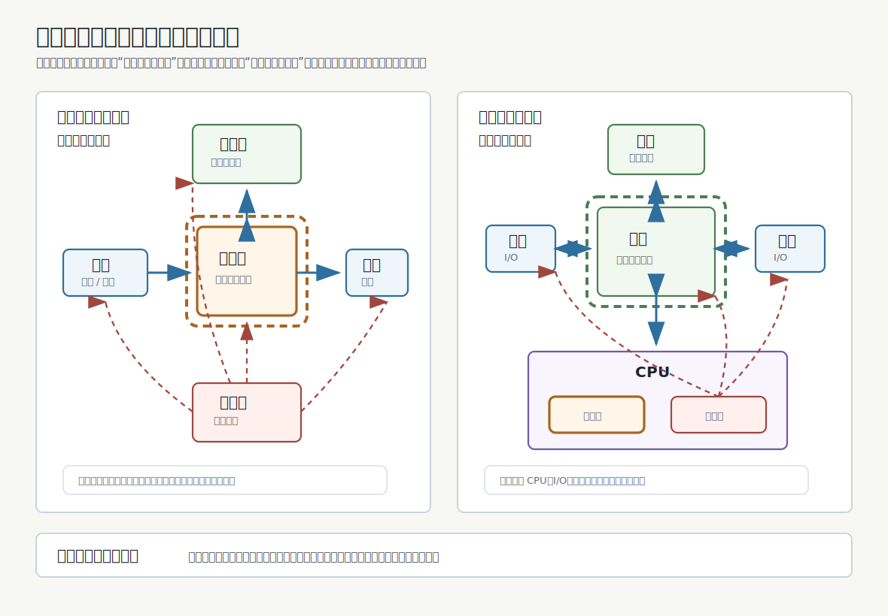
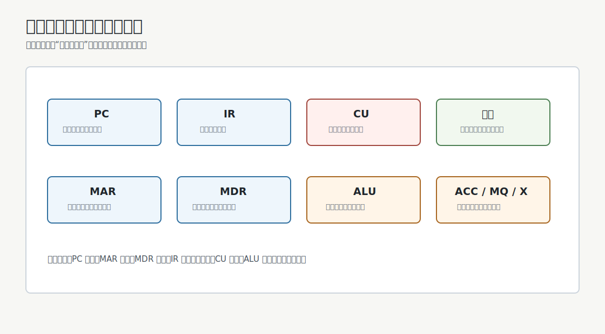
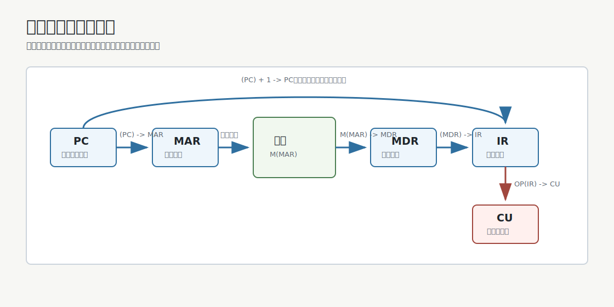
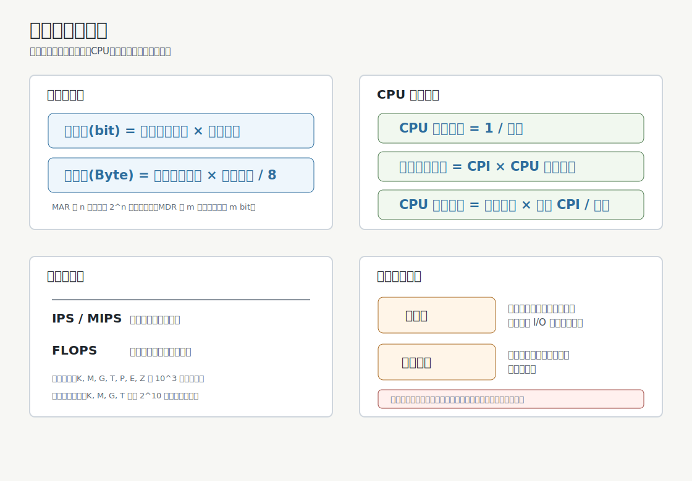

# Computer System Overview

这部分回答三个问题：

- 计算机系统由什么组成。
- 程序如何在硬件上运行。
- 如何衡量一台计算机的性能。

> [!summary] 
> - 计算机系统 = 硬件 + 软件
> - 硬件按冯诺依曼思想组织
> - 程序以指令序列形式存放并运行
> - 性能由存储器、CPU 和系统整体指标共同描述。

## 计算机系统

计算机系统由 **硬件** 和 **软件** 共同构成。

| 组成 | 含义 | 例子 |
|---|---|---|
| 硬件 | 计算机的实体装置 | CPU、主存、辅存、输入设备、输出设备 |
| 软件 | 为完成任务而编写的程序及相关文档 | 操作系统、数据库管理系统、标准程序库、应用程序 |

软件通常分为两类：

- **系统软件**：管理、控制、维护计算机资源，为应用软件提供运行环境，例如操作系统、数据库管理系统、语言处理程序、网络软件、服务程序。
- **应用软件**：面向具体用户任务的软件，例如办公软件、游戏、影音工具、浏览器等。

> [!note] 性能判断
> 计算机性能的好坏取决于软件和硬件功能的总和。只看硬件参数，或只看软件体验，都不能完整评价系统性能。

## 硬件发展

计算机硬件的发展常按逻辑元件划分为四代。

| 发展阶段 | 时间 | 逻辑元件 | 速度 | 内存 | 外存 |
|---|---:|---|---|---|---|
| 第一代 | 1946-1957 | 电子管 | 几千至几万次/秒 | 汞延迟线、磁鼓 | 穿孔卡片、纸带 |
| 第二代 | 1958-1964 | 晶体管 | 几万至几十万次/秒 | 磁芯存储器 | 磁带 |
| 第三代 | 1964-1971 | 中小规模集成电路 | 几十万至几百万次/秒 | 半导体存储器 | 磁带、磁盘 |
| 第四代 | 1972 至今 | 大规模、超大规模集成电路 | 上千万至万亿次/秒 | 半导体存储器 | 磁盘、磁带、光盘、半导体存储器 |

第一台电子数字计算机 ENIAC 诞生于 1946 年，采用电子管，体积大、功耗高、速度相对低。

### 摩尔定律

摩尔定律描述的是集成电路规模增长趋势：集成电路上可容纳的晶体管数目大约每隔 18 个月增加一倍，整体性能也随之提升。

> [!warning] 理解边界
> 摩尔定律不是严格物理定律，而是对一段时期内半导体产业发展速度的经验性概括。

### 当前趋势

硬件发展不只依靠单个通用处理器变快，还体现在：

- 更高集成度与更先进工艺。
- 多核、众核与并行处理。
- 专用处理器与异构计算。
- 更高层次的存储体系与 I/O 能力。

## 冯诺依曼结构

冯诺依曼结构的核心思想是 **存储程序**：把指令以二进制代码形式事先存入主存，程序运行时从首地址开始取出指令，然后按指令规定的顺序执行，直到程序结束。

### 五大部件

冯诺依曼机由五大部件组成：

- **输入设备**：把外部信息转换成机器能识别的形式。
- **输出设备**：把机器处理结果转换成人能识别或其他设备能接收的形式。
- **存储器**：存放程序和数据。
- **运算器**：进行算术运算和逻辑运算。
- **控制器**：指挥程序运行。

### 基本特点

- 计算机由五大部件组成。
- 指令和数据以同等地位存于存储器中，可按地址访问。
- 指令和数据均用二进制表示。
- 指令由 **操作码** 和 **地址码** 组成。
- 采用存储程序工作方式。
- 早期冯诺依曼机以**运算器**为中心；现代计算机通常以**存储器**为中心。

> [!tip] 指令与数据如何区分
> 二进制本身不会标明指令数据。CPU 根据指令周期的阶段解释同一串二进制位：取指阶段读出的内容被送入 IR 作为指令，执行阶段按地址读出的内容作为数据。

## 现代计算机组织

现代计算机一般可以这样把握：

- **CPU = 运算器 + 控制器**
- **主机 = CPU + 主存储器**
- **I/O 设备 = 输入设备 + 输出设备 + 外部设备**
- **存储系统 = 主存 + 辅存 + 层次化缓存结构**

### 主存储器

主存储器由大量存储单元组成。每个存储单元有地址，并存放一串二进制代码。

| 概念   | 含义                        |
| ---- | ------------------------- |
| 存储单元 | 按地址访问的基本存储单位              |
| 存储字  | 一个存储单元中的二进制串              |
| 存储字长 | 一个存储单元中二进制串的位数            |
| 存储元  | 存储 1 bit 的电子元件            |
| MAR  | 存储器地址寄存器，位数反映最多可寻址的存储单元个数 |
| MDR  | 存储器数据寄存器，位数通常等于存储字长       |

如果 MAR 为 $n$ 位，则最多支持 $2^n$ 个存储单元；如果 MDR 为 $m$ 位，则每个存储单元可存放 $m$ bit。

### 运算器

运算器用于实现算术运算和逻辑运算。

| 部件 | 作用 |
|---|---|
| ALU | 算术逻辑单元，执行算术运算和逻辑运算 |
| ACC | 累加器，暂存操作数或运算结果 |
| MQ | 乘商寄存器，辅助乘法和除法 |
| X | 通用操作数寄存器，暂存参与运算的数据 |

### 控制器

控制器负责取指、译码并发出控制信号。

| 部件 | 作用 |
|---|---|
| CU | 控制单元，分析指令并发出控制信号 |
| IR | 指令寄存器，保存当前正在执行的指令 |
| PC | 程序计数器，保存下一条指令的地址 |

## 计算机的工作过程

程序在计算机中表现为一串机器指令。CPU 执行程序时，反复经历：

1. **取指令**：根据 PC 给出的地址，从主存读出指令。
2. **分析指令**：控制器分析操作码，判断要执行什么操作。
3. **执行指令**：根据地址码取得操作数，完成运算、访存或控制动作。

### 公共取指流程

多数指令的取指阶段具有共同模式：

| 步骤 | 寄存器传送 | 含义 |
|---:|---|---|
| 1 | $(PC) \rightarrow MAR$ | 将下一条指令地址送入 MAR |
| 2 | $M(MAR) \rightarrow MDR$ | 从主存指定地址读出指令 |
| 3 | $(MDR) \rightarrow IR$ | 将指令送入 IR |
| 4 | $(PC) + 1 \rightarrow PC$ | PC 指向顺序执行时的下一条指令 |
| 5 | $OP(IR) \rightarrow CU$ | 控制器分析操作码 |

其中：

- $M(MAR)$ 表示主存中 MAR 所指向的存储单元内容。
- $OP(IR)$ 表示 IR 中的操作码字段。
- $Ad(IR)$ 表示 IR 中的地址码字段。

## 计算机系统的层次结构

计算机系统可以看成多级虚拟机器构成的层次。

| 层次 | 面向对象 | 说明 |
|---|---|---|
| 微程序机器 | 微指令 | 用微程序解释机器指令 |
| 传统机器 | 机器语言程序员 | 直接执行机器指令 |
| 操作系统机器 | 操作系统用户 | 提供系统调用、进程、文件、I/O 管理等抽象 |
| 汇编语言机器 | 汇编语言程序员 | 通过汇编语言接近机器指令 |
| 高级语言机器 | 高级语言程序员 | 通过编译或解释执行高级语言程序 |

### 三种语言级别

| 语言 | 特点 | 转换方式 |
|---|---|---|
| 机器语言 | 二进制指令，机器可直接执行 | 无需翻译 |
| 汇编语言 | 用助记符表示机器指令 | 汇编 |
| 高级语言 | 接近自然语言和数学表达 | 编译或解释 |

从 C 语言源程序到可执行文件，通常经历[[../posts/C-and-Cpp-Compilation#2. 从源码到可执行文件的四个阶段|预处理、编译、汇编、链接等阶段]]。可执行文件最终仍以机器指令和数据的形式在计算机中运行。

### ISA 与组成原理

**指令集体系结构**（Instruction Set Architecture, ISA）是软件和硬件之间的接口。它规定计算机支持哪些指令、每条指令做什么、指令如何使用。

| 问题 | 所属范围 |
|---|---|
| 是否提供乘法指令 | 计算机体系结构 |
| 乘法指令如何由硬件实现 | 计算机组成原理 |

> [!note] 软硬件逻辑等价性
> 同一个功能既可以用硬件实现，也可以用软件实现。硬件实现通常性能更高、成本更高；软件实现通常更灵活、成本较低但性能较低。

## 性能指标

### 存储器容量

主存容量可以按位或字节计算：

$$
\text{总容量(bit)} = \text{存储单元个数} \times \text{存储字长}
$$

$$
\text{总容量(Byte)} = \frac{\text{存储单元个数} \times \text{存储字长}}{8}
$$

若 MAR 为 32 位，MDR 为 8 位，则：

$$
2^{32} \times 8\ bit = 2^{32}\ Byte = 4GB
$$

### CPU 性能

| 指标 | 含义 |
|---|---|
| CPU 主频 | CPU 内数字脉冲信号振荡的频率，单位 Hz |
| CPU 时钟周期 | 一个时钟周期的时间，等于主频的倒数 |
| CPI | Clock cycle Per Instruction，执行一条指令平均需要的时钟周期数 |
| CPU 执行时间 | 程序在 CPU 上实际执行所花的时间 |

核心公式：

$$
\text{CPU 时钟周期} = \frac{1}{\text{CPU 主频}}
$$

$$
\text{单条指令耗时} = CPI \times \text{CPU 时钟周期}
$$

$$
\text{CPU 执行时间} = \frac{\text{指令条数} \times \text{平均 CPI}}{\text{CPU 主频}}
$$

>[!example]
>某 CPU 主频为 1000 Hz，某程序包含 100 条指令，平均 CPI 为 3，则：
> $$
\text{CPU 执行时间} = \frac{100 \times 3}{1000} = 0.3s
$$

> [!warning] 
> **主频高的 CPU 不一定更快**。程序执行时间还取决于指令条数、平均 CPI、指令系统、编译结果和具体程序特征。

### IPS 与 FLOPS

| 指标 | 含义 | 常见单位 |
|---|---|---|
| IPS | Instructions Per Second，每秒执行多少条指令 | KIPS、MIPS |
| FLOPS | Floating-point Operations Per Second，每秒执行多少次浮点运算 | KFLOPS、MFLOPS、GFLOPS、TFLOPS、PFLOPS、EFLOPS、ZFLOPS |

数量单位按 $10^3$ 逐级递增：

| 单位 | 数量级 |
|---|---:|
| K | $10^3$ |
| M | $10^6$ |
| G | $10^9$ |
| T | $10^{12}$ |
| P | $10^{15}$ |
| E | $10^{18}$ |
| Z | $10^{21}$ |

> [!caution] K/M/G/T 的二进制与十进制混用
> **存储容量/文件大小**里常见的 K、M、G、T 往往按 $2^{10}$ 逐级上升：$1KB = 2^{10}B$，$1MB = 2^{20}B$，$1GB = 2^{30}B$。  
> **性能指标**里，如 Hz、IPS、FLOPS 及其 k(小写！)/M/G/T/P/E/Z 前缀，通常按 $10^3$ 逐级递增：$1k = 10^3$，$1M = 10^6$，$1G = 10^9$。  
> 因此看到 K(k)/M/G/T 时，先判断它修饰的是“存储容量”还是“频率、速度、运算次数”。

### 系统整体性能

| 指标 | 含义 |
|---|---|
| 数据通路带宽 | 数据总线一次所能并行传送信息的位数 |
| 吞吐量 | 系统单位时间内处理请求的数量 |
| 响应时间 | 从用户发出请求到系统给出结果的等待时间 |
| 基准程序 | 用来测量并比较计算机处理速度的一类测试程序 |

吞吐量受到输入、取指、访存、写回、I/O 等多个环节影响。由于这些环节都与主存有关，系统吞吐量往往与主存存取周期密切相关。

响应时间通常包括：

- CPU 时间。
- 磁盘访问时间。
- 存储器访问时间。
- I/O 操作时间。
- 操作系统开销。

> [!caution] 基准程序误区
> 基准程序执行得更快，只能说明机器在该基准程序及其测试环境下表现更好。不同语句频度、不同应用场景和不同数据规模都会影响评价结论。

## 快速回忆

- 计算机系统由硬件和软件共同组成。
- 冯诺依曼结构的核心是存储程序。
- 指令和数据都用二进制表示，CPU 通过指令周期阶段区分二者。
- 现代计算机以存储器为中心，CPU 由运算器和控制器组成。
- 程序执行过程可概括为取指令、分析指令、执行指令。
- ISA 是软件与硬件之间的接口。
- 存储容量看 MAR 和 MDR；CPU 时间看指令条数、CPI 和主频；整机性能还要看吞吐量、响应时间和实际工作负载。
