# DAG And AOV Network


- DAG 是**没有有向环**的有向图。
- AOV 网用 DAG 表示活动之间的先后依赖。



## DAG

DAG 是 Directed Acyclic Graph，即**有向无环图**。

定义：若一个有向图中不存在有向环，则称为有向无环图。

这里的“无环”指的是：不存在一条沿弧方向出发，最后又回到出发顶点的路径。

例如：

```text
V0 -> V1 -> V3
V0 -> V2 -> V3
```

这是 DAG，因为所有边都大致从前往后指向，不可能沿方向回到原顶点。

而：

```text
V1 -> V2 -> V3 -> V1
```

不是 DAG，因为存在有向环。

> [!tip] 与拓扑排序的关系
> 一个有向图存在拓扑序列，当且仅当它是 DAG。若拓扑排序过程中图还没空，但已经找不到入度为 0 的顶点，则说明剩余部分存在有向环。

## DAG 描述表达式

表达式树会把每次出现的操作数或子表达式都画出来；DAG 描述表达式时，会把相同的操作数和相同的子表达式合并成同一个结点。

核心规则：

- 相同操作数只保留一个结点。
- 相同运算符且左右孩子也相同的子表达式，只保留一个运算结点。
- 非叶结点是运算符，叶结点是运算数。
- 手算时通常先按表达式结构分层，再根据运算关系连线。

[html-card height=1060](../assets/dag-expression-construction.html)

### 手算分层法

考虑表达式：

```text
((a+b)*(b*(c+d))+(c+d)*e)*((c+d)*e)
```

先把它按结构拆成必要的子表达式：

```text
a+b
c+d
b*(c+d)
(c+d)*e
(a+b)*(b*(c+d))
(a+b)*(b*(c+d))+(c+d)*e
整个表达式
```

然后分层：

```text
L0: a, b, c, d, e

L1: +        + 
    a+b      c+d

L2: *        *
    b*(c+d)  (c+d)*e

L3: *
    (a+b)*(b*(c+d))

L4: +
    (a+b)*(b*(c+d))+(c+d)*e

L5: *
    整个表达式
```

层级规则是：

```text
level(operand) = 0
level(op(left, right)) = max(level(left), level(right)) + 1
```

也就是说，一个运算符结点必须等它的两个操作对象都已经在下层出现后，才能放到上一层。

因此：

- `c+d` 的 `+` 在 L1。
- `b*(c+d)` 的 `*` 在 L2。
- `(a+b)*(b*(c+d))` 的 `*` 在 L3，因为它依赖 L2 的 `b*(c+d)`。
- `(c+d)*e` 只建立一次，最终乘法右侧直接复用它。

### 构造表达式 DAG 的方法

按手算步骤构造：

1. 对原表达式分层，明确每个运算符依赖哪些更低层结点。
2. 在最底层写出所有不同运算数，运算数不重复。
3. 从低层到高层列出运算符结点；优先级越高、越接近运算数的运算通常越靠下。
4. 若某个运算符及其左右孩子已经出现过，则复用已有结点。
5. 按运算关系连线。最终根结点对应整个表达式。

> [!warning] 注意左右孩子顺序
> 对 `-`、`/` 这类不满足交换律的运算，左右孩子不能交换。例如 `x / (x + y)` 和 `(x + y) / x` 不是同一个子表达式。


## AOV 网

AOV 网是 Activity On Vertex Network，即**用顶点表示活动的网**。

在 AOV 网中：

- 顶点表示活动。
- 有向边 `<Vi, Vj>` 表示活动 `Vi` 必须先于活动 `Vj` 进行。
- 顶点之间的路径表示间接先后关系。

例如：

```text
准备厨具 -> 下锅炒
打鸡蛋 -> 下锅炒
洗番茄 -> 切番茄 -> 下锅炒
下锅炒 -> 吃
```

表示“下锅炒”必须等准备厨具、打鸡蛋、切番茄等活动完成后才能进行。

## AOV 网为什么必须无环

如果 AOV 网中出现有向环，例如：

```text
A -> B -> C -> A
```

就表示：

- `A` 必须先于 `B`。
- `B` 必须先于 `C`。
- `C` 又必须先于 `A`。

这三个要求互相矛盾，任何活动都无法作为第一个活动开始。因此有环图不能表示合法的 AOV 网，也不存在拓扑序列。

## AOV 与 AOE 的区别

| 网络 | 顶点表示 | 边表示 | 权值位置 | 主要用途 |
|---|---|---|---|---|
| AOV 网 | 活动 | 活动之间的先后约束 | 通常不强调权值 | 拓扑排序 |
| AOE 网 | 事件 | 活动 | 边上权值表示活动耗时 | 关键路径 |

AOV 是拓扑排序的直接模型；AOE 是关键路径的模型。AOE 的计算要依赖拓扑序列和逆拓扑序列，因此应先掌握 [拓扑排序](topological-sorting.md)。
