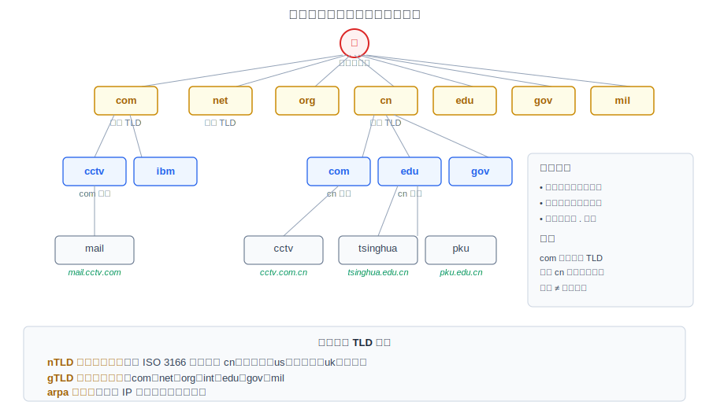
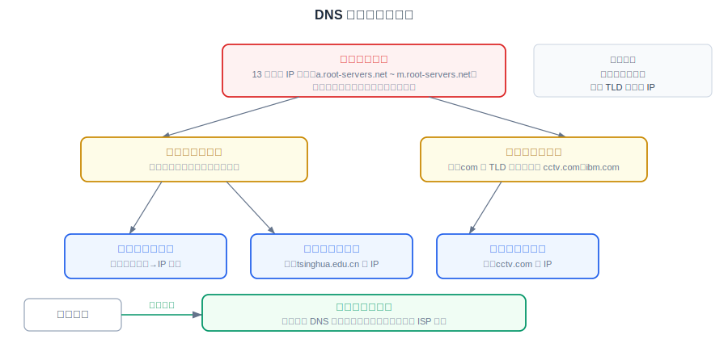
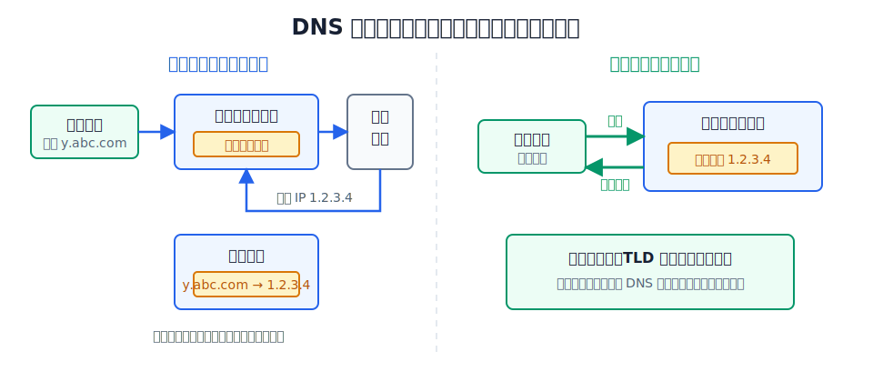

# 为什么需要 DNS

因特网的网际层使用 IP 地址来寻址主机（如 `42.83.144.13`），但人很难记住一串数字。应用层使用**域名**（如 `cnnic.net.cn`）来标识主机，便于用户记忆和使用。

**域名系统**（Domain Name System，DNS）的作用就是把域名转换为 IP 地址。它是分布在因特网上的一套命名和查询系统，使大多数域名能在本地解析，效率高且容错性好。

因特网不能只用一台 DNS 服务器：规模太大，单台服务器会超负荷；一旦故障，整个因特网就会瘫痪。因此 DNS 采用**层次结构**的命名方案和**分布式**的服务器体系。

# 层次域名空间

因特网的域名空间是一棵倒置的树——根在最上面，但没有对应的域名。

域名的结构由若干个分量组成，各分量之间用点 `.` 分隔：

$$
\text{...三级域名.二级域名.顶级域名}
$$

例如 `mail.cctv.com` 中，`com` 是顶级域名，`cctv` 是二级域名，`mail` 是三级域名。级别最低的写在最左边，级别最高的写在最右边。

## 顶级域名 TLD

顶级域名（Top Level Domain）分为三类：

| 类型 | 缩写 | 说明 | 示例 |
|---|---|---|---|
| 国家顶级域名 | nTLD | 按 ISO 3166 规定 | `cn`（中国）、`us`（美国）、`uk`（英国） |
| 通用顶级域名 | gTLD | 最常见的七个 | `com`、`net`、`org`、`int`、`edu`、`gov`、`mil` |
| 反向域 | arpa | 用于 IP 地址反向解析为域名 | `arpa` |

通用顶级域名含义：

| 域名 | 含义 |
|---|---|
| `com` | 公司企业 |
| `net` | 网络服务机构 |
| `org` | 非营利性组织 |
| `int` | 国际组织 |
| `edu` | 美国教育机构 |
| `gov` | 美国政府部门 |
| `mil` | 美国军事部门 |

## 我国的二级域名

在国家顶级域名 `cn` 下，我国将二级域名分为两类：

**类别域名**（7 个）：`ac`（科研）、`com`（工商金融企业）、`edu`（教育）、`gov`（政府）、`net`（网络服务）、`mil`（军事）、`org`（非营利组织）。

**行政区域名**（34 个）：适用于各省、自治区、直辖市，如 `bj`（北京）、`sh`（上海）、`js`（江苏）。

> [!warning] 同名但不同级
> `com` 既是通用顶级域名，也是我国 `cn` 下的二级类别域名。名称相同的域名其等级未必相同。

域名只是逻辑概念，不代表计算机所在的物理地点。

# 域名服务器

域名和 IP 地址的映射关系保存在域名服务器（DNS 服务器）中。DNS 使用分布在各地的域名服务器来实现域名到 IP 地址的转换。

域名服务器可以划分为四种类型：

| 类型 | 角色 | 职责 |
|---|---|---|
| **根域名服务器** | 最高层次 | 知道所有顶级域名服务器的域名和 IP 地址；通常不直接解析域名，而是返回应查询的顶级域名服务器 IP |
| **顶级域名服务器** | 管理二级域名 | 管理在其下注册的所有二级域名；返回最终的 IP 或下一级权限域名服务器的 IP |
| **权限域名服务器** | 负责具体域名 | 保存负责区域中主机的域名到 IP 地址的映射 |
| **本地域名服务器** | 离用户最近 | 用户主机发起 DNS 查询时首先被询问的服务器；通常由 ISP 提供 |

根域名服务器共有 **13 个不同 IP 地址**（`a.root-servers.net` 到 `m.root-servers.net`）。每个"服务器"实际上是由许多分布在世界各地的计算机构成的**服务器群集**。当本地域名服务器向根域名服务器查询时，路由器会把查询请求转发到离 DNS 客户最近的一个根域名服务器。

# 域名解析过程

DNS 查询有两种基本方式：**递归查询**和**迭代查询**。

## 递归查询

递归查询中，收到查询请求的域名服务器**代替查询者**去完成后续的所有查询，最终把结果返回给查询者。

[html-card height=520](../assets/dns-recursive-query-slides.html)

特点：

- 查询者只需发出一次请求，等待最终结果。
- 被查询的服务器（特别是根域名服务器）负担很重。
- DNS 中很少全程使用递归查询。

## 迭代查询

迭代查询中，收到查询请求的域名服务器**告诉查询者下一步该问谁**，由查询者自己去继续查询。

[html-card height=520](../assets/dns-iterative-query-slides.html)

特点：

- 查询者要多次发出请求，但每步都有进展。
- 服务器的负担较轻——只返回自己知道的信息。

## 实际使用的模式

因特网 DNS 实际采用的模式是**二者结合**：

- 主机向**本地域名服务器**的查询采用**递归查询**。
- 本地域名服务器向后继服务器的查询采用**迭代查询**。

这样既保证主机端的简单（一次请求等结果），又避免根域名服务器被递归查询压垮。

以查询 `y.abc.com` 的 IP 地址为例，完整过程如下：

1. 主机向本地域名服务器**递归查询**。
2. 本地域名服务器向根域名服务器**迭代查询**，根服务器返回 `com` 顶级域名服务器的 IP。
3. 本地域名服务器向 `com` 顶级域名服务器**迭代查询**，返回 `abc.com` 权限域名服务器的 IP。
4. 本地域名服务器向 `abc.com` 权限域名服务器**迭代查询**，返回 `y.abc.com` 的 IP。
5. 本地域名服务器将最终结果返回给主机。

DNS 报文使用运输层的 **UDP** 进行封装，熟知端口号为 **53**。

# DNS 高速缓存

为了提高 DNS 的查询效率、减少因特网上的 DNS 查询报文数量，域名服务器和主机都广泛使用高速缓存。

- **域名服务器缓存**：存放最近查询过的域名及映射信息。当其他主机查询同一域名时，直接返回缓存结果，不必再次迭代查询。
- **主机缓存**：用户主机维护最近解析过的域名记录。应用或操作系统在本机缓存中找不到有效记录时，才向本地域名服务器查询。

> [!warning] 缓存时效
> 域名到 IP 地址的映射关系不是永久不变的。域名服务器应为每项缓存内容设置**计时器**，删除超过合理时间的项目（如每个项目只存放**两天**）。主机也需要保持缓存中内容的正确性。
