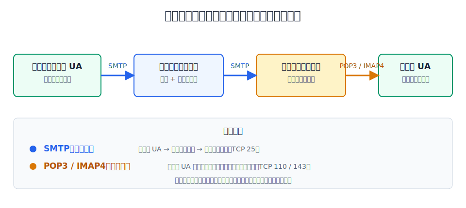
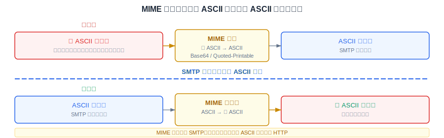
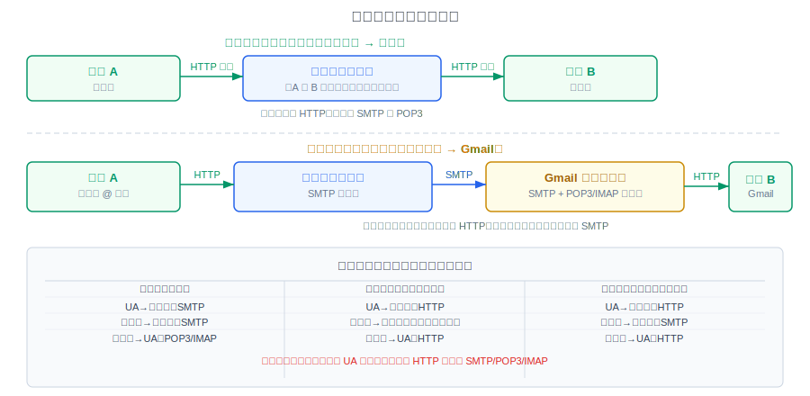

# 电子邮件系统的组成

电子邮件（E-mail）是因特网上最早流行、目前仍最重要和最实用的应用之一。

电子邮件系统采用**客户/服务器**方式，由三个主要构件组成：

| 构件 | 角色 | 说明 |
|---|---|---|
| **用户代理**（UA） | 用户接口 | 用户与电子邮件系统的接口，即邮件客户端软件。用于撰写、发送、接收和阅读邮件 |
| **邮件服务器** | 基础设施 | 发送和接收邮件，维护用户邮箱。包含大量邮箱和待转发的邮件缓存 |
| **协议** | 通信规则 | 邮件发送协议（如 SMTP）和邮件读取协议（如 POP3、IMAP4） |

## 电子邮件的基本收发过程

电子邮件的传送不是发送方用户代理直接发送到接收方用户代理，而是经过邮件服务器的中转：

1. 发送方使用用户代理通过 **SMTP** 将邮件发送给**发送方邮件服务器**。
2. 发送方邮件服务器通过 **SMTP** 将邮件发送给**接收方邮件服务器**。
3. 接收方在方便的时候，使用用户代理通过 **POP3**（或 IMAP4）从接收方邮件服务器读取邮件。

这个过程类似于传统邮政：发件人把信投入邮箱 → 邮局分拣转发 → 收件人到邮局取信。电子邮件的"取信"是由接收方主动进行的，不是被动等待。

# 电子邮件的信息格式

电子邮件的信息格式由 RFC 5322 定义（原 RFC 822），它规定一个电子邮件由**信封**和**内容**两部分构成，内容又由**首部**和**主体**两部分构成：

- **信封**：包含收件人和发件人的电子邮件地址。用户填写好首部后，邮件系统自动提取信息写入信封。用户不需要手动填写信封。
- **首部**：包含一系列关键字，每行一个关键字加冒号：
  - `From`：发件人电子邮件地址（通常由邮件系统自动填入）。
  - `To`：一个或多个收件人电子邮件地址。
  - `Cc`：抄送人电子邮件地址。抄送人收到邮件后可看可不看、可回可不回。
  - `Subject`：邮件主题，反映邮件的主要内容。
- **主体**：邮件的正文内容，由用户自由撰写。

`To` 和 `Subject` 是最重要的两个关键字，往往是必填项。

# MIME：多用途因特网邮件扩展

SMTP 有一个根本限制：只能传送 **7 位 ASCII 码**文本数据，不能传送：

- 可执行文件或其他二进制对象。
- 带有图片、音频或视频数据的多媒体邮件。
- 非英语国家的文字（中文、俄文、带有重音符号的法文或德文等）。

**多用途因特网邮件扩展**（MIME）就是为解决这个问题而提出的。

MIME 的核心作用：将**非 ASCII 码数据转换为 ASCII 码数据**后再用 SMTP 传送，接收方用 MIME 进行**逆转换**还原。

MIME 主要包括三方面的扩展：

- **新增 5 个邮件首部字段**，提供有关邮件主体的信息（如 MIME 版本、内容类型、内容传送编码等）。
- **定义了许多邮件内容的格式**，对多媒体电子邮件的表示方法进行标准化。
- **定义了传送编码**，可对任何内容格式进行转换，而不会被邮件系统改变。

> MIME 不仅用于 SMTP，也用于后来同样面向 ASCII 码字符的 HTTP。

# SMTP：邮件发送协议

**简单邮件传送协议**（SMTP）是电子邮件系统中的**发送**协议，采用 C/S 方式，使用 TCP 端口 **25**。

SMTP 的"推"（push）操作体现在：

- 发送方用户代理 → 发送方邮件服务器（推）。
- 发送方邮件服务器 → 接收方邮件服务器（推）。

## SMTP 基本工作过程

[html-card height=700](../assets/smtp-process-slides.html)

SMTP 客户与服务器建立 TCP 连接后，通过一系列**命令-应答**交互完成邮件发送：

| 步骤 | 命令（客户 → 服务器） | 应答（服务器 → 客户） | 含义 |
|---|---|---|---|
| 1 | — | `220` 服务就绪 | 建立 TCP 连接后服务器主动推送 |
| 2 | `HELO` 客户域名 | `250` OK | 客户表明身份 |
| 3 | `MAIL FROM: <发件人地址>` | `250` OK | 告知邮件来自谁 |
| 4 | `RCPT TO: <收件人地址>` | `250` OK | 告知邮件发给谁 |
| 5 | `DATA` | `354` 开始接收 | 客户准备发送邮件内容 |
| 6 | 邮件内容（含首部和主体） | — | 客户发送邮件正文 |
| 7 | `<CRLF>.<CRLF>`（结束符） | `250` OK | 客户标记邮件结束 |
| 8 | `QUIT` | `221` 关闭连接 | 客户请求释放 TCP 连接 |

# 邮件读取协议：POP3 与 IMAP4

邮件发送用 SMTP（推），邮件读取用 POP3 或 IMAP4（拉）。这两个都是**拉**（pull）协议。

| 维度 | POP3 | IMAP4 |
|---|---|---|
| 端口 | TCP **110** | TCP **143** |
| 标准状态 | 因特网正式标准 | 因特网建议标准 |
| 能力 | 简单、功能有限 | 功能强大 |
| 工作方式 | 下载到本地，有两种方式 | **联机协议**，在服务器端操作邮件 |
| 服务器端管理 | 不支持（下载后本地操作） | 支持：创建文件夹、分类管理、搜索等 |
| 离线访问 | 下载后可在离线状态下阅读 | 需联网（联机操作） |

**POP3 的两种工作方式**：

- **下载并删除**：邮件下载到本地后，从服务器邮箱中删除。换一台计算机就无法看到已读邮件。
- **下载并保留**：邮件下载到本地后，在服务器上保留副本。多设备可反复获取同一封邮件。

**IMAP4 的优势**：用户在自己的计算机上就可以操控邮件服务器中的邮箱（创建文件夹、对邮件分类、移动邮件等），就像在本地操控一样。IMAP4 是联机协议——如果未联网，则不能操作服务器上的邮件。

# 基于万维网的电子邮件

现在越来越多的用户使用基于万维网的电子邮件（如 Gmail、网易邮箱等）。

**两个邮箱位于同一邮件服务器时**（例如用户 A 和 B 的邮箱都由图中的同一台网易邮件服务器管理）：

- 用户 A 使用浏览器登录，撰写并发送邮件 → HTTP。
- 用户 B 使用浏览器登录，读取收到的邮件 → HTTP。
- 用户与该邮件服务器之间使用 HTTP；邮件在服务器内部投递，不需要跨邮件服务器的 SMTP，也不需要浏览器使用 POP3。

“同一服务商”不必然等于“同一邮件服务器”。若服务商内部由多台邮件服务器分工，服务器之间仍可能经过邮件传送过程；判断时应看两个邮箱是否由同一服务器直接管理。

**不同服务商之间的邮件收发**（如网易用户向 Gmail 用户发邮件）：

- 用户 A 使用浏览器登录，撰写并发送 → HTTP。
- A 的邮件服务器使用 **SMTP** 将邮件发送给 B 的邮件服务器。
- 用户 B 使用浏览器登录，读取收到的邮件 → HTTP。

> [!note]
> 无论哪种方式，**不同邮件服务器之间**的中转始终使用 SMTP。万维网邮件只是把用户到服务器/服务器到用户 这一段从 SMTP/POP3 替换成了 HTTP。
