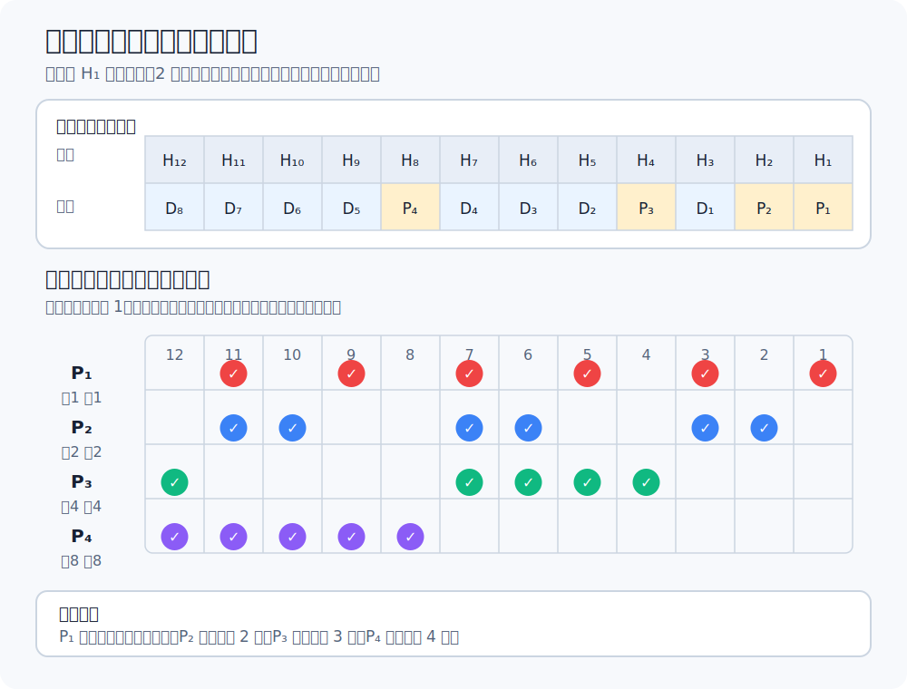

# 差错控制的目标

实际链路不是理想通道。信号在传输过程中可能失真，导致比特 `1` 变成 `0`，或 `0` 变成 `1`。这种错误称为**比特差错**。

差错控制有两类目标：

- **检错**：发现接收到的数据出错。
- **纠错**：不仅发现错误，还能确定错误位置并恢复正确数据。

检错编码开销较小，常用于数据链路层。纠错编码需要更多冗余信息，开销更大，适合误码率高或重传代价大的场景。

# 码距

一个合法编码后的比特串称为**码字**。两个码字之间对应位不同的个数称为**码距**。

例如 $10010$ 与 $11011$ 有第 2 位和第 5 位不同，所以码距为 $2$。

在一个编码集中所有合法码字两两之间的最小码距称为**该编码集的码距**，记为 $d$。码距越大，合法码字之间隔得越远，越容易发现或纠正传输错误。

码距和能力的关系：

| 目标 | 条件 | 含义 |
| --- | --- | --- |
| 检测 $e$ 位错误 | $d\ge e+1$ | 错 $e$ 位后不会刚好变成另一个合法码字 |
| 纠正 $t$ 位错误 | $d\ge 2t+1$ | 接收码字离原码字更近，不会落入另一个码字的纠错范围 |

检错只要知道不是合法码字；纠错还要判断最可能是哪一个合法码字。因此纠错对码距的要求更高。

# 奇偶校验

奇偶校验是最简单的检错编码。发送方在数据后增加 1 个校验位，使整个码字中 `1` 的个数满足约定的奇偶性。

若约定偶校验，则发送方让整个码字中 `1` 的个数为偶数。接收方重新统计 `1` 的个数：

- 若奇偶性不符合约定，判定出错。
- 若奇偶性符合约定，只能说明没有检测出错误，不能保证一定正确。

奇偶校验能检测奇数位错误。若发生偶数位错误，`1` 的个数奇偶性可能不变，因此可能漏检。

# 循环冗余校验 CRC

循环冗余校验 CRC 是数据链路层常用的检错技术。它的基本思想是：收发双方约定一个生成多项式 $G(x)$，发送方计算余数作为帧检验序列 FCS，接收方用同一个 $G(x)$ 再检查一次。

## 发送端生成 FCS

设待发送数据为 $M$，生成多项式最高次数为 $r$。

发送端步骤：

1. 在 $M$ 后面追加 $r$ 个 `0`，形成临时被除数。
2. 用生成多项式对应的比特串作除数，执行二进制模 2 除法。
3. 得到 $r$ 位余数。
4. 把余数作为 FCS 加到原始数据后面发送。

[html-card height=620](../assets/crc-mod2-division-slides.html)

模 2 除法的关键是异或：不进位，不借位。

## 接收端校验

接收端收到数据和 FCS 后，用同一个生成多项式再次做模 2 除法：

- 余数为 `0`：认为没有检测到差错。
- 余数不为 `0`：判定传输过程中出现差错。

CRC 的漏检率很低，但它仍然是检错码。接收方能知道“这个帧出错了”，却不知道具体是哪一位出错，也不能靠 CRC 自行纠正错误。

# 纠错编码和海明码

纠错编码提供更多冗余信息，使接收方能定位并改正某些错误。海明码是典型的纠错编码。

海明码把校验位放在 $1,2,4,8,\dots$ 等位置，其余位置放数据位。每个校验位负责检查一组位置。接收方重新计算各组校验结果，把出错校验组的编号组合起来，就能定位错误位。

海明码常用于说明“纠错为什么需要更多冗余”。若只想检测错误，CRC 通常更经济；若需要直接纠正错误，就必须让码字之间留出更大的距离。

# 检错编码与纠错编码

| 对比 | 检错编码 | 纠错编码 |
| --- | --- | --- |
| 目标 | 发现是否出错 | 定位并改正错误 |
| 冗余开销 | 较小 | 较大 |
| 典型例子 | 奇偶校验、CRC | 海明码 |
| 出错后的处理 | 丢弃、请求重传或交给上层 | 直接恢复可纠正范围内的错误 |

数据链路层常用 CRC，是因为许多链路上重传比增加大量纠错冗余更划算。无线链路或某些低可靠链路中，纠错编码也有应用空间。
