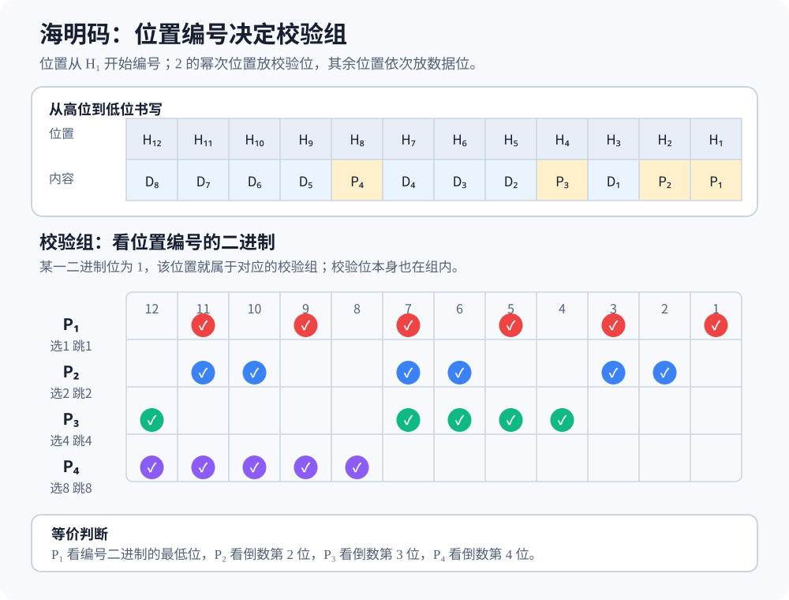
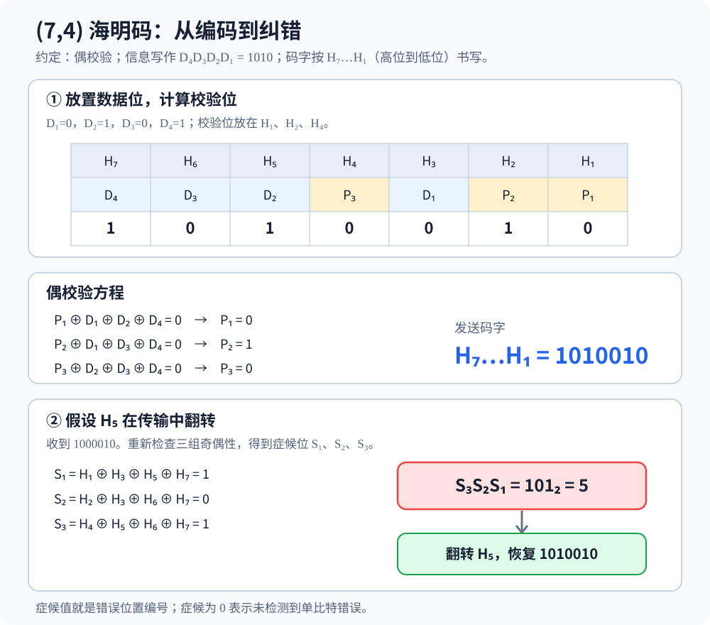

# 差错控制的目标

实际链路不是理想通道。信号在传输过程中可能失真，导致比特 `1` 变成 `0`，或 `0` 变成 `1`。这种错误称为**比特差错**。

差错控制有两类目标：

- **检错**：发现接收到的数据出错。
- **纠错**：不仅发现错误，还能确定错误位置并恢复正确数据。

检错编码开销较小，常用于数据链路层。纠错编码需要更多冗余信息，开销更大，适合误码率高或重传代价大的场景。

# 码距

一个合法编码后的比特串称为**码字**。两个码字之间对应位不同的个数称为**码距**。

例如 $10010$ 与 $11011$ 有第 2 位和第 5 位不同，所以码距为 $2$。

在一个编码集中所有合法码字两两之间的最小码距称为**该编码集的码距**，记为 $d$。码距越大，合法码字之间隔得越远，越容易发现或纠正传输错误。

若码距为$d$，可以检测 $e$ 位错误，纠正 $t$ 位错误，则有：

$$d\geqslant e+t+1$$

![[../assets/code-distance-capability.svg]]

若编码仅有检错能力，则最多检错位数$e$有 

$$d = e+1$$

若编码有纠错能力，则最多纠错位数$t$有

$$d=2t+1$$

检错只要知道不是合法码字；纠错的前提是检错。

# 奇偶校验

奇偶校验是最简单的检错编码。发送方在数据后增加 1 个校验位，使整个码字中 `1` 的个数满足约定的奇偶性。

若约定偶校验，则发送方让整个码字中 `1` 的个数为偶数。接收方重新统计 `1` 的个数：

- 若奇偶性不符合约定，判定出错。
- 若奇偶性符合约定，只能说明没有检测出错误，不能保证一定正确。

奇偶校验能检测奇数位错误。若发生偶数位错误，`1` 的个数奇偶性可能不变，因此可能漏检。

# 循环冗余校验 CRC

循环冗余校验 CRC 是数据链路层常用的检错技术。它的基本思想是：收发双方约定一个生成多项式 $G(x)$，发送方计算余数作为帧检验序列 FCS，接收方用同一个 $G(x)$ 再检查一次。

设待发送数据为 $M$，生成多项式最高次数为 $r$。

发送端步骤：

1. 在 $M$ 后面追加 $r$ 个 `0`，形成临时被除数。
2. 用生成多项式对应的比特串作除数，执行二进制模 2 除法。**模 2 除法不进位，不借位。相同为 0 ，不同为 1 。**
3. 得到 $r$ 位余数。
4. 把余数作为 FCS 加到原始数据后面发送。

[html-card height=620](../assets/crc-mod2-division-slides.html)

接收端收到数据和 FCS 后，用同一个生成多项式再次做模 2 除法：

- 余数为 `0`：认为没有检测到差错。
- 余数不为 `0`：判定传输过程中出现差错。

> [! tip]
> `原始数据 | r 位余数` 除以生成多项式对应的比特串余数为 0。所以在原始数据不出错的情况下，校验时只需计算余数看余数是否正确。

CRC 是检错码。接收方能知道出错了，却不知道具体是哪一位出错，也不能靠 CRC 自行纠正错误。

# 海明码

海明码设置多个校验位，让不同位置参加不同的校验组。某一位出错时，各组的校验结果组合起来，正好给出它的位置编号。

设数据位有 $m$ 位，校验位有 $r$ 位。$r$ 位校验结果需要区分“没有错误”和 $m+r$ 个出错位置，因此：

$$
2^r\ge m+r+1
$$

当 $m=4$ 时，取 $r=3$，得到 $(7,4)$ 海明码。校验位放在编号为 $1,2,4,8,\dots$ 的位置，其余位置依次放数据位。

每一位校验位对应一个校验组。同一个校验组的所有元素的异或为0。即**每一个元素都等于同校验组其他元素异或。**

设 $D_4D_3D_2D_1=1010$。数据位放入 $H_7,H_6,H_5,H_3$ 后，根据每一个元素都等于同校验组其他元素异或计算得 $P_1=0,P_2=1,P_3=0$，所以按 $H_7\cdots H_1$ 书写的码字是 `1010010`。

接收端对各组求异或，得到症候位 $S_1,S_2,S_3$。$S_{3}S_{2}S_{1}$表示二进制数字是几就表示几号位出错。值为0表示没有错误。

例如，若 $H_5$ 在传输中翻转，收到的码字变为 `1000010`，此时：

$$
(S_3S_2S_1)_2=101_2=5
$$

值为 $5$，说明 $H_5$ 出错；将它翻转即可恢复原码字。

普通海明码的最小码距为 $3$，能纠正一位错误。
