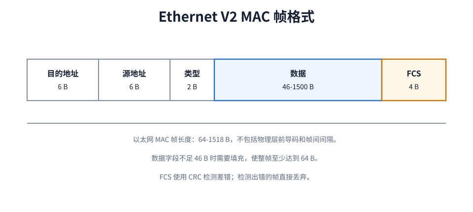
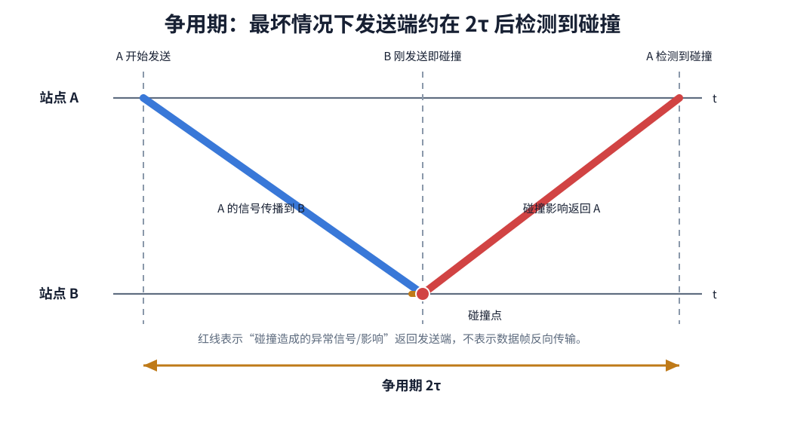
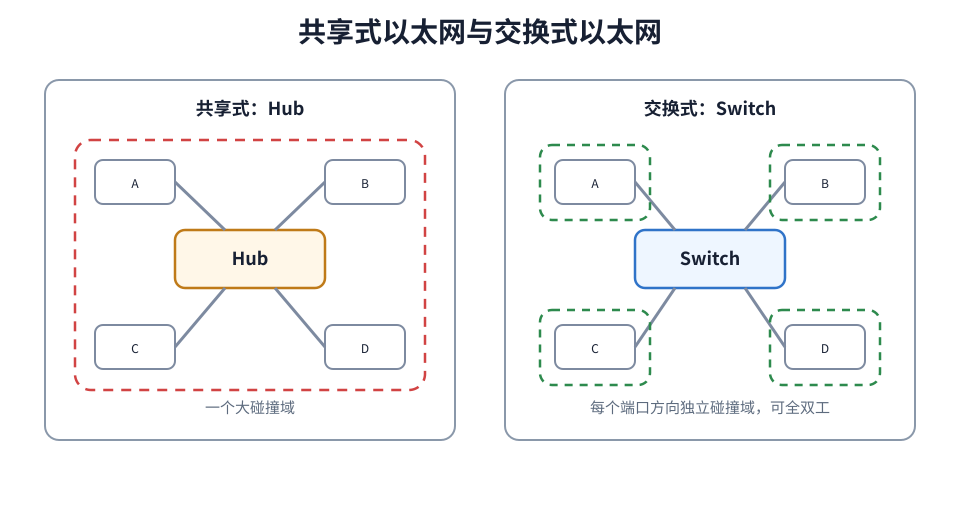
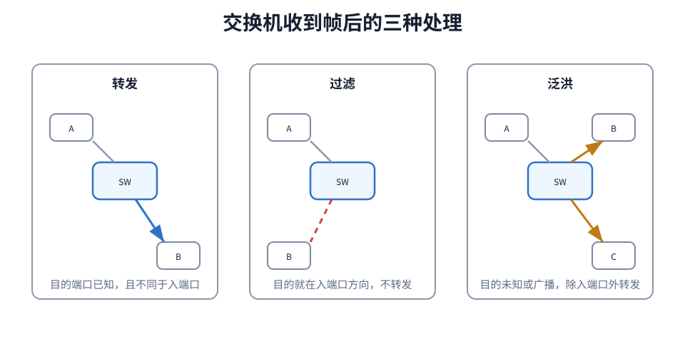
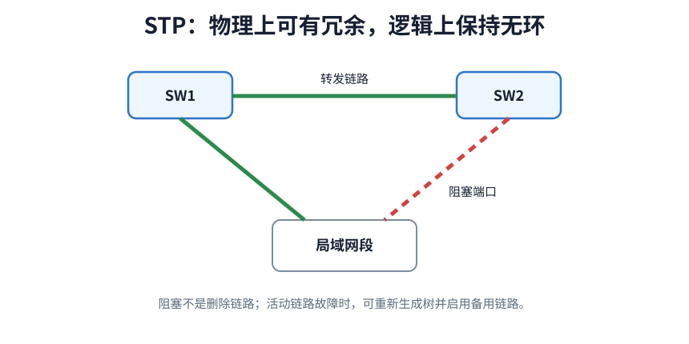

# 以太网概述

以太网最初来自 DIX Ethernet V2 标准。IEEE 802.3 在此基础上制定以太网标准。实际网络设备通常兼容 Ethernet V2 帧和 IEEE 802.3 相关规范。

以太网向上提供的是**无连接、不可靠的帧传输服务**。

- 无连接：发送帧之前不先建立数据链路层连接。
- 不可靠：接收方用 FCS 检测差错，发现错帧就丢弃；以太网本身不确认、不重传、不保证按序交付。
- 尽最大努力交付：没有检测出错误的帧才向上交付，可靠性通常由高层协议处理。

以太网链路质量较好，数据链路层通常不做可靠传输。

# 网络适配器与 MAC 地址

网络适配器也称网卡。主机通过网卡接入局域网，帧的发送、接收、封装、校验和 MAC 地址识别通常由网卡完成。

MAC 地址是数据链路层地址，用来标识局域网中的网络接口。常见 MAC 地址长 48 bit，通常写成 6 个十六进制字节，例如 `00-1A-2B-3C-4D-5E`。

共享式以太网中，所有站点都能收到信道上的帧，但网卡会检查目的 MAC 地址。只有目的 MAC 地址匹配自己、目的地址为广播地址，或网卡处于特殊接收模式时，主机才会向上交付该帧。

MAC 地址并不只有“某台主机的地址”一种情况。按照目的地址的含义，可以分成：

| 地址类型 | 含义          | 典型形式                |
| ---- | ----------- | ------------------- |
| 单播地址 | 标识一个网络接口    | 普通网卡 MAC 地址         |
| 多播地址 | 标识一组接收接口    | 发送给某个多播组            |
| 广播地址 | 发送给局域网内所有站点 | `FF-FF-FF-FF-FF-FF` |

按照管理方式，又可以区分为：

| 地址类型 | 含义 |
|---|---|
| 全球管理地址 | 由 IEEE 分配地址块，厂商写入网卡，通常具有全球唯一性 |
| 本地管理地址 | 由本地管理员或系统软件设置，不保证全球唯一 |

MAC 地址中有两个标志位：

| 标志位 | 含义 |
|---|---|
| I/G 位 | Individual/Group，指出地址是单个接口地址还是组地址 |
| G/L 位 | Global/Local，指出地址是全球管理地址还是本地管理地址 |

这些分类主要影响接收方如何判断“这个帧是否应该交给我”。普通单播帧只交给目标接口；广播帧会被同一广播域内所有站点接收；多播帧交给加入对应多播组的接口，见[[IP-Multicast]]

# 以太网 MAC 帧

常见 Ethernet V2 MAC 帧格式如下：

| 字段   |        长度 | 作用                                   |
| ---- | --------: | ------------------------------------ |
| 目的地址 |       6 B | 接收方 MAC 地址，广播地址为 `FF-FF-FF-FF-FF-FF` |
| 源地址  |       6 B | 发送方 MAC 地址                           |
| 类型   |       2 B | 标明上层协议，例如 IPv4、ARP、IPv6              |
| 数据   | 46-1500 B | 上层交付的数据；不足 46 B 时需要填充                |
| FCS  |       4 B | CRC 检错码，检验范围：目的地址到数据。                |

以太网帧最小长度为 64 B，最大长度通常为 1518 B。这 64 B 包括目的地址、源地址、类型、数据和 FCS，不包括物理层前导码。

# 冲突域与广播域

**冲突域**是共享同一传输介质、同时发送时可能发生信号碰撞的一组接口或站点。

**广播域**是一个二层广播帧能够到达的接口范围。集线器和普通二层交换机都不会阻止广播帧在该范围内传播；路由器接口或 VLAN 边界会把广播域分开。

| 设备  | 隔离冲突域           | 隔离广播域           |
| --- | --------------- | --------------- |
| 集线器 | 否               | 否               |
| 交换机 | 是，不同的端口即为不同的冲突域 | 默认否             |
| 路由器 | 是，不同的端口即为不同的冲突域 | 是，不同的端口即为不同的广播域 |

交换机端口隔离冲突域。若交换机每个端口直接连接一台主机，并工作在全双工方式，则主机和交换机之间不存在共享介质争用。

但普通二层交换机默认不隔离广播域。广播帧、未知单播帧会在同一 [[VLAN|VLAN]] 内泛洪。若没有 VLAN，一个交换式以太网通常仍是一个广播域。

共享式与交换式以太网的核心区即是冲突域：集线器把所有端口接入同一个冲突域，交换机则把不同端口分成不同的冲突域。

# 共享式以太网

共享式以太网的特点是：多个站点共享同一个传输介质，同一时刻只允许一个站点成功发送帧。若两个站点同时发送，信号会在共享介质上叠加，接收方无法还原出正确帧，这就是碰撞。

早期共享式以太网使用同轴电缆形成总线。后来出现使用集线器和双绞线的星型结构。

## 中继器与集线器

**中继器**（Repeater）工作在物理层，连接两个网段。它接收一侧已经衰减、变形的比特信号，重新整形、定时并发送到另一侧，从而延长可传输距离。

中继器只处理信号，不识别帧、MAC 地址或上层协议。它连接的网段仍属于同一个冲突域和广播域。

**集线器**（Hub）可以看成多端口中继器。一个端口收到比特信号后，集线器将其再生并发送到其他所有端口：

集线器不是交换机。它不检查目的 MAC 地址，不学习转发表，也不能只把帧送到目标端口。因此所有端口共同分享带宽，并处在同一个冲突域中。

因此，**使用集线器的星型以太网，物理拓扑结构为星型，但逻辑拓扑结构仍为总线型，所有站点仍在同一个冲突域中。**

>[! question] 中继器和集线器不能无限级联
>
> 中继器和集线器都会增加信号传播与处理时延。共享式以太网使用 CSMA/CD，发送端必须在争用期内收到最远端碰撞产生的异常信号；若中继器过多或链路过长，碰撞返回时发送端可能已经结束发送，碰撞检测就会失效。
> 
> 经典 10 Mb/s 共享式以太网用 **5-4-3 规则**概括：一条主机到主机的路径最多经过 5 个网段和 4 个中继器或集线器，其中最多 3 个网段连接站点
>
> 现代交换式全双工以太网不使用 CSMA/CD，也不按这套规则扩展网络。

## CSMA/CD

共享式以太网使用 CSMA/CD：Carrier Sense Multiple Access with Collision Detection，载波监听多址接入/碰撞检测。

| 部分 | 含义 |
|---|---|
| CS | 发送前监听信道，若信道忙则等待 |
| MA | 多个站点接入同一共享介质 |
| CD | 发送过程中继续检测碰撞，发现碰撞就停止发送 |

CSMA/CD 的发送过程可以分成两条分支：没有碰撞时直接发送完成；发生碰撞时停止、干扰、退避、重发。

1. 发送前监听信道。
	1. 若信道忙，继续监听，直到信道空闲。
2. 信道空闲后，等待**帧间最小间隔**，再开始发送。
3. 发送过程中继续监听信道，边发送边检测碰撞。
4. 若发送完成前没有检测到碰撞，本帧发送成功。
	1. 若检测到碰撞，立即停止发送正常帧，并发送**干扰信号**。
	2. 执行[[#截断二进制指数退避]]，等待随机时间后重新竞争信道。

* 帧间最小间隔是相邻两帧之间必须保留的最短空闲时间。经典以太网规定它为 96 bit time。它给接收站点和网络接口留出处理上一帧、准备下一帧的时间。

* 干扰信号 jam signal 是碰撞后发送的一小段特殊比特序列，用来强化碰撞影响，使同一冲突域内其他站点也能明确检测到碰撞。经典以太网中常按 32 bit 干扰信号理解。

[html-card height=760](../assets/csma-cd-send-process-slides.html)

CSMA/CD 只能减少碰撞、检测碰撞、处理碰撞，不能彻底消除碰撞。原因是信号传播需要时间：一个站点监听到本端信道空闲时，远端站点发出的信号可能还没有传播到本端。

## 争用期

设共享总线两端最远站点之间的单程传播时延为 $\tau$。最坏情况是：

1. 站点 A 开始发送。
2. A 的信号快到达最远端 B 时，B 还没有检测到 A 的信号，于是也开始发送。
3. A 和 B 的信号在 B 附近发生碰撞。
4. 碰撞造成的异常信号再从 B 附近传播回 A。

因此，A 最迟要经过约 $2\tau$ 才能知道自己发送的帧是否发生碰撞。这个时间称为**争用期**或**碰撞窗口**。

图中横轴是时间，纵向上下两条线分别表示站点 A 和站点 B。蓝线表示 A 的信号从 A 传播到 B；橙线表示 B 在还没听到 A 之前也开始发送；红线表示碰撞造成的异常信号传播回 A。红线不是“原来的数据帧倒着走”，而是碰撞这一事件的影响沿共享介质返回发送端。

结论很关键：**发送站点从开始发送算起，经过一个争用期仍未检测到碰撞，就可以认为本次发送不会再发生碰撞。**

## 最小帧长

为了让发送方在发送完帧之前还能检测到碰撞，以太网要求：

$$
T_{\text{send}} \ge 2\tau
$$

其中 $T_{\text{send}}$ 是发送完整帧所需的发送时延。换成帧长：

$$
L_{\min} = R \times 2\tau
$$

以太网规定争用期$2\tau$为发送 512 bit 的时间, 即 64 B。如果接收站点收到长度小于 64 B 的以太网帧，通常可判定它是碰撞导致的异常残帧，应丢弃。

## 截断二进制指数退避

检测到碰撞后，多个站点如果立刻重发，很容易再次同时发送并再次碰撞。退避算法的目标是：让发生碰撞的站点各自随机等待一段时间，把再次发送的时刻错开。

基本退避时间取一个争用期，即 512 bit time。对 10 Mb/s 以太网来说，512 bit time 就是 $51.2\mu s$。

第 $m$ 次碰撞后：

$$
k=\min(m,10)
$$

站点从下面的整数集合中随机选一个 $r$：

$$
r \in \{0,1,2,\cdots,2^k-1\}
$$

然后等待：

$$
r \times 512 \text{ bit time}
$$

这就是“二进制指数”的含义：碰撞次数越多，$2^k$ 越大，可选的退避时隙范围越大，多个站点再次选到同一个发送时刻的概率越低。

“截断”指 $k$ 最大只取到 10，退避范围不会无限扩大。若同一帧连续发送失败达到 16 次，以太网会放弃发送该帧，并向上层报告失败。

举例：

| 碰撞次数 $m$ | $k$ | 可选 $r$   | 等待时间                       |
| -------: | --: | -------- | -------------------------- |
|        1 |   1 | 0 或 1    | $0$ 或 $1$ 个争用期             |
|        2 |   2 | 0 到 3    | $0$ 到 $3$ 个争用期             |
|        3 |   3 | 0 到 7    | $0$ 到 $7$ 个争用期             |
|       10 |  10 | 0 到 1023 | $0$ 到 $1023$ 个争用期          |
|  11 到 16 |  10 | 0 到 1023 | $0$ 到 $1023$ 个争用期，退避范围不再扩大 |

## 共享式以太网的局限

共享式以太网的根本限制来自共享介质：

- 同一冲突域内任意时刻只能有一个站点成功发送。
- 站点越多，碰撞概率越高。
- 链路越长，传播时延越大，争用期越长，最小帧长和性能约束越明显。
- 使用集线器扩展物理范围会扩大冲突域。
- CSMA/CD 要求边发送边检测，因此共享式以太网只能半双工工作。

交换式以太网用交换机端口隔离冲突域，并在全双工链路上消除共享介质争用。

## 信道利用率

共享式以太网的信道利用率受传播时延和碰撞影响。直观地说，站点真正发送数据帧的时间越长，争用、传播和碰撞处理占的比例越小；传播时延越大，站点越多，碰撞和等待带来的开销越明显。

常用参数：

$$
a=\frac{\tau}{T_0}
$$

其中 $\tau$ 是端到端单程传播时延，$T_0$ 是发送一帧所需时间。$a$ 越小，说明传播时延相对于帧发送时间越小，信道利用率越高。要让 $a$ 小，就要限制共享式以太网的物理范围，减少端到端传播时延。

这解释了两个结论：

- 共享式以太网的总线长度不能太长，否则争用期变长，碰撞检测和最小帧长约束更严重。
- 以太网最初更适合局域网，而不适合直接作为广域网技术。

# 交换式以太网

[[Ethernet|共享式以太网]]把多个站点放在同一个冲突域中。交换式以太网使用交换机连接站点，每个交换机端口通常形成独立链路。若端口直接连接主机或另一台交换机，该链路可工作在**全双工方式**，不再争用共享介质，也就不需要 CSMA/CD。

## 网桥与交换机

> [!summary] 交换机提高性能的原因
>- 隔离冲突域：每个端口独立，减少或消除碰撞。
>- 支持全双工：直接连接主机或交换机时，收发可同时进行。
>- 并行交换：交换机内部交换结构可以让多对端口同时转发不同帧。

网桥 Bridge 和以太网交换机 Switch 都工作在数据链路层，都根据 MAC 地址转发帧。

交换机本质上为多端口的网桥。

| 设备  | 工作层次  | 主要依据   | 端口数量 |  端口行为  |
| :-: | :---: | :----: | :--: | :----: |
| 网桥  | 数据链路层 | MAC 地址 | 少    | 不同端口并行 |
| 交换机 | 数据链路层 | MAC 地址 | 多    | 不同端口并行 |

交换机收到帧后，可以等完整帧到达再转发，也可以在读出目的 MAC 地址后立即开始转发，由此形成两种交换方式：

| 交换方式 | 何时开始转发 | 检错能力 | 特点 |
|---|---|---|---|
| 存储转发 | 收完整个帧，并完成 FCS 检查后 | 能先丢弃错帧 | 可靠性较好，但必须等待整个帧到达，帧越长等待时间越长 |
| 直通交换 | 读出目的 MAC 地址并查到输出端口后 | 开始转发时尚未收到帧尾，不能预先完成 FCS 检查 | 转发时延小，但可能把错帧也转发出去 |

> [!note] 直通交换的最小转发时延
> **直通交换机读出帧首部的 6 B 目的 MAC 地址后，就可以查表并开始向输出端口转发，不必等待完整帧到达。** 若题目明确帧不包括前导码，并忽略查表、交换结构和排队时间，则由接收这 6 B 产生的最小时延为
> $$
> t_{\min}=\frac{6\times8}{R}=\frac{48}{R}
> $$
> 例如链路速率为 $100\text{ Mb/s}$ 时，$t_{\min}=0.48\ \mu\text{s}$。

## 交换表

交换机维护一张交换表，也称 MAC 地址表或转发表。表项通常包含：

| 字段 | 含义 |
|---|---|
| MAC 地址 | 某个主机或接口的 MAC 地址 |
| 接口号 | 到达该 MAC 地址应从哪个端口转发 |
| 老化时间 | 表项多久未被刷新后失效 |

透明网桥和交换机通过**自学习**建立交换表。

## 自学习

交换机每收到一个无误码帧，先看源 MAC 地址。

若帧从端口 $P$ 进入，源 MAC 地址为 $S$，交换机就记录：

$$
S \rightarrow P
$$

这表示：以后若要把帧发给 $S$，应该从端口 $P$ 转发。

**自学习只看源地址，不看目的地址**。目的地址用于决定本次帧如何转发。

[html-card height=760](../assets/switch-learning-forwarding-slides.html)

## 转发、过滤、泛洪

交换机查目的 MAC 地址后，有三种基本处理。

| 情况 | 条件 | 动作 |
|---|---|---|
| 转发 | 目的 MAC 在交换表中，且对应端口不是入端口 | 从表项指定端口转发 |
| 过滤 | 目的 MAC 在交换表中，但对应端口就是入端口 | 丢弃，不再转发 |
| 泛洪 | 目的 MAC 未知，或目的地址是广播地址 | 从除入端口外的其他端口转发 |

过滤容易被忽略。若交换机发现目的主机就在帧进入的同一网段或同一端口方向，说明该帧不需要经过交换机转发，交换机应丢弃它。

## 生成树协议

交换网络中若存在二层环路，广播帧和未知单播帧可能沿环路不断转发，造成广播风暴；交换机还可能从不同端口反复学习同一个 MAC 地址，导致交换表震荡。

生成树协议 STP 的作用是：在有环的物理拓扑中，逻辑上阻塞部分冗余链路，形成无环的树形转发拓扑。

被阻塞的端口通常不参与普通数据帧转发；当活动链路故障时，交换机可以重新计算生成树，让备用链路参与转发。

# 高速以太网的发展

以太网后来从 10 Mb/s 发展到百兆、千兆、万兆以及更高速率。它们仍然沿用以太网帧格式和 IEEE 802.3 的基本体系，但高速化后逐渐脱离共享介质争用。

| 类型         | 常见物理介质与规格示例                              | 典型特点                                                      |
| ---------- | ---------------------------------------- | --------------------------------------------------------- |
| 快速以太网      | `100BASE-TX` 使用双绞线；`100BASE-FX` 使用光纤     | 速率 100 Mb/s；若使用集线器和半双工链路，仍可使用 CSMA/CD；交换式全双工链路不使用 CSMA/CD |
| 千兆以太网      | `1000BASE-T` 使用双绞线；`1000BASE-SX/LX` 使用光纤 | 速率 1 Gb/s；全双工时不使用 CSMA/CD。半双工兼容方案曾用载波延伸、分组突发维持碰撞检测约束      |
| 10GE       | `10GBASE-T` 使用双绞线；`10GBASE-SR/LR` 使用光纤   | 速率 10 Gb/s，仅全双工，不使用 CSMA/CD，可用于局域网、数据中心和城域链路              |
| 40GE/100GE | 以多模或单模光纤规格为主，也有适合机架内短距离连接的铜缆规格           | 只工作在全双工方式，不使用 CSMA/CD；仍沿用 IEEE 802.3 帧格式                  |
