# 文件系统定义

**文件系统**是操作系统用来命名、组织、存储和访问文件的一组规则、数据结构与程序。它一方面规定文件、目录和空闲空间在外存中怎样保存，另一方面在内存中维护打开文件、缓存和挂载状态，并向程序提供统一的文件操作接口。

文件管理要实现五个方面：

1. 文件内部的数据如何组织。
2. 文件之间如何组织成目录树。
3. 用户和应用程序如何创建、打开、读写、关闭、删除文件。
4. 文件数据如何落到外存的磁盘块上。
5. 如何实现共享、保护、空闲空间管理和设备 I/O。


从路径名到磁盘块的过程通常会经过多层：

| 层次 | 主要任务 |
| --- | --- |
| 系统调用接口 | 接收 `open`、`read`、`write`、`close` 等请求 |
| VFS | 解析通用文件对象和操作，把请求转给对应的具体文件系统 |
| 具体文件系统 | 按 ext4、FAT、NTFS 等格式查目录、检查权限、管理块映射和空闲空间 |
| 页缓存与块 I/O 层 | 缓存文件页，把文件系统请求转换为块设备 I/O |
| 设备驱动与控制器 | 向存储设备发出读写命令并完成数据传送 |

其中，目录、FCB、inode 和分配结构属于文件系统自己的管理对象；真正启动磁盘读写时，会继续下沉到 [[Disk-Scheduling-And-Management|磁盘调度与磁盘管理]]、[[IO-Control-Methods|I/O 控制方式]] 和设备驱动程序。也就是说，文件系统决定“读哪个文件块”，I/O 子系统负责“怎样让设备把这个块传到主存”。

# 文件系统在磁盘中的结构

磁盘成为可用文件系统通常要经历：

1. **物理格式化**：划分扇区，检测坏扇区，并用备用扇区替换坏扇区。
2. **磁盘分区**：把物理磁盘划分为一个或多个分区，也称文件卷、逻辑卷或逻辑盘。
3. **逻辑格式化**：在分区上创建文件系统，初始化目录区、文件区和空闲空间管理结构。

文件系统在外存中通常包括：


| 区域 | 作用 |
| --- | --- |
| 主引导记录 MBR | 与系统启动有关 |
| 引导块 | 保存启动相关信息 |
| 超级块或卷控制块 | 保存文件系统总体信息 |
| 目录结构 | 保存目录和目录项 |
| 文件控制结构 | 保存 FCB、inode 等元数据 |
| 数据区 | 保存文件数据块 |
| 空闲空间管理结构 | 记录哪些磁盘块空闲 |

# 文件系统在内存中的结构

外存中的超级块、目录项、inode 和数据块只有被访问时才会调入内存。内核在内存中把它们组织为统一对象，并缓存近期访问的目录项、inode 和文件页。


主要结构如下：

| 内存结构 | 作用 |
|---|---|
| 挂载表与内存超级块 | 记录已挂载文件系统及其总体状态 |
| dentry 缓存 | 保存“目录 + 文件名 → inode”的近期查找结果 |
| inode 缓存 | 保存已使用文件的属性和数据块映射 |
| 进程文件描述符表 | 用文件描述符指向打开文件描述 |
| 打开文件描述（file 对象） | 保存本次打开的偏移、状态标志，并指向 dentry 和 inode |
| 页缓存 | 保存已经读入或等待写回的文件页 |

执行 `open(path, ...)` 时要经过路径查找，建立 file 对象并返回文件描述符。之后执行 `read(fd, ...)`，内核可由 `fd` 直接找到 file 对象、dentry 和 inode，再通过页缓存取得文件内容；缓存未命中时才向具体文件系统和块设备发出读请求。

# 外存空闲空间管理

文件卷分为**目录区**和**文件区**。目录区保存目录信息、FCB、空闲空间管理信息等；文件区保存文件数据。


## FAT 表

FAT 表不仅记录文件的簇链，也标识空闲簇，所以 FAT 表可以直接用于外存空闲空间管理。

详见[[File#显式链接]]。

## 空闲表法

空闲表法用表记录每个连续空闲区：

| 字段 | 含义 |
| --- | --- |
| 第一个空闲盘块号 | 空闲区起始位置 |
| 空闲盘块数 | 空闲区长度 |

它适合连续分配。分配时可以像动态分区分配一样采用首次适应、最佳适应、最坏适应等算法。回收时要考虑回收区与前后空闲区是否相邻，并进行表项合并。

## 空闲链表法

空闲链表法分为两类。

### 空闲盘块链

每个空闲盘块中保存下一个空闲盘块的指针。操作系统保存链头、链尾指针。

- 分配：从链头依次摘下所需盘块。
- 回收：把回收盘块挂到链尾。

它适合离散分配，但一次分配多个块时可能要重复多次操作。

### 空闲盘区链

连续的空闲盘块组成一个空闲盘区。每个空闲盘区的第一个块记录：

- 盘区长度。
- 下一个空闲盘区指针。

分配时可按首次适应、最佳适应等算法找空闲盘区。回收时若回收区与空闲盘区相邻，需要合并。

空闲盘区链既可用于连续分配，也可用于离散分配；为一个文件分配多个盘块时效率更高。

## 位示图法

位示图是一个巨大的二进制数。它的位数就是磁盘的盘块数。若第 $i$ 位为 `0` 则表示盘块号为 $i$ 的块未被分配；否则被分配。

可见，位示图占用磁盘空间的大小仅被磁盘的盘块总数决定。

分配时扫描位示图，找到足够的 `0` 位，计算对应盘块号并把这些位改为 `1`。回收时根据盘块号计算对应字号、位号，把相应位改为 `0`。

## 成组链接法

空闲表集中记录各个连续空闲区，便于整段分配；但空闲区很多时，表项也会随之增多。空闲盘块链不需要集中保存这些信息，却要沿链逐块读取，一次申请多个盘块时可能重复多次操作。

成组链接法把两者结合起来：**组内集中保存一批空闲盘块号，组间再通过链接块链接。不需要把所有空闲盘块号都常驻内存。内存中只保存当前一组，其他组的信息存在磁盘上的链接块中。**

**空闲盘块号栈**是内存中专门存放空闲盘块**编号**的栈。栈中的每个元素是一个空闲盘块号，栈顶的块号就是下一次可以分配的盘块的块号。

文件系统用空闲盘块号栈保存当前组的所有空闲盘块的块号。

当前组中最后分配的盘块兼作**链接块**：它本身仍是空闲盘块，但其内容暂时保存下一组的盘块数量和编号。下一组也按同样方式连接后一组。

链接块尚未保存文件数据，因此可以暂存这些管理信息；在其链接的组转移到内存空闲盘块号栈后，链接块本身可正常分配。



**分配盘块**时，通常直接从空闲盘块号栈中弹出一个块号。然后分配该块号对应的块。当栈中只剩链接块的块号时，先读取该块号所指盘块中保存的下一组块号，将下一组装入栈，再分配这个链接块。

**回收盘块**时，若栈未满，直接压入回收块号。若栈已满，就把当前栈中的整组的所有块号写入这个回收块，再清空栈，只压入该回收块的块号。这个回收块由此成为新的链接块，原当前组成为它所连接的下一组。

因此，它的名字也就很好理解了：
* 成组：若干空闲块组成一组
* 链接：用前一组的一个空闲块保存下一组的信息

# VFS

不同文件系统的磁盘格式和内部算法不同，但程序都通过 `open`、`read`、`write` 等系统调用访问文件。**VFS（虚拟文件系统）不是文件系统，它是在内核中的一个处在系统调用接口与具体文件系统之间的软件层**：上层只使用统一对象和操作，下层由 ext4、FAT、NTFS 等文件系统提供各自的实现。

VFS 用几类通用对象表示不同文件系统中的信息：

| VFS 对象             | 表示什么           | 说明                                      |
| ------------------ | -------------- | --------------------------------------- |
| 超级块对象 `superblock` | 一个已挂载文件系统的整体信息 | 记录文件系统类型、根目录、块大小和当前状态，并提供管理整个文件系统所需的操作。 |
| vnode 对象 | 一个文件的属性和数据块映射，不含文件名 | 仅在文件首次被访问时动态创建于内存。关联底层某具体文件系统的索引节点。 |
| 目录项对象 `dentry` | 路径中的一个名字，以及该名字到 inode 的联系 | VFS 解析路径时动态生成的内存缓存，不直接对应磁盘上的某固定结构。 |
| 文件对象 `file` | 一次打开产生的打开文件描述，保存偏移和状态 | 同一文件被多次打开时可以产生多个 file 对象，各自维护本次打开的状态。 |

以 `write(fd, buf, count)` 为例。此时文件已经由 `open` 打开，所以内核用 `fd` 从进程的文件描述符表中找到 `file` 对象，进而找到 `vnode`。VFS 检查该次打开是否允许写入，然后调用 `vnode` 记录的写函数指针指向的写操作；这个操作由 ext4、FAT 等具体文件系统提供。因此，应用程序始终调用同一个 `write`，VFS 负责找到底层具体实现。



# 挂载（mounting）

一块物理磁盘可以划分成多个**分区**。对操作系统而言，每个分区都可以作为一个独立的**逻辑设备**；逻辑卷等虽然不一定直接对应某个磁盘分区，也可以作为逻辑设备使用。逻辑设备只给出一段可读写的块空间，其中还没有文件和目录的组织规则。

在逻辑设备上进行逻辑格式化，就是在这段块空间中创建文件系统。文件系统创建后，设备中已经有目录、文件和空闲空间管理结构，但它还没有接入操作系统正在使用的目录树，因而不能通过普通路径访问其中的文件。

**挂载**把该文件系统的根目录连接到现有目录树中的一个目录，这个目录称为**挂载点**。例如：

```bash
mount /dev/sdb1 /mnt/data
```

若 `/dev/sdb1` 是一个已经建立文件系统的逻辑设备，挂载后，该文件系统根目录中的 `report.txt` 就可以通过 `/mnt/data/report.txt` 访问。路径查找到达 `/mnt/data` 时，会从原文件系统切换到 `/dev/sdb1` 上的文件系统并继续查找。由此，多个逻辑设备上的文件系统被组织成一棵统一的目录树。

挂载点原有内容没有被删除，只是在挂载期间被新文件系统遮住；卸载后会重新显现。卸载则解除这条连接，因此应先完成脏数据写回，并确保其中的文件不再被占用。

# 文件系统的性能

文件访问的主要开销来自外存 I/O，因此优化重点是减少 I/O 次数并让相邻访问尽量落在相邻块上。

| 方法 | 做法 | 作用与代价 |
|---|---|---|
| dentry、inode 缓存 | 保留近期路径查找和文件元数据 | 减少重复目录检索和元数据读取，占用内存 |
| 页缓存 | 用主存缓存文件内容 | 命中时不访问外存；一致性和回写更复杂 |
| 预读 | 顺序访问时提前读取后续文件页 | 提高顺序吞吐量；随机访问时可能读入无用数据 |
| 延迟写回 | 先修改缓存中的页，稍后合并写入外存 | 减少零散写 I/O；断电前未落盘的数据可能丢失 |
| 延迟分配与相邻分配 | 聚集写请求后再选择连续或相近的空闲块 | 改善空间局部性并减少寻道 |
