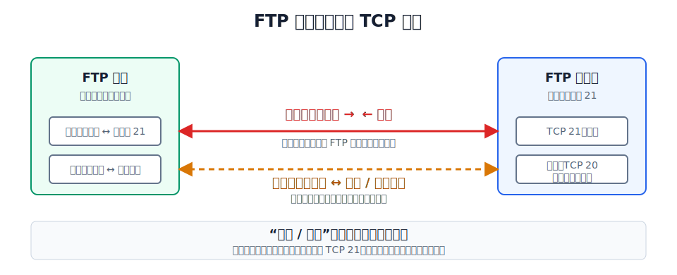

# FTP 解决什么问题

将一台计算机中的文件通过网络传送到另一台计算机，是基本的网络应用需求。**文件传送协议**（File Transfer Protocol，FTP）是因特网上使用最广泛的文件传送协议。

FTP 提供**交互式访问**，允许客户指明文件类型与格式（如 ASCII 码或二进制），并允许文件具有存取权限（访问文件的用户必须经过授权并输入有效口令）。FTP 屏蔽了各计算机系统的细节，因而适用于在**异构网络**中任意计算机之间传送文件。

FTP 采用**客户/服务器**方式。FTP 客户计算机可将各种类型的文件上传到 FTP 服务器，也可以从 FTP 服务器下载文件。

# FTP 的基本工作原理

FTP 与其他 C/S 协议最大的不同是：它使用**两条 TCP 连接**。

| | 控制连接 | 数据连接 |
|---|---|---|
| 服务器端口 | TCP **21** | 主动模式通常使用 TCP **20**；被动模式使用服务器临时端口 |
| 生命周期 | 整个 FTP 会话期间**保持打开** | 每次文件传送时**临时建立**，传送完毕后**释放** |
| 传送内容 | FTP 命令（如 USER、PASS、LIST、RETR、STOR）和服务器应答 | 文件数据或目录列表数据 |
| 方向 | 客户 → 服务器（命令）、服务器 → 客户（应答） | 取决于上传还是下载 |

两条连接分离的好处：

- **控制与数据互不干扰**。控制连接始终可用，可以在文件传输过程中随时发送中止命令。
- 控制连接只需少量带宽（命令和应答很短），数据连接可以专注传送大量文件数据。
- 每条数据连接只传送一个文件或一次目录列表，传完即释放。

> [!note] FTP 使用 TCP
> FTP 需要可靠传输——文件不能少一个字节，命令也不能丢。因此 FTP 的数据连接和控制连接都建立在 **TCP** 之上。这和 DNS 使用 UDP 不同。

# 主动模式与被动模式

建立数据连接时，谁主动发起连接决定了 FTP 的工作模式。FTP 有**主动模式**和**被动模式**两种。

[html-card height=560](../assets/ftp-active-passive-slides.html)

## 主动模式（PORT）

主动模式下，**FTP 服务器主动向 FTP 客户发起数据连接**：

1. 客户通过控制连接发送 `PORT` 命令，告知服务器自己开放了哪个临时端口。
2. 服务器使用自己的端口 **20**，主动向客户的临时端口发起 TCP 连接。
3. 数据连接建立后，开始传送文件数据。

**问题**：如果客户位于防火墙或 NAT 之后，服务器无法主动连接到客户的临时端口。这正是被动模式要解决的问题。

## 被动模式（PASV）

被动模式下，**FTP 服务器被动等待 FTP 客户来连接**：

1. 客户通过控制连接发送 `PASV` 命令。
2. 服务器在本地开放一个临时端口，并通过控制连接把端口号告知客户。
3. **客户主动**向服务器的临时端口发起 TCP 连接。
4. 数据连接建立后，开始传送文件数据。

被动模式让所有连接都由客户发起，解决了客户位于防火墙/NAT 后面的问题。

| 维度 | 主动模式（PORT） | 被动模式（PASV） |
|---|---|---|
| 数据连接发起方 | 服务器（端口 20） | 客户（随机端口 → 服务器临时端口） |
| 客户的防火墙/NAT 友好性 | 差——服务器无法主动穿透 | 好——客户从内部发起连接 |
| 服务器的防火墙要求 | 只需开放 21 和 20 | 需开放 21 和一段临时端口范围 |
| 适用场景 | 客户无防火墙限制的传统环境 | 现代因特网（客户常位于 NAT 后） |

> 主动与被动，说的都是**数据连接**由谁发起。控制连接始终由客户主动发起（TCP 21），这个不受模式影响。
