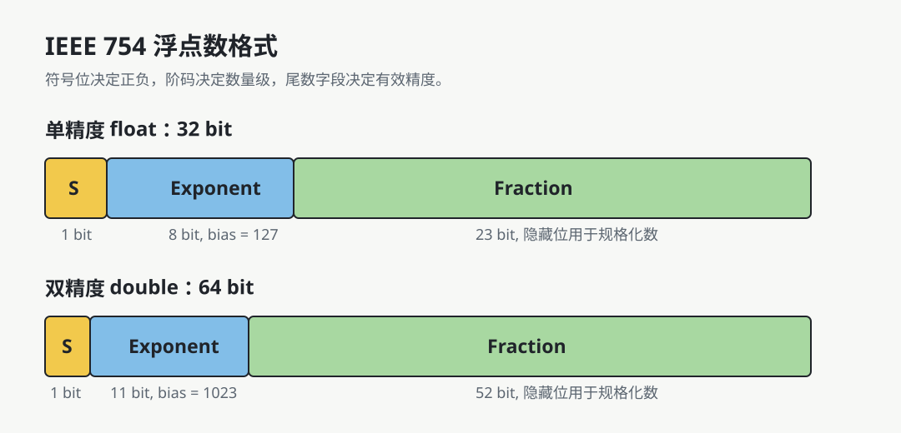
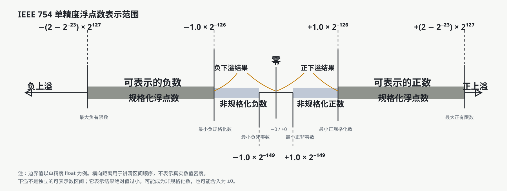

# 浮点数的基本思想

定点数的小数点位置固定，表示范围受位数直接限制。浮点数把一个数拆成三部分：

$$
(-1)^S \times M \times 2^E
$$

| 部分  | 含义          | 表现形式        |
| --- | ----------- | ----------- |
| $S$ | 符号位，决定正负,   | 取值为0/1      |
| $M$ | 尾数或有效数，决定精度 | 非负的定点小数     |
| $E$ | 阶码，决定数量级    | 定点整数，常用移码表示 |

# IEEE 754 标准

IEEE 754 规定了浮点数的编码格式、特殊值、舍入规则和异常状态。

浮点数编码格式如下。



| 格式 | 总位数 | 符号位 | 阶码位 | 尾数字段 | 阶码偏置 |
|---|---:|---:|---:|---:|---:|
| 单精度 `float` | 32 | 1 | 8 | 23 | 127 |
| 双精度 `double` | 64 | 1 | 11 | 52 | 1023 |

## 规格化数

当阶码字段既不全 0，也不全 1 时，表示规格化数：

$$
(-1)^S \times (1.F) \times 2^{e-bias}
$$

这里的 `1.F` 表示尾数最高位的 `1` 不存入字段，称为**隐藏位**。

> [! danger]
> 解读规格化浮点数的机器数的真值表示时，别忘了隐藏位的 1 ！
## 非规格化数

当阶码字段全 0、尾数字段不全 0 时，表示非规格化数：


$$
(-1)^S \times (0.F) \times 2^{1-bias}
$$
> [! Danger]
> 注意这时的指数真值是$1-bias$, **与绝对值最小的规格化数的指数真值一致**。


**非规格化数没有隐藏位 `1`。** 它用于表示非常接近 0 的数，让数值可以逐渐下溢，而不是突然从最小规格化数跳到 0。

## 各部分取值的含义

| 阶码字段 | 尾数字段 | 含义 |
|---|---|---|
| 全 0 | 全 0 | $\pm 0$ |
| 全 0 | 非 0 | 非规格化数 |
| 非全 0 且非全 1 | 任意 | 规格化数 |
| 全 1 | 全 0 | $\pm \infty$ |
| 全 1 | 非 0 | NaN |

> [!note] NaN
> NaN 表示“不是一个数”，常来自未定义或无意义的运算，例如 $0/0$、$\infty-\infty$。

## 表示范围



数轴从左到右可以分成：

1. 负上溢：结果小于最小负规格化数。
2. 规格化负数：负的普通浮点数。
3. 非规格化负数：非常接近 0 的负数。
4. 负下溢：负数小到无法保持规格化，进入非规格化数或 $-0$。
5. 0：包括 `+0` 和 `-0`。
6. 正下溢：正数小到无法保持规格化，进入非规格化数或 `+0`。
7. 非规格化正数：非常接近 0 的正数。
8. 规格化正数：正的普通浮点数。
9. 正上溢：结果大于最大正规格化数。

## 精度

**浮点数表示范围由阶码决定，精度由尾数决定。**

设规格化浮点数的尾数字段有 $f$ 位，阶码真值为 $e$。在 $[2^e,2^{e+1}]$ 内，相邻浮点数的间距为 $2^{e-f}$。随着 $e$ 增大，间距也随之增大。

> [!danger] `int` 转 `float` 可能会有精度丢失
> 单精度 `float` 的 $f=23$。当 $e=23$ 时，间距仍为 1；从 $e=24$ 开始，间距至少为 2，不能再逐个表示整数。见 [[Number-In-C#^222228|C 类型转换示例]]。

## 真值与 IEEE 754 编码互换

以单精度数 $-13.25$ 为例。先把绝对值写成二进制并规格化：

$$
13.25=(1101.01)_2=(1.10101)_2\times 2^3
$$

于是：

- 符号位：$S=1$；
- 指数真值：$e=3$；
- 阶码字段：$E=e+127=130=(10000010)_2$；
- 尾数字段：隐藏最高位的 `1`，保存 `10101000000000000000000`。

拼接三个字段：

$$
\underbrace{1}_{S}\;
\underbrace{10000010}_{E}\;
\underbrace{10101000000000000000000}_{F}
=\mathtt{0xC1540000}
$$

反向解码时按相反顺序进行：

1. `S=1`，所以结果为负；
2. `E=10000010₂=130`，指数真值为 $130-127=3$；
3. 阶码不全 0、也不全 1，因此补回隐藏位，得到 $M=(1.10101)_2$；
4. 计算 $(-1)^1\times(1.10101)_2\times2^3=-13.25$。

[html-card height=760](../assets/ieee754-encode-decode-slides.html)

> [!important] 先根据阶码字段判断解释规则
> 只有规格化数使用 $1.F$ 和 $E-bias$。阶码全 0 时使用 $0.F$ 和固定的最小指数；阶码全 1 时表示无穷大或 NaN，不能套用普通数公式。

# 浮点数加减运算

浮点加减流程是：

1. 比较两个操作数的阶码。并大减小得阶码差
2. 对阶：**阶码小的向大的对齐。** 根据阶码差，把阶码较小的数的尾数连同隐藏位右移。连同隐藏位的尾数每右移一位，阶码就增加1。最终使两个阶码相同。
3. 算上符号、算上隐藏位的尾数相加或相减。
4. 规格化：调整尾数和阶码，使非零结果回到 $1.x$ 形式。
   - 尾数相加产生最高位进位时，尾数**右移**、阶码加 1，称为**右规**；
   - 相减结果出现前导 0 时，尾数**左移**、阶码减 1，称为**左规**。
5. 舍入：把超出尾数字段的位按舍入规则处理。
6. 检查溢出。

[html-card height=820](../assets/floating-point-addition-process.html)

> [!important] 对阶会丢失低位
> 阶码较小的数右移时，低位可能被移出尾数字段。若两个数数量级差距太大，小数可能完全消失，这就是“大数吃小数”。

## 左规与右规

右规发生在尾数加法产生进位时：

$$
(1.100)_2\times2^0+(1.000)_2\times2^0
=(10.100)_2\times2^0
=(1.010)_2\times2^1
$$

右移会把低位推向舍入区；若阶码继续增大到上限，还会发生上溢。

左规常见于两个接近的数相减：

$$
\begin{aligned}
(1.000)_2\times2^0-(1.110)_2\times2^{-1}
&=[(1.000)_2-(0.111)_2]\times2^0\\
&=(0.001)_2\times2^0\\
&=(1.000)_2\times2^{-3}
\end{aligned}
$$

左规本身不会丢掉右侧低位，但会减小阶码。阶码降到规格化数下限后，结果只能进入非规格化区或继续下溢到 0。

## 舍入

浮点数的尾数字段有限，很多实数不能精确表示。例如十进制的 `0.1` 在二进制中是无限循环小数。

当结果需要更多尾数位时，机器必须**舍入**，选择一个可表示的近似值。

为了使得舍入后的结果尽量精准，IEEE 754引入3辅助位：

| 辅助位        | 定义                                              |
| ---------- | ----------------------------------------------- |
| Guard bit  | 被保留尾数右侧的第一位                                     |
| Round bit  | Guard bit 右侧的一位                                 |
| Sticky bit | 更低位是否出现过 `1`，只要有一个被移出的低位为 `1`，Sticky bit 就为 `1` |

这些辅助位组成3bit数$M$。

常见舍入方向包括：

| 舍入方向           | 含义          |
| -------------- | ----------- |
| 就近舍入           | 取最近的可表示数    |
| 截断             | 直接截去多余部分    |
| 向 $+\infty$ 舍入 | 向正无穷方向取可表示数 |
| 向 $-\infty$ 舍入 | 向负无穷方向取可表示数 |


IEEE 754 默认舍入方式通常是**就近舍入， ties to even**：将M附在尾数$f$后面使尾数成为$f'$，选择距离$f'$最近的可表示数；若正好在两个可表示数中间，选择尾数最低有效位为偶数的那个。

即：**看M值，四舍六入五凑偶**

## 溢出

浮点数的阶码也有限，因此结果可能超出可表示范围。

| 情况  | 含义            | 典型结果               |
| --- | ------------- | ------------------ |
| 上溢  | 结果绝对值太大，阶码装不下 | $\pm\infty$ 或最大有限数 |
| 下溢  | 结果绝对值太小，接近 0  | 非规格化数或 $\pm 0$     |

> [!note] 上溢和整数溢出不同
> 整数溢出常表现为截断或环绕；浮点上溢通常进入无穷大或最大有限值，具体取决于舍入模式。

# 大数吃小数

对阶还会导致“大数吃小数”现象。

假设有一个很大的数 $A$ 和一个很小的数 $B$：

$$
|A| \gg |B|
$$

计算 $A+B$ 时，必须把 $B$ 的尾数右移到和 $A$ 同一阶码。若右移位数超过尾数能保留的精度，$B$ 的有效位会全部移出，结果就变成：

$$
A+B=A
$$

这是浮点表示精度不足导致的计算结果。

> [!example] 直观例子
> 在有限精度下，`1.0e20 + 1.0` 可能仍得到 `1.0e20`。因为 `1.0` 在对阶时太小，无法影响 `1.0e20` 的有效位。

## 浮点数加减法不满足结合律

数学中的加减法满足结合律：

$$
(a+b)+c=a+(b+c)
$$

但浮点加减法每做一次运算都可能发生一次对阶、舍入和低位丢失，因此一般不满足结合律。

例如：

```text
a =  1.0e20
b = -1.0e20
c =  1.0
```

若先算左边：

```text
(a + b) + c
= (1.0e20 - 1.0e20) + 1.0
= 0.0 + 1.0
= 1.0
```

若先算右边：

```text
a + (b + c)
= 1.0e20 + (-1.0e20 + 1.0)
```

其中 `-1.0e20 + 1.0` 会发生“大数吃小数”，`1.0` 在对阶时被丢掉：

```text
-1.0e20 + 1.0 ≈ -1.0e20
```

所以：

```text
a + (b + c) ≈ 0.0
```

两种括号顺序得到的结果不同：

```text
(a + b) + c = 1.0
a + (b + c) = 0.0
```

这说明浮点加法的计算结果依赖运算顺序。并行求和、编译器优化、表达式重排都会受到这一点影响。
