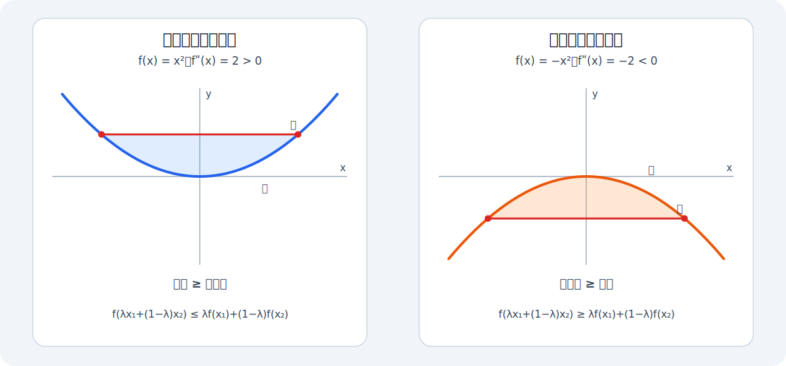

# 单调性

## 定义

在区间 $I$ 上，对任意 $x_1<x_2$：
- $f(x_1)<f(x_2)$：严格单调递增；
- 反向不等式对应单调不增与严格单调递减。

单调性是**区间性质**，不能只看一个点。

**单调性不要求连续，所以更不要求可导。**

进一步说，**单调函数若在 $x_0$ 不连续，只可能是跳跃间断**

所以导函数如果单调，则可以推出它连续，但**不能推出这个导函数可导**。例如$$
f(x)=\begin{cases}
\frac{x^{2}}{2},&x<0; \\
\frac{3x^{2}}{2},&x\geqslant0
\end{cases}$$

## 用一阶导数判断

若 $f$ 在区间 $I$ 上可导，则

$$
f'(x)\ge0\quad(x\in I, \text{等号仅在有限多个点成立})
\Longrightarrow f\text{ 在 }I\text{ 上严格单调递增}
$$

递减情形只需取小于等于。

函数在 $x_0$ 的某个邻域内严格单调，**不能推出** $f'(x_0)\ne0$。例如 $f(x)=x^3$ 严格递增，但 $f'(0)=0$。

 且 $f'(x_0) > 0$ 也不能直接断言邻域单调；还要保证 $f'$ 在附近保持符号。
 
 常用的充分条件是 $f'$ 在 $x_0$ 连续：

$$
f'(x_0)>0
\Longrightarrow
f'(x)>0\text{ 在某邻域内成立}
\Longrightarrow
f\text{ 在该邻域严格递增}.
$$

> [! success] 二阶导存在强化了一阶导的连续性，避免了衰减振荡情况的失效
若 $f''(x_0)$ 存在，则 $f'$ 在 $x_0$ 可导，因此 $f'$ 在 $x_0$ 连续，可以得到：
>
> $$
> \lim_{x\to x_0}f'(x)=f'(x_0).
> $$
>
> 所以当 $f''(x_0)$ 存在且 $f'(x_0)\ne0$ 时，由于 **$\displaystyle\lim_{ x \to x_{0} }f'(x)$存在**，**所以这里可以使用 $f'$ 的[[../posts/Function-Limits-and-Continuity#保号性|保号性]]推出 $f$ 在 $x_0$ 的某邻域内严格单调。**
>
> > [! danger]
> >但若没有$f'(x)$连续的条件，**因为$\displaystyle\lim_{ x \to x_{0} }f'(x)$不存在，所以不可以使用保号性**，由一点导数的正负性推出区间单调性！
# 凹凸性

设 $f$ 定义在区间 $I$ 上。任取 $x_1,x_2\in I$ 和 $\lambda\in(0,1)$，令

$$
x_\lambda=\lambda x_1+(1-\lambda)x_2.
$$

- 若恒有
  $$
  f(x_\lambda)
  \le \lambda f(x_1)+(1-\lambda)f(x_2),
  $$
  则 $f$ 在 $I$ 上为凹函数。函数图像位于任意两点所连弦段的下方。
- 若恒有
  $$
  f(x_\lambda)
  \ge \lambda f(x_1)+(1-\lambda)f(x_2),
  $$
  则 $f$ 在 $I$ 上为凸函数。函数图像位于任意两点所连弦段的上方。

当 $x_1\ne x_2$ 时，将 $\le,\ge$ 分别换成 $<,>$，得到严格凹、严格凸。线性函数取等号，既是凹函数也是凸函数。

若 $f$ 在区间 $I$ 上可导，则

$$
f\text{ 为凹函数}
\iff f'\text{ 在 }I\text{ 上单调不减},
$$

$$
f\text{ 为凸函数}
\iff f'\text{ 在 }I\text{ 上单调不增}.
$$

若 $f$ 在 $I$ 上二阶可导，则可继续化为

$$
f''(x)\ge0\quad(x\in I)
\Longrightarrow f\text{ 在 }I\text{ 上为凹函数},
$$

$$
f''(x)\le0\quad(x\in I)
\Longrightarrow f\text{ 在 }I\text{ 上为凸函数}.
$$

$f''>0$ 与 $f''<0$ 分别保证严格凹与严格凸。

# 极值与拐点

## 极值点

若$x$从小增大越过极值点$x_{0}$时：

- $f'$ 由正变负：局部极大值；
- $f'$ 由负变正：局部极小值；
- $f'$ 不变号：不是极值点。

若 $f$ 在内点 $x_0$ 可导且取得局部极值，则 $f'(x_0)=0$。反之不成立，$x^3$ 在 $0$ 点导数为零但没有极值。

若 $f'(x_0)=0$ 且 $f''(x_0)$ 存在，则

$$
f''(x_0)>0\Longrightarrow x_0\text{ 为严格局部极小值点},
$$

$$
f''(x_0)<0\Longrightarrow x_0\text{ 为严格局部极大值点}.
$$

$f''(x_0)=0$ 时二阶判据失效，应改看 $f'$ 的符号变化或更高阶导数。

## 拐点

拐点描述凹凸性的改变，也就是 $f'$ 的增减趋势是否改变。若 $f''$ 在 $x_0$ 两侧异号，则 $(x_0,f(x_0))$ 是拐点。

$f''(x_0)=0$ 或 $f''(x_0)$ 不存在，只能说明 $x_0$ 是候选点；最终必须检查两侧凹凸性。比如 $x^4$ 满足 $f''(0)=0$，但两侧均为凹，$0$ 不是拐点。

# 最值

求闭区间 $[a,b]$ 上的最大值、最小值：

1. 找区间内部所有 $f'(x)=0$ 的点；
2. 找区间内部所有 $f'(x)$ 不存在但 $f(x)$ 有定义的点；
3. 连同端点 $a,b$ 一起计算函数值；
4. 比较这些值。

极值是局部概念，最值是指定区间内的整体比较。开区间或无界区间还要考察端点极限与无穷远行为。

# 用导数描述局部性质

关注最低阶的有效导数：

| 条件 | 可推出的局部性质 |
|---|---|
| $f'(x_0)>0$ 且 $f'$ 在 $x_0$ 连续 | 邻域内严格递增 |
| $f'(x_0)<0$ 且 $f'$ 在 $x_0$ 连续 | 邻域内严格递减 |
| $f'(x_0)=0, f''(x_0)>0$ | 严格局部极小值 |
| $f'(x_0)=0, f''(x_0)<0$ | 严格局部极大值 |
| $f''$ 在 $x_0$ 两侧变号 | 拐点 |

若前若干阶导数均为零，可看第一个非零高阶导数。设 $f$ 在 $x_0$ 附近足够光滑，且

$$
f'(x_0)=\cdots=f^{(m-1)}(x_0)=0,
\qquad f^{(m)}(x_0)\ne0,
$$

则局部主项为

$$
f(x)-f(x_0)
=\frac{f^{(m)}(x_0)}{m!}(x-x_0)^m
+o\!\left((x-x_0)^m\right).
$$

- $m$ 为偶数：系数为正时是局部极小值，系数为负时是局部极大值；
- $m$ 为奇数：不是极值点；当 $m\ge3$ 时，通常表现为拐点。
