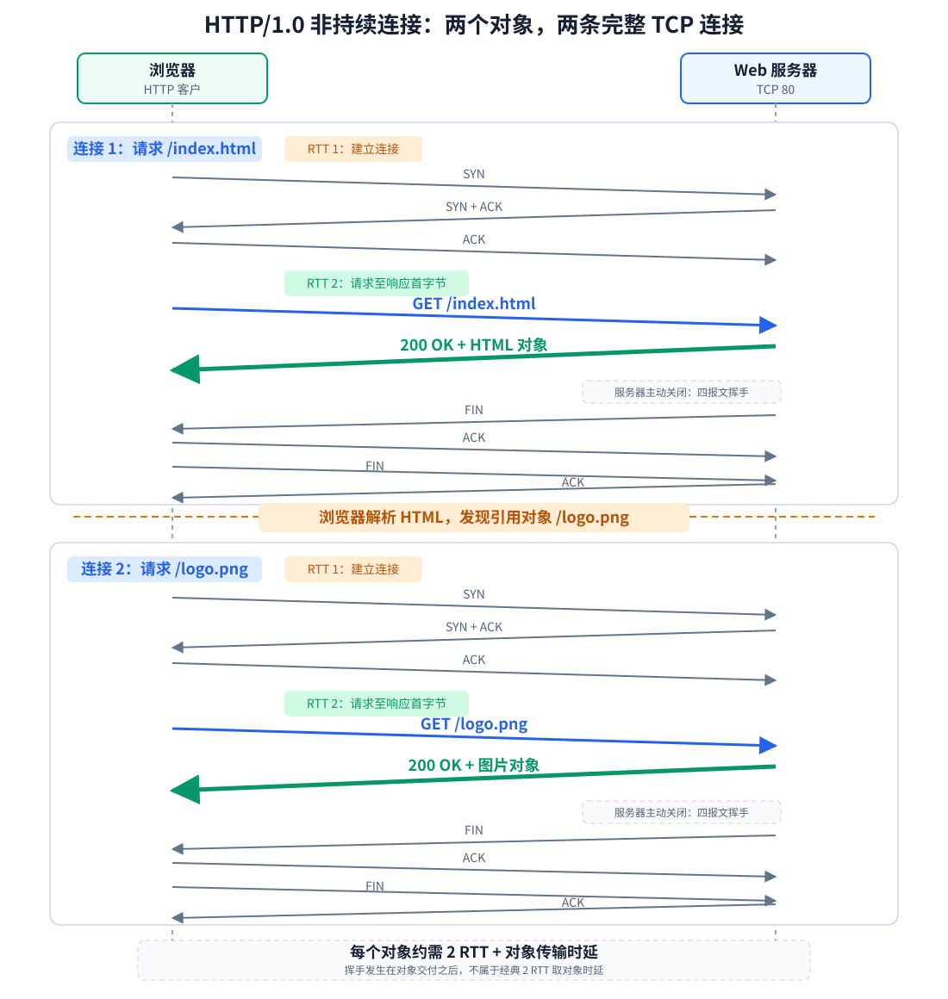
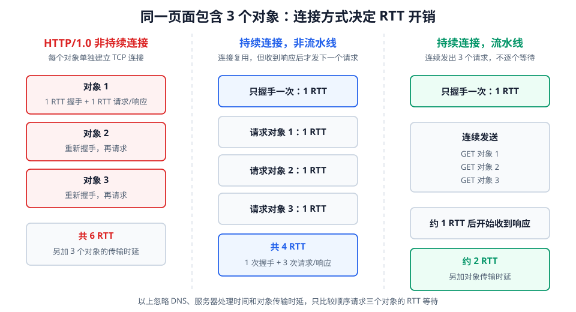
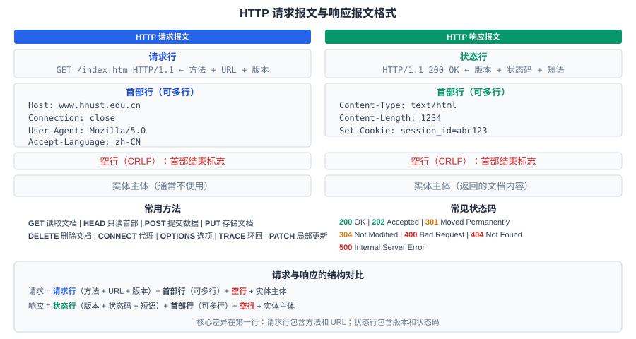

# HTTP 是什么

**超文本传输协议**（HTTP）定义了浏览器（HTTP 客户）如何向万维网服务器（HTTP 服务器）请求万维网文档，以及服务器如何把文档传送给浏览器。它是万维网的核心协议，负责 [[World-Wide-Web]] 中资源的传送。

HTTP 是**请求/响应**协议，通信总是由客户发起，服务器只负责应答，不能主动向客户发报文。它也是**无状态**的：服务器不保存有关客户的历史请求信息，两次请求之间没有联系，需要“记忆”时只能靠 Cookie 这类机制补充。HTTP 报文交给运输层的 TCP 传送，服务器默认监听 TCP 端口 **80**。请求行、状态行和首部行都是 ASCII 文本，可以直接阅读；扩展能力也由首部行承载，例如 Cookie、缓存验证与内容协商。

HTTPS 是 HTTP 与 TLS 的组合：HTTP 报文先经过 TLS 加密再交给 TCP 传送，默认端口 **443**。对上层而言 HTTP 的语义不变。

# HTTP 的操作过程

[html-card height=650](../assets/http-operation-process-slides.html)

HTTP 的基本操作过程：

1. 浏览器解析 URL，得到服务器的域名和端口号。
2. 浏览器与服务器建立 **TCP 连接**（HTTP 默认端口 **80**）。
3. 浏览器通过 TCP 连接发送 **HTTP 请求报文**。
4. 服务器收到请求报文后，执行相应操作，发回 **HTTP 响应报文**。
5. 根据 HTTP 版本和首部设置决定 TCP 连接是否释放。
6. 浏览器解析响应报文中的文档内容并渲染。

# HTTP/1.0 与 HTTP/1.1

HTTP 有两个主要版本，它们的核心区别在于是否持续连接。

## 非持续连接（HTTP/1.0）

HTTP/1.0 默认使用**非持续连接**（non-persistent connection）：一条 TCP 连接只传送一个对象，对象传完后便关闭该连接。网页包含基本 HTML 和多个引用对象时，浏览器要为每个对象重新建立连接。

顺序请求多个对象时，过程是：

1. 建立连接 1，请求并接收基本 HTML。
2. 解析 HTML，发现引用对象；建立连接 2，请求并接收第一个引用对象。后一个连接的建立可以与前一个连接的挥手同时进行。
3. 继续为其余对象建立新连接，每条连接传送一个对象。
4. 最后一个对象传完后，最后一条连接完成四次挥手。

若网页包含 $n$ 个引用对象，共需建立 $n+1$ 条 TCP 连接：一条传送基本 HTML，其余 $n$ 条分别传送引用对象。顺序建立这些连接时等待较多；浏览器也可以在解析 HTML 后并行建立多条连接，同时请求多个引用对象，但会增加服务器负担。

## 持续连接（HTTP/1.1）

HTTP/1.1 默认使用**持续连接**（persistent connection）：一个 TCP 连接建立后，可以**连续传送多个** HTTP 请求和响应，直到明确断开。这避免了每个对象都经历 TCP 握手和慢开始的代价。

HTTP/1.1 的持续连接有两种工作方式：

| | 非流水线方式 | 流水线方式 |
|---|---|---|
| 请求顺序 | 客户发送一个请求 → 收到响应 → 再发下一个请求 | 客户**连续发送**多个请求，不逐个等待响应 |
| RTT 等待 | 每个后续对象通常仍增加 1 RTT | 一批请求可共用约 1 RTT 的等待 |
| RTT 开销 | 第一个请求后，每个后续请求仍需 1 RTT | 一批请求只需 1 RTT 的等待时间 |
| 实现复杂度 | 简单 | 较复杂（需匹配请求与响应顺序） |
| 使用情况 | 最简单、最常见的持续连接方式 | HTTP/1.1 允许使用，但浏览器实践中很少启用 |

流水线方式虽然减少 RTT 等待，但服务器必须按请求顺序返回响应。若前一个响应生成或传输很慢，后续响应会被它挡住，形成 **HTTP/1.1 队头阻塞**。HTTP/2 的多路复用消除了 HTTP 层按响应顺序造成的阻塞，但其 TCP 连接仍可能因丢包发生传输层队头阻塞；HTTP/3 改用 QUIC 后才进一步隔离不同流之间的丢包影响。

# HTTP 报文格式

HTTP 报文分为两种：**请求报文**和**响应报文**。两者的结构类似，都是 ASCII 文本（人类可读）。

## 请求报文

HTTP 请求报文包含请求行、首部行和可选的实体主体；首部与实体主体之间用空行分隔。按报文中的可见区域可列为：

| 部分 | 内容 | 说明 |
|---|---|---|
| **请求行** | 方法 + 空格 + URL + 空格 + 版本 + CRLF | 第一行，必须。`GET /index.htm HTTP/1.1` |
| **首部行** | 首部字段名 + `:` + 空格 + 值 + CRLF | 可有多行。如 `Host:`、`Connection:`、`User-Agent:` |
| **空行** | CRLF | 首部行结束标志 |
| **实体主体** | 数据 | 通常不使用（GET 请求一般无实体主体） |

常见首部行：

| 首部 | 常见于 | 作用 |
| --- | --- | --- |
| `Host` | 请求 | 指明目标主机名和端口；同一服务器托管多个网站时据此区分网站 |
| `User-Agent` | 请求 | 说明浏览器或其他客户程序的类型和版本 |
| `Cookie` | 请求 | 把服务器此前设置的 Cookie 送回服务器 |
| `If-Modified-Since` | 请求 | 仅当资源在指定时间后修改过才要求返回资源，用于缓存验证 |
| `Server` | 响应 | 说明服务器软件信息 |
| `Location` | 响应 | 给出重定向后的目标 URL |
| `Set-Cookie` | 响应 | 要求浏览器保存 Cookie |
| `Last-Modified` | 响应 | 说明资源最后修改时间 |
| `Content-Type` | 含实体主体的报文 | 说明主体的数据类型，如 `text/html`、`image/png` |
| `Content-Length` | 含实体主体的报文 | 说明主体长度，单位为字节 |
| `Connection` | 请求或响应 | 说明本次连接的管理选项，如 `close` |

常用 HTTP 请求方法：

| 方法 | 含义 |
|---|---|
| `GET` | 请求读取 URL 所标志的文档 |
| `HEAD` | 请求读取 URL 所标志文档的**首部**（不返回文档体） |
| `POST` | 向服务器提交数据（如表单） |
| `PUT` | 在指明的 URL 下存储一个文档 |
| `DELETE` | 删除 URL 所标志的文档 |
| `CONNECT` | 用于代理服务器 |
| `OPTIONS` | 请求一些选项信息 |
| `TRACE` | 用于环回测试 |
| `PATCH` | 对 PUT 的补充，用于局部更新 |

## 响应报文

HTTP 响应报文包含状态行、首部行和可选的实体主体，同样用空行分隔首部与主体：

| 部分 | 内容 | 说明 |
|---|---|---|
| **状态行** | 版本 + 空格 + 状态码 + 空格 + 短语 + CRLF | 第一行，必须。`HTTP/1.1 200 OK` |
| **首部行** | 同请求报文 | 如 `Content-Type:`、`Content-Length:` |
| **空行** | CRLF | 首部行结束标志 |
| **实体主体** | 返回的文档内容 | 如 HTML 文件 |

常见 HTTP 状态码：

| 状态码 | 短语 | 含义 |
|---|---|---|
| `200` | OK | 请求成功 |
| `202` | Accepted | 已接受请求 |
| `301` | Moved Permanently | 永久重定向 |
| `304` | Not Modified | 文档未修改（用于缓存验证） |
| `400` | Bad Request | 请求报文有语法错误 |
| `404` | Not Found | 服务器找不到请求的资源 |
| `500` | Internal Server Error | 服务器内部错误 |

# Cookie：让 HTTP "记住"用户

HTTP 本身是**无状态**的，服务器不保存任何有关客户的历史请求信息。这意味着如果用户连续两次请求同一个网站，服务器无法知道这是同一个用户。

**Cookie** 是一种在无状态的 HTTP 之上维护用户状态的机制。

[html-card height=580](../assets/cookie-workflow-slides.html)

Cookie 的基本工作流程：

1. 用户初次访问网站时，浏览器发送 HTTP 请求报文（不含 Cookie）。
2. 服务器为其生成一个唯一的 **Cookie 识别码**，并在后端数据库中创建记录。
3. 服务器在 HTTP 响应报文中通过 **`Set-Cookie` 首部行**将识别码返回给浏览器。
4. 浏览器将识别码存储在 Cookie 文件中。
5. 用户之后每次访问该网站时，浏览器自动从 Cookie 文件中取出识别码，放入 HTTP 请求报文的 **`Cookie` 首部行**中。
6. 服务器根据识别码从数据库中取出用户信息，返回个性化内容。

Cookie 的关键首部：

- 响应报文：`Set-Cookie: <识别码>`（服务器设置 Cookie）。
- 请求报文：`Cookie: <识别码>`（浏览器回传 Cookie）。

> Cookie 只是维护状态的诸多方法之一。它常用于"记住我"、购物车、个性化推荐等场景。

# 万维网缓存与代理服务器

万维网缓存（Web Cache）把最近的一些请求和响应暂存在本地，以提高万维网的效率。缓存可以位于客户机中；位于客户与原始服务器之间的中间系统上的 Web 缓存称为**代理服务器**。

[html-card height=620](../assets/web-cache-proxy-slides.html)

代理服务器的工作方式：

| 情况 | 代理服务器行为 |
|---|---|
| **缓存命中** | 请求到达代理服务器 → 缓存中有对应文档且未过期 → 直接返回给客户 |
| **缓存未命中** | 请求到达代理服务器 → 缓存中无对应文档 → 代理服务器向原始服务器请求 → 存入缓存 → 返回给客户 |
| **缓存过期** | 代理服务器向原始服务器发送验证请求（携带 `If-modified-since` 头）→ 原始服务器判断是否修改 |

## 缓存一致性

原始服务器通常为每个响应的对象设定两个时间字段：

- **`Last-Modified`**：文档最后修改时间。
- **`Expires`**：文档有效期。

当代理服务器中的文档过期后，代理服务器向原始服务器发送验证请求，携带 **`If-Modified-Since`** 首部（值为该文档的修改日期）：

- 文档**未修改** → 原始服务器返回 `304 Not Modified`（不含实体主体），代理服务器更新文档有效期。
- 文档**已修改** → 原始服务器返回 `200 OK` 和新文档，代理服务器更新缓存和有效期。

代理服务器的作用：

- **减少出口带宽**：校园网或公司网络内的用户请求相同资源时，只需一次从因特网获取。
- **降低访问延迟**：缓存命中时，响应从本地代理服务器返回，远快于从原始服务器获取。
- **减轻原始服务器负载**：大量重复请求被代理服务器拦截，不到达原始服务器。

# HTTP 之后

HTTP 的请求/响应模型决定了服务器无法主动向客户推送数据。要在一条既有的连接上实现双向实时通信，需要在 HTTP 基础上完成一次协议升级，也就是 WebSocket，详见 [[Realtime-Web-Communication]]。
