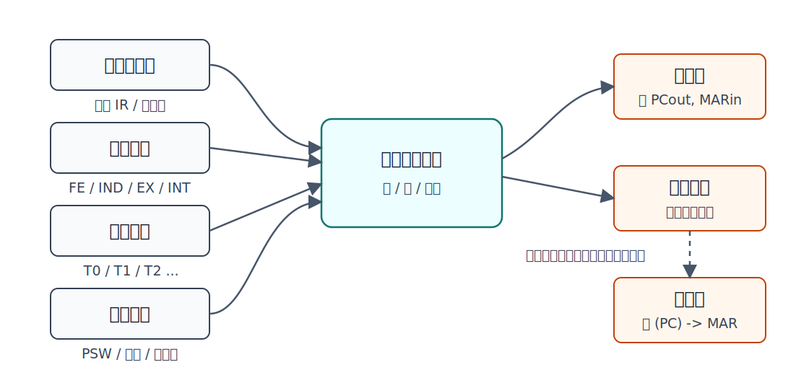
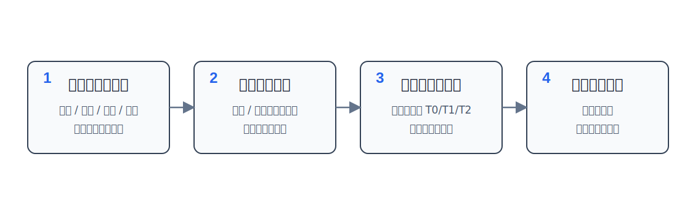

硬布线控制器用**组合逻辑电路**直接产生控制信号。

它的核心思想是：

```text
指令操作码 + 当前工作周期 + 节拍信号 + 状态条件 -> 微操作控制信号
```

每个微命令对应一个或一组控制信号；控制信号接通数据通路后，就完成对应的微操作。



例如，要完成：

```text
(PC) -> MAR
```

在单总线结构中可能需要让：

```text
PCout, MARin
```

同时有效。控制器发出的不是“文字命令”，而是让这些控制线在特定节拍为有效电平。

# 微操作、微命令和控制信号

| 概念 | 含义 | 例子 |
|---|---|---|
| 微操作 | 数据通路中最基本的操作 | `(PC) -> MAR` |
| 微命令 | 控制器发出的命令 | 使 `PCout`、`MARin` 有效 |
| 控制信号 | 微命令在电路中的具体控制线 | `PCout`、`MARin`、`MemR`、`IRin` |

三者关系可以理解为：

```text
微命令发出控制信号，控制信号驱动数据通路完成微操作。
```

一个节拍内可以并行发出多个微命令，但前提是这些微操作**相容**：不争用同一条总线、不同时写同一个目的寄存器、不违反数据依赖。

# 控制信号由什么决定

硬布线控制器发出某个控制信号时，需要同时看四类条件。

| 条件 | 作用 |
|---|---|
| 指令操作码 | 判断当前执行的是 `ADD`、`LDA`、`STA`、`JMP` 等哪类指令 |
| 工作周期标志 | 判断当前处于取指、间址、执行或中断周期 |
| 节拍信号 | 判断当前是 `T0`、`T1`、`T2` 等哪一个时钟节拍 |
| 状态条件 | 判断 PSW、ACC 符号位、中断请求、寻址特征位等条件是否成立 |

因此，某个微命令的逻辑表达式一般形如：

```text
控制信号 = 若干个“工作周期 · 节拍 · 指令条件 · 状态条件”的或
```

例如，`M(MAR) -> MDR` 可能在多个场景出现：

| 场景 | 条件 |
|---|---|
| 取指周期读指令 | `FE · T1` |
| 间址周期读有效地址 | `IND · T1 · 需要间址的指令` |
| 执行周期读操作数 | `EX · T1 · 访存读指令` |

所以它的控制信号不是只属于某一条指令，而是把所有会用到该微操作的情况综合起来。

```text
M(MAR)->MDR = FE·T1 + IND·T1·(...) + EX·T1·(...)
```

# 设计步骤

硬布线控制器的设计可以按下面四步看。



| 步骤 | 要做什么 |
|---|---|
| 分析微操作序列 | 写出取指、间址、执行、中断各周期需要哪些微操作 |
| 选择控制方式 | 决定采用定长或不定长机器周期、每个机器周期安排几个节拍 |
| 安排微操作时序 | 把微操作分配到 `T0/T1/T2/...` 中 |
| 电路设计 | 列操作时间表，写逻辑表达式，画组合逻辑电路 |

其中最关键的是第三步和第四步：先决定**什么时候做什么微操作**，再把这个“什么时候”转成逻辑表达式。

# 微操作时序安排原则

安排节拍时除了尽量少用节拍，还要满足数据通路约束。

| 原则 | 含义 |
|---|---|
| 顺序不能乱 | 后一个微操作依赖前一个结果时，不能提前 |
| 被控对象不同可并行 | 不冲突的寄存器传送、主存控制、PC 更新等可放在同一节拍 |
| 短操作可合并 | 若两个短微操作有先后关系，但总耗时仍能放入一个时钟周期，可以安排在同一节拍 |

> [!warning] 一个节拍内“同时写在一起”不一定表示完全同时
> 有些内部寄存器传送和译码操作很短，可以在同一时钟周期内先后完成。表格里写在同一节拍，是因为它们能在该节拍内完成，而不是说所有电路瞬间同时变化。

# 取指周期的节拍安排

取指周期对所有指令通常相同。

原始微操作序列：

```text
(PC) -> MAR
1 -> R
M(MAR) -> MDR
(MDR) -> IR
OP(IR) -> ID
(PC) + 1 -> PC
```

若采用定长机器周期，并把一个机器周期安排为 3 个节拍，可安排为：

| 节拍 | 微操作 | 说明 |
|---|---|---|
| `T0` | `(PC) -> MAR`，`1 -> R` | 给出指令地址，同时发出读命令 |
| `T1` | `M(MAR) -> MDR`，`(PC)+1 -> PC` | 主存读指令；PC 形成下一条指令地址 |
| `T2` | `(MDR) -> IR`，`OP(IR) -> ID` | 指令进入 IR，操作码送指令译码器 |

这里 `M(MAR) -> MDR` 涉及主存读，通常需要一个完整节拍保证完成；而 `MDR -> IR` 与 `OP(IR) -> ID` 都是 CPU 内部较短操作，可以安排在同一节拍。

# 间址周期的节拍安排

间址周期用于根据指令地址字段访问主存，取出真正的有效地址。

| 节拍 | 微操作 |
|---|---|
| `T0` | `Ad(IR) -> MAR`，`1 -> R` |
| `T1` | `M(MAR) -> MDR` |
| `T2` | `(MDR) -> Ad(IR)` |

间址周期的结果不是操作数，而是有效地址。执行周期再用这个有效地址去取操作数或完成后续操作。

# 执行周期的节拍安排

执行周期因指令而异。

| 指令 | 功能 | 执行周期微操作 |
|---|---|---|
| `CLA` | ACC 清零 | `T2: 0 -> AC` |
| `COM` | ACC 取反 | `T2: AC -> AC` |
| `ADD X` | `(AC) + (X) -> AC` | `T0: Ad(IR)->MAR, 1->R`；`T1: M(MAR)->MDR`；`T2: (AC)+(MDR)->AC` |
| `STA X` | `(AC) -> X` | `T0: Ad(IR)->MAR, 1->W`；`T1: AC->MDR`；`T2: MDR->M(MAR)` |
| `LDA X` | `(X) -> AC` | `T0: Ad(IR)->MAR, 1->R`；`T1: M(MAR)->MDR`；`T2: MDR->AC` |
| `JMP X` | 无条件转移 | `T2: Ad(IR)->PC` |
| `BAN X` | ACC 为负则转移 | `T2: A0·Ad(IR) + A0'·(PC) -> PC` |

> [!note] `A0` 的含义
> `A0` 可理解为 ACC 的符号位。若符号位为 1，表示 ACC 为负，`BAN` 才把指令地址字段送入 PC；否则 PC 保持顺序执行形成的值。

# 中断周期的节拍安排

中断周期由硬件完成，又称中断隐指令完成的操作。它不是指令系统里的一条普通机器指令。

中断周期通常要完成三件事：

| 任务 | 含义 |
|---|---|
| 保存断点 | 保存当前 PC，以便中断返回 |
| 形成入口地址 | 把中断服务程序入口送入 PC |
| 关中断 | 避免处理中断时被新的可屏蔽中断打断 |

一种节拍安排为：

| 节拍 | 微操作 |
|---|---|
| `T0` | `a -> MAR`，`1 -> W`，`0 -> EINT` |
| `T1` | `(PC) -> MDR` |
| `T2` | `MDR -> M(MAR)`，`向量地址 -> PC` |

其中 `EINT` 表示中断允许触发器。`0 -> EINT` 表示关中断。

# 组合逻辑设计

微操作时序安排完成后，就可以转成组合逻辑。

组合逻辑设计通常分三步：

| 步骤 | 内容 |
|---|---|
| 列操作时间表 | 列出各工作周期、各节拍、各指令下可能用到的微操作 |
| 写最简表达式 | 对每个微命令，把所有会用到它的条件合并 |
| 画逻辑图 | 用与门、或门、非门等实现表达式 |

例如某微操作在三类情况中出现：

```text
FE · T1
IND · T1 · (ADD + STA + LDA + JMP + BAN)
EX · T1 · (ADD + LDA)
```

则可综合为：

```text
T1{FE + IND(ADD + STA + LDA + JMP + BAN) + EX(ADD + LDA)}
```

这就是硬布线控制器的本质：把“哪些指令在什么阶段、什么节拍需要这个微操作”翻译成布尔表达式，再用组合逻辑电路实现。

# 特点

| 方面 | 硬布线控制器 |
|---|---|
| 工作原理 | 微操作控制信号由组合逻辑电路即时产生 |
| 速度 | 快 |
| 规整性 | 不如微程序控制器规整 |
| 扩展性 | 增加或修改指令较困难，可能要改大量逻辑 |
| 常见场景 | 更适合指令格式规整、指令数量较少的 RISC CPU |

> [!summary]
> 硬布线控制器不是“存一段控制程序”，而是把控制规则直接做成电路。它快，但不容易改。
