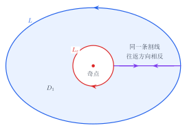

> 本节着重于介绍计算常规的不定积分/定积分/重积分时可以采用的技巧或一些需要注意的地方，不讨论基本概念。

# 不定积分

## 无初等形式的不定积分

遇到下列形式的，**立刻放弃使用不定积分计算原函数！**

$$
\begin{align}
\int e^{ax^2}\,\mathrm{d}x  \\
\int \frac{\sin x}{x}\,\mathrm{d}x  \\
\int \frac{\cos x}{x}\,\mathrm{d}x  \\
\int \frac{e^x}{x}\,\mathrm{d}x  \\
\int \frac{\mathrm{d}x}{\ln x}  \\
\int \frac{\mathrm{d}x}{\sqrt{P_3(x)}}  \\
\int \frac{\mathrm{d}x}{\sqrt{P_4(x)}}  \\
\int \sqrt{1-k^2\sin^2 x}\,\mathrm{d}x \\
\int \frac{\mathrm{d}x}{\sqrt{1-k^2\sin^2 x}}
\end{align}
$$

题目一般将这类函数令为某$f''(x)$，求$f(a)-f(b)$。改用重积分的变换积分次序求解。

> [!info] “积不出来”的函数的不定积分
> 一种方式是使用级数去定义这个函数，然后对级数每一项进行积分。

## 分部积分

求导的函数的优先级：反对幂指三。

## 有理分式

### 有理分式的拆解

如果分子的最高次数大于等于分母最高次数，先采用多项式除法，提出整式部分。

以下的处理都是针对真分式。

任何多项式都可以写成$\prod_{i=1}^{n_{1}}(A_{i}x+B_{i})^{m_{i}}\prod_{i=1}^{n_{2}}(C_{i}x^{2}+D_{i}x+E_{i})^{m_{i}}$。这里定义此形式为“最简式”

拆解的目标：将分母化为“最简式”，然后拆为多个分母较简单的分式相加的形式。

### 如何将分母化为“最简式”？

设分母为$P(x)$, 所以解法：

1. 首选：令$P(x)=0$, 拆出$x-a$项
2. 次选：令$u=x^{2}$, 则$P(x)$化为$Q(u)$。此时允许$u < 0$, 令$Q(u)=0$，拆出$u-a$项即$x^{2}-a$项
3. 前两种都不行：凑平方，即加上一个$P_{2}(x)=P_{1}^{2}(x)$使得存在$P_{3}^{2}(x)=P(x)+P_{2}^{2}(x)$, 于是分母即为$P_{3}^{2}(x)-P_{1}^{2}(x)\implies (P_{3}(x)-P_{1}(x))(P_{3}(x)+P_{1}(x))$

对非最简形式的部分循环使用以上策略，直到合乎标准。

### 如何将原分式拆为多个分式相加的形式？

设真分式的分母已分解为

$$
Q(x)=
\prod_i(A_ix+B_i)^{m_i}
\prod_j(C_jx^2+D_jx+E_j)^{n_j},
$$

其中二次因式在实数范围内不可约。拆分时遵循两条规则：

- 因式的每个幂次都要出现；
- 分子的次数比分母对应的不可约因式低一次。

因此

$$
\frac{P(x)}{Q(x)}
=\sum_i\sum_{k=1}^{m_i}\frac{a_{ik}}{(A_ix+B_i)^k}
+\sum_j\sum_{k=1}^{n_j}
\frac{b_{jk}x+c_{jk}}{(C_jx^2+D_jx+E_j)^k}.
$$

也就是说：一次因式上放常数，二次因式上放一次式。

遇到重复因式，必须从一次幂写到最高次幂。但分子的形式与一次幂一样。
例如 $(x-1)$ ：

$$
\frac{2x^2+3x+4}{(x-1)^2(x^2+1)}
=\frac{A}{x-1}
+\frac{B}{(x-1)^2}
+\frac{Cx+D}{x^2+1}.
$$

分子的系数采用待定系数法求解：两边同乘原分母，代入一些特殊的 $x$，求出系数即可。

### 积分

1. 分子分母差一次：$\ln x$
2. 分母可凑平方加常数，且分子比分母次数的一半少1：$\frac{1}{a}\arctan\left( \frac{x}{a} \right)$
3. 分母可凑 $m+1$次方，且分子次数比分母的 $\frac{1}{m+1}$ 少一次：$x^{-m}$
4. 分母为$(a^{2}+x^{2})^{m}$式，令$x=a\tan t$, 三角换元。

## 三角有理式

要熟悉[[Common-Trigonometric-Identities|公式]]！

一个书写原则：被积分式的形式必须化为$R(\sin x,\cos x),R(\tan x,\sec x),R(\cot x,\csc x)$三种情况中的一种。

对任意关于 $\sin x,\cos x$ 的有理函数积分，万能代换都提供了一种原则上可机械完成的方法，所有 $R(\sin x,\cos x)$ 型积分都能统一地化成有理函数积分。
### 预处理尝试

#### 分母简化

分母写为若干项相乘的形式（同[[#有理分式的拆解]]）。方便接下来的：
* 降次处理(每一项不含加减号) 或者
* 拆为多个分式相加的形式（含加减号，但分式只含有一种三角函数）。

#### 降次

善用二倍角公式与$1=\sin^{2}x+\cos^{2}x$降次。

$1=\sin^{2}x+\cos^{2}x$降次对象：分母为$\cos^{m}x\sin^{n}x$型。($m,n$为正整数)

#### 预处理失败

若被积函数不简单但以下预处理失败：

1. 分母为二次式的若干次方，则尝试 [[#^5710ee|tan(x) 换元]]。
2. 分母为一次式的若干次方，则尝试 [[#^16e961|tan(x/2) 换元]]。

### 分部积分

分部积分目标：积分复现。

### 换元处理

换元原则：进行换元，化为有理分式。

1. 最好：$R(\sin x,\cos x)$可以直接提出 $\mathrm{d} \cos x$ 或 $\mathrm{d} \sin x$ 或者，直接用$\cos x$ 或 $\sin x$换。$R(\tan x,\sec x)$与$R(\cot x,\csc x)$同理。

> [!tip] 善用“巧合”
> 事实上，能够满足上述最好的情形应是相当多的，只是有时候不会那么明显。所以我们应当留意一些“巧合之处”，例如带$1+\cos x$或$\cos x-\sin x$的分母。
> 我们应当注意到，出题人出的题目一定能够解出来，在他构造这道可以被解出来的题目的时候一定会留下暗门。所以那可能真不是巧合，而是出题人有意为之。
> 见[[Common-Trigonometric-Identities]]

2. 次好：用$\tan x$换元。因为$t=\tan x\implies\mathrm{d}x = \frac{1}{1+t^2}\mathrm{d}t$ ^5710ee
3. 最坏（最一般）：万能公式。 ^16e961

### 一类特殊的三角有理分式的积分

$$I=\int_{}^{} \frac{C\sin x+D\cos x}{A\sin x+B\cos x} \, \mathrm{d}x$$

观察分母$f(x)=A\sin x+B\cos x$的导数是$f'(x)=A\cos x-B\sin x$,

于是把分子表示成$C\sin x+D\cos x = \lambda(A\sin x+B\cos x) + \mu(A\cos x-B\sin x)$.

比较 $\sin x,\cos x$ 的系数：

$$\begin{cases} A\lambda-B\mu=C,\\ B\lambda+A\mu=D. \end{cases}$$

解得

$$\lambda=\frac{AC+BD}{A^2+B^2}, \mu=\frac{AD-BC}{A^2+B^2}$$.

因此原积分变成

$$I = \int \left[ \lambda + \mu \frac{A\cos x-B\sin x}{A\sin x+B\cos x} \right]\mathrm{d}x$$.

所以

 $$I= \frac{AC+BD}{A^2+B^2}x + \frac{AD-BC}{A^2+B^2} \ln|A\sin x+B\cos x| +C$$

## 三角无理式

利用[[Common-Trigonometric-Identities#^24cf79|升次去根号]]。

## 无理分式

如果根号下就是完全平方式：直接去根号。

处理原则：化为有理分式/三角有理式。

### 整体换元

$x$ 容易由整体换元后的变量 $t$ 表示。

  1. 只有分子或分母含一个$\sqrt{ Ax+B }$ ：将$\sqrt{ Ax+B }$整体换元
  2. $\sqrt{ \frac{Ax+B}{Cx+D} }$  ：$\sqrt{ \frac{Ax+B}{Cx+D} }$整体换元。特殊地，如果$A=C, B+D=0$，则为[[#三角换元]]的第4种情况。
  3. $\sqrt{ (Ax+B)(Cx+D) }$: 将它写为$\sqrt{ \frac{Ax+B}{Cx+D} }\cdot{|Cx+D|}$，然后同2。

### 三角换元

1. $\sqrt{ a^2 -x^2 }$ 令$x$等于$a\sin t$; $\sqrt{ a^2 +x^2}$ 令$x$等于$a\tan t$; $\sqrt{ x^2-a^2 }$ 令$x$等于 $a\sec t$
2. $\sqrt{ 2ax + x^2 }$与$\sqrt{ 2ax -x^2 }$和$\sqrt{ x^2-2ax }$ 凑成 a 的形式。
3. 若是 $x^m$ （$m>2$） 其他同 a-d 。则对$x^{m/2}$三角换元，后面的处理同 a-b 的形式。
4. 若是$\sqrt{ \frac{Ax+B}{Ax-B} }$ 这样的形式，则利用平方差公式将分母转为 a（事实上，这样处理也将分子的根号消去了） 。 

## 含反三角函数与对数函数

形如$\int_{}^{} f(x)g(x)\,\mathrm{d}x$,$g(x)$为由某反三角函数或对数函数的组成的多项式，$f(x)$为其他函数。

分部积分，即：$$I=g(x)\int_{}^{} f(x) \, \mathrm{d}x-\int_{}^{} g'(x)\int_{}^{}  \, f(x) \, \mathrm{d}x\,\mathrm{d}x$$

## 分母含指数函数的分式

指数函数特性：求导等于本身乘某个系数

分子分母同时乘以指数函数$f$，造$\displaystyle\frac{\mathrm{d}f}{fu(f)}$

换元，转为[[#有理分式]]。

## 含指数函数的无理式

对根号式整体代换。

# 定积分

## 区间再现

一个重要性质：

$$\int_{A}^{B} f(x)\, \mathrm{d}{x}=\int_{A}^{B} f(A+B-x) \, \mathrm{d}{x} $$

更进一步地，如果有$f(x)=f(A+B-x)$，那么还可以推出：

$$\int_{A}^{B} f(x)\, \mathrm{d}{x}=2\int_{A}^{\frac{A+B}{2}} f(x) \, \mathrm{d}{x} $$

> [!tip] “巧合”
> 尤其是看到被积函数是$x\sin x$或$x\cos x$或$x\tan x$等三角函数，且积分区间带 $\pi$。

特殊地，对于$\int_{0}^{+\infty} f(x) \, \mathrm{d}{x}$形式的反常积分，我们可以采用**倒代换$x=\frac{1}{t}$** 实现这样的效果:
$$\int_{0}^{+\infty}f(x) \, \mathrm{d}{x}=\int_{0}^{+\infty} \frac{f\left( \frac{1}{t} \right)}{t^{2}} \, \mathrm{d}{t}  $$

# 重积分

变换积分次序、变换坐标系、注意对称性。

## 轮换对称性

在直角坐标系下，若将$x,y$对调，积分区域$D$不变，则

$$\iint_{D}f(x,y)\mathrm{d}\delta=\iint_{D} f(y,x)\mathrm{d}\delta$$

而且更有：

$$\iint_{D}g(x)\mathrm{d}\delta=\iint_{D} g(y)\mathrm{d}\delta$$

**其中 $g$ 为任意一元函数。**

三重积分也是一样的。

## 换元

一般的极坐标系换元（三重积分为柱面坐标系与球坐标系换元）就够了。但仍有需要灵活处理的时候。

例如一个圆区域：$(x-a)^2+(y-b)^2\leqslant c^2$，但它圆心不在零点，而且也不过源点，直接使用极坐标系换元后对于$r$的确定很复杂。这个时候就可以考虑先平移：$$\begin{cases}
x-a= x_{1}; \\
y-b= y_{1}
\end{cases}$$
然后再极坐标换元。

通法：

$$\begin{cases}
x=f(u,v); \\
y=g(u,v)
\end{cases}\implies \mathrm{d}x\mathrm{d}y=\left|\begin{vmatrix}
\frac{ \partial x }{ \partial u }& \frac{ \partial x }{ \partial v } \\
\frac{ \partial y }{ \partial u }&\frac{ \partial y }{ \partial v }
\end{vmatrix} \right|\mathrm{d}u\mathrm{d}v$$

而且根据反函数的求导公式，有：

$$\begin{cases}
f(x,y)=u; \\
g(x,y)=v
\end{cases}\implies \mathrm{d}x\mathrm{d}y=\dfrac{1}{\left|\begin{vmatrix}
\frac{ \partial u } { \partial x }& \frac{ \partial u }{ \partial y } \\
\frac{ \partial v }{ \partial x }&\frac{ \partial v }{ \partial y }
\end{vmatrix} \right|}\mathrm{d}u\mathrm{d}v$$

三重积分也是一样的。

# 第一类的曲线/曲面积分

注意被积函数的自变量同时也满足积分曲线/曲面的方程，可能可以化简被积函数。

> [!danger] 第一类曲面积分使用投影法不要忘记乘以投影修正因子！

# 第二类的曲线/曲面积分

>[!danger] 带方向的曲面与不带方向的曲面需要进行区分
> 为了区分，设曲面为$\Sigma$，则不带方向记为$\Sigma$ ；带方向记为$(\Sigma,\vec{n})$, $n$ 为一个正向的法向量。

## 积分与路径无关

**设在单连通区域 $D$ 内，** $P,Q$ 具有一阶连续偏导数。

> [!danger] 必须先确保区域内不含奇异点！
> **若含奇异点，务必单独拿出来！**
> >[!example] 
> > 设 $L:y=\pi\cos x$ 从 $A(\pi,-\pi)$ 到 $B(-\pi,-\pi)$，求
> > $$
> > I=\int_L\frac{(x+y)\,\mathrm dx-(x-y)\,\mathrm dy}{x^2+y^2}.
> > $$
> > 记被积微分式为 $\omega$。存在奇异点原点。
> >
> > 补线段 $l:y=-\pi$，方向从 $B$ 到 $A$。闭曲线 $l+L$ 为正向，**但它将原点围在内部**。
> > 
> > 需要先挖去原点附近的小圆 $C_\varepsilon$，在剩余区域内使用格林公式。由于 $Q_x-P_y=0$，
> > $$
> > \int_L\omega+\int_l\omega=\oint_{C_\varepsilon^+}\omega,
> > $$
> > 其中 $C_\varepsilon^+$ 取逆时针方向。
> >
> > 令 $x=\varepsilon\cos\theta$，$y=\varepsilon\sin\theta$，则
> > $$
> > \oint_{C_\varepsilon^+}\omega
> > =\int_0^{2\pi}-\mathrm d\theta=-2\pi.
> > $$
> > 在线段 $l$ 上，$y=-\pi$，$\mathrm dy=0$，故
> > $$
> > \int_l\omega
> > =\int_{-\pi}^{\pi}\frac{x-\pi}{x^2+\pi^2}\,\mathrm dx
> > =-\frac{\pi}{2}.
> > $$
> > 因此
> > $$
> > I=-2\pi+\frac{\pi}{2}=-\frac{3\pi}{2}.
> > $$
> > **奇点不必位于原曲线上；只要落入所用区域，就必须单独处理。**

以下命题等价：

1. $\displaystyle\int_{l_{AB}}P\,\mathrm{d}x+Q\,\mathrm{d}y$ 只与起点 $A$、终点 $B$ 有关。
2. 向量场 $\mathbf F=(P,Q)$ 在 $D$ 内处处旋度为 $0$，即 $\dfrac{\partial Q}{\partial x}=\dfrac{\partial P}{\partial y}$。
3. 对 $D$ 内任意分段光滑闭曲线 $L$，都有 $\displaystyle\oint_LP\,\mathrm{d}x+Q\,\mathrm{d}y=0$。
4. 微分形式 $P\,\mathrm{d}x+Q\,\mathrm{d}y$ 是$U$的全微分：$P\,\mathrm{d}x+Q\,\mathrm{d}y=\mathrm{d}U$。
5.  $\nabla U = (P,Q)^{\top}$ 
6.  $P\,\mathrm{d}x+Q\,\mathrm{d}y=0$ 是全微分方程。

三维曲线的情况同理。

如果曲线$L$不封闭且积分与路径无关，则找一条使被积函数能被化简的路径进行第二类曲线积分。（如果封闭则[[#格林公式 （本质二维情况下的斯托克斯公式）|考虑是否会存在奇异点？若否则写 0 ，若是则需要额外讨论含奇异点的区域]]）

## 斯托克斯公式

变力在封闭路径上做功，等于场在封闭路径上的旋度通过以该路径为边界的曲面的通量。

设 $\mathbf F=(P,Q,R)$，定向曲面 $\Sigma$ 的边界为 $L=\partial\Sigma$，则

写成第二类曲面积分：

$$
\oint_L P\,\mathrm dx+Q\,\mathrm dy+R\,\mathrm dz
=\iint_{(\Sigma,\vec{n})}
\begin{vmatrix}
\mathrm dy\,\mathrm dz & \mathrm dz\,\mathrm dx & \mathrm dx\,\mathrm dy \\
\dfrac{\partial}{\partial x} & \dfrac{\partial}{\partial y} & \dfrac{\partial}{\partial z} \\
P & Q & R
\end{vmatrix}.
$$

写成第一类曲面积分：

$$
\oint_L P\,\mathrm dx+Q\,\mathrm dy+R\,\mathrm dz
=\iint_\Sigma
\begin{vmatrix}
n_x & n_y & n_z \\
\dfrac{\partial}{\partial x} & \dfrac{\partial}{\partial y} & \dfrac{\partial}{\partial z} \\
P & Q & R
\end{vmatrix}\mathrm dS.
$$

边界 $L$ 的正方向与曲面法向 $\mathbf n$ 按右手定则对应。

## 格林公式 （本质二维情况下的斯托克斯公式）

$$\oint_{L} P\mathrm{d}x+Q\mathrm{d}y=\iint_{D_{xy}}\begin{vmatrix}
\frac{ \partial  }{ \partial x } &\frac{ \partial  }{ \partial y } \\
P &Q 
\end{vmatrix}\mathrm{d}x\mathrm{d}y$$

（必然有前提条件：$P$对$y$可导，$Q$对$x$可导）

如果曲线$L$封闭且内部无奇异点（即积分区域内使得求偏微分后出现分母等于 0 的点），则直接使用。（最平凡）

如果曲线$L$封闭且内部无奇异点，而且在 $D$ 内[[#积分与路径无关]]，则直接写 0 。（最简单）

如果曲线$L$不封闭，则根据积分的可加性，可以先补一条线使其成为封闭曲线，再减去在这条线上的第二类曲线积分。 **但要注意补线后造成封闭曲线内部有奇异点的可能。**

如果曲线$L$封闭但内部有奇异点，则：

1. 人为做一条“割线”，沿割线进去，绕奇点周围的一个很小的区域$D_{\varepsilon}$的边界$L_{\varepsilon}$一周，再沿同一条割线回来。这个新曲线$L_{1}$构造的区域$D_{1}$里面已经没有奇点，因此可以正常使用格林公式。而且两次经过割线方向相反，所以积分抵消，于是只需要考虑外边界$L$和内边界$L_{\varepsilon}$。

> [!warning]- 注意方向 : 新曲线在内边界的正方向是顺时针。
> 根据这样的构造方式，新曲线在内边界的正方向与在外边界的正方向恰好相反。
> 本质上封闭曲线的正方向符合右手定则。

2. 同时对于在$L_{\varepsilon}$上的积分，由于可以将$P,Q$化为不会出现奇点的$R,S$（一般是去掉了分母），于是可以使用格林公式。
3. 根据积分的可加性，于是得到：$$\begin{align}
\oint_{L}P\mathrm{d}x+Q\mathrm{d}y&=\oint_{L_{1}}P\mathrm{d}x+Q\mathrm{d}y - \oint_{L_{\varepsilon}-}P\mathrm{d}x+Q\mathrm{d}y \\
&=\iint_{D_{1}} \frac{ \partial Q }{ \partial x } -\frac{ \partial P }{ \partial y } \mathrm{d}\delta + \oint_{L_{\varepsilon}}P\mathrm{d}x+Q\mathrm{d}y \\
&=\iint_{D_{1}} \frac{ \partial Q }{ \partial x } -\frac{ \partial P }{ \partial y } \mathrm{d}\delta + \iint_{D_{\varepsilon}}\frac{ \partial S }{ \partial x } -\frac{ \partial R }{ \partial y } \mathrm{d}\delta
\end{align}$$

> [!warning] 封闭曲线内部可能会有奇异点的情况
> 被积函数含分式，且不能保证分母不会为 0 。
> 所以在封闭曲线上的积分，不能无脑直接使用格林公式，还要先进行判断是否会有奇异点。

## 向量场在区域内散度为 0 

如果曲面$\pi$不封闭且向量场在包含它的区域内散度为 0，则找一个使被积函数能被化简的曲面进行第二类曲面积分。（如果封闭则[[#高斯公式|考虑是否会存在奇异点？若否则写 0 ，若是则需要额外讨论含奇异点的区域]]）

## 高斯公式

向量场对闭合曲面的通量等于场在该曲面围住的空间区域的散度。

$$
\iint_{({\partial\Omega},\vec{n_{out}})}
P\,\mathrm dy\,\mathrm dz
+Q\,\mathrm dz\,\mathrm dx
+R\,\mathrm dx\,\mathrm dy
=\iiint_\Omega\left(P_x+Q_y+R_z\right)\mathrm dV.
$$

（必然有前提条件：$P$对$x$可导，$Q$对$y$可导，$R$对$z$可导）

如果曲面 $\pi$ 封闭且内部无奇异点（即积分区域内使得求偏微分后出现分母等于 0 的点），则直接使用。（最平凡）

如果曲面 $\pi$ 封闭且内部无奇异点，而且场在区域内散度为零，则直接写 0 。（最简单）

如果曲面 $\pi$ 不封闭，则根据积分的可加性，可以先补一个面使其成为封闭曲面，再减去在这个面上的第二类曲面积分。 **但要注意补面后造成封闭曲面内部有奇异点的可能。**

如果曲面$\pi$封闭但内部有奇异点，则：

1. 人为做一个“割面”，沿割面的一侧进去，绕奇点周围的一个很小的区域$\Omega_{\varepsilon}$的边界$\pi_{\varepsilon}$一周，再沿同一个割面的另一侧回来。这个新曲面$\pi_{1}$构造的区域$\Omega_{1}$里面已经没有奇点，因此可以正常使用高斯公式。而且场对割面两侧的通量相反，所以积分抵消，于是只需要考虑外边界$\pi$和内边界$\pi_{\varepsilon}$。

[html-card height=680](../assets/gauss-theorem-cut-surface.html)

> [!warning]- 注意方向 : 新曲面在内边界的正方向是朝$\pi_{\varepsilon}$里。
> 根据这样的构造方式，新曲面在内边界的正方向与在外边界的正方向恰好相反。
> 本质上封闭曲面的正方向是朝曲面外侧。

2. 同时对于在$\pi_{\varepsilon}$上的积分，由于可以将原函数$(P,Q,R)^\top$化为不会出现奇点的$(S,T,U)^\top$（一般是去掉了分母），于是可以使用高斯公式。
3. 根据积分的可加性，于是得到：$$\begin{align}
\iint_{(\pi,\vec{n})}P\,\mathrm dy\,\mathrm dz+Q\,\mathrm dz\,\mathrm dx+R\,\mathrm dx\,\mathrm dy
&=\iint_{(\pi_{1},\vec{n})}P\,\mathrm dy\,\mathrm dz+Q\,\mathrm dz\,\mathrm dx+R\,\mathrm dx\,\mathrm dy \\
&\quad-\iint_{(\pi_{\varepsilon},-\vec{n})}P\,\mathrm dy\,\mathrm dz+Q\,\mathrm dz\,\mathrm dx+R\,\mathrm dx\,\mathrm dy \\
&=\iiint_{\Omega_{1}}\left(\frac{\partial P}{\partial x}+\frac{\partial Q}{\partial y}+\frac{\partial R}{\partial z}\right)\mathrm dV \\
&\quad+\iiint_{\Omega_{\varepsilon}}\left(\frac{\partial S}{\partial x}+\frac{\partial T}{\partial y}+\frac{\partial U}{\partial z}\right)\mathrm dV
\end{align}$$

> [!warning] 封闭曲面内部可能会有奇异点的情况
> 被积函数含分式，且不能保证分母不会为 0 。
> 所以在封闭曲面上的积分，不能无脑直接使用高斯公式，还要先进行判断是否会有奇异点。
