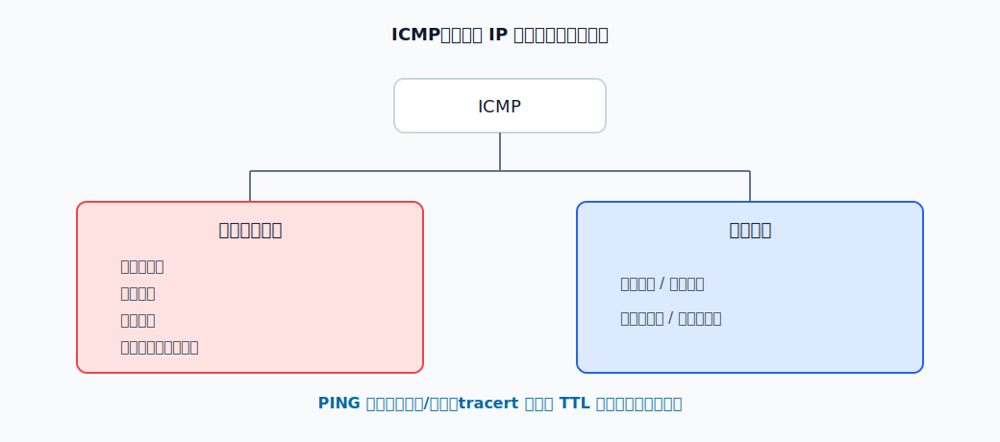

# ICMP

ICMP 用来传递网络层控制信息。它封装在 IP 数据报中，但不是运输层协议；它服务于 IP，帮助主机和路由器报告差错、进行连通性测试和路径探测。

ICMP 不能让 IP 变成可靠协议。IP 数据报仍然可能丢失、重复、失序；ICMP 只是让某些异常能被报告回来。

ICMP 报文大体分为两类：

| 类型 | 作用 |
|---|---|
| 差错报告报文 | 当路由器或主机处理 IP 数据报出现某类异常时，向源主机报告 |
| 询问报文 | 主机或路由器主动发出请求，用于测试可达性、测量时间等 |

# 差错报告报文

ICMP 差错报告报文把网络层遇到的问题反馈给源主机。常见类型如下：

| 差错类型 | 典型触发场景 |
|---|---|
| 终点不可达 | 路由器找不到到目的网络的路由，或目的主机/端口不可达 |
| 源点抑制 | 路由器或主机因拥塞丢弃数据报，通知源主机降低发送速率 |
| 时间超过 | TTL 减为 0，或目的主机在规定时间内没有收到全部分片 |
| 参数问题 | IP 首部字段有错误，无法继续处理 |
| 改变路由 | 路由器发现源主机下一次应把数据报发给另一台更合适的路由器 |

**终点不可达**常出现在查不到路由、目的网络不可达、目的主机不可达等场景。路由器无法继续转发时，会丢弃原 IP 数据报，并向源主机发送 ICMP 终点不可达报文。

**源点抑制**用于拥塞反馈。路由器或主机因为拥塞丢弃 IP 数据报时，可以通知源主机降低发送速率。现代拥塞控制主要由运输层和队列管理机制处理，这个报文在实际网络中很少作为核心手段使用，但概念上要知道它表示“别发这么快”。

**时间超过**与 TTL 关系最密切。路由器每转发一次 IP 数据报，就把 TTL 减 1；若减到 0，就丢弃该数据报，并向源主机发送 ICMP 时间超过报文。`tracert` 正是利用这一点逐跳探测路径。

**参数问题**表示 IP 首部中存在无法处理的错误。例如某个字段取值非法，接收方或路由器不能继续处理，就可以返回参数问题报文。

**改变路由**也叫重定向。若主机把数据报发给默认网关 R1，而 R1 发现这类目的地址其实应交给同一网络上的 R4 更合适，R1 可以给主机发送改变路由报文，让主机以后改走 R4。

并不是所有出错情况都继续发送 ICMP 差错报告。以下情况通常不发送：

- 对 ICMP 差错报告报文本身，不再发送 ICMP 差错报告。
- 对分片后的非第一个分片，不发送 ICMP 差错报告。
- 对目的地址为多播地址的 IP 数据报，不发送 ICMP 差错报告。
- 对具有特殊地址的数据报，例如 `127.0.0.0` 或 `0.0.0.0` 相关地址，不发送 ICMP 差错报告。

这些限制的目的，是避免网络异常时 ICMP 报文继续放大异常，造成更多控制报文。

# 询问报文

ICMP 询问报文常见类型包括：

- 回送请求和回送回答。
- 时间戳请求和时间戳回答。

**回送请求和回送回答**用于测试目的主机或路由器是否可达。收到回送请求的一方，若允许响应，应返回回送回答。

**时间戳请求和时间戳回答**用于请求对方返回当前日期和时间，可用于时钟同步和时间测量。

# PING

[html-card height=560](../assets/ping-tracert-slides.html)

PING 使用 ICMP 回送请求和回送回答检查目的主机是否可达。它是应用层命令直接使用 ICMP 的典型例子，不使用 TCP 或 UDP。

能收到 PING 回答，通常说明到目的主机的 IP 层路径可达，并且目的主机愿意响应 ICMP 回送请求。收不到回答不一定表示主机不存在，也可能是防火墙、服务器策略或中间设备丢弃了 ICMP。

# tracert 与 traceroute

`tracert` 和 `traceroute` 都用于探测从源主机到目的主机经过哪些路由器，但不同系统中的实现机制不完全相同：

| 命令 | 常见系统 | 基本机制 |
|---|---|---|
| `tracert` | Windows | 发送 ICMP 回送请求，逐步增大 TTL，依赖时间超过报文和最终的回送回答 |
| `traceroute` | Unix/Linux | 常用 UDP 探测报文，依赖 ICMP 时间超过和终点不可达等差错报告 |

以 Windows `tracert` 为例：

1. 源主机发送 TTL=1 的 ICMP 回送请求。
2. 第 1 个路由器把 TTL 减到 0，丢弃该数据报，返回 ICMP 时间超过报文。
3. 源主机发送 TTL=2 的 ICMP 回送请求。
4. 第 2 个路由器把 TTL 减到 0，返回 ICMP 时间超过报文。
5. 逐步增大 TTL，直到目的主机收到请求并返回 ICMP 回送回答。

`tracert` 输出中的 `*` 通常表示超时时间内没有收到响应。原因可能是路由器不返回这类 ICMP、策略性限速、链路拥塞、报文丢失或防火墙过滤。
