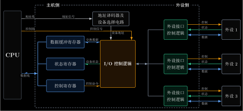

# I/O 系统

I/O 系统处理的是主机与外部设备之间的信息交换。

I/O 不会让 CPU 直接控制设备的机械部件或物理介质。CPU 面对的是 **I/O 控制器**，也叫 **I/O 接口**或**设备控制器**。控制器再去驱动具体设备。

I/O 系统包括相互配合的硬件和软件。

| 部分     | 组成                                             | 在一次 I/O 中的作用            |
| ------ | ---------------------------------------------- | ----------------------- |
| I/O 硬件 | 外部设备、I/O 控制器以及连接它们与主机的总线；采用 DMA 或通道时还包括相应的控制部件 | 真正完成设备控制、状态记录和数据传送      |
| I/O 软件 | CPU 执行的 I/O 指令；采用通道时还包括通道程序中的通道指令              | 说明操作哪个设备、执行什么操作以及数据放在哪里 |

程序查询和中断方式由 CPU 执行 I/O 指令访问控制器；DMA 方式由 DMA 控制器成块传送数据；通道方式则由通道执行通道程序，进一步减少 CPU 对具体 I/O 过程的干预。具体过程见 [[IO-Control-Methods]]。

# I/O 设备分类

I/O 设备是计算机与外部环境交换数据或保存数据的硬件。

按功能分：

| 类型 | 作用 | 例子 |
| --- | --- | --- |
| 输入设备 | 把外部信息送入计算机 | 键盘、鼠标、扫描仪 |
| 输出设备 | 把计算机信息送到外部 | 显示器、打印机 |
| 存储设备 | 长期保存数据，可读可写 | 磁盘、SSD、U 盘 |
| 通信设备 | 与其他系统交换数据 | 网卡、调制解调器 |

按信息交换单位分：

| 类型 | 基本单位 | 特点 |
| --- | --- | --- |
| 字符设备 | 字符或字节 | 传输速率通常较低，不按块随机寻址，常配合中断驱动 |
| 块设备 | 数据块 | 可寻址，可随机读写某一块，传输速率较高，常配合 DMA |

# I/O 控制器（I/O 接口）

I/O 控制器是 CPU 与设备之间的电子部件。它一侧连接系统总线，另一侧连接一个或多个设备。

从主机一侧看，控制器通过数据线、地址线和控制线与 CPU、主存相连。这一侧也称**内部接口**，它接入的是系统内部的并行总线环境。

从设备一侧看，控制器通过外部接口连接具体设备。外部设备不一定按主机总线的格式工作，数据可能是串行传输，也可能有设备自己的控制时序。因此 I/O 控制器常要完成串并转换、格式转换和速度匹配。

控制器的核心功能：

| 功能          | 说明                                               |
| ----------- | ------------------------------------------------ |
| 地址译码与设备选择   | 译码 CPU 送来的端口地址或设备号，选中本次要访问的寄存器和设备                |
| 通信联络与时序协调   | 在主机与设备之间交换就绪、应答等联络信号，按双方的工作节拍组织一次传送              |
| 数据缓冲        | 用数据寄存器暂存输入或输出数据，缓和主机与设备的速度差异                     |
| 信号格式转换      | 在主机和设备使用的不同信号形式之间转换，例如串并转换、电平转换或编码转换             |
| 控制命令与状态信息传递 | 把 CPU 命令转成设备控制信号，并把设备的忙、就绪、出错等状态送回 CPU；需要时提出中断请求 |

同一种 I/O 控制器可以从不同角度分类：

- **按数据传输方式**：分为并行接口和串行接口，区别在于多位数据是同时传送，还是逐位传送。
- **按 I/O 控制方式**：分为程序直接控制接口、中断接口和 DMA 接口。程序直接控制接口又有无条件传送接口和条件传送接口；区别在于 CPU 是否要查询设备状态，以及数据由 CPU 还是 DMA 控制器搬运。
- **按功能选择的灵活性**：分为可编程接口和不可编程接口，前者可由 CPU 通过控制寄存器设置工作方式，后者的功能和时序由硬件固定。

# I/O 端口与编址

 I/O 端口是 I/O 控制器里能被 CPU 读写的寄存器。

控制器通常包含三类寄存器：

| 寄存器   | CPU 如何使用  |
| ----- | --------- |
| 数据寄存器 | CPU 读或写数据 |
| 状态寄存器 | CPU 读设备状态 |
| 控制寄存器 | CPU 写控制命令 |

一次典型输入过程：

1. 设备把输入数据送入控制器的数据寄存器。
2. 控制器修改状态寄存器，例如置为“就绪”。
3. CPU 通过查询或中断得知数据可取。
4. CPU 从数据寄存器读出数据。
5. 数据先进入 CPU 寄存器，再由 CPU 写入主存。

输出过程方向相反：CPU 把数据写入控制器的数据寄存器，再由控制器驱动设备完成输出。

CPU 必须能定位 I/O 端口。常见方式有两类：**统一编址**和**独立编址**。

| 编址方式 | 地址                 | CPU 如何访问       | 优点                                          | 代价                                                        |
| ---- | ------------------ | -------------- | ------------------------------------------- | --------------------------------------------------------- |
| 统一编址 | I/O 端口与内存共用相同的地址总线 | 用普通访存指令访问端口    | 无需专门的I/O指令，编程灵活                             | 占用主存地址空间，访存时硬件需要区分普通存储单元和 I/O 端口，所需地址线多，译码电路复杂            |
| 独立编址 | I/O 端口有独立地址总线      | 用专门 I/O 指令访问端口 | 不占用主存地址空间，所需地址线少，译码电路简单；使用专门的 I/O 指令让程序可读性好 | I/O 指令功能有限，仅支持简单的数据传输，编程不灵活；CPU 需要提供存储器读/写和 I/O 读写两组控制信号。 |

# I/O 指令与通道指令

**I/O 指令**是 CPU 指令系统的一部分，用来让 CPU 对 I/O 控制器或通道发出命令。它通常需要表达两类信息：

- 对哪个控制器、设备或端口操作；
- 做什么操作，例如读、写、启动、查询状态。

在有通道的系统中，CPU 不再逐项管理大量设备操作，而是执行 I/O 指令启动通道。通道再执行主存中的**通道程序**。通道程序由一串**通道指令**组成，描述要访问哪些设备、传多少数据、数据放在主存哪里、传输方向是什么。

CPU 指令和通道指令的区别：

| 对比项 | I/O 指令 | 通道指令 |
| --- | --- | --- |
| 执行者 | CPU | 通道 |
| 作用 | 启动控制器或通道，发出 I/O 命令 | 由通道执行，控制一组具体 I/O 操作 |
| 所在位置 | 指令流中 | 通道程序中，通常预先放在主存 |
| 目标 | 减少 CPU 对 I/O 的直接管理 | 进一步让通道代替 CPU 管理多个控制器和设备 |
