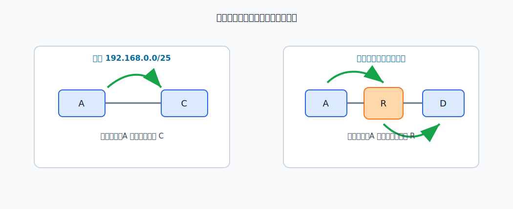
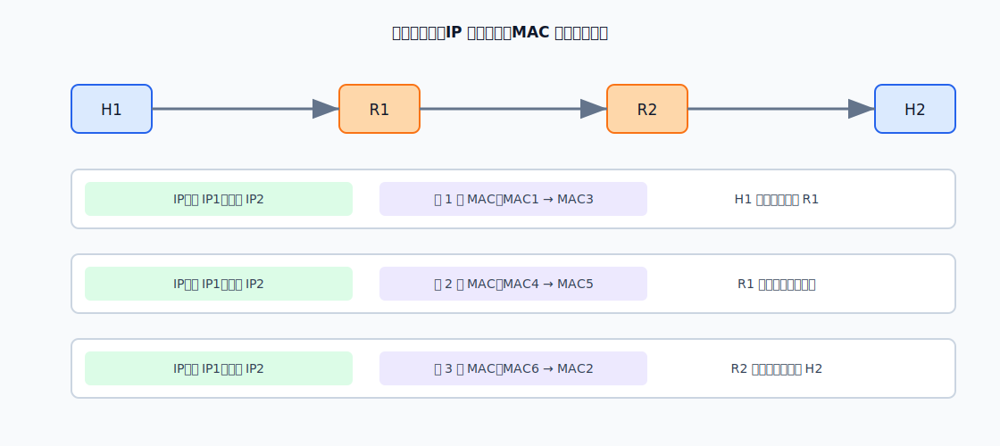

# IP 转发

IP 转发解决的是一个很具体的问题：设备拿到一个 IP 数据报后，下一跳应该发到哪里。主机发送前要判断目的主机是否在本网络；路由器收到数据报后要查路由表，决定输出接口和下一跳。

# 直接交付与间接交付

若目的 IP 与源主机在同一网络，主机直接把数据报封装成链路层帧发给目的主机，这叫**直接交付**。判断方法是：源主机用自己的子网掩码分别与源 IP、目的 IP 相与，若得到相同网络地址，就认为目的主机在本网络。

若目的 IP 不在本网络，主机不能直接把帧发给目的主机，而是先发给默认网关或下一跳路由器，这叫**间接交付**。后续由路由器继续逐跳转发。

> [!warning] 广播不被路由器转发
> 广播 IP 数据报只在本网络内有效，路由器不会把它转发到其他网络。

主机侧判断的是“目的主机是否在本网络”。若不在本网络，主机只需要把数据报交给默认网关，不需要知道完整路径。

路由器侧判断的是“目的网络应从哪个接口转发”。路由器收到一个首部正确、TTL 还未耗尽的 IP 数据报后，才查路由表并选择下一跳。

# 路由表项

路由器根据路由表转发 IP 数据报。典型路由表项包含：

| 字段 | 含义 |
|---|---|
| 目的网络 | 本路由项覆盖的目标地址范围 |
| 地址掩码或前缀长度 | 用于判断目的 IP 是否属于该范围 |
| 下一跳 | 下一台路由器的 IP 地址；直连网络可为空或指向本接口 |
| 转发接口 | 数据报应从哪个接口发出 |

常见路由项包括：

- **直连路由**：路由器接口配置 IP 地址和掩码后自动得到。
- **非直连路由**：到非直连网络，需要指定下一跳。
- **默认路由**：`0.0.0.0/0`，用于没有更具体匹配项时。
- **特定主机路由**：`/32`，只匹配某一个主机，匹配优先级很高。

静态配置默认路由和特定主机路由时要特别注意下一跳是否可达、是否会形成环路。默认路由可以显著减少路由表项，但配置错误时也会把大量未知目的地址送向错误方向。

# 最长前缀匹配

路由表中可能有多条路由都匹配同一个目的 IP。此时选择前缀最长的路由，因为它表示的地址范围最小、最具体。

[html-card height=620](../assets/longest-prefix-match-slides.html)

默认路由 `/0` 能匹配所有地址，但只有在没有更具体路由时才使用。

# IP 地址和 MAC 地址的变化

跨网络转发时，IP 数据报的源 IP 和目的 IP 是主机到主机语义，通常在整个路径中保持不变。

每经过一段链路，链路层帧都要重新封装，因此源 MAC 和目的 MAC 会逐跳变化。

这也解释了为什么不能只用 MAC 地址完成互联网通信。MAC 地址只适合在一段链路或局域网内寻址；互联网规模太大，路由器需要按网络前缀聚合路由，不能为全世界每个接口维护一条 MAC 级路由。

# 转发动作

[html-card height=620](../assets/ip-forwarding-actions-slides.html)

路由器收到 IP 数据报后，典型处理顺序是：

1. 检查首部是否正确，TTL 是否还有效。
2. TTL 减 1，并重新计算 IPv4 首部检验和。
3. 用目的 IP 查路由表，按最长前缀匹配选择路由项。
4. 确定输出接口和下一跳 IP。
5. 通过 [[ARP]] 等机制获得下一跳 MAC 地址。
6. 重新封装链路层帧并发送。

若查不到匹配路由，路由器丢弃该数据报，并通常向源主机返回 [[ICMP|ICMP]] 差错报告。
