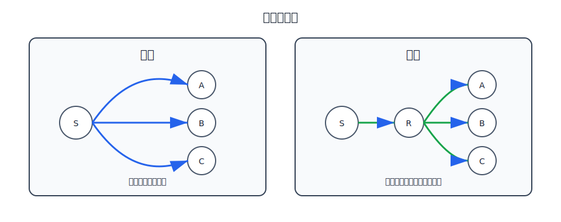
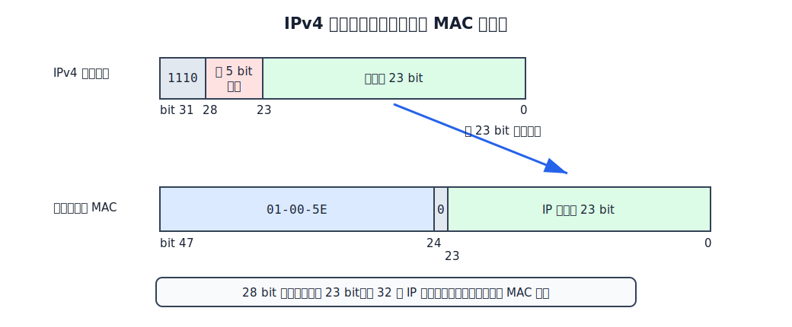
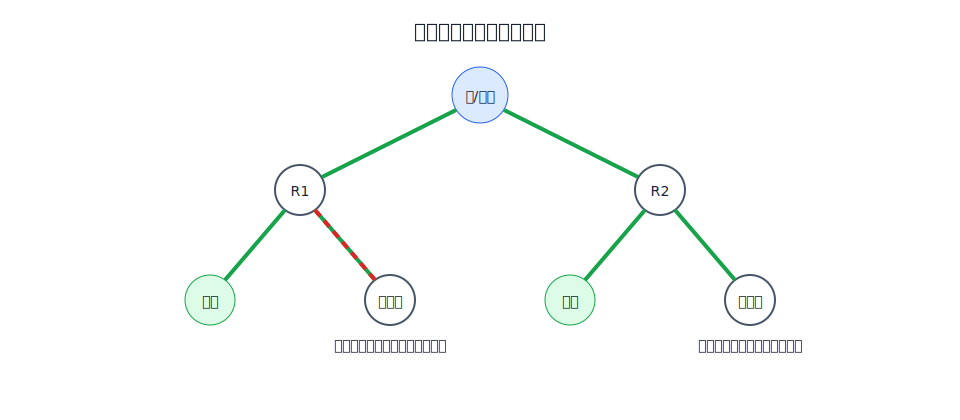

# IP 多播

多播是一对多通信。发送者只发送一份数据，网络在需要分叉的地方复制分组，把数据送给多播组成员。

与单播相比，多播能减少源主机发送副本数量，也能减少链路上的重复流量。典型场景是视频直播、会议分发、组通信等。

# 多播组和多播地址

IPv4 多播地址使用 D 类地址，即 `224.0.0.0` 到 `239.255.255.255`。多播地址只能作为目的地址，不能作为源地址。

一个 IP 多播地址标识一个多播组。使用同一个 IP 多播地址接收数据报的主机构成一个多播组。

多播组有几个特点：

- 主机可以动态加入或离开多播组。
- 一台主机可以加入多个多播组。
- 多播组成员数量和位置可以变化。
- 发送者不一定是多播组成员。

IP 多播可以发生在局域网内，也可以跨越因特网。跨网络多播需要多播路由选择；到达最后一个局域网后，通常还要依赖局域网硬件多播交付给组成员。

# 多播 MAC 映射

以太网支持多播 MAC 地址。IPv4 多播数据报在以太网上发送时，需要把 IP 多播地址映射成以太网多播 MAC 地址。

映射规则的关键是：

- 以太网多播 MAC 地址前缀为 `01-00-5E`。
- MAC 地址后 23 bit 来自 IPv4 多播地址的低 23 bit。
- IPv4 多播地址中有 28 bit 多播组号，但只有低 23 bit 参与映射。

因此，IPv4 多播地址到以太网多播 MAC 地址的映射不是一一对应。32($2^{5}$, 即低23位相同但被丢弃的高5位不同的情况)个 IP 多播地址映射到同一个多播 MAC 地址。

这会带来一个后果：主机网卡可能接收了某个以太网多播帧，但帧中 IP 多播地址并不是自己真正加入的多播组。主机还需要在 IP 层进行软件过滤。

# IGMP

IGMP 网际组管理协议用于让多播路由器知道自己直连网络中有哪些多播组成员。它管理的是**某个直连网络是否有某个多播组成员，不记录每个成员主机的完整名单。**

[html-card height=570](../assets/igmp-membership-slides.html)

IGMP 报文封装在 IP 数据报中，IP 首部的协议字段取值为 `2`。基本工作包括：

| 过程 | 含义 |
|---|---|
| 加入多播组 | 主机发送成员报告，报告自己要加入的 IP 多播组 |
| 成员报告抑制 | 同组其他主机听到报告后取消自己的报告 |
| 成员查询 | 多播路由器周期性查询直连网络上的组成员情况 |
| 超时删除 | 长时间没有成员报告的组从列表中删除 |
| 退出多播组 | IGMPv2 支持主机主动发送离开报文 |

同一链路上可能有多个多播路由器，但通常只需要一个查询路由器周期性发送查询。常见选举规则是 IP 地址较小的多播路由器成为查询路由器。

# 多播转发树

单播路由只需要给每个目的网络选择下一跳；多播路由要为每个多播组建立覆盖成员的转发结构。这个结构称为多播转发树。

多播转发树需要满足两个目标：

- 数据能到达所有有成员的网络。
- 尽量不要把数据发送到没有成员、也不通向成员的分支。

[html-card height=620](../assets/multicast-tree-prune-graft-slides.html)

一种思路是先形成广播转发树，再剪掉不需要的分支：

- 反向路径广播 RPB 用来避免广播分组兜圈。
- 若某叶节点路由器没有多播组成员，也没有下游成员路由器，就向上游发送剪枝报文。
- 若后来该分支又出现多播组成员，则发送嫁接报文重新加入多播转发树。

另一种思路是使用共享树。每个多播组指定一个核心路由器，成员路由器向核心发送加入报文，逐步形成以核心为根的共享树。

# 常见多播路由协议

常见多播路由选择协议包括：

| 协议 | 简要含义 |
|---|---|
| DVMRP | 距离向量多播路由选择协议 |
| MOSPF | OSPF 的多播扩展 |
| PIM-SM | 协议无关多播，稀疏方式 |
| PIM-DM | 协议无关多播，密集方式 |
| CBT | 基于核心的转发树 |

IP 多播在整个因特网范围内推广并不容易，主要部署在局部园区网络、专用网络或 VPN 中。应用层多播和内容分发系统也常用类似“树形分发”的思想。
