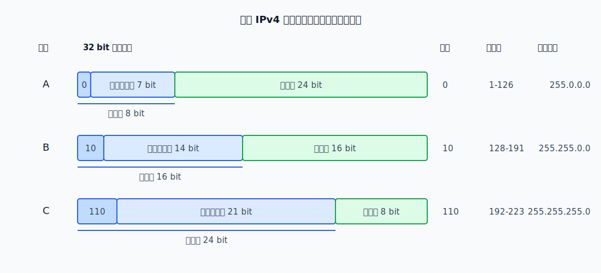
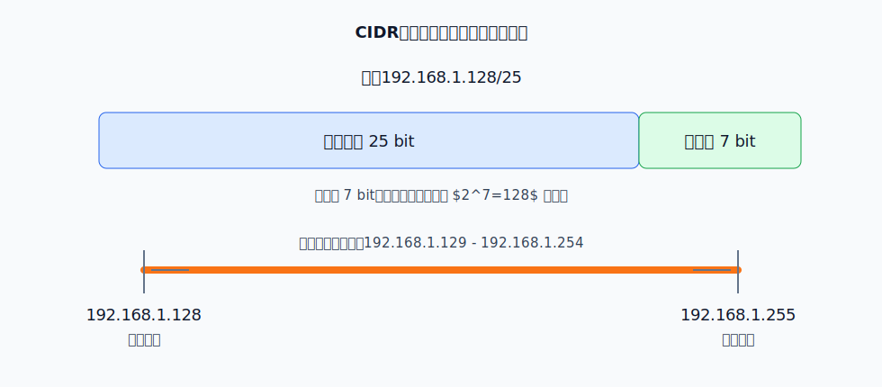
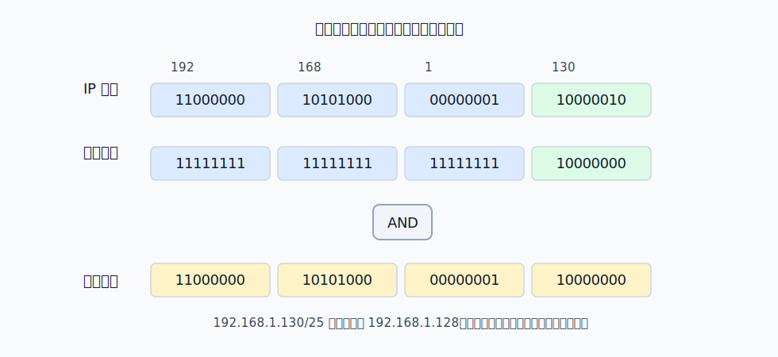
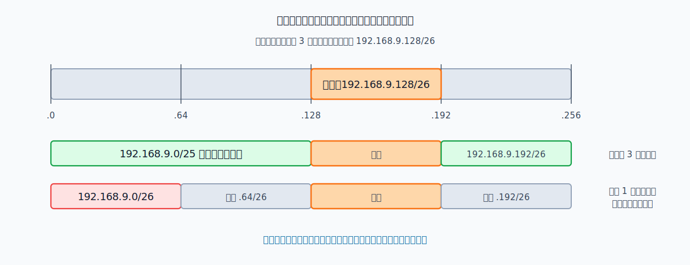
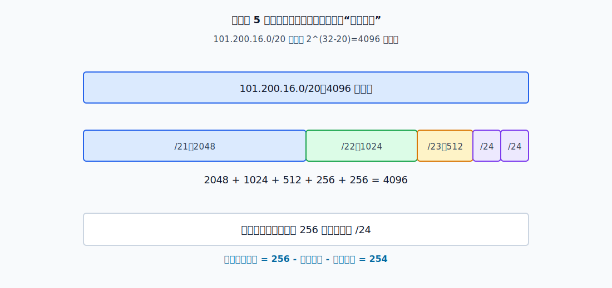
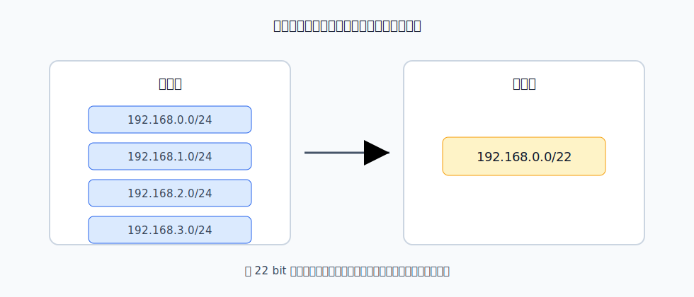

# IPv4 地址的基本含义

IPv4 地址是 32 bit 的网络层标识符，通常写成点分十进制形式，例如 `192.168.1.130`。每 8 bit 写成一个十进制数，四个十进制数之间用点分隔。

IPv4 地址不是分配给“机器整体”的，而是分配给**接口**的。普通主机通常只有一个联网接口，因此看起来像是一台主机一个 IP 地址；路由器至少有两个接口，因此一个路由器通常有多个 IP 地址。

> [!warning] 地址属于接口
> 路由器有多个接口，每个接口连接不同网络，因此每个接口需要自己的 IP 地址。说“一台路由器的 IP 地址”通常是不严谨的，应该说明是哪一个接口的 IP 地址。

IPv4 地址在逻辑上分为两部分：

- 网络前缀：标识接口所在的网络。
- 主机号：标识该网络中的具体接口。

同一网络中的接口应具有相同网络前缀，不同接口的主机号不能相同。路由器转发分组时，主要根据目的 IP 地址中的网络前缀查找下一跳，而不是为每台主机维护一条路由。

# 分类编址

早期 IPv4 使用分类编址，把地址分为 A、B、C、D、E 五类。其中 A、B、C 类可分配给主机或路由器接口；D 类用于多播；E 类保留。

判断 A/B/C 类地址时，本质上看的是**最高位二进制前缀**：

| 类别 | 最高位前缀 | 对应首字节范围 | 网络号长度 | 主机号长度 | 默认子网掩码 | 每个网络最大可分配接口数 |
|---|---|---:|---:|---:|---|---:|
| A | `0` | 1-126 | 8 bit | 24 bit | `255.0.0.0` | $2^{24}-2$ |
| B | `10` | 128-191 | 16 bit | 16 bit | `255.255.0.0` | $2^{16}-2$ |
| C | `110` | 192-223 | 24 bit | 8 bit | `255.255.255.0` | $2^8-2$ |

主机号全 0 的地址表示网络本身，不能分配给接口。主机号全 1 的地址表示该网络的广播地址，也不能分配给接口。

> [!example] 判断地址能否分配
> `192.0.0.255` 是 C 类地址，网络号是 `192.0.0`，主机号是 `255`。主机号全 1，所以它是广播地址，不能分配给主机接口。

分类编址中还有几类容易混淆的特殊地址：

| 地址形式 | 含义 |
|---|---|
| `0.0.0.0` | 本主机尚未获得正式地址时使用，也可表示默认路由的目的网络 |
| 主机号全 0 | 某个网络本身，不能分配给接口 |
| 主机号全 1 | 某个网络的广播地址，不能分配给接口 |
| `255.255.255.255` | 受限广播地址，只在本网络内广播，路由器不转发 |
| `127.0.0.0/8` | 本地环回地址，用于本机内部测试和进程通信 |

`127.0.0.1` 是最常见的环回地址。发往环回地址的 IP 数据报由本机协议栈处理，不会真正发送到网络链路上。

分类编址的问题是地址块大小过于固定。一个 C 类网络只有 254 个可分配地址，一个 B 类网络却有 65534 个可分配地址。一个需要几百个地址的单位往往不得不申请 B 类网络，造成大量地址浪费。

# CIDR

CIDR 使用斜线记法表示网络前缀长度，例如 `192.168.1.128/25`。它不再依赖 A/B/C 类边界，而是直接说明前多少 bit 是网络前缀。

斜线记法 `a.b.c.d/n` 表示前 `n` bit 是网络前缀，后 `32-n` bit 是主机号。

> [!warning] 分类地址和 CIDR 不要混用
> `218.75.230.30` 按分类编址看是 C 类地址；但 `218.75.230.30/27` 的网络前缀是 27 bit。实际使用 CIDR 时，以斜线前缀为准。

CIDR 的主要作用有两个：

- 更灵活地分配地址：地址块不再被固定在 A/B/C 类边界上，可以按需求分配 `/20`、`/27`、`/30` 等不同大小的地址块。
- 支持路由聚合：多个连续地址块可以合并成一条更短前缀的路由，减少路由表项。

CIDR 表示法`a.b.c.d/n`可以确定以下信息：

- 前缀长度 `/n`。
- 主机号长度 $32-n$。
- 地址块大小 $2^{32-n}$。
- 最小地址（网络地址）：主机号全 0。计算方法：
	1. 根据`n/8`的商与余数`x`确定网络前缀-主机号分界线位置属于哪个字节，以及IP地址在该字节处的值`y`
	2. 左侧字节保留，右侧字节全设为0，该字节值设为`y>>(8-x)<<(8-x)`。即可得到网络地址。
	3. 例：`180.80.77.55/22`。`22/8 = 2`和`22%8 = 6`可确定分界线在第三个字节处，第四字节应全设为0。该字节值设为`77>>(8-6)<<(8-6) = 76`。所以网络地址为`180.80.76.0/22`
- 最大地址（广播地址）：主机号全 1。计算方法：
	1. 计算网络地址。确定网络前缀-主机号分界线位置属于哪个字节，以及网络地址在该字节处的值`y`
	2. 左侧地址保留，右侧字节全设为255，该字节值设为`y+2^(8-x)-1`。即可得到广播地址
	3. 例：`180.80.77.55/22`。得到网络地址`180.80.76.0/22`，且分界线在第三个字节处。该字节值设为`76+2^(8-6)-1 = 79`，第四字节值设为255。所以广播地址为`180.80.79.255/22`
- 可分配主机地址：去掉最小地址和最大地址。

CIDR 地址块有两个关键性质：

- 块大小一定是 2 的幂。`/n` 地址块的大小是 $2^{32-n}$。
- 起始地址必须按块大小对齐。也就是说，在整个 IPv4 地址空间中，起始地址前面的地址数量必须是该块大小的整数倍。

例如 `/26` 地址块大小为 64，所以在同一个 `/24` 中，合法起点只能是 `.0`、`.64`、`.128`、`.192`。`192.168.1.32/26` 不是合法的 `/26` 地址块起点，因为 32 不是 64 的整数倍边界。

# 子网划分

子网划分是在已有地址块内部再切出若干更小地址块。原来的主机号中，一部分 bit 被拿来区分子网，剩余 bit 才继续作为子网内主机号。

划分子网后，IPv4 地址可以看成三级结构：

| 部分 | 作用 |
|---|---|
| 网络号 | 标识原来的网络 |
| 子网号 | 标识内部划分出的子网 |
| 主机号 | 标识该子网中的接口 |

子网掩码用连续的 1 对应网络号和子网号，用连续的 0 对应主机号。IP 地址与子网掩码逐位与运算，就得到网络地址。

若原主机号长度为 $h$，借出 $s$ bit 作为子网号，则：

$$
\text{子网数量}=2^s
$$

$$
\text{每个子网地址数}=2^{h-s}
$$

$$
\text{每个子网可分配接口数}=2^{h-s}-2
$$

减 2 是因为每个子网中主机号全 0 的地址作为该子网的网络地址，主机号全 1 的地址作为该子网的广播地址。

> [!warning] 网络地址和广播地址不能分配
> 一个地址块中最小地址通常是网络地址，最大地址通常是广播地址。计算“可分配主机数”时要减 2；计算“地址块大小”时不要减 2。

[html-card height=650](../assets/subnetting-calculation-slides.html)

如果每个子网大小相同，只要确定借位数即可。如果每个子网大小不同，就要使用**变长子网掩码**：先分配较大的子网，再分配较小的子网，避免地址空间被切碎。

当不同网络需要不同数量的地址时，应使用变长子网掩码。基本步骤是：

1. 统计每个网络需要的地址数，包括主机接口、路由器接口、网络地址和广播地址。
2. 对每个需求向上取到最近的 2 的幂。
3. 由地址块大小反推出主机号位数。
4. 由主机号位数得到前缀长度。
5. 通常先分配需求最大的网络，再分配较小网络，减少碎片。

例如某网络需要 28 个地址。最近的 2 的幂是 32，所以主机号需要 5 bit，前缀长度是 $32-5=27$，应分配一个 `/27` 地址块。

## 子网划分的判断

1. 每个候选子网本身是否合法：块大小必须是 2 的幂，起始地址必须按块大小对齐。
2. 候选子网之间能不能共存：子网之间不能重叠，也不能互相包含。
3. 子网数量和剩余空间是否匹配：如果题目限定划分为 $k$ 个子网，那么已知子网和候选子网占用名额后，剩余空间也必须能由剩余名额表示成合法 CIDR 块。

上图对应第一类问题：已知其中一个子网，判断候选子网是否可能成为另一个子网。

`192.168.9.0/26` 会与 `192.168.9.128/26` 隔开，中间留下 `192.168.9.64/26`。若它也作为一个子网，则已知子网和候选子网已经占去两个子网名额，只剩一个子网名额；剩余地址空间却分成两段不连续区域，不能合成一个合法 CIDR 子网，因此它不可能是另外两个子网之一。`192.168.9.0/25`、`192.168.9.192/26`、`192.168.9.192/27` 都可以和已知子网共存于一种合法划分中。

上图对应第二类问题：已知原地址块和子网数量，判断可能的最小子网规模。

若把 `101.200.16.0/20` 划分为 5 个子网，原地址块大小是 $2^{12}=4096$。要让 5 个子网都存在，最小子网不能太大：

- 若最小子网是 `/23`，大小为 512，则可以用 `2048 + 1024 + 512 + 256 + 256 = 4096` 切成 5 个子网。
- 若最小子网是 `/22`，大小为 1024，则 5 个子网至少需要 $5 \times 1024=5120$ 个地址，超过原来的 `/20`。

所以可能的最小子网大小是 256 个地址，可分配地址数是 $256-2=254$。

# 路由聚合

路由聚合是把多个连续地址块合并成一条更短前缀的路由。它能减少路由表项数量，提高查表和路由传播效率。

例如以下四个连续地址块：

- `192.168.0.0/24`
- `192.168.1.0/24`
- `192.168.2.0/24`
- `192.168.3.0/24`

它们可以聚合为：

- `192.168.0.0/22`

聚合成立需要两个条件：地址块连续，并且它们共享一个更短的共同前缀。不能为了减少路由表项而把不连续或前缀不一致的地址块强行合并，否则会把不属于自己的目的地址也吸进来。

如果路由表中有多条路由都能匹配同一个目的地址，路由器按[[IP-Forwarding#最长前缀匹配|最长前缀匹配]]选择路由。前缀越长，表示范围越小，路由越具体。

例如目的地址 `192.168.1.130` 同时匹配：

| 路由项 | 是否匹配 | 含义 |
|---|---|---|
| `192.168.0.0/16` | 是 | 较大的聚合路由 |
| `192.168.1.0/24` | 是 | 更具体的网络 |
| `192.168.1.128/25` | 是 | 最具体的子网 |

最终选择 `192.168.1.128/25`，因为 `/25` 的前缀最长。
