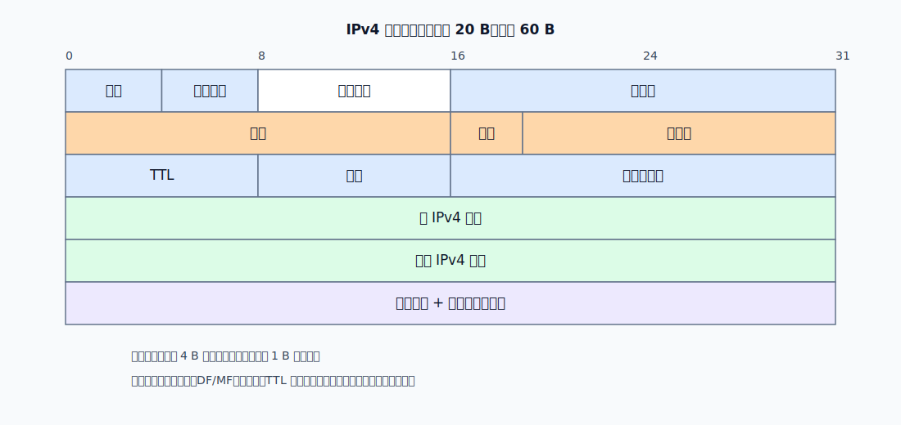
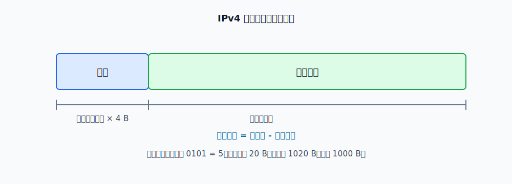

# IPv4 数据报

IPv4 数据报由首部和数据载荷组成。首部用于让路由器逐跳转发，数据载荷通常是上层协议交给 IP 的内容，例如 TCP 报文段、UDP 用户数据报或 ICMP 报文。

IPv4 首部最小 20 B，最大 60 B。首部长度可变的原因是可选字段可能存在；填充字段只用于把首部补齐到 4 B 的整数倍。

| 字段 | 长度 | 作用 |
|---|---:|---|
| 版本 | 4 bit | IPv4 中取值为 4 |
| 首部长度 | 4 bit | 以 4 B 为单位表示首部长度 |
| 区分服务 | 8 bit | 用于区分服务质量，一般场景不使用 |
| 总长度 | 16 bit | 以 1 B 为单位表示整个 IPv4 数据报长度 |
| 标识 | 16 bit | 同一个原始数据报的所有分片具有相同标识 |
| 标志 | 3 bit | 包含 DF 和 MF 等分片控制位 |
| 片偏移 | 13 bit | 表示本片数据在原始载荷中的位置，以 8 B 为单位 |
| TTL | 8 bit | 生存时间，防止分组在路由环路中无限转发 |
| 协议 | 8 bit | 指明载荷应交给哪个上层协议 |
| 首部检验和 | 16 bit | 只检验 IPv4 首部 |
| 源地址 | 32 bit | 发送方 IPv4 地址 |
| 目的地址 | 32 bit | 接收方 IPv4 地址 |

# 长度计算

首部长度字段和总长度字段的单位不同，这是最容易算错的地方。

$$
\text{首部长度}= \text{首部长度字段值} \times 4\text{B}
$$

$$
\text{载荷长度}= \text{总长度字段值}-\text{首部长度}
$$

例如首部长度字段为 `0101`，即十进制 5，则首部长度为 $5 \times 4=20\text{B}$。若总长度字段表示 1020 B，则载荷长度为 $1020-20=1000\text{B}$。

# 分片

每段链路都有自己的最大传输单元 MTU。若 IPv4 数据报长度超过下一段链路的 MTU，且 DF 位允许分片（`DF=0`），路由器可以把一个 IPv4 数据报切成多个较小的分片。

[html-card height=620](../assets/ipv4-fragmentation-slides.html)

分片对应的三个字段：

- **标识**：同一个原始数据报切出的各个分片使用相同标识。
- **MF**：More Fragment。`MF=1` 表示后面还有分片；最后一个分片 `MF=0`。
- **片偏移**：表示本分片载荷在原始载荷中的起始位置，**单位是 8 B**。

**除最后一个分片外，每个分片的数据载荷长度必须是 8 B 的整数倍**。原因是片偏移字段用 8 B 为单位记录位置，如果前面的分片载荷不是 8 B 的整数倍，后续分片的偏移就无法准确表示。

分片可以再次分片。中间路由器只负责继续转发或继续分片；重组只在目的主机进行。这样可以避免每个中间路由器都维护大量重组状态。

> [!warning] DF = 1 且数据报长度大于 MTU
> `DF=1` 表示不允许分片。若下一段链路的 MTU 装不下该数据报，路由器不能强行分片，只能丢弃，并通常通过 [[ICMP|ICMP]] 返回差错报告。

# TTL、协议字段和首部检验和

TTL 用来限制 IPv4 数据报的生存时间。每经过一个路由器，TTL 至少减 1；若减到 0，路由器丢弃该数据报，并通常向源主机发送 [[ICMP|ICMP]] 时间超过报文。TTL 的核心作用是防止路由环路导致分组无限循环。

协议字段告诉目的主机的 IP 层把载荷交给谁处理。常见取值包括 ICMP、TCP、UDP 等。

首部检验和只覆盖 IPv4 首部，不覆盖数据载荷。由于 TTL 每跳都会变化，所以每个路由器转发前都需要重新计算首部检验和。IPv6 删除了首部检验和字段，以减少路由器逐跳处理开销。

# 易混点

- **首部长度字段**以 4 B 为单位，**总长度字段**以 1 B 为单位。
- 分片时，标识用于说明“这些分片来自同一个原始数据报”，MF 用于说明“后面是否还有分片”，片偏移用于说明“本片载荷在原始载荷中的位置”。
- 片偏移以 8 B 为单位，所以除最后一个分片外，前面各分片的载荷长度必须是 8 B 的整数倍。
- TTL 每经过路由器至少减 1，因此 IPv4 首部检验和也要逐跳重新计算。
