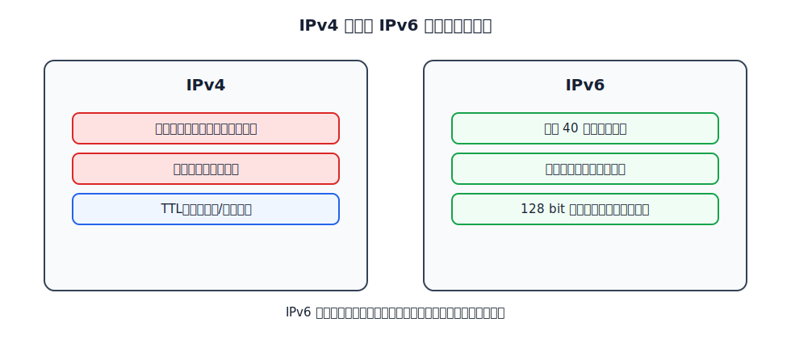
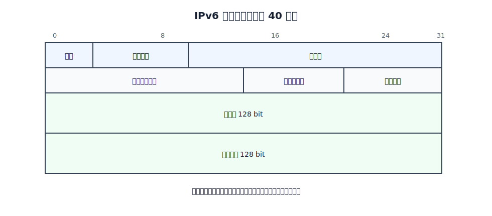
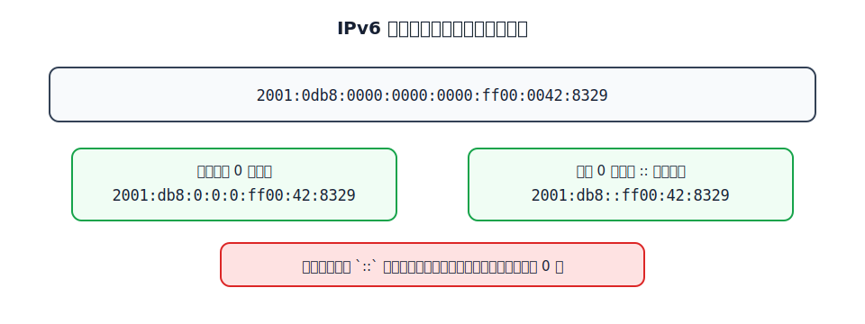
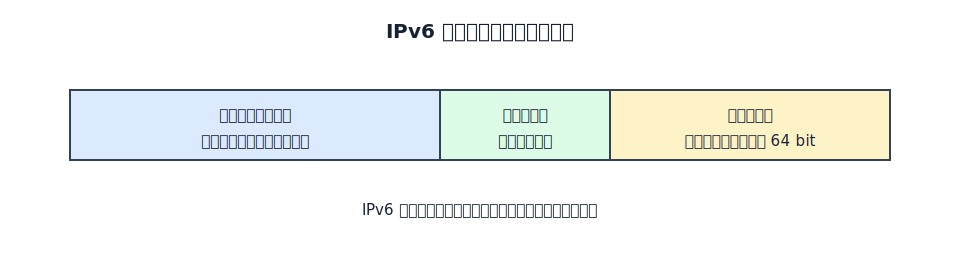

# IPv6

IPv6 引入的根本原因是 IPv4 地址空间不足。IPv4 地址只有 32 bit，地址总量和分配方式都无法长期支撑因特网规模增长。IPv6 把地址长度扩展到 128 bit，同时调整首部结构、扩展首部、地址类型和控制协议。

IPv6 仍提供无连接、尽最大努力交付的不可靠数据报服务。它不是把 IP 变成可靠协议，而是在地址空间和转发机制上做了新设计。

# 主要变化

IPv6 的主要变化包括：

- 地址长度从 32 bit 增加到 128 bit。
- 基本首部固定为 40 字节。
- 取消 IPv4 首部中的首部长度、首部检验和、标识、标志、片偏移等字段。
- 使用扩展首部承载选项和分片等功能。
- 使用“下一个首部”字段串联扩展首部或上层协议。
- 引入流标号，便于标识同一类需要特殊处理的数据报序列。
- 不使用广播，把广播看作多播的特殊情形。
- 不使用 ARP，邻站发现由 ICMPv6 完成。



# 基本首部

IPv6 基本首部固定 40 字节。



IPv6 基本首部字段如下：

| 字段 | 长度 | 作用 |
|---|---:|---|
| 版本 | 4 bit | IPv6 中取值为 6 |
| 通信量类 | 8 bit | 区分不同类型或优先级的数据报 |
| 流标号 | 20 bit | 标识同一流中的 IPv6 数据报 |
| 有效载荷长度 | 16 bit | 指明基本首部之后的有效载荷长度 |
| 下一个首部 | 8 bit | 指明后面是扩展首部还是上层协议数据 |
| 跳数限制 | 8 bit | 类似 IPv4 的 TTL，每经过一个路由器减 1 |
| 源地址 | 128 bit | 发送端 IPv6 地址 |
| 目的地址 | 128 bit | 接收端 IPv6 地址 |

IPv6 取消首部检验和的目的之一是减少路由器逐跳处理开销。IPv4 路由器每次修改 TTL 后都要重新计算首部检验和；IPv6 路由器转发时不再做这项工作。

# 扩展首部

IPv6 把可选功能从基本首部中移出，放到扩展首部中。基本首部的“下一个首部”字段指向第一个扩展首部；每个扩展首部也有自己的“下一个首部”字段，直到最后指向 TCP、UDP、ICMPv6 等上层协议。

常见扩展首部包括：

| 扩展首部 | 作用 |
|---|---|
| 逐跳选项 | 需要路径上每个路由器检查的选项 |
| 路由选择 | 指定数据报经过的部分路径 |
| 分片 | 承载分片相关信息 |
| 鉴别 | 提供认证相关功能 |
| 封装安全有效载荷 | 提供加密和完整性保护 |
| 目的站选项 | 只需目的站检查的选项 |

分片字段不再出现在基本首部中。IPv6 中通常由源主机执行分片，路由器不负责像 IPv4 那样在转发途中分片。

# 地址表示

IPv6 地址用冒号十六进制记法表示。128 bit 地址分成 8 组，每组 16 bit，用 4 个十六进制数表示。



书写时有两条常用压缩规则：

- 每一组中的前导 0 可以省略。
- 连续的一段全 0 组可以用 `::` 压缩，但一个地址中 `::` 只能出现一次。

例如：

```text
2001:0db8:0000:0000:0000:ff00:0042:8329
2001:db8:0:0:0:ff00:42:8329
2001:db8::ff00:42:8329
```

IPv6 仍可使用类似 CIDR 的前缀长度写法，例如 `2001:db8:1234::/48`。

# 地址类型

IPv6 数据报的目的地址有三种基本类型：

| 类型 | 含义 |
|---|---|
| 单播 | 发给一个接口 |
| 多播 | 发给一组接口中的每一个 |
| 任播 | 发给一组接口中按路由意义最近的一个 |

IPv6 不再使用广播地址。需要“一对多”发送时使用多播。

常见 IPv6 地址类型：

| 地址 | 含义 |
|---|---|
| `::` | 未指明地址，只能在特定场景作为源地址使用 |
| `::1` | 环回地址 |
| `FF00::/8` | 多播地址 |
| `FE80::/10` | 本地链路单播地址，只在同一链路内有效 |
| 其他全球单播地址 | 可在全球范围路由的单播地址 |

IPv6 地址分配给接口。一个主机或路由器可以有多个接口，因此可以有多个 IPv6 地址。

# 全球单播地址

IPv6 全球单播地址采用层次结构，便于路由聚合和查找。



三级结构通常可以理解为：

- 全球路由选择前缀：由上级机构分配，用于全球路由。
- 子网标识符：机构内部划分子网。
- 接口标识符：标识具体网络接口，常为 64 bit。

# ICMPv6

ICMPv6 是 IPv6 的重要配套协议。它不仅承担 IPv4 中 ICMP 的差错报告和诊断功能，还合并了 ARP 和 IGMP 的部分功能。

ICMPv6 可用于：

- 差错报告。
- 回送请求和回答。
- 邻站发现。
- 多播听众发现。

IPv6 不使用 ARP。邻站询问和邻站通告用于替代 IPv4 中 ARP 的地址解析功能。多播听众发现用于替代 IGMP 的多播组成员管理功能。

# IPv4 到 IPv6 过渡

因特网不能一次性从 IPv4 切换到 IPv6，只能逐步过渡。常见策略是双协议栈和隧道技术。

[html-card height=570](../assets/ipv6-transition-slides.html)

**双协议栈**指主机或路由器同时支持 IPv4 和 IPv6。与 IPv4 主机通信时使用 IPv4 地址；与 IPv6 主机通信时使用 IPv6 地址。双协议栈主机可以根据 DNS 返回的地址类型选择使用哪套协议。

**隧道技术**用于让 IPv6 数据报穿过 IPv4 网络。隧道入口把整个 IPv6 数据报封装到 IPv4 数据报的数据部分中；IPv4 网络只负责转发外层 IPv4 数据报；隧道出口再取出原 IPv6 数据报继续转发。为了标明 IPv4 数据部分承载的是 IPv6 数据报，IPv4 首部协议字段可设置为 41。
