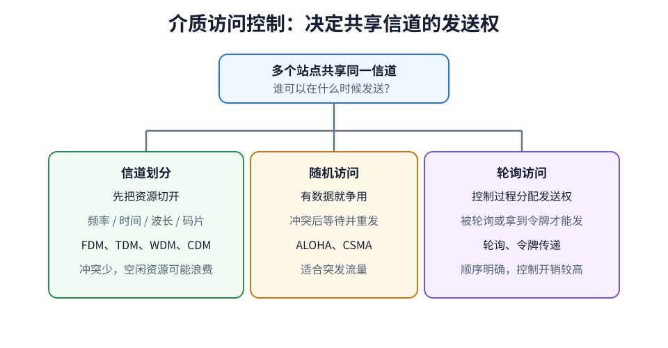
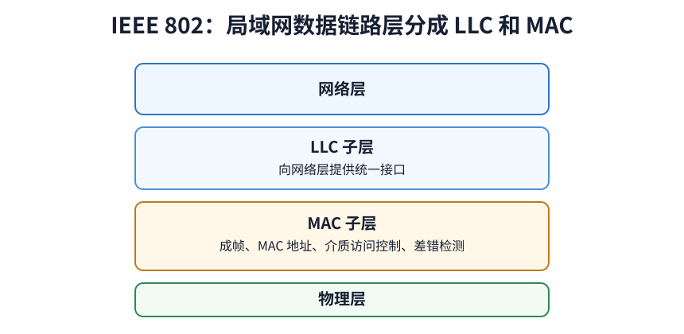

# 局域网 LAN

局域网 LAN（Local Area Network）是由同一组织在有限范围内建设和管理的网络，例如家庭、办公楼或园区网络。有线局域网通常采用[[Ethernet|以太网]]，无线局域网通常采用 [[WLAN|IEEE 802.11]]。

# 决定局域网工作方式的三个要素

| 要素 | 决定什么 | 常见形式 |
|---|---|---|
| 网络拓扑 | 设备怎样连接，帧经过哪些设备，局部故障会影响多大范围 | 总线形、星形、环形 |
| 传输介质 | 可传距离、速率、抗干扰能力和布线成本 | 双绞线、光纤、无线信道 |
| 介质访问方法 | 多个站点使用同一信道时，发送权怎样分配 | CSMA/CD、CSMA/CA、令牌传递、信道划分 |

# 典型局域网类型

局域网可以按介质分成有线 LAN 和无线 LAN，也可以按具体技术标准区分。

| 局域网技术      | 标准                    | 典型拓扑与介质                 | 介质访问方法                            | 现状                           |
| ---------- | --------------------- | ----------------------- | --------------------------------- | ---------------------------- |
| Ethernet   | IEEE 802.3            | 早期使用同轴电缆总线，后来改用双绞线或光纤星形 | 共享式半双工网络使用 CSMA/CD；交换式全双工网络不再争用介质 | 目前最主要的有线 LAN                 |
| Token Ring | IEEE 802.5            | 物理上常为星形布线，逻辑上为环形        | 令牌传递                              | 已基本退出实际部署，但常用于理解受控访问         |
| FDDI       | ANSI 标准，后来形成 ISO 9314 | 双光纤环，通常由主环和备用环组成        | 令牌传递                              | 曾用于 100 Mb/s 园区骨干，现已被高速以太网取代 |
| WLAN       | IEEE 802.11           | 无线信道；基础结构模式以 AP 组织 BSS  | CSMA/CA                           | 常见的无线 LAN                    |

**物理拓扑**描述设备和线路怎样连接，**逻辑拓扑**描述数据怎样在这些连接上流动。两者可能不同。

| 结构 | 帧怎样传播 | 主要特点 | 典型实例 |
|---|---|---|---|
| 总线形 | 信号沿共享干线传播，所有站点都能收到 | 同时发送会碰撞；干线故障可能影响整体 | 早期同轴电缆以太网 |
| 集线器星形 | 集线器把一个端口收到的比特复制到其他端口 | 物理上是星形，逻辑上仍是共享总线；所有端口属于同一碰撞域 | 早期双绞线以太网 |
| 交换机星形 | 每个端口是一条独立链路，交换机按目的 MAC 转发帧 | 可并行传输并支持全双工；端口之间不发生共享介质碰撞 | 现代交换式以太网 |
| 环形 | 帧或令牌按固定方向逐站传递 | 访问次序可预测；需要处理断环和令牌异常 | 令牌环、FDDI |

基础结构 WLAN 在关联关系上以 AP 为中心，但无线信号仍在空间中传播，覆盖范围内的站点共享无线信道。它不能因为结构图像星形，就按交换式以太网理解。

# 局域网的介质访问控制

介质访问控制 MAC（Medium Access Control）处理的是**共享介质的发送权**。它不负责选择端到端路由，也不等同于 MAC 地址；MAC 地址用于标识接口，MAC 访问机制用于决定接口何时能发送。

局域网使用的介质访问方法可分为三类：

| 类别 | 怎样取得发送权 | 是否发生碰撞 | 适用流量 | 主要代价 |
|---|---|---|---|---|
| 信道划分 | 预先把频率、时间或码字分给各站点 | 通常不会 | 站点数量和速率较稳定的连续业务 | 站点空闲时，其固定资源可能被浪费 |
| 随机访问 | 站点有帧就按协议竞争信道，失败后退避重试 | 可能 | 发送时刻分散、突发性强的业务 | 重载时碰撞或退避增多，等待时间不确定 |
| 受控访问 | 主站轮询，或令牌按顺序传递 | 通常不会 | 需要公平性或可预测等待时间的场景 | 轮询和令牌传递产生控制开销，还要处理主站或令牌故障 |

更具体具体见[[Media-Access-Control|介质访问控制]]。

# 共享信道与交换式链路

共享信道只有一份传输能力。若信道速率为 $R$，多个站点共享的是这一个 $R$，不是每个站点都独享 $R$。站点越多、负载越重，随机访问协议用于碰撞和退避的时间通常越多。

交换式以太网把共享信道拆成多条点对点链路。若每个端口速率为 $R$，不同端口对可以同时传输；主机与交换机之间采用全双工时，不再使用 CSMA/CD。

交换机收到帧后，根据**源 MAC**学习地址所在端口，再根据**目的 MAC**处理本帧：

| 目的 MAC 的状态 | 交换机动作 |
|---|---|
| 已知，且不在入端口 | 只向对应端口转发 |
| 已知，但就在入端口方向 | 过滤，不再转发 |
| 未知 | 向除入端口外的其他端口泛洪 |
| 广播地址 | 向同一 VLAN 内除入端口外的其他端口泛洪 |

> [!note] 交换机消除碰撞，不等于阻止广播
> 交换机把每个端口分成独立的碰撞域，但默认仍会在同一二层网络内泛洪广播帧。碰撞域和广播域不是同一个概念。

# 广播域与局域网边界

二层广播帧能到达的范围称为**广播域**。普通交换机转发广播帧，路由器不转发二层广播，因此路由器接口构成广播域边界。[[VLAN]] 还能在同一组交换机上划分多个逻辑广播域。

碰撞域、广播域、VLAN 和 IP 子网描述的不是同一件事：

| 概念 | 范围由什么决定 | 如何划分 |
|---|---|---|
| 碰撞域 | 哪些接口会因同时发送而发生碰撞 | 交换机的每个端口可划分碰撞域；全双工链路没有碰撞 |
| 广播域 | 二层广播帧能到达哪些接口 | 路由器接口或 VLAN 边界 |
| VLAN | 交换机配置出的逻辑二层网络 | VLAN ID 和端口配置 |
| IP 子网 | 哪些接口具有相同网络前缀，可直接进行 IP 交付 | IP 地址和子网掩码；不同子网之间需要路由 |

一个物理交换网络可以包含多个 VLAN。每个 VLAN 是独立的广播域，通常对应一个 IP 子网；不同 VLAN 即使接在同一台交换机上，也必须经过路由器或三层交换机才能通信。家庭 LAN 往往只有一个广播域，园区 LAN 则可以包含许多 VLAN 和 IP 子网，所以 LAN 不能简单等同于一个广播域。

这也决定了主机封装帧时应填写谁的 MAC 地址：

- 目的 IP 与本机在同一网络时，主机通过 [[ARP]] 查询目的主机的 MAC 地址，帧直接发给它。
- 目的 IP 在其他网络时，主机查询默认网关的 MAC 地址。此时帧的目的 MAC 是路由器接口，IP 数据报的目的 IP 仍是远端主机。

路由器收到帧后去掉原来的帧首部，再按下一段链路重新封装。因此 MAC 地址只在当前链路上有效，会逐跳改变。

# IEEE 802 体系

IEEE 802 标准面向局域网和城域网。在其参考结构中，OSI 数据链路层进一步分为 LLC 和 MAC 两个子层：

| 层次 | 主要规定 |
|---|---|
| LLC 子层 | 位于网络层与各种 MAC 技术之间，提供逻辑链路服务和较统一的上层接口 |
| MAC 子层 | MAC 帧格式、物理地址、介质访问、帧的发送与接收、FCS 检错 |
| 物理层 | 传输介质、信号编码、接口特性和传输速率 |

| 标准族 | 主要内容 |
|---|---|
| IEEE 802.1 | LAN 体系结构、桥接、生成树、VLAN 等 |
| IEEE 802.2 | LLC 子层 |
| IEEE 802.3 | Ethernet 的 MAC 与物理层规范 |
| IEEE 802.11 | WLAN 的 MAC 与物理层规范 |

具体 LAN 技术的差异主要落在 MAC 子层和物理层。IEEE 802.3 与 802.11 都能承载 IP 数据报，但它们的帧格式、地址字段和介质访问方式不同。LLC 位于这些 MAC 技术之上，使网络层不必针对每种 LAN 技术使用完全不同的接口。

> [!note] 分层模型不等于实际帧必然包含 LLC 首部
> 实际网络中最常见的 Ethernet II 帧使用 EtherType 直接指出上层协议，并不显式携带 IEEE 802.2 LLC 首部。LLC/MAC 划分用于理解 IEEE 802 的职责边界，不能据此认定每个以太网帧都有 LLC 首部。
