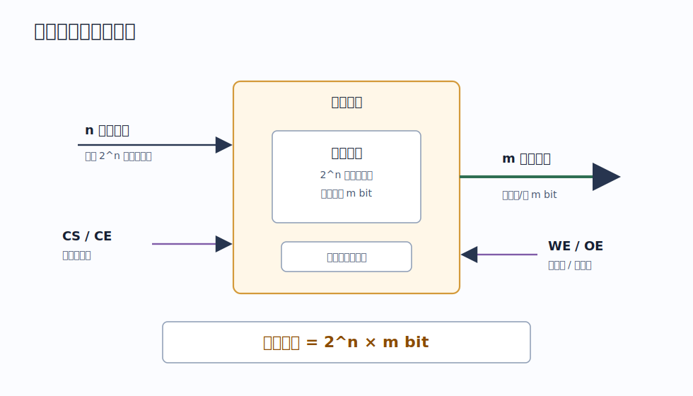
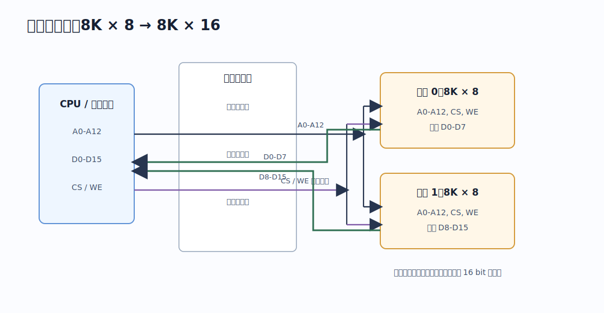
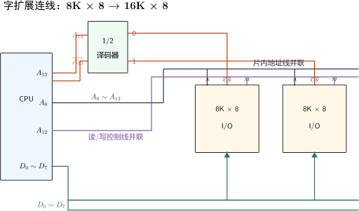
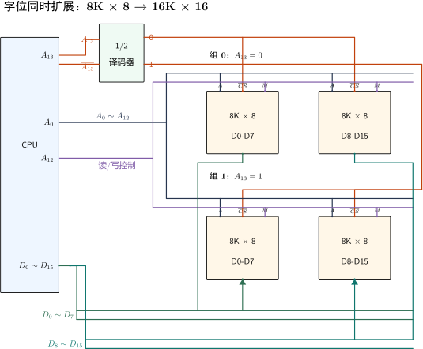
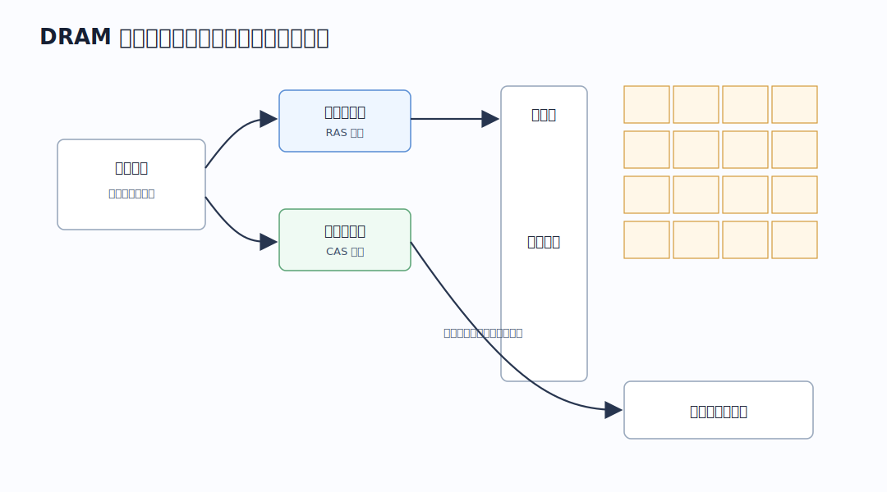
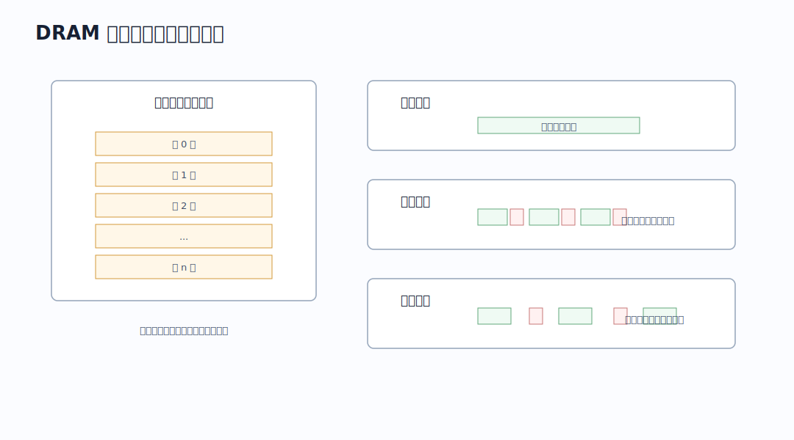
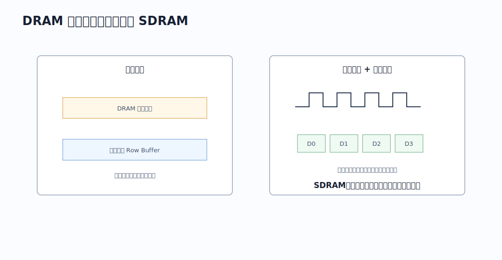
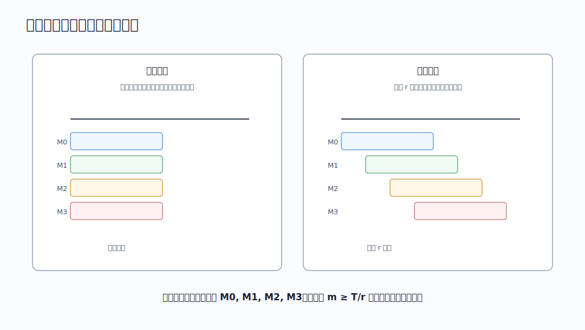

# 存储单元、编址与容量

| 概念 | 含义 |
|---|---|
| 存储元 | 存放 1 bit 信息的基本单位 |
| 存储单元 | 具有一个地址的最小可寻址单位 |
| 存储字 | 一次作为整体读写的一组二进制位 |
| 存储字长 | 一个存储字包含的二进制位数 |
| 按字节编址 | 每个地址对应 1 Byte，现代计算机最常见 |
| 按字编址 | 每个地址对应 1 个字，地址加 1 表示移动 1 个字 |

若地址有 $n$ 位，最多能表示 $2^n$ 个地址。若每个地址对应一个存储单元，则最多可寻址 $2^n$ 个存储单元。

$$
\text{存储容量} = \text{存储字数} \times \text{存储字长}
$$

# 存储芯片接口

一片存储芯片对外主要有四类信号：地址线、数据线、片选线、读写控制线。

若芯片有 $n$ 根地址线、$m$ 根数据线：

$$
\text{芯片容量} = 2^n \times m\ bit
$$

| 信号 | 作用 |
|---|---|
| 地址线 | 选择芯片内部的某个存储单元 |
| 数据线 | 传送该存储单元读出或写入的数据 |
| 片选线 `CS/CE` | 决定当前芯片是否参与本次访问 |
| 读写控制线 `WE/OE` | 决定本次访问是写还是读 |

芯片字长小于 CPU 数据总线宽度时，需要位扩展；芯片字数小于目标主存字数时，需要字扩展。

# 主存容量扩展

设已有芯片规格为：

$$
2^a \times b\ bit
$$

目标主存规格为：

$$
2^A \times B\ bit
$$

则需要：

$$
\text{每组芯片数} = \frac{B}{b}
$$

$$
\text{芯片组数} = \frac{2^A}{2^a} = 2^{A-a}
$$

$$
\text{总芯片数} = \frac{B}{b} \times 2^{A-a}
$$

## 位扩展

位扩展用于增加存储字长。多片芯片共用同一组地址线和控制线，每片负责数据总线的一部分位。

>[!example] 用 `8K × 8 bit` 芯片组成 `8K × 16 bit` 主存：
>- 地址数不变，仍为 `8K`，所以地址线并联接到两片芯片。
>- 字长从 8 bit 变 16 bit，所以需要 2 片芯片并行输出。
>- 两片芯片同时片选，同时读写。
>- 第一片接 `D0-D7`，第二片接 `D8-D15`。

## 字扩展

字扩展用于增加存储字数。低位地址线接到每片芯片，高位地址线经过译码器产生片选信号，一次只选中其中一片或一组。

>[!example] 用 `8K × 8 bit` 芯片组成 `16K × 8 bit` 主存：
>- 每片芯片内部需要 $13$ 根地址线，因为 $8K = 2^{13}$。
>- 目标主存需要 $14$ 根地址线，因为 $16K = 2^{14}$。
>- 低 13 位地址 `A0-A12` 同时接到两片芯片。最高位 `A13` 作为片选依据：`A13=0` 选第一片，`A13=1` 选第二片。
>- 两片芯片的数据线都接 `D0-D7`，但由于片选互斥，一次只有一片驱动数据总线。

## 字位同时扩展

字位同时扩展就是先用若干片组成一组更宽的存储字，再用多组扩展存储字数。

>[!example] 用 `8K × 8 bit` 芯片组成 `16K × 16 bit` 主存：
>- 字长从 8 bit 扩到 16 bit，每组需要 2 片。
>- 字数从 8K 扩到 16K，需要 2 组。
>- 总共需要 $2 \times 2 = 4$ 片。每组内部做位扩展，两组之间做字扩展。

> [!note] 
> - 位扩展：地址线并联，数据线分位，片选同时有效。
> - 字扩展：数据线并联，低位地址并联，高位地址译码片选。
> - 字位同时扩展：先分组做位扩展，再对组做字扩展。

# SRAM 与 DRAM

SRAM 和 DRAM 都是 RAM，但存储元不同，导致速度、成本、刷新、用途都不同。

| 对比项    | SRAM                 | DRAM           |
| ------ | -------------------- | -------------- |
| 存储信息   | 双稳态触发器, 有 0/1 两种稳定状态 | 电容, 是否带电表示 0/1 |
| 读出是否破坏 | 非破坏性读出               | 破坏性读出，读后需要重写   |
| 是否刷新   | 不需要                  | 需要刷新           |
| 速度     | 快                    | 较慢             |
| 集成度    | 低                    | 高              |
| 单位成本   | 高                    | 低              |
| 典型用途   | Cache                | 主存             |

SRAM 的存储状态只要不断电就能保持，因此称为“静态”。DRAM 的电容电荷会泄漏，即使不断电，也必须周期性刷新，因此称为“动态”。

## DRAM

### DRAM 阵列与地址复用

DRAM 容量大，如果用一维译码直接选择所有单元，选通线数量过多。实际通常把存储单元排成二维阵列，用行地址和列地址共同定位一个单元。

若原本需要 $n$ 位地址，DRAM 可以把地址拆成两次送入：

1. 先送行地址，锁存在行地址缓冲器中。
2. 再送列地址，锁存在列地址缓冲器中。
3. 行译码器选中一行，列译码器在该行中选中目标列。

这样做的代价是地址要分两次送；好处是芯片地址引脚更少，阵列译码结构也更适合大容量 DRAM。

### DRAM 刷新机制

| 问题     | 结论                       |
| ------ | ------------------------ |
| 多久刷新一次 | 在刷新周期内，每一行至少刷新一次；常用 2ms  |
| 每次刷新多少 | 通常按行刷新，不是一个存储元一个存储元刷新    |
| 怎样刷新   | 读出一行信息后重新写入              |
| 谁来刷新   | 由硬件刷新电路完成，通常不由 CPU 逐条控制  |

常见刷新方式：

| 刷新方式 | 做法 | 特点 |
|---|---|---|
| 集中刷新 | 在一段集中时间内刷新所有行 | 正常访存会出现较长“死区” |
| 分散刷新 | 每次正常读写后安排一次刷新 | 存取周期变长 |
| 异步刷新 | 在刷新周期内分散地产生刷新请求 | 死区较短，更均衡 |

> [!example] 刷新间隔计算
> 若 DRAM 阵列有 128 行，刷新周期为 2ms，则平均每隔 $\frac{2ms}{128} \approx 15.6\mu s$ 至少要刷新一行。

### DRAM 行缓冲与突发传输

DRAM 访问一行时，整行数据会先进入行缓冲区。若后续访问仍落在同一行，只需改变列地址即可连续读出多个相邻数据，这就是突发传输能够加速连续访问的基础。

| 机制   | 作用                   |
| ---- | -------------------- |
| 行缓冲  | 保存刚打开的一整行，后续列访问更快    |
| 突发传输 | 一次给出起始列地址，连续输出多个相邻数据 |

行缓冲的效果依赖访问局部性：如果连续访问的数据落在同一行，后续访问可以少做一次“打开行”的准备；如果频繁换行，则需要反复关闭旧行、打开新行，收益会下降。

### SDRAM

SDRAM 是 Synchronous DRAM，即同步 DRAM。

**它与系统时钟同步**。所以CPU能知道一次访存需要具体的时钟周期数。进而使得CPU不用不断轮询来获取某一时刻存储器的状态，从而可以执行其他指令，提高效率。

# 多模块存储器

根据模块间地址分配方式，多模块存储器分为高位交叉编址和低位交叉编址两种结构。

| 编址方式   | 地址分布         | 连续访问效果               |
| ------ | ------------ | -------------------- |
| 高位交叉编址 | 连续地址集中在同一模块  | 更像单纯扩容，连续访问难以并行      |
| 低位交叉编址 | 连续地址轮流落到不同模块 | 适合一次读取多个存储单元或流水式连续访问 |

## 低位交叉编址

低位交叉编址中，若有 $m$ 个模块，则地址 $x$ 所在模块通常由低位决定：

$$
\text{模块号} = x \bmod m
$$

低位交叉的两种启动方式：

| 启动方式 | 做法                      | 适用理解           |
| ---- | ----------------------- | -------------- |
| 同时启动 | 一次向多个模块发出访问请求，各模块并行准备数据 | 适合连续取一批数据，强调并行 |
| 分时启动 | 每隔一个总线传输周期 $r$ 启动下一个模块  | 适合流水线理解，强调不断流  |

### 分时启动

一次读写位数为数据总线位数。

对于为了使流水线不断流，常用条件是：

$$
m \ge \frac{T}{r}
$$

其中 $m$ 为模块数，$T$ 为每个模块的存取周期，$r$ 为总线传输周期或一个字的传输时间。

由流水线得，连续取$m$字所需时间是：

$$T+(m-1)r$$

### 同时启动

同时启动是一次向多个存储模块同时发出读写请求，让多个模块在同一个存取周期内并行工作。它适合把多个相邻地址的数据作为一批取出。

若有 $m$ 个模块，每个模块一次输出一个字，则一次同时启动最多可以得到 $m$ 个字。此时一次读写位数不再只是数据总线位数，而是：

$$
\text{一次读写位数} = m \times \text{每个模块的字长}
$$

例如 4 个低位交叉模块同时启动时，连续地址 `0, 1, 2, 3` 分别落在模块 `0, 1, 2, 3` 中，可以同时读出 4 个字，再按地址顺序送出。

> [!note] 边界未对齐会增大访问次数
> 
> 同时启动也能解释为什么内存要求数据边界对齐。若一个数据刚好落在一次同时启动能覆盖的地址范围内，那么一次启动即可取完；若数据没有按边界对齐，跨过了这一批地址的边界，要想完整读取数据，就必须再启动下一批模块，增大了访问次数。
> 
> 假设 4 个模块低位交叉，同时启动一次可取连续 4 个字。若要读取的 4 字数据从地址 `0` 开始，占用 `0, 1, 2, 3`，一次启动即可完成；若从地址 `2` 开始，占用 `2, 3, 4, 5`，则 `2, 3` 属于第一批，`4, 5` 属于下一批，需要两次启动。
> 
