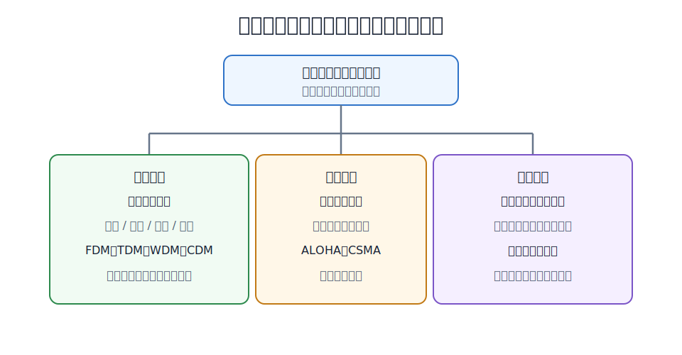
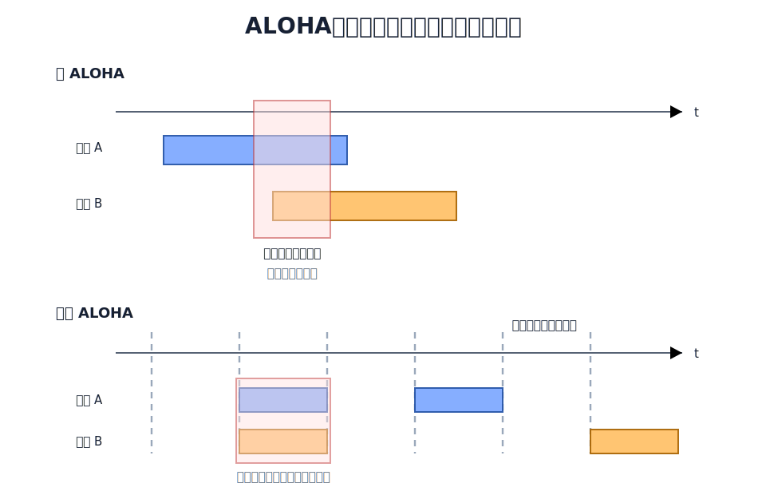
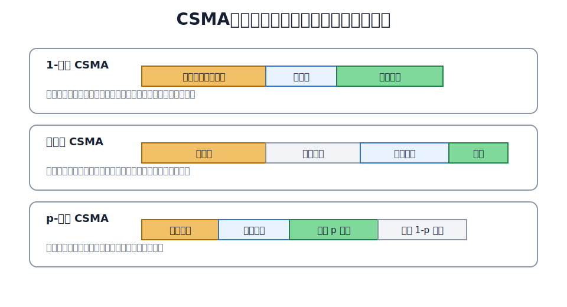
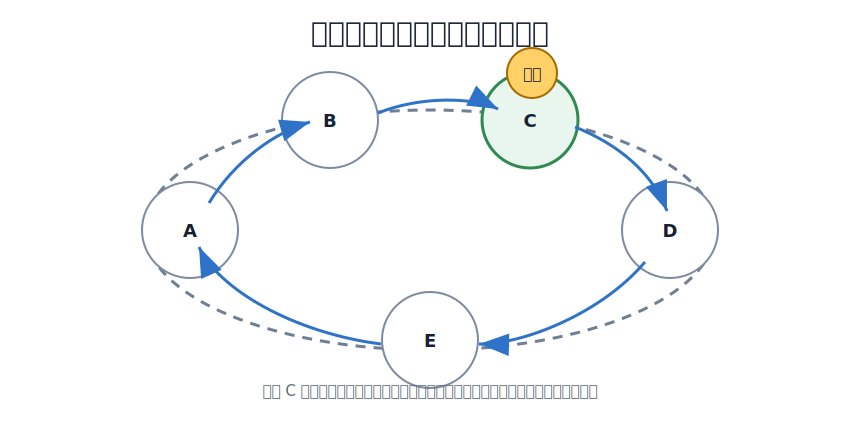

# 介质访问控制

介质访问控制 MAC 要解决的是：多个站点共享同一条广播信道时，谁可以在什么时候发送数据。

如果一条链路只连接两个节点，例如点对点链路，那么发送方和接收方明确，通常不需要复杂的 MAC 机制。若多个站点共用同一传输介质，例如早期总线以太网、无线局域网、令牌环网，就必须协调发送权，否则多个站点同时发送会产生碰撞或互相干扰。

MAC 方法可以先分成三类：

| 方法 | 核心思想 | 典型技术 | 特点 |
|---|---|---|---|
| 信道划分 | 先把信道资源切开，每个站点使用自己的资源片 | FDM、TDM、WDM、CDM/CDMA | 冲突少，但资源可能被空闲站点浪费 |
| 随机访问 | 站点有数据就争用信道，冲突后再处理 | ALOHA、CSMA、CSMA/CD、CSMA/CA | 灵活，适合突发流量，但可能发生冲突 |
| 轮询访问 | 用集中轮询或令牌传递决定发送顺序 | 轮询、令牌传递 | 发送权明确，但控制开销较高 |

# 信道划分介质访问控制

信道划分把共享信道预先分成若干互不干扰的资源片。站点只在分配给自己的资源片中发送，因此不需要每次发送前争抢信道。

- 频分复用、时分复用、统计时分复用、波分复用见 [[Multiplexing-Technologies]]。
- 码分复用和 CDMA 的正交码片计算见 [[CDMA-Code-Division-Multiplexing]]。

在数据链路层视角下，这些方法把共享信道上的发送权冲突转化成固定资源片的分配问题。

# 随机访问介质访问控制

随机访问不预先给每个站点固定分配信道资源。站点有帧要发送时，就根据协议规则尝试发送；如果发生冲突，再等待一段时间后重发。

这种方法适合突发通信：多数站点平时不发送，少数站点临时发送。它的代价是冲突不可完全避免。

## ALOHA

纯 ALOHA 的规则很简单：站点有帧就立即发送；如果没有收到确认，就认为发生碰撞或丢失，随机等待后重发。

时隙 ALOHA 把时间切成等长时隙，站点只能在时隙开始处发送。这样可以减少碰撞发生的时间范围，但仍然可能出现多个站点在同一时隙发送而碰撞。

ALOHA 的关键是碰撞后重发。它实现简单，但信道利用率不高。

## CSMA

CSMA 是 Carrier Sense Multiple Access，载波监听多址接入。它比 ALOHA 多了一步：发送前先监听信道。

若信道空闲，站点尝试发送；若信道忙，则根据坚持策略决定等待方式。

三种坚持策略的区别：

| 策略        | 信道忙时            | 信道刚变空闲时                          | 直观效果             |
| --------- | --------------- | -------------------------------- | ---------------- |
| 1-坚持 CSMA | 持续监听            | 立即发送                             | 延迟小，但多个站点可能同时抢发  |
| 非坚持 CSMA  | 随机等待一段时间后再监听    | 不一定立刻抢发                          | 冲突概率较低，但平均等待时间变长 |
| p-坚持 CSMA | 只用于时隙信道；持续监听到空闲 | 以概率 $p$ 发送，以概率 $1-p$ 推迟到下一**时隙** | 在冲突概率和等待时间之间折中   |

> [!note]
> CSMA 只能减少冲突，不能消除冲突。因为信号传播需要时间，一个站点监听到信道空闲时，远端站点发出的信号可能还没有传播过来。

## CSMA/CD 与 CSMA/CA

CSMA/CD 在 CSMA 基础上加入**碰撞检测**。站点边发送边检测信道；一旦检测到碰撞，就停止发送，发送干扰信号，然后执行退避算法。它适用于共享式有线以太网。

CSMA/CA 在 CSMA 基础上加入**碰撞避免**。无线局域网中，发送站很难边发送边检测碰撞，而且还存在隐藏站问题，因此 802.11 使用 CSMA/CA，通过 DIFS、随机退避、ACK、NAV、RTS/CTS 等机制尽量降低碰撞概率。

两者的本质区别：

| 协议 | 重点 | 适用环境 | 碰撞处理思路 |
|---|---|---|---|
| CSMA/CD | 检测碰撞 | 共享式有线以太网 | 发送中发现碰撞，立即停止并退避重发 |
| CSMA/CA | 避免碰撞 | 802.11 无线局域网 | 发送前等待和预约，发送后用 ACK 确认 |

CSMA/CD 的争用期、最小帧长和退避算法属于 [[Shared-Ethernet|共享式以太网]] 的核心内容。全双工以太网不需要 CSMA/CD。
CSMA/CA 的帧间间隔、NAV、RTS/CTS 属于 [[WLAN|无线局域网]] 的核心内容。

# 轮询访问介质访问控制

轮询访问把发送权交给一个明确的控制过程。站点不能随意发送，必须等到自己被询问或拿到令牌。

常见方式有两类：

- 轮询：主站按顺序询问各从站是否有数据要发送。被询问的站点才可以发送。
- 令牌传递：令牌是一种特殊的控制帧，本身不承载普通数据，它表示当前发送权；哪个站点持有令牌，哪个站点才可以发送数据帧。令牌在站点之间循环传递。只有持有令牌的站点可以发送数据；发送完或无数据可发时，把令牌交给下一个站点。

轮询访问的优点是不会因为多个站点同时发送而碰撞，适合需要确定性访问顺序的场景。缺点是控制开销较大，主站故障或令牌丢失会影响整个系统，需要额外的维护机制。

# 三类方法比较

信道划分、随机访问、轮询访问的差异可以概括为“发送权在哪里决定”：

| 方法 | 发送权来源 | 是否可能冲突 | 适合场景 |
|---|---|---|---|
| 信道划分 | 预先分配资源片 | 通常不会 | 用户数相对稳定、持续通信 |
| 随机访问 | 站点按协议自行争用 | 可能 | 突发通信、站点发送不均匀 |
| 轮询访问 | 主站轮询或令牌控制 | 通常不会 | 需要有序访问或确定性控制 |
