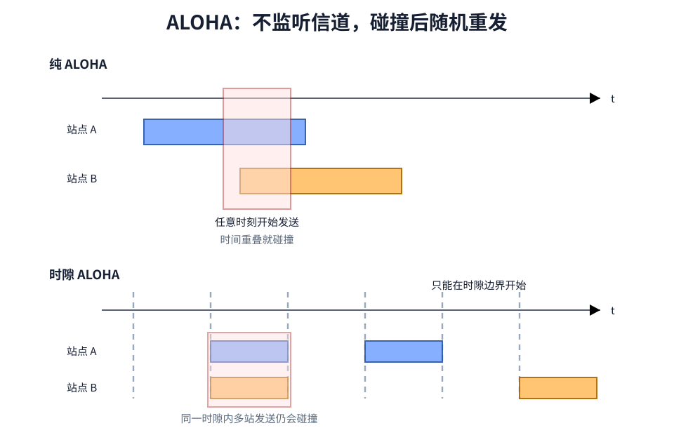
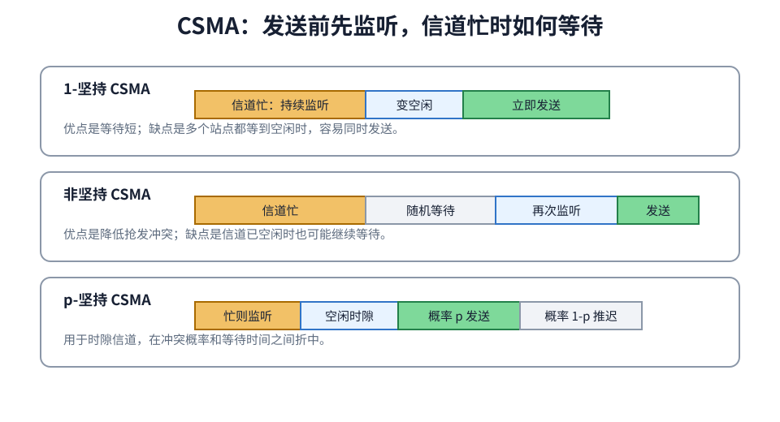
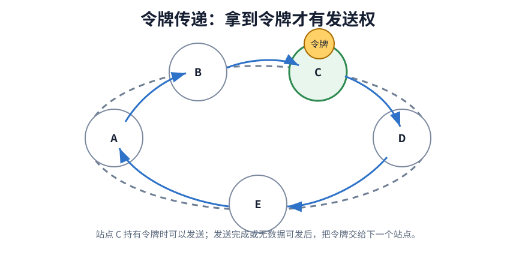

# 介质访问控制

介质访问控制 MAC 要解决的是：多个站点共享同一条广播信道时，谁可以在什么时候发送数据。

如果一条链路只连接两个节点，例如点对点链路，那么发送方和接收方明确，通常不需要复杂的 MAC 机制。若多个站点共用同一传输介质，例如早期总线以太网、无线局域网、令牌环网，就必须协调发送权，否则多个站点同时发送会产生碰撞或互相干扰。

MAC 方法可以分成三类：

| 方法 | 核心思想 | 典型技术 | 特点 |
|---|---|---|---|
| 信道划分 | 先把信道资源切开，每个站点使用自己的资源片 | FDM、TDM、WDM、CDM/CDMA | 冲突少，但资源可能被空闲站点浪费 |
| 随机访问 | 站点有数据就争用信道，冲突后再处理 | ALOHA、CSMA、CSMA/CD、CSMA/CA | 灵活，适合突发流量，但可能发生冲突 |
| 轮询访问 | 用集中轮询或令牌传递决定发送顺序 | 轮询、令牌传递 | 发送权明确，但控制开销较高 |

# 信道划分介质访问控制

信道划分把共享信道预先分成若干**互不干扰**的资源片。站点只在分配给自己的资源片中发送，因此不需要每次发送前争抢信道。

- 频分复用、时分复用、统计时分复用、波分复用见 [[Multiplexing-Technologies]]。
- 码分复用和 CDMA 的正交码片计算见 [[CDMA-Code-Division-Multiplexing]]。

这些方法把共享信道上的发送权冲突转化成固定资源片的分配问题。代价是资源分配不容易随业务量变化：某个站点暂时没有数据时，它占用的频带、时隙或码字可能闲置；其他站点即使积压了数据，也不能直接使用。固定划分还需要同步、保护间隔或码字管理等开销。因此，它适合用户数量和通信速率较稳定的连续业务，不适合大量站点偶尔突发发送的场景。

# 随机访问介质访问控制

随机访问不预先给每个站点固定分配信道资源。站点有帧要发送时，就根据协议规则尝试发送；如果发生冲突，再等待一段时间后重发。

这种方法适合突发通信：多数站点平时不发送，少数站点临时发送。它的代价是冲突不可完全避免。

## ALOHA

纯 ALOHA 的规则很简单：站点有帧就立即发送；如果没有收到确认，就认为发生碰撞或丢失，随机等待后重发。

时隙 ALOHA 把时间切成等长时隙，站点只能在时隙开始处发送。这样可以减少碰撞发生的时间范围，但仍然可能出现多个站点在同一时隙发送而碰撞。

ALOHA 的关键是碰撞后重发。它实现简单，但信道利用率不高。

## CSMA

CSMA 是 Carrier Sense Multiple Access，载波监听多址接入。它比 ALOHA 多了一步：发送前先监听信道。

若信道空闲，站点尝试发送；若信道忙，则根据坚持策略决定等待方式。

三种坚持策略的区别：

| 策略        | 信道忙时            | 信道刚变空闲时                          | 直观效果             |
| --------- | --------------- | -------------------------------- | ---------------- |
| 1-坚持 CSMA | 持续监听            | 立即发送                             | 延迟小，但多个站点可能同时抢发  |
| 非坚持 CSMA  | 随机等待一段时间后再监听    | 不一定立刻抢发                          | 冲突概率较低，但平均等待时间变长 |
| p-坚持 CSMA | 只用于时隙信道；持续监听到空闲 | 以概率 $p$ 发送，以概率 $1-p$ 推迟到下一**时隙** | 在冲突概率和等待时间之间折中   |

> [!note]
> CSMA 只能减少冲突，不能消除冲突。因为信号传播需要时间，一个站点监听到信道空闲时，远端站点发出的信号可能还没有传播过来。

## CSMA/CD 与 CSMA/CA

CSMA/CD 在 CSMA 基础上加入**碰撞检测**。站点边发送边检测信道；一旦检测到碰撞，就停止发送，发送干扰信号，然后执行退避算法。它适用于共享式有线以太网。

CSMA/CA 在 CSMA 基础上加入**碰撞避免**。无线局域网中，发送站很难边发送边检测碰撞，而且还存在隐藏站问题，因此 802.11 使用 CSMA/CA，通过 DIFS、随机退避、ACK、NAV、RTS/CTS 等机制尽量降低碰撞概率。

两者的本质区别：

| 协议 | 重点 | 适用环境 | 碰撞处理思路 |
|---|---|---|---|
| CSMA/CD | 检测碰撞 | 共享式有线以太网 | 发送中发现碰撞，立即停止并退避重发 |
| CSMA/CA | 避免碰撞 | 802.11 无线局域网 | 发送前等待和预约，发送后用 ACK 确认 |

CSMA/CD 的争用期、最小帧长和退避算法属于 [[Ethernet#共享式以太网|共享式以太网]] 。全双工以太网不需要 CSMA/CD。
CSMA/CA 的帧间间隔、NAV、RTS/CTS 属于 [[WLAN|无线局域网]] 。

# 轮询访问介质访问控制

轮询访问不让站点自行争用信道，而是明确指定下一个发送者。它包括集中式轮询和令牌传递：前者由主站分配发送权，后者由站点沿逻辑次序传递发送权。

## 集中式轮询

集中式轮询中有一个主站和若干从站。一次轮询按以下顺序进行：

1. 主站向站点 A 发送 `POLL(A)`，把发送机会交给 A。
2. A 有数据时，在规定帧数或时间额度内发送；没有数据时返回空响应，或者由主站等待到规定的响应超时。
3. A 的机会结束后，主站发送 `POLL(B)`，再依次询问其他站点。

图中 A 没有数据，但主站仍然发送了一次询问，A 也要返回空响应；这段时间没有传送业务数据。若 A 刚在自己的机会结束后产生数据，它必须等主站询问完 B、C 等其他站点，下一轮再次点到 A 时才能发送。

主站可以多给重要站点一些发送机会，但主站一旦失效，就没有设备继续发出 `POLL`，所有从站都会因为得不到许可而停发。

## 令牌传递

令牌是表示发送权的特殊控制帧。各站按固定次序传递令牌，这个次序称为逻辑环，物理线路不一定真的接成环形。

以 A、B、C 三个站点为例：令牌先到 A；A 没有数据，就立即交给 B；B 有数据，拿到令牌后发送；B 发完或用完规定的发送时间，再把令牌交给 C。任何时刻只有拿到令牌的站点能发送，因此不会发生争用碰撞。

网络繁忙时，每个站点都可能用满自己的发送时间。一个站点交出令牌后，必须等令牌绕过其他站点再回来；限制每站连续发送的时间，可以防止某个站点长期霸占信道。

如果令牌因差错丢失，所有站点都会一直等待；系统必须在超时后补发令牌。若错误地产生了两个令牌，就可能同时出现两个发送者，因此还要删除多余令牌。某个站点故障时，也必须跳过它，才能让令牌继续传递。

# 三类方法比较

| 方法   | 发送权来源     | 是否可能冲突 | 适合场景         | 优势                      |
| ---- | --------- | ------ | ------------ | ----------------------- |
| 信道划分 | 预先分配资源片   | 通常不会   | 用户数相对稳定、持续通信 | 无争用；每个站点可获得稳定、可预期的资源    |
| 随机访问 | 站点按协议自行争用 | 可能     | 突发通信、站点发送不均匀 | 无需集中调度；轻载时站点可迅速使用整个共享信道 |
| 轮询访问 | 主站轮询或令牌控制 | 通常不会   | 需要有序访问或确定性控制 | 无碰撞；各站有序取得发送权，等待时间较可预测  |
