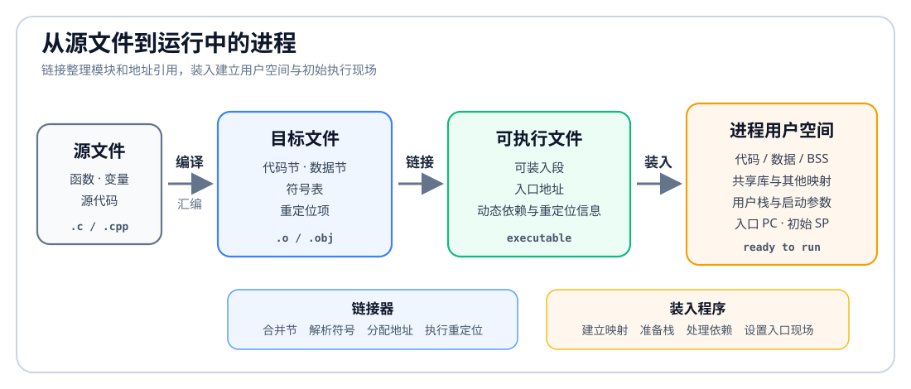

# 存储管理

多个程序如何同时装入内存？如何互不干扰？如何让程序看到一套稳定的地址空间？

存储管理主要处理五件事：

| 功能         | 要解决的问题                  |
| ---------- | ----------------------- |
| 内存空间的分配与回收 | 哪个进程占用哪段内存，进程结束后如何释放    |
| 地址转换       | 程序中的逻辑地址如何变成真正访问主存的物理地址 |
| 内存保护       | 一个进程不能越界访问其他进程或操作系统的内存  |
| 内存共享       | 多个进程如何共享同一段代码或同一份数据     |
| 内存扩充       | 物理内存不够时，如何让程序仍然能运行      |

# 程序如何进入用户空间

C 程序经过[[C-And-Cpp-Compilation#从源码到可执行文件的四个阶段|编译、汇编、链接]]后得到目标程序文件，操作系统再把它装入进程的用户空间并开始执行。

这条路径包含三个不同问题：

1. **链接**：把分散的代码和数据组织成可执行文件，并解决模块之间“引用谁、引用地址是多少”。
2. **装入**：根据可执行文件建立进程最初的用户空间映射、栈和运行现场。
3. **运行时地址转换**：CPU 执行访存指令时，由硬件把进程使用的虚拟地址转换为物理地址。

## 链接

链接的定义与操作见[[C-And-Cpp-Compilation#4. 链接 Linking]]

| 链接方式    | 可执行文件中保留什么       | 何时完成绑定       | 具体做法                                          |
| ------- | ---------------- | ------------ | --------------------------------------------- |
| 静态链接    | 已合并的目标模块和所需库代码   | 生成可执行文件时     | 静态链接器从库中取出需要的目标模块，复制进可执行文件，解析符号并完成重定位         |
| 装入时动态链接 | 共享库名称、动态符号和重定位项  | 程序启动时        | 装入程序启动动态链接器；动态链接器映射所需共享库，查找符号并修正动态引用，然后进入程序入口 |
| 运行时动态链接 | 尚未装入模块的名称或延迟绑定入口 | 程序首次使用或显式请求时 | 调用桩、延迟绑定机制或 `dlopen` 一类接口触发装入模块，再查找并绑定所需符号    |

静态链接产生的文件较大，同一库代码可能进入多个可执行文件；动态链接允许多个进程共享库的只读代码页，也可以只在需要时装入模块。

> [!example]
> 在[[Virtual-Memory-And-Demand-Paging|页式虚拟存储管理]]中, 程序的链接方式必然是运行时动态链接。

## 装入

**装入**是操作系统根据可执行文件创建进程初始用户空间和执行现场的过程。现代系统通常按文件段建立虚拟内存映射，并在发生缺页时才把具体页面读入主存，并非启动时把整个可执行文件一次性复制到物理内存。

装入程序通常完成：

1. 读取可执行文件头，取得入口地址、各可装入段的位置、大小、文件偏移和权限。
2. 创建进程的虚拟地址空间，把代码、只读数据和数据段映射到相应虚拟地址。
3. 为 BSS 建立零填充区域，建立初始用户栈，并写入命令行参数、环境变量等启动数据。
4. 若使用动态链接，映射动态链接器和所需共享库，完成启动阶段的符号解析与重定位。
5. 设置程序计数器为入口地址，设置栈指针和初始寄存器现场，使进程具备第一次运行所需的状态。

三种装入方式的区别是地址在什么时候确定，以及由软件修改指令地址还是由硬件在访存时转换。

| 装入方式           | 装入程序具体做什么                      | 地址怎样形成                        | 主要限制                       | 所需支持                  |
| -------------- | ------------------------------ | ----------------------------- | -------------------------- | --------------------- |
| 绝对装入           | 按目标代码中写明的物理地址放置代码和数据           | 编译或汇编时已经写成物理地址，装入后不再换算        | 只能装入预定位置，运行期间不能移动          | 编译器或汇编器必须预先知道装入地址     |
| 可重定位装入（静态重定位）  | 选择装入起址，依据重定位项一次性修改所有地址字段       | 物理地址 = 装入起址 + 可重定位地址，计算结果写回程序 | 装入后地址固定；移动时必须重新装入，通常要求连续空间 | 目标文件提供重定位项，装入程序负责修改地址 |
| 动态运行时装入（动态重定位） | 建立基址寄存器、段表或页表等映射，程序继续使用逻辑或虚拟地址 | CPU 每次取指或访存时，由 MMU 转换为物理地址    | 地址转换有开销，映射结构还会占用内存         | MMU 和操作系统共同维护地址映射     |

在采用基址寄存器的连续分配系统中，若装入起始物理地址为 `100`，逻辑地址为 `79`，运行时计算：

$$
\text{物理地址}=100+79=179
$$

分页系统则用虚拟页号查询页表得到页框号，详见 [[Paging-And-Segmentation]]。

# 内存保护

这里主要讨论分区分配内存管理方式的内存保护。关于虚拟内存方式的内存保护是由[[Virtual-Memory-And-Demand-Paging#一次访存的完整路径|页表与 MMU 协同检查]]完成的。

硬件在地址转换前先检查逻辑地址是否越界。

设某进程的逻辑地址空间为 `0~179`，实际装入物理地址 `100~279`：

- 重定位寄存器保存起始物理地址 `100`。
- 界地址寄存器保存最大合法逻辑地址 `179`，或保存逻辑地址空间长度。
- CPU 访问逻辑地址 `80` 时，先检查是否越界，再计算物理地址 `100 + 80 = 180`。
- CPU 访问逻辑地址 `200` 时，越过进程边界，触发越界异常。

## 两种保护方式

| 方式              | 做法                     | 说明                  |
| --------------- | ---------------------- | ------------------- |
| 上下限寄存器          | 直接保存允许访问的物理地址范围        | CPU 判断目标物理地址是否落在区间内 |
| 重定位寄存器 + 界地址寄存器 | 先检查逻辑地址是否越界，再加基址得到物理地址 | 适合动态重定位             |

内存保护的目标是保证进程只能访问自己的地址空间，不能随意读写其他进程或操作系统内核的数据。

# 内存分配与回收

内存分配与回收要解决的是：进程装入时放到哪里，运行结束后如何释放它占用的空间。

连续分配方式、空闲分区管理、分配算法和回收合并见 [[Contiguous-Memory-Allocation]]。

分段、分页、段页式方式见[[Paging-And-Segmentation]]。请求分页方式见[[Virtual-Memory-And-Demand-Paging]]。

# 内存共享

内存共享让多个进程使用同一份物理内存内容，而不是为每个进程都复制一份。

常见共享对象包括：

| 共享对象 | 说明 |
|---|---|
| 共享库代码 | 多个进程调用同一个库函数时，可以共享只读代码段 |
| 可重入代码 | 不会在执行过程中修改自身内容的代码，可以被多个进程安全共享 |
| 共享内存区 | 多个进程有意映射同一块内存，用于进程间通信 |
| 内存映射文件 | 多个进程把同一个文件映射到自己的地址空间，可共享文件内容 |

共享通常要求配合保护机制：只读代码可以共享执行，但不能被普通进程修改；可写共享区则需要同步机制，否则多个进程并发写入会造成数据不一致。

[[Paging-And-Segmentation|分段管理]]更容易按逻辑模块表达共享和保护，例如让不同进程的段表项指向同一个只读代码段。分页系统也能共享，但共享单位是页面，表达逻辑模块边界不如分段直观。

# 内存空间扩充

现在常使用[[Virtual-Memory-And-Demand-Paging|虚拟存储技术]]。

早期系统中，程序可能大于物理内存，或者内存无法同时容纳太多程序。覆盖技术和交换技术都是在[[Virtual-Memory-And-Demand-Paging|虚拟内存]]成熟之前用于**减少程序占用的主存空间**，以缓解内存不足的办法。

## 覆盖技术

覆盖技术把程序划分成若干模块。常用模块常驻内存，不常用模块在需要时调入；不会同时执行的模块可以共用同一个覆盖区。

它能让程序大小超过物理内存，但需要程序员显式设计覆盖结构，对用户不透明，编程负担重，现代系统中基本已成为历史。

## 交换技术

交换技术以进程为单位进行换入、换出：内存紧张时，把暂时不能运行或优先级较低的进程换出到外存；需要继续运行时，再换入内存。

交换能提高内存利用率，但换入换出涉及外存 I/O，开销较大。现在的虚拟内存和请求分页把这种思想细化到“页”这个粒度。
