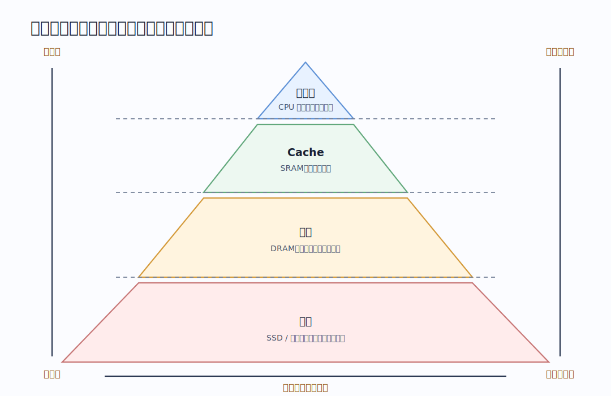
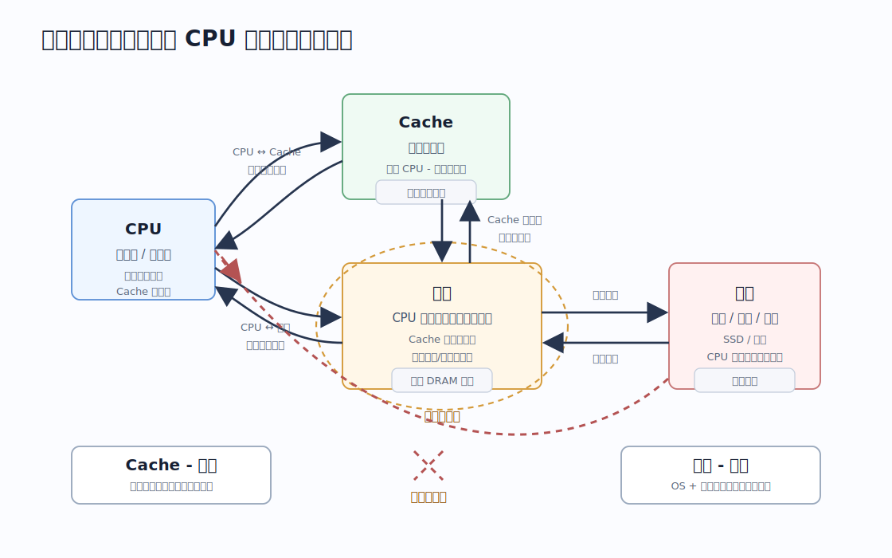
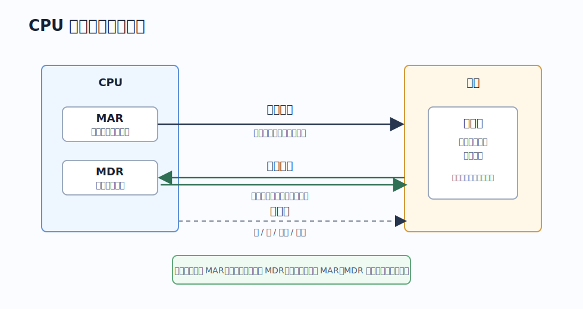
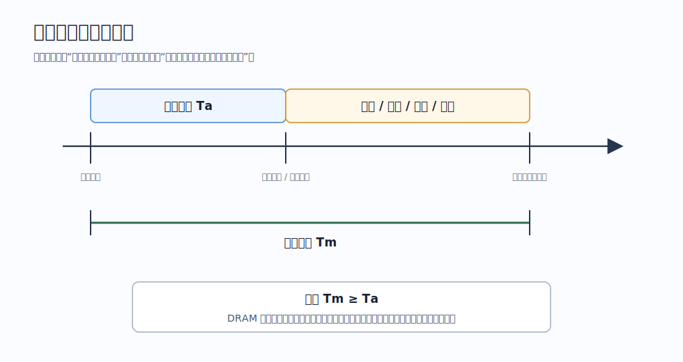
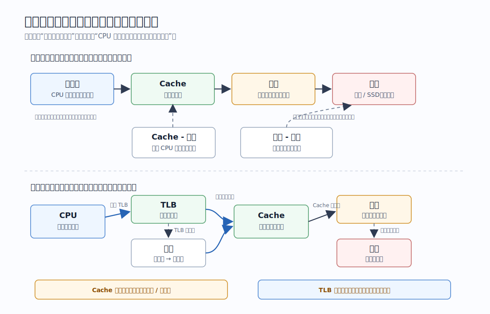

# 存储系统

存储系统是协同工作的一组不同速度、容量、价格的存储器。

现代计算机不会只使用一种存储器，而是形成层次结构：越靠近 CPU，速度越快、容量越小、单位成本越高；越远离 CPU，速度越慢、容量越大、单位成本越低。

# 存储器分类

存储器可以按多个维度分类。

| 分类维度    | 类型                                     | 关键点                                           |
| ------- | -------------------------------------- | --------------------------------------------- |
| 按层次     | 寄存器、Cache、主存、辅存                        | 越靠近 CPU 越快、越小、越贵                              |
| 按介质     | 半导体、磁表面、光介质                            | 主存和 Cache 多为半导体；磁盘是磁表面；光盘是光介质                 |
| 按存取方式   | 随机存取RAM、顺序存取、直接存取（随机存取找块+顺序存取读数据）、相联存取 | RAM 任意单元访问时间相同；磁带是顺序存取；磁盘是直接存取；TLB/快表体现相联访问思想 |
| 按可改写性   | 读写存储器、只读存储器ROM                         | ROM 名义上只读，但许多 ROM 类器件可擦写                      |
| 按断电保存性  | 易失性、非易失性                               | 主存和 Cache 通常易失；磁盘、SSD、ROM 非易失                 |
| 按读出是否破坏 | 破坏性读出、非破坏性读出                           | DRAM 读出后需要重写；SRAM、磁盘、光盘通常非破坏性读出               |

> [!warning] RAM 和 ROM 不是对称的
> RAM 强调“随机存取”，ROM 强调“只读或写入受限”。很多 ROM 类器件也能随机访问，很多 ROM 类器件也能擦写，只是擦写方式、速度和寿命与普通 RAM 不同。

# 层次化结构

金字塔从上到下的规律：

- 速度：越来越慢。
- 容量：越来越大。
- 单位价格：越来越低。
- CPU 访问频率：越靠上越频繁。

其中真正构成存储系统主线的是两个相邻层次：

| 层次         | 构成         | 数据流动                            | 交换单位 | 解决问题         | 透明性           |
| ---------- | ---------- | ------------------------------- | ---- | ------------ | ------------- |
| Cache - 主存 | Cache + 主存 | Cache 未命中时，从主存调入主存块；写策略决定是否写回主存 | 块    | CPU 与主存速度不匹配 | 对所有程序员和操作系统透明 |
| 主存 - 辅存    | 主存 + 辅存    | 缺页时从辅存调入页面；内存不足时把页面换出到辅存        | 页    | 主存容量不足       | 对用户程序透明       |

==上一级保存下一级中近期可能使用的信息副本==，这是层次化结构能够工作的关键。Cache 保存主存块副本；主存保存辅存中近期运行需要的页面或程序数据。

> [!note] 透明性的准确理解
> “透明”不是说这层不存在，而是说使用者通常不需要直接读写。Cache 的调入由硬件自动完成；虚拟内存中的页面调入调出由操作系统和硬件配合完成。

# 主存储器的基本组成

CPU 访问主存时，`MAR` 给出要访问的地址，`MDR` 暂存本次读写的数据。

**`MAR`位数等于地址总线宽度，`MDR`宽度等于数据总线宽度**。

地址总线、数据总线和控制线分别承担“访问哪里、交换什么、执行读还是写”的任务。

# 局部性原理

层次结构能成立，是因为程序访问具有局部性。

| 局部性   | 含义                  | 典型例子          | 对存储系统的意义             |
| ----- | ------------------- | ------------- | -------------------- |
| 时间局部性 | 刚访问过的信息，短时间内可能再次访问  | 循环变量、循环体指令    | 访问过的块/页值得暂时留在高速层     |
| 空间局部性 | 访问某个地址后，附近地址可能很快被访问 | 顺序执行指令、顺序扫描数组 | 每次不只取一个字节，而是取一整块或一整页 |

Cache 的“块”、虚拟内存的“页”、磁盘和文件系统中的预读，本质上都在利用空间局部性；Cache 替换算法、页面置换算法、工作集思想则主要利用时间局部性。

# 性能指标

存储器性有存取时间、存取周期和带宽。

| 指标         | 含义                     |
| ---------- | ---------------------- |
| 存取时间 $T_a$ | 从启动一次读/写操作，到本次操作完成所需时间 |
| 存取周期 $T_m$ | 连续两次独立访问之间必须间隔的最小时间    |
| 主存带宽 $B_m$ | 单位时间内主存最多能传送的信息量       |

通常有：

$$
T_m \ge T_a
$$

因为一次读写完成后，存储器可能还需要恢复、重写、刷新或准备下一次访问。DRAM 的恢复时间可能较长，因此存取周期可能明显大于存取时间。

> [!example] 为什么要区分 $T_a$ 和 $T_m$
> 如果某存储器存取时间为 $r$，存取周期为 $T=4r$，那么一次读出数据可能只需要 $r$，但同一个存储体要等到 $4r$ 后才能再次发起独立访问。多模块存储器、低位交叉编址就是为了在这个等待期间让其他存储体先工作。

主存带宽常可粗略理解为：

$$
B_m = \frac{\text{一次传送的数据宽度}}{\text{传送间隔}}
$$

提高带宽的常见方向包括：增加数据通路宽度、使用多模块并行、利用突发传输、提升总线或存储器工作频率。

# 一次访存的大致路径

一次内存访问要分清两件事：**地址转换**和**数据访问**。

典型路径如下：

1. CPU 执行指令，产生虚拟地址。
2. 地址转换机构查询 TLB。TLB 命中则直接得到物理页框号。
3. TLB 未命中时，访问页表，查出虚拟页对应的物理页框。
4. 如果页表项显示目标页不在主存，则发生缺页，由操作系统把页面从辅存调入主存。
5. 得到物理地址后，硬件用物理地址访问 Cache。
6. Cache 命中则直接返回数据。
7. Cache 未命中则访问主存，把对应主存块调入 Cache，再返回数据。

> [!warning] TLB 和 Cache 的区别
> TLB 缓存的是页表项，目标是减少地址转换开销；Cache 缓存的是主存数据块或指令块，目标是减少主存访问开销。TLB 命中不等于数据在 Cache 中，Cache 命中也不负责虚拟地址到物理地址的转换。

# 基本术语

| 术语 | 含义 |
|---|---|
| 主存 / 内存 | CPU 可直接访问的运行时存储空间，通常由 DRAM 构成 |
| 辅存 / 外存 | 长期保存数据的存储设备，如磁盘、SSD、U 盘、光盘等 |
| 存储元 | 存储 1 bit 信息的基本单位 |
| 存储单元 | 带有地址的最小可寻址单位 |
| 存储字 | 一次作为整体读写的一组二进制位 |
| 存储字长 | 一个存储字包含的位数，常与 MDR 位数相关 |
| Cache 块 | Cache 与主存之间交换数据的单位 |
| 页 | 虚拟内存中主存与辅存之间调入调出的单位 |
| 命中 | 所需信息已经在高速层中 |
| 未命中 | 所需信息不在高速层，需要访问下一层 |
| 缺页 | 所访问的虚拟页不在主存，需要从辅存调入 |
