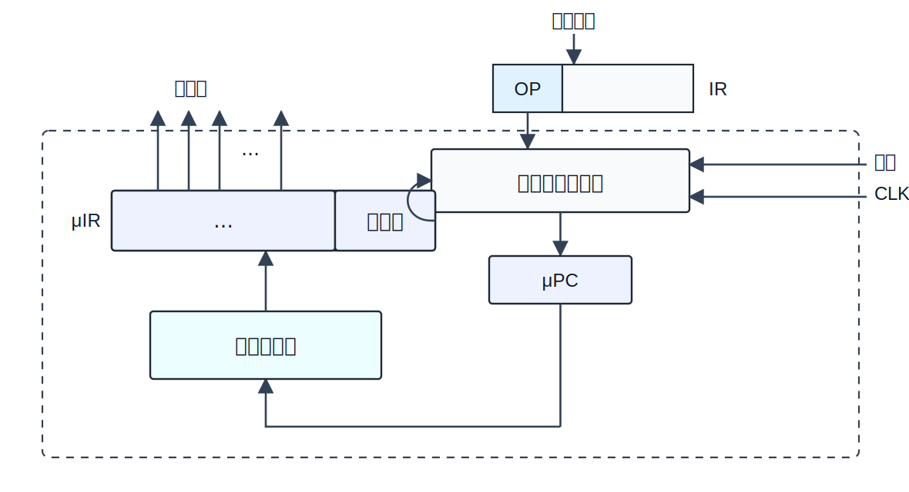
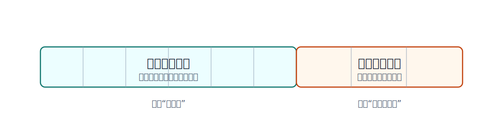

微程序控制器把微指令存放在控制存储器中。执行机器指令时，控制器从控制存储器中逐条取出微指令，由微指令发出微命令，从而控制数据通路完成微操作。

它的核心思想是：

```text
机器指令 -> 对应的微程序 -> 微指令序列 -> 微命令 -> 微操作
```



硬布线控制器把控制规则做成组合逻辑；微程序控制器则把控制规则写成微程序并存入控制存储器。

# 基本术语

| 概念         | 含义                                     |
| ---------- | -------------------------------------- |
| 微命令        | 控制一个微操作的命令                             |
| 微操作        | 数据通路中的基本动作，如 `(PC)->MAR`               |
| 微指令        | 一组微命令加上后继微指令地址信息                       |
| 微程序        | 一组微指令序列，用来解释一条机器指令                     |
| 控制存储器 `CM` | 存放微程序的存储器，常用 ROM 实现                    |
| `CMAR`     | 控制存储器地址寄存器，也称 $\mu PC$，保存要读取的微指令地址     |
| `CMDR`     | 控制存储器数据寄存器，也称 $\mu IR$，保存从 `CM` 读出的微指令 |

程序、机器指令、微程序、微指令之间的层次关系可以写成：

```text
程序由机器指令组成
机器指令由微程序解释
微程序由微指令组成
微指令发出微命令
微命令控制微操作
```

> [!note] 一条机器指令对应一个微程序
> 取指周期的微指令序列通常被多条机器指令共用。物理存放上它像一个公共微程序段，但逻辑上仍可把“公共取指段 + 该指令执行段”看成这条机器指令对应的完整微程序。

# 微程序控制器的工作流程

微程序控制器执行时，反复做两类事情：

1. 取出当前微指令，并让其中的操作控制字段发出控制信号；
2. 形成下一条微指令地址，送入 `CMAR`。

基本流程为：

```text
CMAR 给出微地址
-> CM 读出微指令
-> CMDR 保存微指令
-> 操作控制字段发出微命令
-> 顺序控制字段形成下一微地址
-> 下一微地址送入 CMAR
```

[html-card height=680](../assets/microprogrammed-control-flow-slides.html)

`CMDR` 中的微指令通常包含两大部分：

| 字段 | 作用 |
|---|---|
| 操作控制字段 | 指出本条微指令要发出哪些微命令 |
| 顺序控制字段 | 指出下一条微指令地址怎样形成 |

# 控制存储器中的微程序组织

控制存储器按地址存放微指令。常见组织方式是：

| 微程序段 | 作用 |
|---|---|
| 公共取指微程序 | 完成所有机器指令共有的取指操作 |
| 间址周期微程序 | 需要间接寻址时使用 |
| 中断周期微程序 | 响应中断时使用 |
| 各机器指令执行微程序 | 每条机器指令有自己的执行阶段微指令序列 |

若指令系统有 `n` 条机器指令，并且取指微程序公共使用，则控制存储器中至少需要保存：

```text
n 个执行微程序 + 1 个公共取指微程序
```

如果该 CPU 支持间址周期和中断周期，还需要相应的公共微程序段。

# 微指令格式

微指令的基本格式可以抽象为：



```text
操作控制字段 + 顺序控制字段
```

| 字段 | 解决的问题 |
|---|---|
| 操作控制字段 | 当前这一步发出哪些控制信号 |
| 顺序控制字段 | 下一条微指令去哪里取 |


## 水平型、垂直型和混合型微指令

| 类型     | 特点                                            | 优点           | 缺点            |
| ------ | --------------------------------------------- | ------------ | ------------- |
| 水平型微指令 | 采用**微操作码**，一条微指令可定义多个可并行微命令；其微程序段较扁平，所以**水平** | 微程序短，执行速度快   | 微指令长，编写微程序较麻烦 |
| 垂直型微指令 | 一条微指令通常只定义一个微命令，由微操作码字段规定功能；其微程序段较瘦长，所以**垂直** | 微指令短、规整，便于编写 | 微程序长，执行速度慢    |
| 混合型微指令 | 在垂直型基础上允许一定并行控制                               | 折中微指令长度和执行速度 | 设计复杂度介于两者之间   |

> [!note] 相容微命令与互斥微命令
> 可以并行完成的微命令称为相容微命令；不能并行完成的微命令称为互斥微命令。微指令编码时必须考虑这件事。

# 微指令的编码方式

微指令编码方式是指对操作控制字段进行组织和表示的方式。

## 直接编码

直接编码又叫直接控制方式。操作控制字段中每一位代表一个微命令。

```text
某一位为 1 -> 对应控制信号有效
某一位为 0 -> 对应控制信号无效
```

| 优点 | 缺点 |
|---|---|
| 简单直观，执行速度快，并行性好 | 微指令字长很长；若有 `n` 个微命令，操作控制字段至少要 `n` 位 |

## 字段直接编码

字段直接编码把操作控制字段分成若干小段，每段经过译码后产生控制信号。

分段原则：

| 原则              | 含义                                                |
| --------------- | ------------------------------------------------- |
| 互斥微命令放在同一段      | 同一段一次只能译出其中一个控制信号                                 |
| 相容微命令放在不同段      | 不同段可以同时译出控制信号，从而并行执行                              |
| 每段不宜太长          | 段太长会增加译码复杂度和译码时间                                  |
| 每段需要留出**空操作状态** | 例如 3 位字段有 8 种状态，常用 `000` 表示不发出微命令，所以最多表示 7 个互斥微命令 |

字段直接编码常用于计算操作控制字段位数。

若某一互斥类有 `m` 个微命令，并且需要留出一个无操作状态，则该字段位数为$\lceil\log_{2}(m + 1)\rceil$

若共有多个互斥类，则各字段位数相加。

## 字段间接编码

字段间接编码又称隐式编码。某个字段中的微命令需要结合另一个字段的含义才能解释。

| 优点 | 缺点 |
|---|---|
| 可进一步缩短微指令字长 | 削弱并行控制能力，译码关系更复杂 |

字段间接编码通常作为字段直接编码的辅助手段。

# 微指令地址形成方式

下一条微指令地址从哪里来。

常见方式如下：

| 方式 | 含义 |
|---|---|
| 下地址字段指出 | 微指令中直接给出后继微指令地址，又称断定方式 |
| 根据机器指令操作码形成 | 取指结束后，由 `OP(IR)` 经微地址形成部件产生执行微程序入口地址 |
| 增量计数器法 | `(CMAR) + 1 -> CMAR`，顺序取下一条微指令 |
| 分支转移 | 微指令中给出判别条件和转移地址 |
| 测试网络 | 根据外部条件或状态测试结果形成后继微地址 |
| 硬件产生入口地址 | 取指周期第一条微指令地址、中断周期入口地址可由硬件给出 |

断定方式下，若控制存储器中需要标识 `N` 条微指令的位置，则下地址字段至少需要$\lceil \log_{2} N \rceil$位。

# 取指周期的微程序执行

硬布线控制器中，取指周期可安排为：

| 节拍 | 微操作 |
|---|---|
| `T0` | `(PC)->MAR`，`1->R` |
| `T1` | `M(MAR)->MDR`，`(PC)+1->PC` |
| `T2` | `(MDR)->IR`，`OP(IR)->ID` |

微程序控制器也要完成这些微操作，但还要补充“取下一条微指令”的动作。

一种微程序控制器中的取指过程可写成：

| 节拍 | 动作 | 说明 |
|---|---|---|
| `T0` | `(PC)->MAR`，`1->R` | 微指令 `a` 发出取指开始的微命令 |
| `T1` | `Ad(CMDR)->CMAR` | 根据当前微指令的下地址字段取下一条微指令 |
| `T2` | `M(MAR)->MDR`，`(PC)+1->PC` | 微指令 `b` 发出读主存和 PC 自增的微命令 |
| `T3` | `Ad(CMDR)->CMAR` | 取下一条微指令 |
| `T4` | `(MDR)->IR`，`OP(IR)->微地址形成部件` | 微指令 `c` 完成指令装入与操作码送出 |
| `T5` | `微地址形成部件->CMAR` | 根据机器指令操作码进入对应执行微程序 |

> [!warning] 微程序控制器通常更慢
> 它不仅要控制 CPU 数据通路，还要不断从控制存储器取微指令、形成下一微地址。因此同样的取指功能，使用微程序控制器可能需要更多节拍。

# 微程序控制单元的设计

微程序控制单元的设计可以按四步看：

| 步骤 | 内容 |
|---|---|
| 分析微操作序列 | 先写出各机器周期本来要完成的微操作 |
| 写出微操作命令与节拍安排 | 在硬布线节拍基础上，补充微程序控制器特有的取下一微指令操作 |
| 确定微指令格式 | 根据微命令数量确定操作控制字段；根据控制存储器规模确定顺序控制字段 |
| 编写微指令码点 | 按微指令格式填写每条微指令的控制位和下地址 |

确定微指令字长时要分两部分：

```text
微指令字长 = 操作控制字段位数 + 顺序控制字段位数
```

其中：

| 字段 | 位数取决于 |
|---|---|
| 操作控制字段 | 微命令数量、编码方式、互斥类划分 |
| 顺序控制字段 | 控制存储器中需要寻址的微指令数量、后继地址形成方式 |

# 微程序设计分类

| 类型      | 含义                                   |
| ------- | ------------------------------------ |
| 静态微程序设计 | 微程序不改变，常采用 ROM                       |
| 动态微程序设计 | 可通过改变微指令和微程序改变机器指令，常采用 EPROM 等可改写存储器 |
| 毫微程序设计  | 用毫微程序解释微程序；毫微指令与微指令的关系，类似微指令与机器指令的关系 |

# 与硬布线控制器比较

| 对比项  | 微程序控制器                       | 硬布线控制器                        |
| ---- | ---------------------------- | ----------------------------- |
| 工作原理 | 微操作控制信号以微程序形式存放在控制存储器中，执行时读出 | 微操作控制信号由组合逻辑电路根据指令码、状态和时序即时产生 |
| 执行速度 | 较慢                           | 较快                            |
| 规整性  | 较规整                          | 较烦琐、不规整                       |
| 易扩充性 | 易扩充、易修改                      | 扩充困难                          |
| 常见场景 | CISC CPU                     | RISC CPU                      |
> [!danger] 
> “微程序控制器可以实现硬布线控制器**难以**实现的功能", 这里的“难以”指的是**实现复杂度和代价高**，并不是**不能**。
> **对于一段已经确定、长度有限的微程序，它能实现的控制功能，原则上都能用硬布线控制器实现。**


> [!summary]
> 微程序控制器把复杂控制逻辑存储化。它牺牲速度，换来规整性和可修改性。
