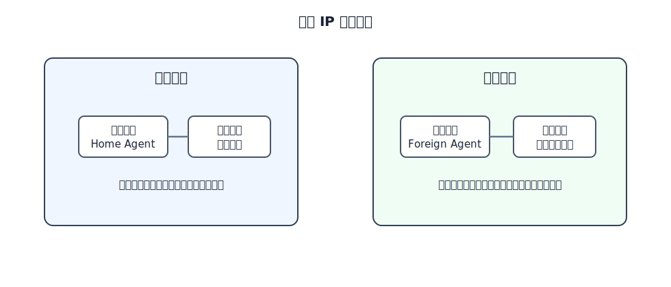
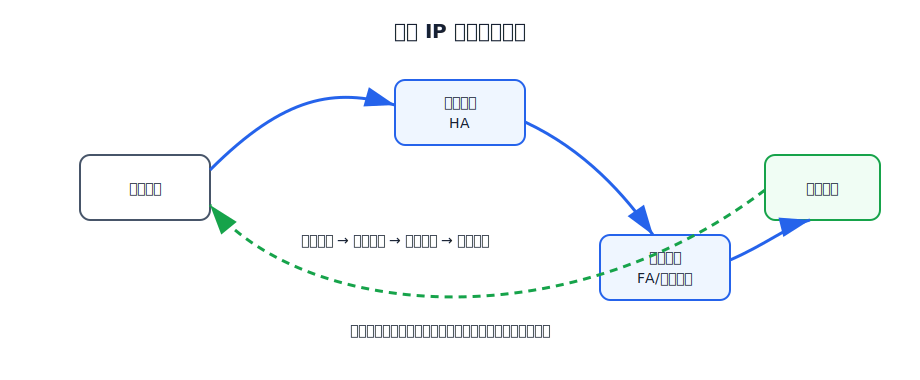

# 移动 IP

普通 IP 地址同时包含两个含义：主机接口标识和所在网络位置。路由器根据地址中的网络前缀转发分组。如果主机移动到另一个网络但仍使用原地址，分组仍会被路由到原网络；如果直接换成新地址，原有通信连接又会被破坏。

移动 IP 的目标是：移动主机跨网络移动时，仍能保持原来的永久 IP 地址，并尽量不要求固定主机和普通路由器修改协议。

# 移动性的几种情况

移动性对网络层的影响不同：

| 情况 | 是否需要移动 IP |
|---|---|
| 只在同一 Wi-Fi 覆盖区内移动，网络层地址不变 | 不需要 |
| 换地点重新接入，地址改变，但不要求保持原连接 | 不需要 |
| 跨网络移动，仍要求保持原地址和通信连续性 | 需要移动 IP 这类机制 |

移动 IP 解决的是第三种情况。

# 基本术语

| 术语 | 含义 |
|---|---|
| 移动主机 | 可以从一个网络移动到另一个网络的主机 |
| 归属网络 | 移动主机默认所属的网络 |
| 归属地址 | 移动主机在归属网络中的永久地址 |
| 归属代理 | 归属网络中代表移动主机执行移动管理的实体，通常是路由器 |
| 外地网络 | 移动主机当前接入的非归属网络 |
| 外地代理 | 外地网络中协助移动主机接入的实体 |
| 转交地址 | 移动主机当前所在位置对应的地址，常由外地代理提供 |

移动主机对外仍使用归属地址。转交地址用于让归属代理知道移动主机当前在哪里，并把数据通过隧道送过去。

# 代理发现和注册

移动主机进入外地网络后，需要发现外地代理，并向归属代理注册当前转交地址。

[html-card height=570](../assets/mobile-ip-process-slides.html)

基本过程是：

1. 移动主机到达外地网络。
2. 移动主机通过代理发现协议找到外地代理。
3. 移动主机从外地代理获得转交地址。
4. 移动主机通过外地代理向归属代理注册。
5. 归属代理记录“归属地址 → 转交地址”的绑定关系。

注册完成后，归属代理就能把发往移动主机归属地址的数据报转发到当前外地网络。

# 固定主机到移动主机

固定主机不知道移动主机已经离开归属网络，它仍把 IP 数据报发往移动主机的归属地址。

移动 IP 的间接路由过程是：

1. 固定主机发送目的地址为移动主机归属地址的 IP 数据报。
2. 普通路由机制把该数据报送到移动主机的归属网络。
3. 归属代理代替移动主机接收或截获该数据报。
4. 归属代理把原 IP 数据报封装到一个新的 IP 数据报中。
5. 新 IP 数据报的目的地址是转交地址。
6. 外地代理收到外层数据报后解封，取出原 IP 数据报。
7. 外地代理把原 IP 数据报交付给外地网络中的移动主机。

这里使用的是 IP 隧道思想：原数据报没有被修改，而是作为新数据报的数据部分穿过因特网。

# 移动主机到固定主机

移动主机向固定主机发送数据时，可以直接按照普通 IP 转发机制发给固定主机。源地址仍可使用移动主机的归属地址，目的地址是固定主机地址。

这样会形成路径不对称：固定主机发往移动主机的数据要先到归属代理，再隧道转发到外地代理；移动主机发回固定主机的数据可以直接走普通路由。

这种路径称为三角形路由。它能保持对固定主机透明，但路径可能不是最短路径。

# 透明性

移动 IP 对固定主机和大多数普通路由器是透明的。固定主机仍按移动主机的永久地址通信，不需要知道移动主机当前在哪个网络。

# 局限

它的局限包括：

- 固定主机到移动主机的路径可能绕远。
- 发往移动主机的数据通常要先经过归属代理。若归属代理故障、过载或绑定表出错，固定主机到移动主机的通信就会受影响。
- 代理发现、注册、隧道和安全认证增加复杂性。
- 在整个因特网范围内大规模部署困难。

移动 IP 的思想与蜂窝移动通信中的位置管理有相似之处，但后者通常在 IP 层以下或运营商核心网中使用更复杂的机制。
