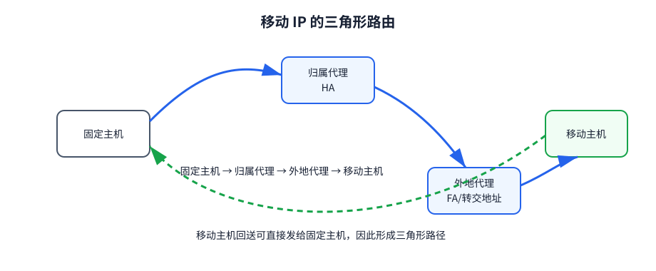

# 移动 IP

## 存在的矛盾

IP 地址既标识一台主机，也通过网络前缀指出这台主机应当接在哪个网络。路由器只看目的地址的网络前缀，因此发往某个 IP 地址的分组，总会被送到该地址所属的网络。

假设移动主机原来接在网络 A，长期使用地址 `H`。网络 A 是它的**归属网络**，`H` 是它的**归属地址**。当主机移动到网络 B 时，普通 IP 面临两种选择：

- 继续使用 `H`：通信对端仍能使用原地址，但普通路由会把分组送回网络 A，找不到已经移动到网络 B 的主机。
- 换用网络 B 的地址：分组可以直接到达新位置，但主机的 IP 地址已经改变，以原地址建立的 TCP 连接等通信状态难以继续使用。

移动 IP 把这两个需求分开处理：

- **归属地址保持不变**，继续代表“这是谁”。
- 主机离开归属网络后取得一个**转交地址**，代表“现在在哪里”。

归属网络中的**归属代理**保存两者的对应关系。当发往归属地址的分组仍按普通路由到达网络 A 时，归属代理代为接收，再把分组通过隧道送到转交地址。

> [!important]
> 移动 IP 并没有要求全网路由器把归属地址改路由到新位置。发往归属地址的分组仍先到归属网络，只是在那里由归属代理接手并转送。

## 哪些设备需要知道主机正在移动

通信对端仍把移动主机当成地址为 `H` 的普通主机，不需要查询它当前在哪个网络。普通路由器也不运行移动 IP：

- 从通信对端到归属网络，普通路由器照常按目的地址 `H` 转发。
- 从归属代理到转交地址，普通路由器只把封装后的分组当作普通 IP 数据报转发。

需要执行移动管理的只有移动主机和归属代理；使用外地代理转交地址时，当前网络中的**外地代理**也参与注册、解封和交付。所谓“不要求通信对端和普通路由器修改协议”，指的就是它们不必识别移动状态，也不必增加移动 IP 的登记和隧道处理逻辑。

# 移动后的完整通信过程

## 1. 在外地网络登记当前位置

移动主机接入归属网络以外的网络时，这个网络称为**外地网络**。它先通过代理通告或代理请求发现外地代理，并取得当前的转交地址。教材常见的情形是把外地代理的地址用作转交地址；移动主机也可以自己取得一个位于外地网络的地址作为转交地址。

随后进行注册：

1. 移动主机把“归属地址 `H`、当前转交地址 `C`、注册有效期”等信息交给外地代理。
2. 外地代理把注册请求转交给归属代理。
3. 归属代理验证请求，记录绑定关系 `H → C`，再返回注册结果。

完成注册后，归属代理知道地址为 `H` 的移动主机当前应当从转交地址 `C` 接收分组。归属地址没有改变，改变的只是归属代理保存的位置绑定。

[html-card height=620](../assets/mobile-ip-process-slides.html)

## 2. 通信对端向移动主机发送

假设通信对端向移动主机发送数据，原 IP 数据报为：

```text
源地址：通信对端地址
目的地址：归属地址 H
```

接收过程如下：

1. 通信对端不知道移动主机已经离开，仍以 `H` 为目的地址发送。
2. 普通路由器根据 `H` 的网络前缀，把原数据报送到归属网络。
3. 归属代理发现 `H → C` 的绑定，代替移动主机接收该数据报。
4. 归属代理把整个原数据报装入一个新的 IP 数据报。外层目的地址为转交地址 `C`，因此普通路由器会把它送到当前外地网络。
5. 隧道终点删除外层首部，取出目的地址仍为 `H` 的原数据报，再交给移动主机。

若 `C` 是外地代理的地址，外地代理就是隧道终点，负责解封并在本地交付；若移动主机使用自己取得的转交地址，则可以由移动主机自己解封。

| 数据报 | 源地址 | 目的地址 | 作用 |
|---|---|---|---|
| 原数据报 | 通信对端地址 | 归属地址 `H` | 保持通信双方看到的地址不变 |
| 隧道外层数据报 | 归属代理地址 | 转交地址 `C` | 把原数据报送到移动主机的当前位置 |

这就是移动 IP 的关键：**原数据报负责维持原来的通信关系，外层数据报只负责把它运到当前位置。**

## 3. 移动主机向通信对端发送

移动主机回发时，可以仍以归属地址 `H` 为源地址，把目的地址写成通信对端地址，然后按普通 IP 路由直接发出。返回分组不必先绕回归属代理。



于是两个方向经过的路径不同：

- 通信对端 → 归属代理 → 转交地址 → 移动主机；
- 移动主机 → 通信对端。

这种不对称路径称为**三角形路由**。它换来了对通信对端的透明性，但通信对端到移动主机的路径可能明显绕远。某些网络还会因入口过滤等原因要求移动主机把回程分组反向隧道到归属代理，再由归属代理发出。

## 4. 再次移动或返回归属网络

移动主机从一个外地网络移动到另一个外地网络后，要取得新的转交地址并重新注册。归属代理把原来的 `H → C` 更新为 `H → C'`，此后新分组就被隧道送往新位置；通信对端仍然只使用 `H`。

移动主机返回归属网络时，撤销外地注册。归属代理停止为它建立隧道，发往 `H` 的分组重新在归属网络中直接交付。

# 作用范围与代价

移动 IP 解决的是主机跨 IP 子网移动后仍保持归属地址的问题。若主机只在同一子网的不同接入点之间移动，通常由链路层切换机制处理，不需要移动 IP。

移动 IP 的代价包括：

- 三角形路由可能使去程绕远。
- 归属代理必须持续维护绑定并转发入站分组，因而会成为性能和可靠性上的关键节点。
- 代理发现、注册、认证、封装和解封增加了控制与处理开销。
- 位置注册必须经过认证，否则攻击者可能伪造转交地址，把分组重定向到错误位置。

可以把整个机制压缩为一句话：**归属地址保持通信身份，转交地址表示当前位置，归属代理用绑定和隧道把两者接起来。**
