# 复用的基本思想

复用是让多路信号共享一条物理信道。接收端能够恢复各路信号，是因为发送端在某个维度上把它们区分开：频率、时间、波长或码片序列。

不同复用方式的关键差异如下：

| 复用方式 | 划分资源 | 直观理解 |
| --- | --- | --- |
| 频分复用 FDM | 频带 | 同时发送，各占一段频率 |
| 时分复用 TDM | 时间 | 轮流发送，各占固定时隙 |
| 统计时分复用 STDM | 动态时隙 | 谁有数据就给谁分配时隙 |
| 波分复用 WDM | 光波长 | 光纤中的频分复用 |
| 码分复用 CDM/CDMA | 码片序列 | 同时同频，用正交码区分 |

# 频分复用

频分复用把信道频带划分成若干互不重叠的子频带。每一路信号占用其中一段频率，可以在同一时间同时传输。

这种方式适合连续通信。代价是各子频带之间通常要留出保护频带，避免相邻频带互相干扰。

# 时分复用

时分复用让多个用户在不同时间使用同一个信道。一个 TDM 帧是一段固定长度时间，里面分成若干时隙；每个用户在每个 TDM 帧中占有固定时隙。

> [!warning] TDM 帧不是数据链路层的帧
> TDM 帧指一段固定长度的时间安排。数据链路层的帧是对等实体之间传送的数据单元。两者名称相同，但概念不同。

固定时隙的优点是结构简单，接收端按位置就知道时隙属于哪个用户。缺点是用户没有数据时，时隙也不能自动让给别人。

# 统计时分复用

统计时分复用是对 TDM 的改进。各用户只要有数据就送到集中器，集中器把输入数据缓存起来，再按顺序把有数据的缓存放入 STDM 帧。没有数据的用户会被跳过。

[html-card height=690](../assets/tdm-stdm-utilization-slides.html)

STDM 的优势是提高突发数据场景下的信道利用率。计算机数据常常具有突发性：有时短时间连续发送，有时长时间没有数据。固定 TDM 会在空闲用户时隙上浪费资源，而 STDM 可以把时隙让给真正有数据的用户。

STDM 的代价是每个时隙需要携带地址信息。因为时隙不再固定属于某个用户，接收端不能只靠位置判断数据来源。

# 波分复用

波分复用用于光纤通信。它把不同波长的光信号合到同一根光纤中传输，到达接收端后再按波长分开。

从原理上看，WDM 是光纤中的频分复用。不同光波长对应不同频率，多个波长可以在同一根光纤中同时传播。

密集波分复用可以显著提高光纤总数据率。例如一根光缆中有 $100$ 根光纤，每根光纤速率为 $2.5\text{ Gb/s}$，每根光纤再使用 $40$ 倍波分复用，则总数据率为：

$$
2.5\text{ Gb/s}\times 40\times 100=10000\text{ Gb/s}=10\text{ Tb/s}
$$

# 码分复用

码分复用常称为码分多址 CDMA。它与 FDM、TDM 的区别更大：多个用户可以在相同时间、相同频带发送数据，接收端靠各用户的码片序列把信号分离出来。

CDMA 的核心不是“分时间”或“分频率”，而是让不同站点使用互相正交的码片序列。多个站点同时发送时，信道中的信号是各站码片向量的叠加；接收端用自己的码片向量做规格化内积，就能判断本站收到的是 `1`、`0`，还是没有本站数据。

CDMA 的正交码片和解码计算详见 [[CDMA-Code-Division-Multiplexing]]。
