# 多处理机调度

单处理机调度只需要回答一个问题：**让哪个就绪进程上 CPU**。

多处理机调度还要多回答一个问题：**让它上哪个 CPU**。因此，同一个进程调度算法放到多 CPU 环境下，还要考虑队列组织、负载均衡和处理机亲和性。

| 场景 | 调度决策 |
| --- | --- |
| 单处理机 | 从就绪队列中选出一个进程，让它运行 |
| 多处理机 | 先选进程，再决定放到哪个 CPU 上运行 |

# 两个目标

多处理机调度常见的两个目标。

| 目标 | 含义 | 好处 | 代价 |
| --- | --- | --- | --- |
| 负载均衡 | 尽量让各 CPU 同等忙碌 | 避免某些 CPU 空闲、某些 CPU 排队过长 | 进程可能被迁移到别的 CPU |
| 处理机亲和性 | 尽量让同一进程继续在同一 CPU 上运行 | 更容易复用该 CPU Cache 中的数据 | 可能造成某些 CPU 忙、某些 CPU 闲 |

处理机亲和性来自缓存局部性。进程上次在某个 CPU 上运行时，它访问过的数据和指令可能还留在该 CPU 的 Cache 中；如果下次仍在这个 CPU 上运行，Cache 命中率更可能较高。若频繁换 CPU，原来的缓存优势就会被削弱。

亲和性有两种常见形式：

| 类型 | 含义 |
| --- | --- |
| 软亲和 | 调度程序尽量让进程回到原来的 CPU，但不绝对保证 |
| 硬亲和 | 进程通过系统调用等方式绑定到指定 CPU 或 CPU 集合 |

# 公共就绪队列

公共就绪队列让所有 CPU 共享同一个内核就绪队列。某个 CPU 空闲时，就运行调度程序，从公共队列中选出一个进程运行。

| 角度 | 公共就绪队列 |
| --- | --- |
| 队列组织 | 所有 CPU 共享一个就绪队列 |
| 调度方式 | 每个 CPU 空闲时都从公共队列取进程 |
| 负载均衡 | 较容易天然实现 |
| 处理机亲和性 | 较差，进程可能每次被不同 CPU 取走 |
| 同步开销 | 访问公共队列需要互斥控制 |

公共队列的直觉是“谁空闲谁来取活”。这样不容易出现某个 CPU 队列很长、另一个 CPU 没活干的情况。但多个 CPU 同时访问一个队列，需要锁或其他同步机制；并且进程不固定在哪个 CPU 上运行，Cache 亲和性较差。

# 私有就绪队列

私有就绪队列让每个 CPU 都有自己的就绪队列。CPU 空闲时，只从自己的队列里选进程运行。

| 角度 | 私有就绪队列 |
| --- | --- |
| 队列组织 | 每个 CPU 一个就绪队列 |
| 调度方式 | CPU 通常只从自己的队列中选择进程 |
| 负载均衡 | 需要额外迁移机制 |
| 处理机亲和性 | 较好，进程更容易反复在同一 CPU 上运行 |
| 同步开销 | 队列竞争较少 |

私有队列的直觉是“每个 CPU 管自己的活”。它天然有利于处理机亲和性，也减少多个 CPU 争抢同一个队列的同步开销。但如果队列长短差别很大，就需要迁移进程来做负载均衡。

常见迁移策略有两类：

| 策略 | 操作 |
| --- | --- |
| 推迁移 Push | 系统中的负载均衡程序周期性检查各 CPU 负载，把任务从忙 CPU 推到空闲 CPU |
| 拉迁移 Pull | 空闲或低负载 CPU 主动检查其他 CPU 队列，从高负载 CPU 拉任务到自己队列 |

推迁移像集中式的负载均衡器；拉迁移像空闲 CPU 主动找活。实际系统可以同时使用两者。

# 对比

| 维度 | 公共就绪队列 | 私有就绪队列 |
| --- | --- | --- |
| 结构 | 一个共享队列 | 每个 CPU 一个队列 |
| 负载均衡 | 容易 | 需要推迁移或拉迁移 |
| 处理机亲和性 | 较差 | 较好 |
| 队列同步 | 竞争较多 | 竞争较少 |
| 典型问题 | 共享队列锁竞争、Cache 亲和性差 | 队列不均衡、任务迁移策略复杂 |

**公共队列偏向负载均衡，私有队列偏向处理机亲和性**。多处理机调度的许多设计，都是在这两个目标之间折中。
