# 二元函数在一点处的极限、连续、偏导与可微

设二元函数 $f(x,y)$ 在点 $P(x_0,y_0)$ 附近有定义。讨论以下性质：

| 性质            | 在 $P$ 点的含义                                                                                                   |
| ------------- | ------------------------------------------------------------------------------------------------------------ |
| 二重极限存在        | $\displaystyle \lim_{(x,y)\to(x_0,y_0)}f(x,y)$ 存在                                                            |
| 连续            | 二重极限存在，并且等于 $f(x_0,y_0)$                                                                                     |
| 关于 $x,y$ 分别连续 | 固定 $y=y_0$ 时关于 $x$ 连续；固定 $x=x_0$ 时关于 $y$ 连续                                                                  |
| 一阶偏导数存在       | $f_x(x_0,y_0)$ 与 $f_y(x_0,y_0)$ 都存在                                                                          |
| 可微            | $f(x_0+\Delta x,y_0+\Delta y)-f(x_0,y_0)=f_x(P)\Delta x+fy(P)\Delta y+o(\sqrt{ \Delta x^{2}+\Delta y^{2} })$ |
| 一阶偏导数连续       | $f_x,f_y$ 在 $P$ 的某个邻域内有定义，并且在 $P$ 连续                                                                         |

# 必然成立的推导

## 为什么这些箭头成立

**5 $\Rightarrow$ 4**：若两个一阶偏导数在 $P$ 附近存在，并且在 $P$ 连续，则函数在 $P$ 可微。这是判断可微的常用充分条件，但不是必要条件。

**4 $\Rightarrow$ 2、3**：可微意味着函数在 $P$ 附近能够由一个线性函数近似，因此函数必在 $P$ 连续；令 $\Delta y=0$ 或 $\Delta x=0$，又可得到两个一阶偏导数都存在。

**2 $\Rightarrow$ 1、2′**：连续已经包含“二重极限存在且等于函数值”。二重极限沿任意路径都趋于同一个值，当然也包括两条坐标方向。

**3 $\Rightarrow$ 2′**：$f_x(P)$ 存在，说明一元函数 $x\mapsto f(x,y_0)$ 在 $x_0$ 可导，因而在 $x_0$ 连续；$f_y(P)$ 同理。

# 反方向为什么不能直接推出

## 极限不决定点值

定义

$$
f(x,y)=
\begin{cases}
0,&(x,y)\ne(0,0),\\
1,&(x,y)=(0,0).
\end{cases}
$$

当 $(x,y)\to(0,0)$ 时，附近点的函数值始终为 0，因此

$$
\lim_{(x,y)\to(0,0)}f(x,y)=0.
$$

但 $f(0,0)=1$，所以函数在原点不连续。这个函数关于 $x$ 和 $y$ 也分别不连续，两个偏导数同样不存在。因此，单凭二重极限存在，不能推出2、2′、3或4。

## 连续不保证有偏导数，进而不能保证可微

取

$$
f(x,y)=|x|+|y|.
$$

它在原点连续，当然也关于 $x,y$ 分别连续。但是

$$
f_x(0,0)
=\lim_{h\to0}\frac{|h|}{h}
$$

不存在，$f_y(0,0)$ 同理。因此，即使函数连续，也不能保证偏导数存在，更不能保证可微。

## 在坐标方向满足不能保证在所有方向满足

定义

$$
f(x,y)=
\begin{cases}
\displaystyle\frac{xy}{x^2+y^2},&(x,y)\ne(0,0),\\[6pt]
0,&(x,y)=(0,0).
\end{cases}
$$

在两条坐标轴上，函数恒为 0，所以

$$
f_x(0,0)=f_y(0,0)=0,
$$

而且函数关于 $x,y$ 分别连续。但是沿两条不同路径趋近原点时，

$$
f(x,x)=\frac12,
\qquad
f(x,-x)=-\frac12.
$$

二重极限不存在。因此该函数在原点不连续，也不可能可微。这个例子说明：偏导数只考察两个坐标方向；二重极限和可微要求控制所有趋近方向。

## 可微不要求偏导数连续

令 $r=\sqrt{x^2+y^2}$，定义

$$
f(x,y)=
\begin{cases}
r^2\sin\dfrac1r,&r>0,\\[6pt]
0,&r=0.
\end{cases}
$$

因为

$$
\frac{|f(x,y)-f(0,0)|}{\sqrt{x^2+y^2}}
\leqslant r\to0,
$$

所以 $f$ 在原点可微，微分的线性部分为 0。对 $r>0$，

$$
f_x(x,y)=2x\sin\frac1r-\frac{x}{r}\cos\frac1r.
$$

沿 $y=0, x>0$ 趋近原点时，

$$
f_x(x,0)=2x\sin\frac1x-\cos\frac1x,
$$

它没有极限，而 $f_x(0,0)=0$。因此 $f_x$ 在原点不连续。函数可微，却不满足一阶偏导数连续。

