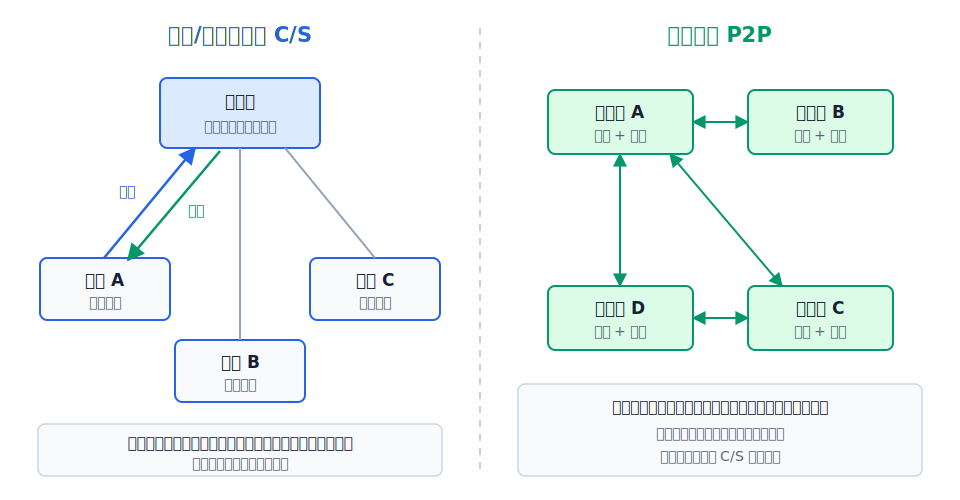

# 应用层解决什么问题

应用层是 TCP/IP 体系结构的顶层，离用户最近。它的任务是通过应用进程之间的交互来实现特定网络应用——浏览器访问网页、邮件客户端收发邮件、FTP 工具传文件，都是在应用层完成的。

网络应用程序只运行在端系统中。运输层已经为应用层提供了端到端的进程间逻辑通信，应用开发人员只需要关心应用协议和用户界面，不需要考虑路由器和交换机等核心网络设备。

应用层的内容不是一种通用的传输机制，而是几个具体的网络应用协议。在学这些协议之前，先看清楚它们采用什么样的网络应用架构。

应用进程之间的通信方式主要有两种：**客户/服务器（C/S）方式**和**对等（P2P）方式**。

# 客户/服务器方式

客户/服务器（Client/Server）方式中，通信双方的角色是不对等的：

- **客户**是服务请求方，主动向服务器发起通信。
- **服务器**是服务提供方，被动等待客户请求。

C/S 方式的特点：

- **服务器始终运行**，等待客户的服务请求。
- 服务器具有**固定的运输层端口号**（如 Web 服务器端口 80），运行服务器程序的主机也有**固定的 IP 地址**。
- **服务集中型**：应用服务集中在少数服务器上。一台服务器要为大量客户提供服务，常出现性能瓶颈。
- 为此，C/S 应用常用**计算机群集**（服务器场）来构建一个强大的虚拟服务器。

因特网上许多传统网络应用采用 C/S 方式：万维网、文件传送（FTP）、电子邮件等。

# 对等方式

对等（Peer-to-Peer，P2P）方式中，通信双方的角色是对等的——**每个对等方既是服务请求者，也是服务提供者**。

P2P 方式的特点：

- **服务分散型**：服务不是集中在少数服务器中，而是分散在大量对等计算机中。这些计算机通常由个人控制，位于住宅、校园和办公室中。
- **自扩展能力较强**：系统每增加一个对等方，不仅增加请求负载，也增加可供利用的处理、存储或上传能力。因此它不像纯 C/S 模型那样只依赖中心服务器扩容，但实际性能仍会受到节点在线率、上行带宽和资源分布的影响。
- **成本优势**：通常不需要庞大的服务器设施和服务器带宽。

目前因特网上流行的 P2P 应用包括 P2P 文件共享、即时通信、P2P 流媒体和分布式存储等。

# C/S 与 P2P 对比

| 维度 | C/S | P2P |
|---|---|---|
| 角色 | 客户请求，服务器提供，角色不对等 | 每个对等方同时是请求者和提供者 |
| 服务分布 | 集中在少数服务器 | 分散在大量对等方 |
| 服务器 | 需要专门的服务器（可能有群集） | 不需要专门的服务器设施 |
| 可扩展性 | 受限于服务器能力 | 每增加一个节点，服务能力随之增加 |
| 成本 | 需要服务器带宽和运维 | 成本低 |
| 地址端口 | 服务器有固定 IP 和端口 | 对等方的 IP 地址可能变化 |
| 典型应用 | Web、FTP、Email | 文件共享、即时通信、流媒体、分布式存储 |

> [!note] 混合使用
> 许多实际的网络应用会将 C/S 方式和 P2P 方式混合使用。例如，即时通信的用户登录和认证使用 C/S 方式（连接服务器验证身份），但两个用户之间的文字消息传输可以采用 P2P 方式直接通信。
