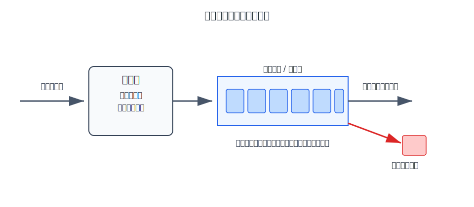
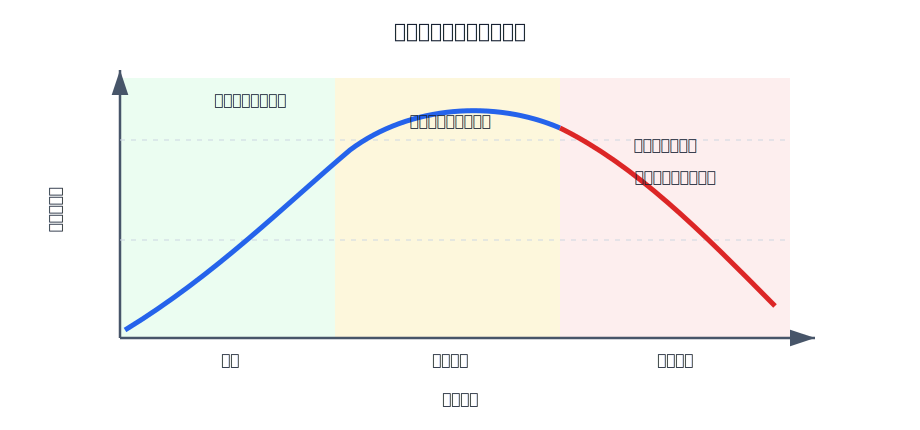
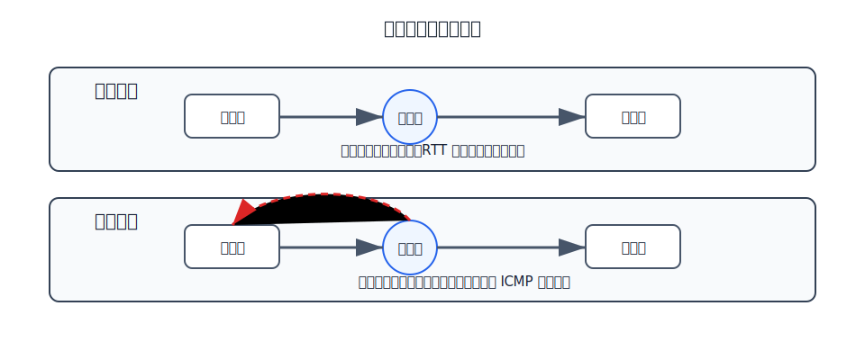
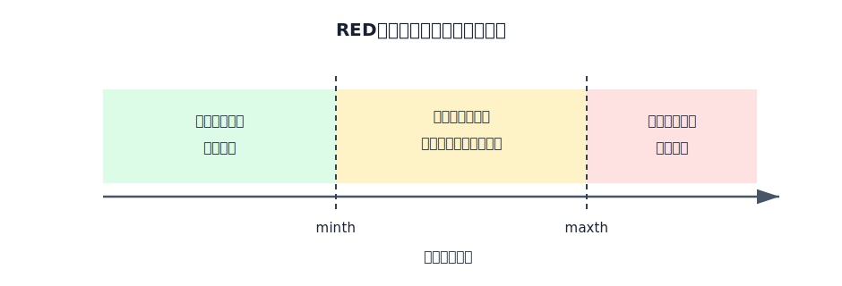

# 拥塞

拥塞是网络内部资源不足造成的现象。若进入网络的分组太多，路由器缓冲区、链路带宽、处理能力等资源被持续压满，就会出现排队时延增大、队列溢出、分组丢失和重传增多。

拥塞不是接收方来不及收。接收方来不及收属于流量控制问题；拥塞发生在网络内部，常见位置是路由器队列和瓶颈链路。

| 比较点 | 流量控制 | 拥塞控制 |
|---|---|---|
| 控制对象 | 发送方和接收方之间的速率匹配 | 网络内部整体负载 |
| 直接原因 | 接收方缓存或处理能力有限 | 路由器、链路、队列等网络资源过载 |
| 典型现象 | 接收方来不及接收 | 排队时延增大、丢包、重传增多 |
| 常见位置 | 数据链路层或运输层 | 网络层和运输层共同涉及 |

## 判断某条链路是否可能拥塞

分析某条链路是否可能拥塞时，应把问题落到发送该链路的**输出端口**上：哪些输入端口的分组可能同时被转发到这里，它们最多能提供多少流量？

若某个方向的输出链路带宽为 $C_{out}$，可能汇聚到该输出端口的各路输入流量上限分别为 $r_1,r_2,\dots,r_k$，则判断条件是：

$$
\sum_{i=1}^{k}r_i>C_{out}
$$

满足这个条件时，分组到达输出队列的速度可能超过发送速度，队列会持续增长；缓冲区耗尽后就会丢包。全双工链路的两个方向拥有各自的发送能力，必须分别分析，不能把相反方向的流量直接相加。

> [!example] 树形网络中的链路拥塞判断
> 某树形网络的主机接入链路为 $1\text{ Mb/s}$，底层路由器到上层路由器的链路为 $2\text{ Mb/s}$，顶层链路为 $4\text{ Mb/s}$。所有链路均为全双工，路由器处理速度远高于链路带宽。
>
> 
>
> **判断 R1–R2 链路**
>
> 对 R1→R2 方向，流量只能经 R3→R1 进入。R3–R1 最多提供 $4\text{ Mb/s}$，R1–R2 也能发送 $4\text{ Mb/s}$：
>
> $$
> 4\le 4
> $$
>
> 反方向同理，因此在忽略瞬时突发和协议开销的题设下，R1–R2 不会因为持续到达速率超过输出速率而拥塞。
>
> **判断 R2→R4 方向**
>
> 发往 R4 的分组可以同时来自两个输入方向：
>
> - R1→R2 最多送来 $4\text{ Mb/s}$；
> - R5→R2 最多送来 $2\text{ Mb/s}$。
>
> 两路流量都可能被转发到 R2→R4 输出端口，因此最大汇聚输入为：
>
> $$
> 4+2=6\text{ Mb/s}
> $$
>
> R2–R4 的链路带宽只有 $2\text{ Mb/s}$：
>
> $$
> 6>2
> $$
>
> 所以 R2→R4 的输出队列可能积压，R2–R4 链路可能发生拥塞。结论是：**R1–R2 不可能拥塞，R2–R4 可能拥塞**。

> [!warning] 不要用接收端能力限制上游提供负载
> H1、H2 最终合计只能接收 $2\text{ Mb/s}$，并不表示上游只能向它们发送 $2\text{ Mb/s}$。多个外部发送方仍可能以更高总速率把分组送到 R2；超出的部分正是在 R2→R4 输出队列中排队或被丢弃。除非题目另外说明存在能立即限制所有发送源的流量控制机制，否则应按输入链路可能提供的流量判断。

# 队列、时延和丢包

路由器不是立即把所有分组都发出去。若多个输入端口的分组都要从同一个输出端口发送，而输出链路速率有限，分组就要在输出队列中等待。

队列带来两个结果：

- **排队时延增大**：队列越长，分组等待发送的时间越长。
- **队列溢出丢包**：缓冲区不是无限的，队列满时，新到分组或队列中已有分组会被丢弃。

如果丢包触发上层重传，网络中会出现更多分组，进一步加重拥塞。因此严重拥塞时，输入负载继续增加不但不能提高有效吞吐量，反而可能使吞吐量下降。

# 拥塞控制的目标

拥塞控制的目标不是让链路永远低负载，而是在吞吐量、时延和丢包之间保持可用状态：

- 避免路由器队列长期处于满载。
- 避免大量丢包引起重传风暴。
- 让网络吞吐量随负载增加而平稳接近容量，而不是进入崩溃区。
- 在不同通信流之间尽量保持公平。

# 开环控制和闭环控制

拥塞控制可以分为开环控制和闭环控制。

| 类型 | 思路 | 典型做法 |
|---|---|---|
| 开环控制 | 在拥塞发生前通过设计避免拥塞 | 合理的路由选择、准入控制、资源预留、流量整形 |
| 闭环控制 | 监测拥塞迹象，发生后反馈并调整 | 丢包反馈、RTT 增大、显式拥塞通知、源点抑制 |

开环控制强调预防，闭环控制强调检测、反馈和调节。实际网络通常同时使用两类思想。

# 隐式反馈和显式反馈

闭环拥塞控制需要让发送方知道网络变拥塞了。反馈可以是隐式的，也可以是显式的。

**隐式反馈**不直接告诉发送方发生拥塞。发送方从现象推断拥塞，例如：

- 分组丢失。
- 计时器超时。
- 往返时间 RTT 明显增大。
- ACK 返回变慢。

运输层的 TCP 拥塞控制主要使用这类信号。慢开始、拥塞避免、快重传、快恢复应放在运输层笔记里详细展开。

**显式反馈**由网络设备或接收方明确反馈拥塞信息。历史上的 ICMP 源点抑制就是一种显式反馈：路由器或主机因拥塞丢弃 IP 数据报时，向源主机发送源点抑制报文，要求源主机降低发送速率。现代因特网已经不依赖它作为主流拥塞控制机制，但它能说明网络层也曾尝试直接向源站反馈拥塞。

# 队列管理

最简单的路由器队列管理方式是**尾部丢弃**。当队列满时，新到分组被丢弃。它实现简单，但问题也明显：

- 拥塞信号来得太晚，只有队列满了才丢包。
- 多个 TCP 流可能同时被丢包，导致同步降速和同步恢复。
- 队列长期很满时，排队时延很大。

主动队列管理 AQM 的思想是：不要等队列完全满了才处理，而是在拥塞明显恶化前提前丢弃或标记一部分分组，让发送方较早感知拥塞。

# RED

RED 随机早期检测是一种典型 AQM 方法。目的是提前给发送端拥塞信号，避免队列长时间满载。它试图用少量早期丢弃换取更稳定的队列长度和更低的排队时延。它使用平均队列长度，并设置最小门限和最大门限。

RED 的基本规则是：

| 平均队列长度 | 处理 |
|---|---|
| 小于最小门限 | 分组正常入队 |
| 介于最小门限和最大门限之间 | 按一定概率丢弃或标记分组 |
| 大于最大门限 | 强制丢弃分组 |

