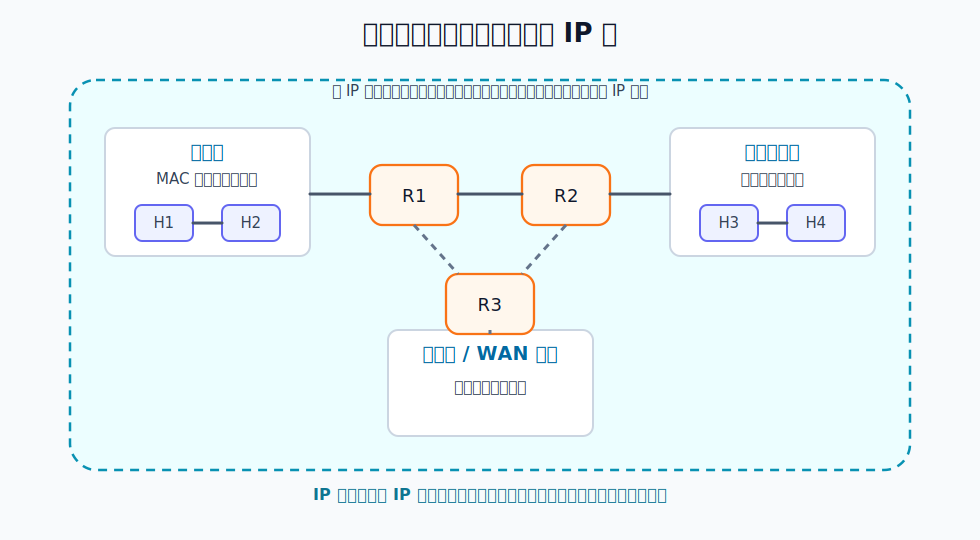
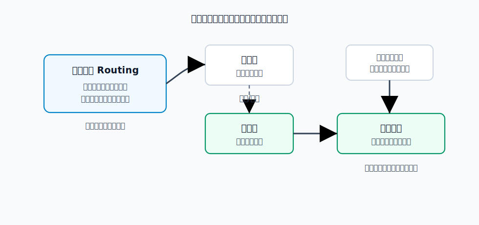
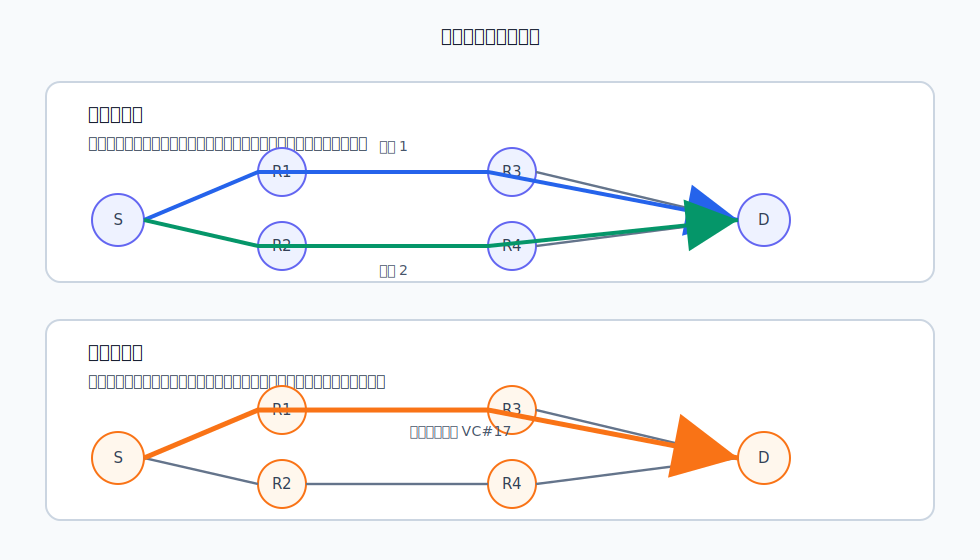

# 网络层

数据链路层只负责一段链路或一个局域网内部的传输。网络层要解决的是更大的问题：把分组从源主机送到目的主机，途中可能经过多个网络、多个路由器和多段链路。

**异构网络**指底层实现不同的网络。它们可能使用不同的链路层协议、帧格式、链路层地址、最大帧长、差错处理方式和接入机制。网络层用统一的 IP 地址和统一的转发规则，把这些差异屏蔽起来，对上提供一个可互联的 IP 网。

> [!note] 网络层的核心抽象
> 从 IP 层看，主机只需要知道目的 IP 地址，路由器只需要根据网络层首部进行转发。具体每一段链路怎样成帧、怎样使用 MAC 地址、怎样接入介质，是下层处理的事情。

# 分组转发与路由选择

网络层必须区分两个基本动作：**路由选择**和**分组转发**。

**路由选择**回答走哪条路。源主机和目的主机之间可能存在多条路径，路由器需要根据拓扑、代价、策略和路由协议计算到各目的网络的路径。路由选择的结果通常写入路由表。

**分组转发**回答这个分组下一跳往哪发。路由器收到分组后，根据分组首部中的目的地址或转发标识查表，把分组从某个输出接口发往下一跳路由器或目的主机。

路由表和转发表的侧重点不同：

| 表 | 作用 | 关注点 |
|---|---|---|
| 路由表 | 表示到各目的网络的路径信息 | 拓扑变化、路由计算、路由协议 |
| 转发表 | 从路由表派生，用于逐包查找输出接口 | 查找速度、匹配规则、硬件转发 |

转发是高频动作。每个经过路由器的数据分组都要查转发表。路由选择是低频动作，通常在拓扑变化、路由信息更新或配置变化时才重新计算。

# 异构网络互联

互联网不是一个单一网络，而是许多网络通过路由器互连形成的网络集合。异构网络互联会遇到很多差异：

- 接入机制不同：有的网络是广播式共享介质，有的是点对点链路。
- 链路层地址不同：以太网使用 MAC 地址，其他网络可能使用不同形式的链路层地址。
- 最大传输单元不同：某段链路能承载的最大帧长可能小于另一段链路。
- 差错处理方式不同：有的链路层只检错，有的可能提供更强的可靠性机制。
- 路由选择技术不同：不同网络内部可能使用不同的管理和路由机制。

IP 层提供统一的网络层地址和统一的分组格式，使主机之间可以跨越这些差异通信。路由器是异构网络互联的关键设备：它至少连接两个网络，并根据网络层信息转发分组。

# IP 及其配套协议

在 TCP/IP 体系中，IP 是网络层的核心协议。IP 规定统一的数据报格式、地址形式和转发规则，但它自己并不完成所有辅助工作。

常见配套协议各自解决一个边界问题：

| 协议 | 解决的问题 |
|---|---|
| [[ARP]] | 已知同一链路上的 IP 地址，找到对应 MAC 地址 |
| [[ICMP]] | 报告网络层差错，支持连通性测试和路径探测 |
| [[DHCP]] | 主机自动获得 IP 地址、子网掩码、默认网关等配置 |

这些协议不改变 IP 的基本服务模型。IP 仍然提供无连接、尽最大努力交付的数据报服务；ARP、ICMP、DHCP 只是让地址解析、差错反馈和地址配置这些必要环节能够自动完成。

# 网络层服务模型

网络层可以向运输层提供两种典型服务：虚电路服务和数据报服务。

## 数据报服务

数据报服务不建立网络层连接。每个分组独立转发，每个分组首部都携带完整的目的地址。路由器收到分组后，按当前转发表决定下一跳。

这带来几个结果：

- 同一源主机发往同一目的主机的多个分组可以走不同路径。
- 分组可能失序、丢失、重复或出现误码。
- 网络核心可以保持相对简单。
- 端到端可靠性通常由主机中的运输层协议处理。

因特网采用的就是这种无连接、尽最大努力交付的数据报服务。“尽最大努力”不是保证交付，而是网络尽力转发，但不承诺可靠、按序、无重复。

> [!important] 因特网的设计取向
> 复杂功能尽量放在网络边缘的主机上，网络核心的路由器主要负责简单快速的分组转发。这就是数据报服务能支撑大规模互联网的重要原因。

## 虚电路服务

虚电路服务是面向连接的网络层服务。通信双方发送数据前，先建立一条逻辑连接，即虚电路。属于同一虚电路的分组沿同一路径转发，通信结束后再释放虚电路。

[html-card height=650](../assets/virtual-circuit-service-slides.html)

虚电路不是物理电路。它只是网络中沿途节点保存的一组转发状态。连接建立阶段需要完整目的地址；连接建立后，后续分组只需要携带较短的虚电路号，沿途节点按虚电路号查表转发。

虚电路服务的特点：

- 建立连接时可以预先选择路径，甚至预留资源。
- 属于同一虚电路的分组通常按序到达。
- 分组首部可以更短，因为可使用虚电路号。
- 沿途节点需要保存连接状态。
- 某个节点故障时，经过该节点的虚电路都会受影响。

# 两种服务的对比

| 对比项 | 数据报服务 | 虚电路服务 |
|---|---|---|
| 连接建立 | 不需要 | 需要 |
| 分组首部 | 每个分组携带完整目的地址 | 建立后携带虚电路号 |
| 路由 | 每个分组可独立选择路径 | 同一虚电路沿同一路径 |
| 到达顺序 | 可能失序 | 通常按序 |
| 节点状态 | 路由器不保存端到端连接状态 | 沿途节点保存虚电路状态 |
| 节点故障影响 | 可改走其他路径，部分分组丢失 | 经过故障节点的虚电路失效 |
| 服务质量 | 难以保证 | 更容易预留资源 |
| 复杂性位置 | 主机端系统更复杂 | 网络内部节点更复杂 |

数据报服务的思路是让主机端系统负责可靠性；虚电路服务则倾向于让网络内部提供更强的连接管理和资源保障。
