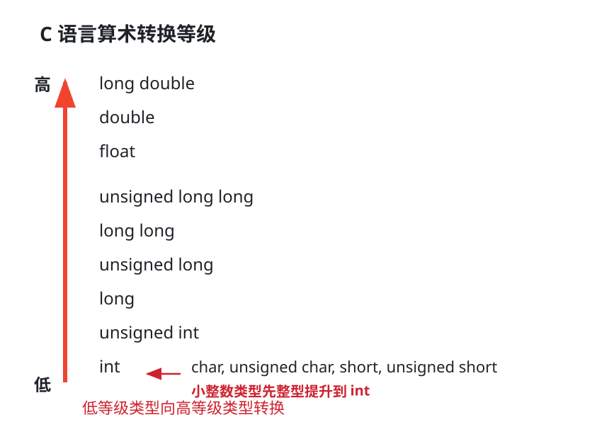

# 数值类型

C 语言中的数值类型可以分成两大类：**整数类型** 和 **浮点类型**。整数存储方式通常为补码或无符号编码，浮点数为 IEEE 754 编码。

## 整数类型

常见整数类型包括：

| 类型                                       |            常见位宽 | 说明                      |
| ---------------------------------------- | --------------: | ----------------------- |
| `char` / `signed char` / `unsigned char` |           8 bit | 字节级整数，`char` 是否有符号由实现决定 |
| `short` / `unsigned short`               |          16 bit | 短整数                     |
| `int` / `unsigned int`                   |          32 bit | 默认整数类型                  |
| `long` / `unsigned long`                 | 32 bit 或 64 bit | 位宽与平台有关                 |
| `long long` / `unsigned long long`       |          64 bit | 长长整数                    |

> [!note] 位宽不是语法保证
> C 标准只规定不同整数类型的最小范围和相对大小关系，具体位宽与平台、编译器和 ABI 有关。如果题目没有特地说明，则按以上默认值计算。

有符号整数在现代机器中通常用补码表示；无符号整数按普通二进制位权解释。

## 浮点类型

常见浮点类型包括：

| 类型            | 常见格式         |                          典型位宽 | 说明                   |
| ------------- | ------------ | ----------------------------: | -------------------- |
| `float`       | IEEE 754 单精度 |                        32 bit | 1 位符号位、8 位阶码、23 位尾数  |
| `double`      | IEEE 754 双精度 |                        64 bit | 1 位符号位、11 位阶码、52 位尾数 |
| `long double` | 平台相关         | 80 bit、128 bit 或与 `double` 相同 | 具体格式不固定              |

# 类型转换

类型转换关键在于：

1. 位宽是否改变。
2. 解释语义是否改变。

## 截断与扩展

从较长整数类型转为较短整数类型时，通常**保留低位，丢弃高位**。这叫 **位截断**。

```text
int x = 0x12345678;
short y = (short)x;
```

若 `short` 为 16 bit，则 `y` 的低 16 bit 为：

```text
0x5678
```

从较短整数类型转为较长整数类型时，需要扩展高位。扩展方式有以下两种，**扩展方式的选择只与原类型无符号有符号有关**：

### 零扩展

零扩展用于**无符号整数**：在高位补 0。

```text
unsigned char x = 0b10110110;
unsigned int y = x;

10110110 -> 00000000 00000000 00000000 10110110
```

零扩展不改变无符号数的真值。

### 符号扩展

符号扩展用于**带符号补码整数**：用符号位扩展高位。

```text
+90: 0,1011010 -> 0,00000000 1011010
-90: 1,0100110 -> 1,11111111 0100110
```

符号扩展不改变补码真值。
## 相同位宽：语义改变

位宽不变时只改变解释方式。

```c
unsigned char u = 255;   // 11111111
signed char s = (signed char)u;
```

如果 `signed char` 采用 8 位补码，则 `11111111` 被解释为 $-1$。

| bit 模式 | 解释为 `unsigned char` | 解释为 `signed char` |
|---|---:|---:|
| `11111111` | 255 | -1 |
| `10000000` | 128 | -128 |
| `01111111` | 127 | 127 |

## 整数与浮点之间转换

整数转为浮点数时，若浮点格式能精确表示该整数，真值不变；若只能近似表示，转换结果落在相邻的可表示浮点数上。

有限浮点数转为整数时，先丢弃小数部分，即**向 0 截断**：

```c
(int)3.9   == 3
(int)-3.9  == -3
```

若截断后的整数超出目标整数类型的表示范围，C 语言不保证转换结果，不能依赖所谓的“截断低位”或“饱和到最大值”。

> [!danger] 整数转浮点数会有精度丢失问题
> IEEE 754 单精度 `float` 只能连续精确表示 $-2^{24}\sim 2^{24}$ 内的整数。精度边界见 [[Floating-Point-Numbers#精度|推导过程]]。
>
> ```c
> int x = 16777217;       // 2^24 + 1
> float f = (float)x;     // 舍入为 16777216.0f
> int y = (int)f;         // 16777216
> ```
>
> 这里 `y != x` 是 `x` 转成 `float` 时已经丢失了最低有效位。
>
> `double` 有 53 位有效精度，能精确表示所有常见的 32 位整数；但对 64 位整数仍可能发生同类问题，例如 $2^{53}+1$ 不能被 `double` 精确表示。

^222228


# 运算时的默认类型提升

C 语言做算术运算时，先看下面这张等级图。




1. `char`、`unsigned char`、`short`、`unsigned short` 等小整数类型，先提升到 `int`。
2. 如果两个操作数类型不同，低等级类型转换为高等级类型。

## 小整数类型先提升

图中最下面的 `char`、`unsigned char`、`short`、`unsigned short` 不直接参加算术运算，而是先提升到 `int`。

```c
unsigned char a = 255;
unsigned char b = 1;
int c = a + b; //256
unsigned char d = a + b; //0, int->unsigned char触发截断
```

`a + b` 计算前，`a` 和 `b` 先提升为 `int`：

$$
255 + 1 = 256
$$

所以 `c` 是 `256`，不是 8 bit 无符号加法溢出后的 `0`。

> [!warning] 小整数不等于小位宽运算
> 看到 `char + char`、`short + short`，先想到“提升到 `int`”，不要直接按 8 bit 或 16 bit 加法算。

## 低等级向高等级转换

小整数提升之后，再比较两个操作数在图中的高低。低的转换成高的，然后再运算。

>[!example] `int + double`：
>
```c
int a = 3;
double b = 0.5;
double c = a + b; 
```
> `double` 高于 `int`，所以 `a` 转换为 `double`。

> [!example] `float + double`：
```c
float f = 1.0f;
double d = 2.0;
double x = f + d;
```
> `double` 高于 `float`，所以 `f` 转换为 `double`。

>[!example] `int + long`：
```c
int i = 10;
long l = 20;
long r = i + l;
```
> `long` 高于 `int`，所以 `i` 转换为 `long`。

## 有符号数和无符号数

同宽的无符号数高于有符号数。

> [!example]
```c
int a = -1;
unsigned int b = 1;
```
> 问`a < b`结果。
比较前，`a` 转换为 `unsigned int`。在 32 bit 无符号数中，`-1` 被解释为：
>
>$$
> 2^{32}-1
> $$
所以 `a < b` 为假。

> [!important] 先转换，再计算
> C 表达式不是先按数学意义算完再看类型，而是先按等级图完成类型转换，再计算。
